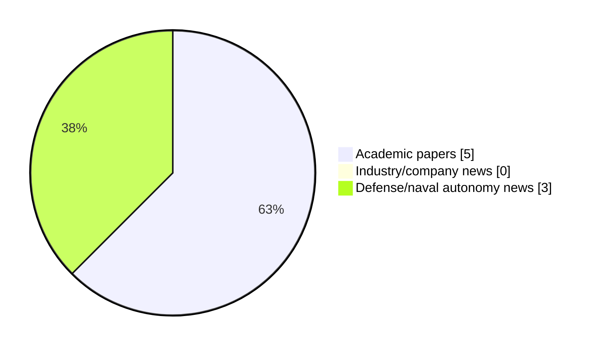

# Maritime Autonomy Watch — 2026-07-16

## Executive Summary

- Total selected items: 8
- Academic papers: 5
- Industry/company news: 0
- Defense/naval autonomy news: 3
- Failed/inaccessible sources: 0

## Contents

- [Analyst Brief](#analyst-brief)
- [Must Read](#must-read)
- [Top Signals Today](#top-signals-today)
- [Topic Signals](#topic-signals)
- [Freshness and Coverage](#freshness-and-coverage)
- [Quality Notes](#quality-notes)
- [Watchlist](#watchlist)
- [Academic Papers](#academic-papers)
- [Industry and Company News](#industry-and-company-news)
- [Defense and Naval Autonomy News](#defense-and-naval-autonomy-news)
- [Source Status Summary](#source-status-summary)

## Analyst Brief

Today's report selected 8 non-duplicate item(s), led by AUV navigation, USV operations, perception. The strongest item is [Design and Control of the "QuadBoat": A Quadruped Surface Vehicle for Drowning Rescue](http://arxiv.org/abs/2607.13633v1) from arXiv.
Coverage is weighted toward academic research (5), with 0 industry and 3 defense signal(s).
Quality caveat: low-score-unique=1.

## Must Read

- [Design and Control of the "QuadBoat": A Quadruped Surface Vehicle for Drowning Rescue](http://arxiv.org/abs/2607.13633v1) — Research signal: USV operations
- [Robust Autonomous UAV Landing on Maritime Platforms via Multimodal Agentic AI and Active Wave Compensation](http://arxiv.org/abs/2606.31613v1) — Research signal: USV operations
- [Task-Oriented Sensing and Covert Transmissions for Collaborative Multi-AUV Systems](http://arxiv.org/abs/2607.13880v1) — Research signal: AUV navigation
- [Information-Aided DVL Calibration](http://arxiv.org/abs/2606.31216v1) — Research signal: AUV navigation
- [Sonardyne USBL Systems to Track AUV Fleet Under Greenland Glaciers](https://oceannews.com/news/science-technology/sonardyne-usbl-systems-to-track-auv-fleet-under-greenland-glaciers/) — Defense signal: AUV navigation

## Top Signals Today

- AUV navigation: 4 selected item(s).
- USV operations: 3 selected item(s).
- perception: 3 selected item(s).
- swarm autonomy: 3 selected item(s).
- planning/control: 2 selected item(s).

## Topic Signals

- AUV navigation: 4
- USV operations: 3
- perception: 3
- swarm autonomy: 3
- planning/control: 2
- defense adoption: 2
- critical infrastructure: 1
- underwater communications: 1

## Freshness and Coverage

- Newest selected item date: 2026-07-15
- Oldest selected item date: 2026-06-30
- Active/enabled sources: 5
- Sources with access problems: 2
- Quality flags: 1

## Quality Notes

- low-score-unique: 1

## Watchlist

- [KONGSBERG & Oceaneering Win DIU Contract to Develop XLUUV for US Navy](https://oceannews.com/news/defense/kongsberg-oceaneering-win-diu-contract-to-develop-xluuv-for-us-navy/) — low-score-unique

### Category Snapshot

| Category | Selected items |
|---|---:|
| Academic papers | 5 |
| Industry/company news | 0 |
| Defense/naval autonomy news | 3 |

## Academic Papers

_Selected items: 5_

### [Design and Control of the "QuadBoat": A Quadruped Surface Vehicle for Drowning Rescue](http://arxiv.org/abs/2607.13633v1)

- Source: arXiv
- Date: 2026-07-15
- Relevance score: 10
- Authors: Lianxin Zhang, Yihan Huang, Huihuan Qian
- Signal: Research signal: USV operations
- Topic tags: USV operations, perception, planning/control

**Abstract**

Prompt extraction of victims from water is crucial in water surface rescue missions. However, previous research on rescue robots has seldom addressed this issue. This paper presents QuadBoat, a bio-inspired unmanned surface vehicle (USV) designed to track and retrieve victims from water. QuadBoat features a quadrupedal robot configuration, enabling it with highly adaptable and agile maneuverability through its actively adjustable posture. Employing an inverse kinematics-based controller and cascaded model predictive control (MPC)-PID controller for overall movement, QuadBoat can accurately track and retrieve objects on the water surface. Maneuverability demonstrations validate QuadBoat's high agility, while a series of tracking experiments, including leg action tracking and trajectory tracking, confirm its high motion accuracy and system mobility.

**Why it matters**

Relevant to surface-vessel operations, planning and control; the work may inform maritime autonomy research, testing priorities, or system design.

---

### [Robust Autonomous UAV Landing on Maritime Platforms via Multimodal Agentic AI and Active Wave Compensation](http://arxiv.org/abs/2606.31613v1)

- Source: arXiv
- Date: 2026-06-30
- Relevance score: 9.5
- Authors: Francisco S. Neves, Pedro N. Pereira, Raul D. S. G. Campilho, Andry M. Pinto
- Signal: Research signal: USV operations
- Topic tags: USV operations, critical infrastructure

**Abstract**

Autonomous aerial inspection of marine infrastructure is frequently compromised by stochastic sea states, introducing risks of high-kinetic impacts, post-landing toppling, and sensory occlusion. This paper proposes a decoupled, multi-vehicle landing framework synchronizing an Unmanned Surface Vehicle (USV) equipped with a 3-RPU stabilized platform with a robust Unmanned Aerial Vehicle (UAV). The architecture utilizes two independent Deep Reinforcement Learning (DRL) agents: a Soft Actor-Critic (SAC) agent providing high-frequency wave-motion compensation for the landing deck, and a multimodal RL agent for the UAVs final approach. Evaluated in high-fidelity maritime simulations, the system achieved a 100% landing success rate across 15 trials in wave states varying from calm to rough. Results show a mean stabilization efficacy of 87.

**Why it matters**

Relevant to surface-vessel operations, infrastructure monitoring; the work may inform maritime autonomy research, testing priorities, or system design.

---

### [Task-Oriented Sensing and Covert Transmissions for Collaborative Multi-AUV Systems](http://arxiv.org/abs/2607.13880v1)

- Source: arXiv
- Date: 2026-07-15
- Relevance score: 8.5
- Authors: Xueyao Zhang, Chenyang Yan, Bo Yang, Xuelin Cao, Zhiwen Yu, Bin Guo, George C. Alexandropoulos, Merouane Debbah, Chau Yuen
- Signal: Research signal: AUV navigation
- Topic tags: AUV navigation, underwater communications, swarm autonomy, perception

**Abstract**

In underwater covert cooperative missions, autonomous underwater vehicles (AUVs) often cannot rely on active sonar to continuously obtain complete information, since active sensing and frequent communications increase the risk of exposure. As a result, AUVs primarily rely on passive observation, an approach that yields incomplete local perception and limited task efficiency. Although underwater acoustic communications can mitigate this limitation through information sharing, they are simultaneously constrained by long delays, severe interference, low reliability, and the risk of covert exposure. Existing communications-oriented multi-agent reinforcement learning (MARL) studies often model communication as an ideal information flow, whereas traditional communication optimization primarily focuses on link-level performance.

**Why it matters**

Relevant to underwater autonomy, multi-vehicle coordination; the work may inform maritime autonomy research, testing priorities, or system design.

---

### [Information-Aided DVL Calibration](http://arxiv.org/abs/2606.31216v1)

- Source: arXiv
- Date: 2026-06-30
- Relevance score: 7
- Authors: Zeev Yampolsky, Itzik Klein
- Signal: Research signal: AUV navigation
- Topic tags: AUV navigation, swarm autonomy

**Abstract**

The Doppler velocity log (DVL) velocity measurements are critical to the accuracy of autonomous underwater vehicle (AUV) navigation solutions and, consequently, to mission success. To ensure accurate measurements, the DVL is commonly calibrated before mission start while the AUV sails on the water surface, receiving global navigation satellite system (GNSS) signals that provide accurate reference measurements. Conventionally, Kalman filter-based approaches are employed during calibration to estimate the scale factor and misalignment errors. However, in certain environments, GNSS signals may be unavailable, rendering conventional calibration impossible and forcing the use of uncalibrated DVL measurements, which degrades navigation performance.

**Why it matters**

Relevant to underwater autonomy, multi-vehicle coordination; the work may inform maritime autonomy research, testing priorities, or system design.

---

### [JPS-TEB Fusion Path Planning Based on COLREGs](https://doi.org/10.3390/oceans7040060)

- Source: OpenAlex
- Date: 2026-07-13
- Relevance score: 5
- Authors: Hongxiao Yu, Qiaoyan Cai, Jianqiang Zhang
- DOI: 10.3390/oceans7040060
- Signal: Research signal: USV operations
- Topic tags: USV operations, planning/control

**Abstract**

To address the lack of compliance with the International Regulations for Preventing Collisions at Sea (COLREGs) in conventional timed elastic band (TEB)—based dynamic path planning for autonomous surface vessels (ASVs), this study proposes an intelligent path-planning framework that integrates an improved jump point search (JPS) algorithm with a COLREGs-aware TEB approach. At the global planning layer, an enhanced JPS algorithm incorporating redundant-node elimination and cubic Bezier curve smoothing is developed to construct the JPS–PB method, thereby reducing path redundancy and improving trajectory continuity. At the local planning layer, COLREGs encounter rules are reformulated as differentiable cost functions and embedded into the TEB optimization framework, enabling rule-compliant collision avoidance in typical maritime encounter scenarios, including head-on, crossing, and overtaking situations.

**Why it matters**

Relevant to surface-vessel operations, navigation safety, planning and control; the work may inform maritime autonomy research, testing priorities, or system design.

---

## Industry and Company News

_Selected items: 0_

No selected items.

## Defense and Naval Autonomy News

_Selected items: 3_

### [Sonardyne USBL Systems to Track AUV Fleet Under Greenland Glaciers](https://oceannews.com/news/science-technology/sonardyne-usbl-systems-to-track-auv-fleet-under-greenland-glaciers/)

- Source: oceannews.com
- Date: 2026-07-15
- Relevance score: 5.75
- Signal: Defense signal: AUV navigation
- Topic tags: AUV navigation, swarm autonomy, perception

**Summary**

An ambitious climate science mission using marine robots, in formation and closer to glaciers than they’ve been before, sets sail this summer with support from Sonardyne underwater positioning technology.

**Why it matters**

Signals movement in underwater autonomy, multi-vehicle coordination; useful for tracking operational concepts, procurement direction, and fleet integration.

---

### [Metron Starts Fabrication of Lancet XL-AUV for DIU CAMP Program](https://oceannews.com/news/defense/metron-starts-fabrication-of-lancet-xl-auv-for-diu-camp-program/)

- Source: oceannews.com
- Date: 2026-07-15
- Relevance score: 5
- Signal: Defense signal: AUV navigation
- Topic tags: AUV navigation, defense adoption

**Summary**

Metron has begun fabrication of the Lancet™ uncrewed undersea vehicle, the XL-class autonomous system it is delivering for the Defense Innovation Unit's Combat Autonomous Maritime Platform (CAMP) program. Metalwork is underway across the vehicle, with fabrication started on the nose, tail, and midsection.

**Why it matters**

Signals movement in underwater autonomy, naval adoption; useful for tracking operational concepts, procurement direction, and fleet integration.

---

### [KONGSBERG & Oceaneering Win DIU Contract to Develop XLUUV for US Navy](https://oceannews.com/news/defense/kongsberg-oceaneering-win-diu-contract-to-develop-xluuv-for-us-navy/)

- Source: oceannews.com
- Date: 2026-07-15
- Relevance score: 3.5
- Signal: Defense signal: defense adoption
- Topic tags: defense adoption
- Quality flags: low-score-unique
- Also reported by: https://www.naval-technology.com/feed/

**Summary**

KONGSBERG and Oceaneering International have announced their selection by the US Department of War's Defense Innovation Unit (DIU) to support the Combat Autonomous Maritime Platform (CAMP) program, focused on the development of an Extra-Large Uncrewed Undersea Vehicle (XLUUV) for future US Navy missions.

**Why it matters**

Signals movement in naval adoption; useful for tracking operational concepts, procurement direction, and fleet integration.

---

## Inaccessible or Failed Sources

- None

## Source Status Summary

| Source | Status | Notes |
|---|---|---|
| arXiv | enabled | API source, 15 items fetched |
| OpenAlex | enabled | API source, 15 items fetched |
| RSS feeds | enabled | 107 RSS items fetched |
| SMI MASG News | enabled | HTML source, 10 items fetched |
| IEEE Xplore | disabled | Missing IEEE_XPLORE_API_KEY |
| Elsevier Scopus | enabled | API source, 15 items fetched |
| NewsAPI | disabled | Missing NEWS_API_KEY |

## Metadata

- Generated at: 2026-07-16T08:50:50.436331+02:00
- Date: 2026-07-16
- Repository: ferhannb/MarineRobotics
- Relevance threshold: 4.0
- Deduplication method: DOI, canonical URL, source ID, normalized title, similar recent titles, category caps, and novelty score
