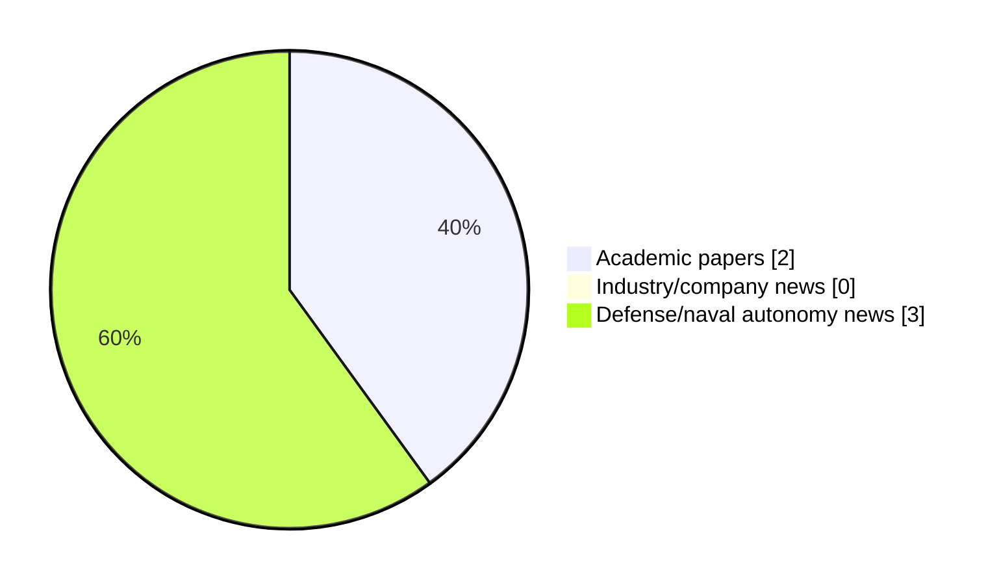

# Maritime Autonomy Watch — 2026-07-17

## Executive Summary

- Total selected items: 5
- Academic papers: 2
- Industry/company news: 0
- Defense/naval autonomy news: 3
- Failed/inaccessible sources: 0

## Contents

- [Analyst Brief](#analyst-brief)
- [Must Read](#must-read)
- [Top Signals Today](#top-signals-today)
- [Topic Signals](#topic-signals)
- [Freshness and Coverage](#freshness-and-coverage)
- [Quality Notes](#quality-notes)
- [Watchlist](#watchlist)
- [Academic Papers](#academic-papers)
- [Industry and Company News](#industry-and-company-news)
- [Defense and Naval Autonomy News](#defense-and-naval-autonomy-news)
- [Source Status Summary](#source-status-summary)

## Analyst Brief

Today's report selected 5 non-duplicate item(s), led by AUV navigation, USV operations, defense adoption. The strongest item is [Integrated Discovery and State-Aware Servicing for Mobile AUVs With UOWC: Modeling and Performance Analysis](http://arxiv.org/abs/2607.15183v1) from arXiv.
Coverage is weighted toward academic research (2), with 0 industry and 3 defense signal(s).
Quality caveat: low-score-unique=3, missing-summary=1, date-anomaly=1.

## Must Read

- [Integrated Discovery and State-Aware Servicing for Mobile AUVs With UOWC: Modeling and Performance Analysis](http://arxiv.org/abs/2607.15183v1) — Research signal: AUV navigation
- [Typhoon USV Completes First-Ever At-Sea Resupply with USS Essex](https://www.navalnews.com/naval-news/2026/07/typhoon-usv-uss-essex-at-sea-resupply/) — Defense signal: USV operations
- [Saronic Selects Texas to Build $3 Billion ‘Port Alpha’ Shipyard for Autonomous Vessels](https://www.navalnews.com/naval-news/2026/07/saronic-port-alpha-shipyard-texas-autonomous-naval-vessels/) — Defense signal: general autonomy
- [2 defense tech companies sue US Navy after losing out on MUSV program](https://www.defensenews.com/industry/techwatch/2026/07/16/2-defense-tech-companies-sue-us-navy-after-losing-out-on-musv-program/) — Defense signal: USV operations

## Top Signals Today

- AUV navigation: 2 selected item(s).
- USV operations: 2 selected item(s).
- defense adoption: 2 selected item(s).
- underwater communications: 1 selected item(s).
- swarm autonomy: 1 selected item(s).

## Topic Signals

- AUV navigation: 2
- USV operations: 2
- defense adoption: 2
- underwater communications: 1
- swarm autonomy: 1
- critical infrastructure: 1
- general autonomy: 1
- planning/control: 1

## Freshness and Coverage

- Newest selected item date: 2026-12-01
- Oldest selected item date: 2026-07-16
- Active/enabled sources: 5
- Sources with access problems: 2
- Quality flags: 5

## Quality Notes

- low-score-unique: 3
- missing-summary: 1
- date-anomaly: 1
- Date anomalies: [Robust LPV pitch control of autonomous underwater vehicle with input constraints](https://api.elsevier.com/content/abstract/scopus_id/105044143294) reports 2026-12-01

## Watchlist

- [Saronic Selects Texas to Build $3 Billion ‘Port Alpha’ Shipyard for Autonomous Vessels](https://www.navalnews.com/naval-news/2026/07/saronic-port-alpha-shipyard-texas-autonomous-naval-vessels/) — low-score-unique
- [2 defense tech companies sue US Navy after losing out on MUSV program](https://www.defensenews.com/industry/techwatch/2026/07/16/2-defense-tech-companies-sue-us-navy-after-losing-out-on-musv-program/) — low-score-unique
- [Robust LPV pitch control of autonomous underwater vehicle with input constraints](https://api.elsevier.com/content/abstract/scopus_id/105044143294) — missing-summary, date-anomaly, low-score-unique

### Category Snapshot

| Category | Selected items |
|---|---:|
| Academic papers | 2 |
| Industry/company news | 0 |
| Defense/naval autonomy news | 3 |

## Academic Papers

_Selected items: 2_

### [Integrated Discovery and State-Aware Servicing for Mobile AUVs With UOWC: Modeling and Performance Analysis](http://arxiv.org/abs/2607.15183v1)

- Source: arXiv
- Date: 2026-07-16
- Relevance score: 8.5
- Authors: Qiyu Ma, Jiajie Xu, Mohamed-SlimAlouini
- Signal: Research signal: AUV navigation
- Topic tags: AUV navigation, underwater communications, swarm autonomy, critical infrastructure

**Abstract**

Underwater wireless optical communication (UWOC) is an enabling technology for high-throughput subsea networks, yet its long-term deployment is constrained by the finite energy budget of underwater nodes. To address this challenge, we investigate a mobile system wherein an autonomous underwater vehicle (AUV) performs joint wireless information transfer (WIT) and wireless power transfer (WPT) for a network of randomly distributed sensor nodes. This paper develops \textcolor{blue}{an integrated mission-level framework} that combines stochastic node discovery with state-aware servicing. First, we present an analytical model for node discovery based on a signal-to-noise ratio (SNR) analysis, deriving performance metrics that include the probability distribution of the discovery distance.

**Why it matters**

Relevant to underwater autonomy, multi-vehicle coordination; the work may inform maritime autonomy research, testing priorities, or system design.

---

### [Robust LPV pitch control of autonomous underwater vehicle with input constraints](https://api.elsevier.com/content/abstract/scopus_id/105044143294)

- Source: Elsevier Scopus
- Date: 2026-12-01
- Relevance score: 3.5
- DOI: 10.1038/s41598-026-49350-0
- Signal: Research signal: AUV navigation
- Topic tags: AUV navigation, planning/control
- Quality flags: missing-summary, date-anomaly, low-score-unique

**Abstract**

No summary available.

**Why it matters**

Relevant to underwater autonomy; the work may inform maritime autonomy research, testing priorities, or system design.

---

## Industry and Company News

_Selected items: 0_

No selected items.

## Defense and Naval Autonomy News

_Selected items: 3_

### [Typhoon USV Completes First-Ever At-Sea Resupply with USS Essex](https://www.navalnews.com/naval-news/2026/07/typhoon-usv-uss-essex-at-sea-resupply/)

- Source: navalnews.com
- Date: 2026-07-16
- Relevance score: 6
- Signal: Defense signal: USV operations
- Topic tags: USV operations, defense adoption

**Summary**

As part of the ongoing Rim of the Pacific (RIMPAC) 2026 naval exercises, a Splash Industries Typhoon Unmanned Surface Vessel (USV) successfully landed in the well deck of the Wasp-class Landing Helicopter Dock USS Essex (LHD-2), marking the first instance of a USV performing an underway replenishment for a larger, crewed vessel. Splash Industries’ CEO.

**Why it matters**

Signals movement in surface-vessel operations, naval adoption; useful for tracking operational concepts, procurement direction, and fleet integration.

---

### [Saronic Selects Texas to Build $3 Billion ‘Port Alpha’ Shipyard for Autonomous Vessels](https://www.navalnews.com/naval-news/2026/07/saronic-port-alpha-shipyard-texas-autonomous-naval-vessels/)

- Source: navalnews.com
- Date: 2026-07-16
- Relevance score: 3.5
- Signal: Defense signal: general autonomy
- Topic tags: general autonomy
- Quality flags: low-score-unique

**Summary**

Saronic announced it has selected Brownsville, Texas as the future home of Port Alpha, its next-generation shipyard designed to help restore American maritime strength and significantly expand the nation’s shipbuilding capacity. Saronic press release The announcement marks a major milestone in Saronic’s mission to restore U.S. shipbuilding capacity at scale. First introduced as a vision.

**Why it matters**

This item may signal operational adoption, procurement priorities, or naval autonomy doctrine shifts.

---

### [2 defense tech companies sue US Navy after losing out on MUSV program](https://www.defensenews.com/industry/techwatch/2026/07/16/2-defense-tech-companies-sue-us-navy-after-losing-out-on-musv-program/)

- Source: defensenews.com
- Date: 2026-07-16
- Relevance score: 3.5
- Signal: Defense signal: USV operations
- Topic tags: USV operations, defense adoption
- Quality flags: low-score-unique

**Summary**

Two defense tech companies sued the U.S. government, alleging they were unfairly excluded from the Navy's Medium Unmanned Surface Vessel program.

**Why it matters**

Signals movement in surface-vessel operations, naval adoption; useful for tracking operational concepts, procurement direction, and fleet integration.

---

## Inaccessible or Failed Sources

- None

## Source Status Summary

| Source | Status | Notes |
|---|---|---|
| arXiv | enabled | API source, 15 items fetched |
| OpenAlex | enabled | API source, 15 items fetched |
| RSS feeds | enabled | 107 RSS items fetched |
| SMI MASG News | enabled | HTML source, 10 items fetched |
| IEEE Xplore | disabled | Missing IEEE_XPLORE_API_KEY |
| Elsevier Scopus | enabled | API source, 15 items fetched |
| NewsAPI | disabled | Missing NEWS_API_KEY |

## Metadata

- Generated at: 2026-07-17T08:49:03.931531+02:00
- Date: 2026-07-17
- Repository: ferhannb/MarineRobotics
- Relevance threshold: 4.0
- Deduplication method: DOI, canonical URL, source ID, normalized title, similar recent titles, category caps, and novelty score
