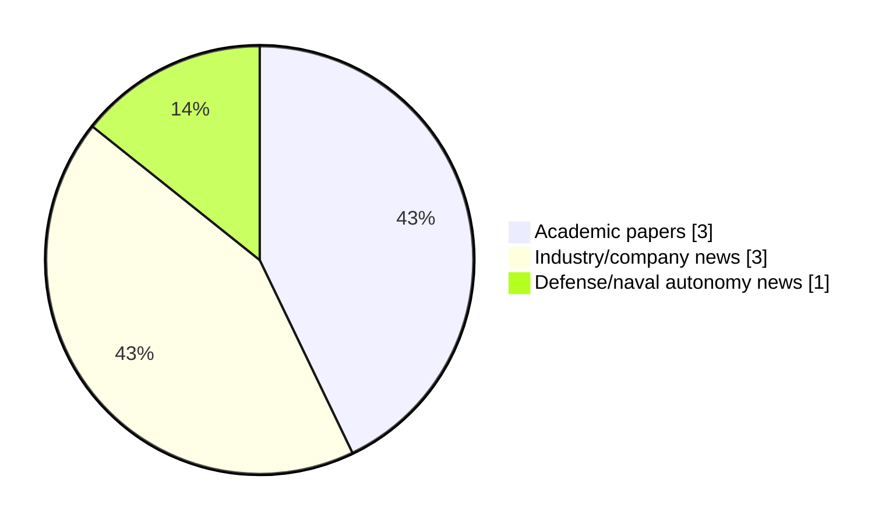

# Maritime Autonomy Watch — 2026-07-18

## Executive Summary

- Total selected items: 7
- Academic papers: 3
- Industry/company news: 3
- Defense/naval autonomy news: 1
- Failed/inaccessible sources: 0

## Contents

- [Analyst Brief](#analyst-brief)
- [Must Read](#must-read)
- [Top Signals Today](#top-signals-today)
- [Topic Signals](#topic-signals)
- [Freshness and Coverage](#freshness-and-coverage)
- [Quality Notes](#quality-notes)
- [Watchlist](#watchlist)
- [Academic Papers](#academic-papers)
- [Industry and Company News](#industry-and-company-news)
- [Defense and Naval Autonomy News](#defense-and-naval-autonomy-news)
- [Source Status Summary](#source-status-summary)

## Analyst Brief

Today's report selected 7 non-duplicate item(s), led by USV operations, AUV navigation, planning/control. The strongest item is [Ocean Power Technologies WAM-V USV Advances in US Government Assessment](https://oceannews.com/news/defense/ocean-power-technologies-wam-v-usv-advances-in-us-government-assessment/) from oceannews.com.
Coverage is weighted toward academic research (3), with 3 industry and 1 defense signal(s).
Quality caveat: low-score-unique=1, missing-summary=1, date-anomaly=1.

## Must Read

- [Ocean Power Technologies WAM-V USV Advances in US Government Assessment](https://oceannews.com/news/defense/ocean-power-technologies-wam-v-usv-advances-in-us-government-assessment/) — Industry signal: USV operations
- [Allocation Integrated Sliding Mode Control for Heading Autonomous Underwater Vehicles with Varying Speeds](https://doi.org/10.65154/ijmst.39) — Research signal: AUV navigation
- [Saronic launches 52‑ft Mirage Autonomous Vessel](https://massworld.news/saronic-launches-52%e2%80%91ft-mirage-autonomous-vessel/) — Defense signal: USV operations
- [Choreographing the Way of Water: A Computational Framework for Aquatic Robotic Art](http://arxiv.org/abs/2607.02174v1) — Research signal: USV operations
- [Imenco Invests in Next-Generation Underwater Robotics Firm](https://www.maritimeindustries.org/news/imenco-invests-next-generation-underwater-robotics-firm) — Industry signal: critical infrastructure

## Top Signals Today

- USV operations: 4 selected item(s).
- AUV navigation: 2 selected item(s).
- planning/control: 2 selected item(s).
- critical infrastructure: 2 selected item(s).
- swarm autonomy: 2 selected item(s).

## Topic Signals

- USV operations: 4
- AUV navigation: 2
- planning/control: 2
- critical infrastructure: 2
- swarm autonomy: 2
- perception: 1

## Freshness and Coverage

- Newest selected item date: 2027-01-01
- Oldest selected item date: 2026-06-30
- Active/enabled sources: 5
- Sources with access problems: 2
- Quality flags: 3

## Quality Notes

- low-score-unique: 1
- missing-summary: 1
- date-anomaly: 1
- Date anomalies: [Cooperative multi-USV coverage scheduling in obstacle-rich waters: A DRL-assisted adaptive evolutionary approach](https://api.elsevier.com/content/abstract/scopus_id/105044422334) reports 2027-01-01

## Watchlist

- [Fugro Deploys AUV Technology for Deepwater Survey off Timor-Leste](https://oceannews.com/news/subsea-and-survey/fugro-deploys-auv-technology-for-deepwater-survey-off-timor-leste/) — low-score-unique
- [Cooperative multi-USV coverage scheduling in obstacle-rich waters: A DRL-assisted adaptive evolutionary approach](https://api.elsevier.com/content/abstract/scopus_id/105044422334) — missing-summary, date-anomaly

### Category Snapshot

| Category | Selected items |
|---|---:|
| Academic papers | 3 |
| Industry/company news | 3 |
| Defense/naval autonomy news | 1 |

## Academic Papers

_Selected items: 3_

### [Allocation Integrated Sliding Mode Control for Heading Autonomous Underwater Vehicles with Varying Speeds](https://doi.org/10.65154/ijmst.39)

- Source: OpenAlex
- Date: 2026-06-30
- Relevance score: 7
- Authors: Do Khac Tiep, Nguyen Van Tien
- DOI: 10.65154/ijmst.39
- Signal: Research signal: AUV navigation
- Topic tags: AUV navigation, planning/control

**Abstract**

This paper addresses the challenge of robust heading control for Autonomous Underwater Vehicles (AUVs) operating under variable speed conditions, subject to system nonlinearities, parametric uncertainties, and actuator constraints. We propose a hierarchical control architecture that integrates Sliding Mode Control (SMC) with an optimization-based Control Allocation (CA) scheme. The outer-loop SMC guarantees robustness by computing the required total yaw moment to reject disturbances and track the reference heading. The inner-loop CA then optimally distributes this virtual control effort to individual actuators, explicitly accounting for saturation limits and speed-dependent actuator effectiveness. The performance of the proposed SMC-CA strategy is validated through comprehensive numerical simulations.

**Why it matters**

Relevant to underwater autonomy; the work may inform maritime autonomy research, testing priorities, or system design.

---

### [Choreographing the Way of Water: A Computational Framework for Aquatic Robotic Art](http://arxiv.org/abs/2607.02174v1)

- Source: arXiv
- Date: 2026-07-02
- Relevance score: 4.25
- Authors: Aswin Ramachandran, Christopher Golling, Sebastian Burmester, Noa Sendlhofer, Jan Kamm, Ruiheng Jiang, Raffaello D'Andrea
- Signal: Research signal: USV operations
- Topic tags: USV operations, swarm autonomy, perception, planning/control

**Abstract**

Robotic choreography in open water is governed by nonlinear fluid dynamics, which impose significant challenges due to environmental disturbances and nonlinear system dynamics. This paper presents the cyber-physical architecture of Way of Water, a vertically integrated framework that orchestrates a fleet of autonomous surface vessels as a distributed choreographic platform. Moving beyond the surface-pixel paradigm, these vessels use laminar nozzles and multi-zone lighting to extend their expressive range from the 2D water plane into the 3D volumetric domain. Our primary contribution is the Way of Water Studio, a browser-based, timeline-compositing authoring paradigm that treats the fleet as a DAW-like instrument for music-responsive choreography.

**Why it matters**

Relevant to surface-vessel operations, multi-vehicle coordination, planning and control; the work may inform maritime autonomy research, testing priorities, or system design.

---

### [Cooperative multi-USV coverage scheduling in obstacle-rich waters: A DRL-assisted adaptive evolutionary approach](https://api.elsevier.com/content/abstract/scopus_id/105044422334)

- Source: Elsevier Scopus
- Date: 2027-01-01
- Relevance score: 4.5
- DOI: 10.1016/j.eswa.2026.133648
- Signal: Research signal: USV operations
- Topic tags: USV operations, swarm autonomy
- Quality flags: missing-summary, date-anomaly

**Abstract**

No summary available.

**Why it matters**

Relevant to surface-vessel operations; the work may inform maritime autonomy research, testing priorities, or system design.

---

## Industry and Company News

_Selected items: 3_

### [Ocean Power Technologies WAM-V USV Advances in US Government Assessment](https://oceannews.com/news/defense/ocean-power-technologies-wam-v-usv-advances-in-us-government-assessment/)

- Source: oceannews.com
- Date: 2026-07-17
- Relevance score: 8
- Signal: Industry signal: USV operations
- Topic tags: USV operations

**Summary**

Ocean Power Technologies has announced that it has received notification from the US Government that its maritime drone technology, the WAM-V unmanned surface vehicle (USV), has been selected for further engagement following a recent competitive capability assessment.

**Why it matters**

Signals momentum in surface-vessel operations; useful for tracking product direction, partnerships, and deployment opportunities.

---

### [Fugro Deploys AUV Technology for Deepwater Survey off Timor-Leste](https://oceannews.com/news/subsea-and-survey/fugro-deploys-auv-technology-for-deepwater-survey-off-timor-leste/)

- Source: oceannews.com
- Date: 2026-07-17
- Relevance score: 3.5
- Signal: Industry signal: AUV navigation
- Topic tags: AUV navigation, critical infrastructure
- Quality flags: low-score-unique

**Summary**

The survey programme will support the planning and development of critical offshore energy infrastructure associated with the Greater Sunrise and Bayu Undan developments, two strategically important projects that underpin Timor-Leste's future energy ambitions.

**Why it matters**

Signals momentum in underwater autonomy; useful for tracking product direction, partnerships, and deployment opportunities.

---

### [Imenco Invests in Next-Generation Underwater Robotics Firm](https://www.maritimeindustries.org/news/imenco-invests-next-generation-underwater-robotics-firm)

- Source: maritimeindustries.org
- Date: 2026-07-02
- Relevance score: 4.25
- Signal: Industry signal: critical infrastructure
- Topic tags: critical infrastructure

**Summary**

Imenco Future Technologies has announced it has taken a strategic investment stake in Frontier Robotics, a specialist developer of advanced subsea robotics technologies supporting its long-term innovation and growth strategy.

**Why it matters**

Signals momentum in underwater autonomy; useful for tracking product direction, partnerships, and deployment opportunities.

---

## Defense and Naval Autonomy News

_Selected items: 1_

### [Saronic launches 52‑ft Mirage Autonomous Vessel](https://massworld.news/saronic-launches-52%e2%80%91ft-mirage-autonomous-vessel/)

- Source: massworld.news
- Date: 2026-07-03
- Relevance score: 5.5
- Signal: Defense signal: USV operations
- Topic tags: USV operations

**Summary**

Saronic has launched its first Mirage, a 52‑ft dual‑use Autonomous Surface Vessel (ASV). Mirage joins the 24‑ft Corsair and 180‑ft Marauder as the third flagship platform in the company’s fleet..

**Why it matters**

Signals movement in surface-vessel operations; useful for tracking operational concepts, procurement direction, and fleet integration.

---

## Inaccessible or Failed Sources

- None

## Source Status Summary

| Source | Status | Notes |
|---|---|---|
| arXiv | enabled | API source, 15 items fetched |
| OpenAlex | enabled | API source, 15 items fetched |
| RSS feeds | enabled | 107 RSS items fetched |
| SMI MASG News | enabled | HTML source, 10 items fetched |
| IEEE Xplore | disabled | Missing IEEE_XPLORE_API_KEY |
| Elsevier Scopus | enabled | API source, 15 items fetched |
| NewsAPI | disabled | Missing NEWS_API_KEY |

## Metadata

- Generated at: 2026-07-18T08:40:47.063900+02:00
- Date: 2026-07-18
- Repository: ferhannb/MarineRobotics
- Relevance threshold: 4.0
- Deduplication method: DOI, canonical URL, source ID, normalized title, similar recent titles, category caps, and novelty score
