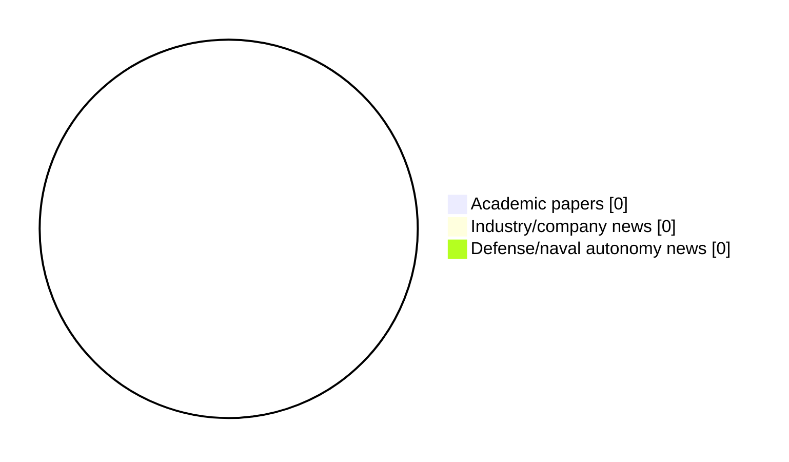

# Maritime Autonomy Watch — 2026-07-19

## Executive Summary

- Total selected items: 0
- Academic papers: 0
- Industry/company news: 0
- Defense/naval autonomy news: 0
- Failed/inaccessible sources: 0

## Contents

- [Analyst Brief](#analyst-brief)
- [Must Read](#must-read)
- [Top Signals Today](#top-signals-today)
- [Topic Signals](#topic-signals)
- [Freshness and Coverage](#freshness-and-coverage)
- [Quality Notes](#quality-notes)
- [Watchlist](#watchlist)
- [Academic Papers](#academic-papers)
- [Industry and Company News](#industry-and-company-news)
- [Defense and Naval Autonomy News](#defense-and-naval-autonomy-news)
- [Source Status Summary](#source-status-summary)

## Analyst Brief

No selected maritime autonomy items cleared the filters today.

## Must Read

- No must-read items with sufficient summary quality today.

## Top Signals Today

- No high-relevance maritime autonomy items were selected.

## Topic Signals

- No topic tags were detected.

## Freshness and Coverage

- Newest selected item date: Unknown
- Oldest selected item date: Unknown
- Active/enabled sources: 4
- Sources with access problems: 3
- Quality flags: 0

## Quality Notes

- No quality flags on selected items.

## Watchlist

- No watchlist items today.

### Category Snapshot

| Category | Selected items |
|---|---:|
| Academic papers | 0 |
| Industry/company news | 0 |
| Defense/naval autonomy news | 0 |

## Academic Papers

_Selected items: 0_

No selected items.

## Industry and Company News

_Selected items: 0_

No selected items.

## Defense and Naval Autonomy News

_Selected items: 0_

No selected items.

## Inaccessible or Failed Sources

- None

## Source Status Summary

| Source | Status | Notes |
|---|---|---|
| arXiv | enabled | API source, 15 items fetched |
| OpenAlex | enabled | API source, 15 items fetched |
| RSS feeds | partial | 85 RSS items fetched; failures: https://massworld.news/feed/: Invalid XML from https://massworld.news/feed/: mismatched tag: line 93, column 2; https://oceannews.com/feed/: Invalid XML from https://oceannews.com/feed/: mismatched tag: line 93, column 2 |
| SMI MASG News | enabled | HTML source, 0 items fetched |
| IEEE Xplore | disabled | Missing IEEE_XPLORE_API_KEY |
| Elsevier Scopus | enabled | API source, 15 items fetched |
| NewsAPI | disabled | Missing NEWS_API_KEY |

## Metadata

- Generated at: 2026-07-19T08:52:41.423015+02:00
- Date: 2026-07-19
- Repository: ferhannb/MarineRobotics
- Relevance threshold: 4.0
- Deduplication method: DOI, canonical URL, source ID, normalized title, similar recent titles, category caps, and novelty score
