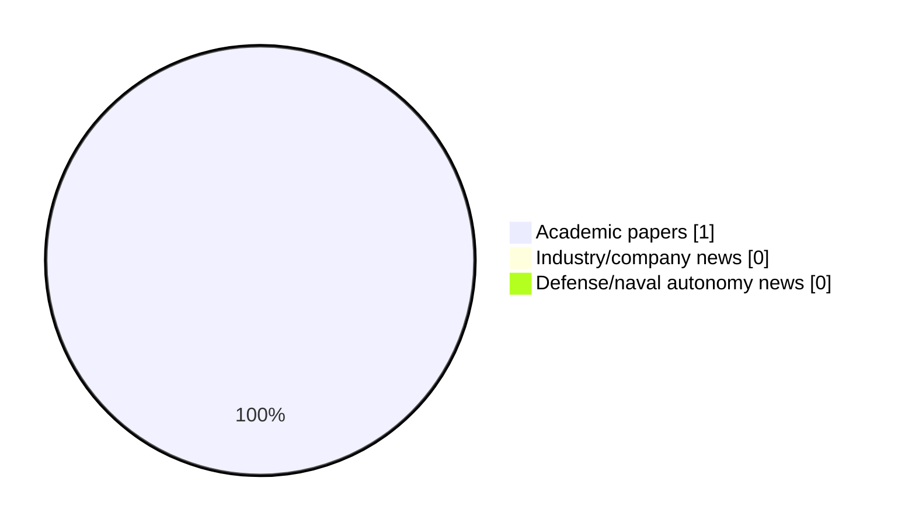

# Maritime Autonomy Watch — 2026-07-20

## Executive Summary

- Total selected items: 1
- Academic papers: 1
- Industry/company news: 0
- Defense/naval autonomy news: 0
- Failed/inaccessible sources: 0

## Contents

- [Analyst Brief](#analyst-brief)
- [Must Read](#must-read)
- [Top Signals Today](#top-signals-today)
- [Topic Signals](#topic-signals)
- [Freshness and Coverage](#freshness-and-coverage)
- [Quality Notes](#quality-notes)
- [Watchlist](#watchlist)
- [Academic Papers](#academic-papers)
- [Industry and Company News](#industry-and-company-news)
- [Defense and Naval Autonomy News](#defense-and-naval-autonomy-news)
- [Source Status Summary](#source-status-summary)

## Analyst Brief

Today's report selected 1 non-duplicate item(s), led by USV operations, swarm autonomy, planning/control. The strongest item is [Formation tracking control of multiple USVs using ADRC with prescribed performance](https://api.elsevier.com/content/abstract/scopus_id/105035333345) from Elsevier Scopus.
Coverage is weighted toward academic research (1), with 0 industry and 0 defense signal(s).
Quality caveat: missing-summary=1, date-anomaly=1.

## Must Read

- No must-read items with sufficient summary quality today.

## Top Signals Today

- USV operations: 1 selected item(s).
- swarm autonomy: 1 selected item(s).
- planning/control: 1 selected item(s).

## Topic Signals

- USV operations: 1
- swarm autonomy: 1
- planning/control: 1

## Freshness and Coverage

- Newest selected item date: 2026-12-01
- Oldest selected item date: 2026-12-01
- Active/enabled sources: 4
- Sources with access problems: 3
- Quality flags: 2

## Quality Notes

- missing-summary: 1
- date-anomaly: 1
- Date anomalies: [Formation tracking control of multiple USVs using ADRC with prescribed performance](https://api.elsevier.com/content/abstract/scopus_id/105035333345) reports 2026-12-01

## Watchlist

- [Formation tracking control of multiple USVs using ADRC with prescribed performance](https://api.elsevier.com/content/abstract/scopus_id/105035333345) — missing-summary, date-anomaly

### Category Snapshot

| Category | Selected items |
|---|---:|
| Academic papers | 1 |
| Industry/company news | 0 |
| Defense/naval autonomy news | 0 |

## Academic Papers

_Selected items: 1_

### [Formation tracking control of multiple USVs using ADRC with prescribed performance](https://api.elsevier.com/content/abstract/scopus_id/105035333345)

- Source: Elsevier Scopus
- Date: 2026-12-01
- Relevance score: 5.25
- DOI: 10.1038/s41598-026-37252-0
- Signal: Research signal: USV operations
- Topic tags: USV operations, swarm autonomy, planning/control
- Quality flags: missing-summary, date-anomaly

**Abstract**

No summary available.

**Why it matters**

Relevant to surface-vessel operations, multi-vehicle coordination; the work may inform maritime autonomy research, testing priorities, or system design.

---

## Industry and Company News

_Selected items: 0_

No selected items.

## Defense and Naval Autonomy News

_Selected items: 0_

No selected items.

## Inaccessible or Failed Sources

- None

## Source Status Summary

| Source | Status | Notes |
|---|---|---|
| arXiv | enabled | API source, 15 items fetched |
| OpenAlex | enabled | API source, 15 items fetched |
| RSS feeds | partial | 85 RSS items fetched; failures: https://massworld.news/feed/: Invalid XML from https://massworld.news/feed/: mismatched tag: line 93, column 2; https://oceannews.com/feed/: Invalid XML from https://oceannews.com/feed/: mismatched tag: line 93, column 2 |
| SMI MASG News | enabled | HTML source, 0 items fetched |
| IEEE Xplore | disabled | Missing IEEE_XPLORE_API_KEY |
| Elsevier Scopus | enabled | API source, 15 items fetched |
| NewsAPI | disabled | Missing NEWS_API_KEY |

## Metadata

- Generated at: 2026-07-20T09:06:50.181745+02:00
- Date: 2026-07-20
- Repository: ferhannb/MarineRobotics
- Relevance threshold: 4.0
- Deduplication method: DOI, canonical URL, source ID, normalized title, similar recent titles, category caps, and novelty score
