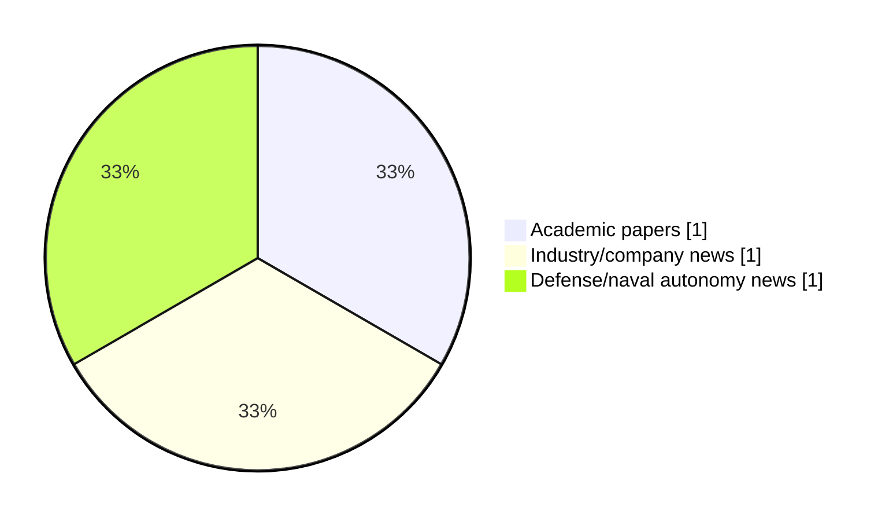

# Maritime Autonomy Watch — 2026-07-21

## Executive Summary

- Total selected items: 3
- Academic papers: 1
- Industry/company news: 1
- Defense/naval autonomy news: 1
- Failed/inaccessible sources: 0

## Contents

- [Analyst Brief](#analyst-brief)
- [Must Read](#must-read)
- [Top Signals Today](#top-signals-today)
- [Topic Signals](#topic-signals)
- [Freshness and Coverage](#freshness-and-coverage)
- [Quality Notes](#quality-notes)
- [Watchlist](#watchlist)
- [Academic Papers](#academic-papers)
- [Industry and Company News](#industry-and-company-news)
- [Defense and Naval Autonomy News](#defense-and-naval-autonomy-news)
- [Source Status Summary](#source-status-summary)

## Analyst Brief

Today's report selected 3 non-duplicate item(s), led by AUV navigation, underwater communications, swarm autonomy. The strongest item is [Remote Awareness of Seafloor Images Collected by AUVs over Low-Bandwidth Communication Links](http://arxiv.org/abs/2607.18013v1) from arXiv.
Coverage is weighted toward academic research (1), with 1 industry and 1 defense signal(s).

## Must Read

- [Remote Awareness of Seafloor Images Collected by AUVs over Low-Bandwidth Communication Links](http://arxiv.org/abs/2607.18013v1) — Research signal: AUV navigation
- [JAGM-Armed Saildrone Surveyor USV Joins RIMPAC 2026](https://www.navalnews.com/naval-news/2026/07/jagm-armed-saildrone-surveyor-usv-rimpac-2026/) — Defense signal: USV operations
- [Ray Systems Joins NOC Innovation Hub to Advance Fin-Based AUV Propulsion](https://oceannews.com/news/science-technology/ray-systems-joins-noc-innovation-hub-to-advance-fin-based-auv-propulsion/) — Industry signal: AUV navigation

## Top Signals Today

- AUV navigation: 2 selected item(s).
- underwater communications: 1 selected item(s).
- swarm autonomy: 1 selected item(s).
- USV operations: 1 selected item(s).
- defense adoption: 1 selected item(s).

## Topic Signals

- AUV navigation: 2
- underwater communications: 1
- swarm autonomy: 1
- USV operations: 1
- defense adoption: 1

## Freshness and Coverage

- Newest selected item date: 2026-07-20
- Oldest selected item date: 2026-07-20
- Active/enabled sources: 5
- Sources with access problems: 2
- Quality flags: 0

## Quality Notes

- No quality flags on selected items.

## Watchlist

- No watchlist items today.

### Category Snapshot

| Category | Selected items |
|---|---:|
| Academic papers | 1 |
| Industry/company news | 1 |
| Defense/naval autonomy news | 1 |

## Academic Papers

_Selected items: 1_

### [Remote Awareness of Seafloor Images Collected by AUVs over Low-Bandwidth Communication Links](http://arxiv.org/abs/2607.18013v1)

- Source: arXiv
- Date: 2026-07-20
- Relevance score: 8.5
- Authors: Adrian Bodenmann, Cailei Liang, Miquel Massot-Campos, Samuel Simmons, Alexander B. Phillips, Alberto Consensi, Matthew Kingsland, Rashiid Sherif, Stan Brown, Adam Riese, Blair Thornton
- Signal: Research signal: AUV navigation
- Topic tags: AUV navigation, underwater communications, swarm autonomy

**Abstract**

This paper introduces a method for real-time processing and transmission of autonomous underwater vehicle (AUV) imagery over low-bandwidth communication links. It leverages artificial intelligence (AI) techniques to identify a set of images that best represent an entire dataset, or automatically finds the most similar images to a given query image for transmission to operators. Combined with metadata of a larger set of images, compressed versions of the selected images can be transmitted over satellite communication links or underwater modems, and provide operators on shore with information about the type of imagery the AUV is collecting while it is still deployed. Data from three deployments off the coast of the UK and in Gran Canaria using different AUVs and imaging systems demonstrate the method in the field.

**Why it matters**

Relevant to underwater autonomy, multi-vehicle coordination; the work may inform maritime autonomy research, testing priorities, or system design.

---

## Industry and Company News

_Selected items: 1_

### [Ray Systems Joins NOC Innovation Hub to Advance Fin-Based AUV Propulsion](https://oceannews.com/news/science-technology/ray-systems-joins-noc-innovation-hub-to-advance-fin-based-auv-propulsion/)

- Source: oceannews.com
- Date: 2026-07-20
- Relevance score: 5
- Signal: Industry signal: AUV navigation
- Topic tags: AUV navigation

**Summary**

Ray Systems, the UK bio-inspired robotics company reimagining how machines move through water, today announced a collaboration with the National Oceanography Centre (NOC), one of the world's leading oceanographic institutions. Through membership of the NOC Innovation Hub in Southampton, Ray Systems gains access to specialist engineering and testing facilities, deep scientific expertise, and an unrivaled network across the ocean and maritime sectors; resources the company will use to accelerate its mission to...

**Why it matters**

Signals momentum in underwater autonomy; useful for tracking product direction, partnerships, and deployment opportunities.

---

## Defense and Naval Autonomy News

_Selected items: 1_

### [JAGM-Armed Saildrone Surveyor USV Joins RIMPAC 2026](https://www.navalnews.com/naval-news/2026/07/jagm-armed-saildrone-surveyor-usv-rimpac-2026/)

- Source: navalnews.com
- Date: 2026-07-20
- Relevance score: 6
- Signal: Defense signal: USV operations
- Topic tags: USV operations, defense adoption

**Summary**

A missile-armed variant of Saildrone’s 20-meter Surveyor unmanned surface vessel (USV) has officially joined the at-sea phase of Exercise Rim of the Pacific (RIMPAC) 2026. Featuring a custom launcher capable of firing four AGM-179 Joint Air-to-Ground Missiles (JAGM), the deployment marks a critical milestone in the U.S. Navy’s push to field a hybrid fleet of.

**Why it matters**

Signals movement in surface-vessel operations, naval adoption; useful for tracking operational concepts, procurement direction, and fleet integration.

---

## Inaccessible or Failed Sources

- None

## Source Status Summary

| Source | Status | Notes |
|---|---|---|
| arXiv | enabled | API source, 15 items fetched |
| OpenAlex | enabled | API source, 15 items fetched |
| RSS feeds | enabled | 107 RSS items fetched |
| SMI MASG News | enabled | HTML source, 10 items fetched |
| IEEE Xplore | disabled | Missing IEEE_XPLORE_API_KEY |
| Elsevier Scopus | enabled | API source, 15 items fetched |
| NewsAPI | disabled | Missing NEWS_API_KEY |

## Metadata

- Generated at: 2026-07-21T08:52:58.702537+02:00
- Date: 2026-07-21
- Repository: ferhannb/MarineRobotics
- Relevance threshold: 4.0
- Deduplication method: DOI, canonical URL, source ID, normalized title, similar recent titles, category caps, and novelty score
