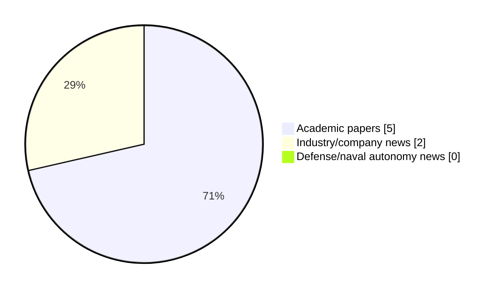

# Maritime Autonomy Watch — 2026-07-22

## Executive Summary

- Total selected items: 7
- Academic papers: 5
- Industry/company news: 2
- Defense/naval autonomy news: 0
- Failed/inaccessible sources: 0

## Contents

- [Analyst Brief](#analyst-brief)
- [Must Read](#must-read)
- [Top Signals Today](#top-signals-today)
- [Topic Signals](#topic-signals)
- [Freshness and Coverage](#freshness-and-coverage)
- [Quality Notes](#quality-notes)
- [Watchlist](#watchlist)
- [Academic Papers](#academic-papers)
- [Industry and Company News](#industry-and-company-news)
- [Defense and Naval Autonomy News](#defense-and-naval-autonomy-news)
- [Source Status Summary](#source-status-summary)

## Analyst Brief

Today's report selected 7 non-duplicate item(s), led by planning/control, AUV navigation, USV operations. The strongest item is [Robustness Verification of an Autonomous Underwater Vehicle-based Plankton Classifier](http://arxiv.org/abs/2607.04453v1) from arXiv.
Coverage is weighted toward academic research (5), with 2 industry and 0 defense signal(s).
Quality caveat: low-score-unique=1.

## Must Read

- [Robustness Verification of an Autonomous Underwater Vehicle-based Plankton Classifier](http://arxiv.org/abs/2607.04453v1) — Research signal: AUV navigation
- [Optimal mean-time path planning for unmanned underwater vehicles: a Hamilton-Jacobi approach](http://arxiv.org/abs/2607.03407v1) — Research signal: planning/control
- [Davie Autonomous Inc. Launches in Ontario to Manufacture USVs with Kraken Technology Group](https://oceannews.com/news/milestones/davie-autonomous-inc-launches-in-ontario-to-manufacture-usvs-with-kraken-technology-group/) — Industry signal: USV operations
- [LOTUSim: Multi-Domain Simulator for Marine Robotics](http://arxiv.org/abs/2607.03072v1) — Research signal: swarm autonomy
- [USV Streamlines Waterway Cleanup & Multi-Mission Operations](https://www.oceansciencetechnology.com/news/usv-streamlines-waterway-cleanup-multi-mission-operations/) — Industry signal: USV operations

## Top Signals Today

- planning/control: 3 selected item(s).
- AUV navigation: 2 selected item(s).
- USV operations: 2 selected item(s).
- swarm autonomy: 2 selected item(s).
- perception: 2 selected item(s).

## Topic Signals

- planning/control: 3
- AUV navigation: 2
- USV operations: 2
- swarm autonomy: 2
- perception: 2
- defense adoption: 1
- underwater communications: 1
- critical infrastructure: 1

## Freshness and Coverage

- Newest selected item date: 2026-07-21
- Oldest selected item date: 2026-07-03
- Active/enabled sources: 5
- Sources with access problems: 2
- Quality flags: 1

## Quality Notes

- low-score-unique: 1

## Watchlist

- [DIVO: Continuous-time DVL-Inertial-Visual Odometry for Unmanned Underwater Vehicles](http://arxiv.org/abs/2607.04615v1) — low-score-unique

### Category Snapshot

| Category | Selected items |
|---|---:|
| Academic papers | 5 |
| Industry/company news | 2 |
| Defense/naval autonomy news | 0 |

## Academic Papers

_Selected items: 5_

### [Robustness Verification of an Autonomous Underwater Vehicle-based Plankton Classifier](http://arxiv.org/abs/2607.04453v1)

- Source: arXiv
- Date: 2026-07-05
- Relevance score: 7.75
- Authors: Abdelrahman Sayed Sayed, Pierre-Jean Meyer, Asgeir J. Sørensen, Mohamed Ghazel
- Signal: Research signal: AUV navigation
- Topic tags: AUV navigation

**Abstract**

The assessment of planktonic standing stocks and microorganism structures is critical for understanding upper ocean biological processes. Currently, autonomous underwater vehicles (AUVs) equipped with in-situ optical imaging and artificial intelligence (AI) methods offer a promising solution for persistent surveillance, mapping and monitoring of planktonic life. However, current AI methods often lack robustness in dynamic, unstructured environments, where environmental noise and non-biological artifacts lead to frequent misclassifications. Standard convolutional neural network (CNN) classifiers often struggle with such conditions, leading to misclassifications that require time-consuming manual validation by marine biologists. To address this issue, we propose a novel robustness verification framework for in-situ plankton classifiers based on reachability analysis.

**Why it matters**

Relevant to underwater autonomy, infrastructure monitoring; the work may inform maritime autonomy research, testing priorities, or system design.

---

### [Optimal mean-time path planning for unmanned underwater vehicles: a Hamilton-Jacobi approach](http://arxiv.org/abs/2607.03407v1)

- Source: arXiv
- Date: 2026-07-03
- Relevance score: 7.75
- Authors: Jonathan Valyou, Jeremy Brandman, Sanghyun Lee
- Signal: Research signal: planning/control
- Topic tags: planning/control

**Abstract**

Unmanned underwater vehicles (UUV) integrate ocean forecasts with path planning algorithms in order to identify energy- or time-minimizing paths that enable mission completion. Typically, a well-defined deterministic ocean forecast is assumed to be available for path planning; however, in practice, different ocean forecasts can disagree. In this paper, we extend previous work on deterministic optimal path planning to identify optimal mean-time paths when presented with an ensemble of possible ocean forecasts. In particular, we formulate a system of time-independent Hamilton-Jacobi partial differential equations that incorporates forecast uncertainty and yields the optimal mean reachability travel time and the necessary controls to find the associated optimal path. An efficient numerical solution of this system of PDEs is obtained through an extension of the Fast Sweeping Method; verification and benchmarking results are provided.

**Why it matters**

Relevant to underwater autonomy, planning and control; the work may inform maritime autonomy research, testing priorities, or system design.

---

### [LOTUSim: Multi-Domain Simulator for Marine Robotics](http://arxiv.org/abs/2607.03072v1)

- Source: arXiv
- Date: 2026-07-03
- Relevance score: 5.75
- Authors: Cédric Buche, Juliette Grosset, Hélène Lechêne, Marie Dubromel, Pierig Havez-Bodivit, Malcom Neo, Julien Prodhon
- Signal: Research signal: swarm autonomy
- Topic tags: swarm autonomy, perception, defense adoption

**Abstract**

Simulation is essential for maritime robotics, supporting operator training, mission rehearsal, and human-vehicle interaction in environments where real-world testing is costly or hazardous. Existing simulators focus primarily on autonomy systems and often lack human-in-the-loop interaction and realistic environmental physics. This paper introduces LOTUSim, an open-source, real-time maritime simulator supporting multi-user interaction across aerial, surface, and underwater robotic systems for coordinated naval-style operations. The first contribution of this work is enabling real-time interactive performance for users while ensuring scalability to large fleets operating within a shared interactive simulation environment. Validation demonstrates robust human-in-the-loop performance, maintaining strict real-time execution and high visual fidelity while scaling to large heterogeneous maritime drone swarms.

**Why it matters**

Relevant to underwater autonomy, multi-vehicle coordination, naval adoption; the work may inform maritime autonomy research, testing priorities, or system design.

---

### [Strouhal-Aware Model Predictive Control for Efficient Multi-Fin Flapping Locomotion](http://arxiv.org/abs/2607.03216v1)

- Source: arXiv
- Date: 2026-07-03
- Relevance score: 4.25
- Authors: Yuya Hamamatsu, Zixi Chen, Maarja Kruusmaa, Asko Ristolainen
- Signal: Research signal: AUV navigation
- Topic tags: AUV navigation, planning/control

**Abstract**

Efficient flapping propulsion hinges on operating within a narrow Strouhal number window, a principle nature has converged upon for maximum thrust-to-power ratio. We translate this bioinspired empirical rule into real-time control, demonstrating it on an autonomous underwater vehicle driven by four soft fins. The proposed Strouhal-aware Model Predictive Control (MPC) enhances a quasi-steady hydrodynamic model with an explicit penalty for Strouhal deviation, solving the resulting nonconvex problem via a two-stage sampling and gradient optimization that runs onboard at 25 Hz. Pool and field trials show that the controller keeps each fin within the optimal Strouhal corridor (0.25-0.35) while precisely tracking commanded forces. This results in a mean reduction in mechanical power of 8.8\% to 32\% throughout the cruising range of 0.1 to 0.3 m/s. The proposed method also allows for a velocity of 0.

**Why it matters**

Relevant to underwater autonomy; the work may inform maritime autonomy research, testing priorities, or system design.

---

### [DIVO: Continuous-time DVL-Inertial-Visual Odometry for Unmanned Underwater Vehicles](http://arxiv.org/abs/2607.04615v1)

- Source: arXiv
- Date: 2026-07-06
- Relevance score: 3.5
- Authors: Kyungmin Jung, Angad Bajwa, Junha Yoo, Arturo Del Castillo Bernal, James Richard Forbes
- Signal: Research signal: underwater communications
- Topic tags: underwater communications, perception, planning/control, critical infrastructure
- Quality flags: low-score-unique

**Abstract**

This paper presents a novel acoustic-visual-inertial odometry solution leveraging a continuous-time trajectory estimation framework for unmanned underwater vehicles. Underwater environments present unique challenges for visual localization and mapping, such as light attenuation, illumination variance, and the presence of particulate matter. This motivates the use of additional sensing modalities and a visual tracking pipeline that is robust to diverse subsea conditions. The proposed system is the first continuous-time trajectory estimation framework based on Gaussian processes to fuse asynchronous measurements from a Doppler velocity log, a stereo camera, and an inertial measurement unit. Additionally, a novel visual frontend is proposed, incorporating learning-based feature extraction and matching that is robust to the specific challenges that subsea environments present.

**Why it matters**

Relevant to underwater autonomy, planning and control, infrastructure monitoring; the work may inform maritime autonomy research, testing priorities, or system design.

---

## Industry and Company News

_Selected items: 2_

### [Davie Autonomous Inc. Launches in Ontario to Manufacture USVs with Kraken Technology Group](https://oceannews.com/news/milestones/davie-autonomous-inc-launches-in-ontario-to-manufacture-usvs-with-kraken-technology-group/)

- Source: oceannews.com
- Date: 2026-07-21
- Relevance score: 6
- Signal: Industry signal: USV operations
- Topic tags: USV operations, swarm autonomy

**Summary**

Davie today announced the formation of Davie Autonomous Inc., an Ontario-based company that will manufacture and integrate uncrewed and autonomous maritime vehicles and systems in Canada.

**Why it matters**

Signals momentum in surface-vessel operations, multi-vehicle coordination; useful for tracking product direction, partnerships, and deployment opportunities.

---

### [USV Streamlines Waterway Cleanup & Multi-Mission Operations](https://www.oceansciencetechnology.com/news/usv-streamlines-waterway-cleanup-multi-mission-operations/)

- Source: oceansciencetechnology.com
- Date: 2026-07-21
- Relevance score: 5.25
- Signal: Industry signal: USV operations
- Topic tags: USV operations

**Summary**

The USVSTAR CLEANER from AGISTAR utilizes advanced autonomous navigation and a modular structural design to optimize floating debris recovery across.

**Why it matters**

Signals momentum in surface-vessel operations; useful for tracking product direction, partnerships, and deployment opportunities.

---

## Defense and Naval Autonomy News

_Selected items: 0_

No selected items.

## Inaccessible or Failed Sources

- None

## Source Status Summary

| Source | Status | Notes |
|---|---|---|
| arXiv | enabled | API source, 15 items fetched |
| OpenAlex | enabled | API source, 15 items fetched |
| RSS feeds | enabled | 107 RSS items fetched |
| SMI MASG News | enabled | HTML source, 10 items fetched |
| IEEE Xplore | disabled | Missing IEEE_XPLORE_API_KEY |
| Elsevier Scopus | enabled | API source, 15 items fetched |
| NewsAPI | disabled | Missing NEWS_API_KEY |

## Metadata

- Generated at: 2026-07-22T08:53:52.190499+02:00
- Date: 2026-07-22
- Repository: ferhannb/MarineRobotics
- Relevance threshold: 4.0
- Deduplication method: DOI, canonical URL, source ID, normalized title, similar recent titles, category caps, and novelty score
