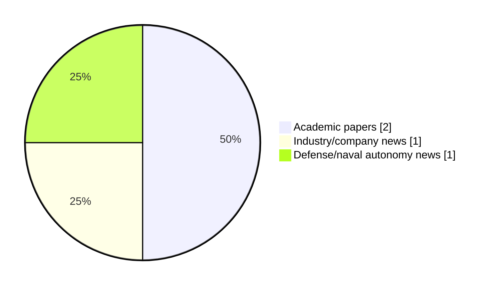

# Maritime Autonomy Watch — 2026-07-23

## Executive Summary

- Total selected items: 4
- Academic papers: 2
- Industry/company news: 1
- Defense/naval autonomy news: 1
- Failed/inaccessible sources: 0

## Contents

- [Analyst Brief](#analyst-brief)
- [Must Read](#must-read)
- [Top Signals Today](#top-signals-today)
- [Topic Signals](#topic-signals)
- [Freshness and Coverage](#freshness-and-coverage)
- [Quality Notes](#quality-notes)
- [Watchlist](#watchlist)
- [Academic Papers](#academic-papers)
- [Industry and Company News](#industry-and-company-news)
- [Defense and Naval Autonomy News](#defense-and-naval-autonomy-news)
- [Source Status Summary](#source-status-summary)

## Analyst Brief

Today's report selected 4 non-duplicate item(s), led by USV operations, AUV navigation, critical infrastructure. The strongest item is [Elistair and Exail bring persistent aerial surveillance to USVs](https://www.navalnews.com/naval-news/2026/07/elistair-and-exail-bring-persistent-aerial-surveillance-to-usvs/) from navalnews.com.
Coverage is weighted toward academic research (2), with 1 industry and 1 defense signal(s).
Quality caveat: missing-summary=1, date-anomaly=1.

## Must Read

- [Elistair and Exail bring persistent aerial surveillance to USVs](https://www.navalnews.com/naval-news/2026/07/elistair-and-exail-bring-persistent-aerial-surveillance-to-usvs/) — Defense signal: USV operations
- [ZeroUSV Completes Construction & Testing for Next-Generation Autonomous Vessel](https://www.oceansciencetechnology.com/news/zerousv-completes-construction-testing-for-next-generation-autonomous-vessel/) — Industry signal: USV operations
- [Optimal Placement of Docking Stations and Resident AUVs for Subsea Pipeline Inspection](http://arxiv.org/abs/2607.19944v1) — Research signal: AUV navigation

## Top Signals Today

- USV operations: 2 selected item(s).
- AUV navigation: 2 selected item(s).
- critical infrastructure: 1 selected item(s).
- perception: 1 selected item(s).

## Topic Signals

- USV operations: 2
- AUV navigation: 2
- critical infrastructure: 1
- perception: 1

## Freshness and Coverage

- Newest selected item date: 2026-12-01
- Oldest selected item date: 2026-07-22
- Active/enabled sources: 4
- Sources with access problems: 3
- Quality flags: 2

## Quality Notes

- missing-summary: 1
- date-anomaly: 1
- Date anomalies: [Ubiquitous sensing of marine activities via the cooperation of autonomous underwater vehicles](https://api.elsevier.com/content/abstract/scopus_id/105028115165) reports 2026-12-01

## Watchlist

- [Ubiquitous sensing of marine activities via the cooperation of autonomous underwater vehicles](https://api.elsevier.com/content/abstract/scopus_id/105028115165) — missing-summary, date-anomaly

### Category Snapshot

| Category | Selected items |
|---|---:|
| Academic papers | 2 |
| Industry/company news | 1 |
| Defense/naval autonomy news | 1 |

## Academic Papers

_Selected items: 2_

### [Optimal Placement of Docking Stations and Resident AUVs for Subsea Pipeline Inspection](http://arxiv.org/abs/2607.19944v1)

- Source: arXiv
- Date: 2026-07-22
- Relevance score: 7
- Authors: Gabrielė Kasparavičiūtė, Pasquale Grippa, Kjetil Skaugset, Asgeir J. Sørensen, Martin Ludvigsen
- Signal: Research signal: AUV navigation
- Topic tags: AUV navigation, critical infrastructure

**Abstract**

A two-stage mixed-integer linear programming framework is introduced for subsea pipeline incident response planning, jointly optimizing Subsea Docking Plate (SDP) placement and resident autonomous underwater vehicle allocation to minimize both maximum and average response times under spatial uncertainty. Phase 1 minimizes the maximum response time across all potential leak locations. Phase 2 reduces the average response time subject to the maximum bound. A case study based on the Johan Sverdrup oil and gas field in Norway, with 9 SDP options and 33 pipelines, shows that just a few well-placed SDPs are enough to achieve top performance. A cost versus time Pareto analysis reveals the trade-off between deployment expenditure and response efficiency, providing actionable guidance for designing resilient and cost-effective subsea inspection networks.

**Why it matters**

Relevant to underwater autonomy, infrastructure monitoring; the work may inform maritime autonomy research, testing priorities, or system design.

---

### [Ubiquitous sensing of marine activities via the cooperation of autonomous underwater vehicles](https://api.elsevier.com/content/abstract/scopus_id/105028115165)

- Source: Elsevier Scopus
- Date: 2026-12-01
- Relevance score: 4.25
- DOI: 10.1038/s41598-025-29532-y
- Signal: Research signal: AUV navigation
- Topic tags: AUV navigation, perception
- Quality flags: missing-summary, date-anomaly

**Abstract**

No summary available.

**Why it matters**

Relevant to underwater autonomy; the work may inform maritime autonomy research, testing priorities, or system design.

---

## Industry and Company News

_Selected items: 1_

### [ZeroUSV Completes Construction & Testing for Next-Generation Autonomous Vessel](https://www.oceansciencetechnology.com/news/zerousv-completes-construction-testing-for-next-generation-autonomous-vessel/)

- Source: oceansciencetechnology.com
- Date: 2026-07-23
- Relevance score: 8
- Signal: Industry signal: USV operations
- Topic tags: USV operations

**Summary**

UK-based ZeroUSV has completed construction and factory acceptance testing for its first 17-meter Oceanus17 Uncrewed Surface Vessel (USV), delivering the.

**Why it matters**

Signals momentum in surface-vessel operations; useful for tracking product direction, partnerships, and deployment opportunities.

---

## Defense and Naval Autonomy News

_Selected items: 1_

### [Elistair and Exail bring persistent aerial surveillance to USVs](https://www.navalnews.com/naval-news/2026/07/elistair-and-exail-bring-persistent-aerial-surveillance-to-usvs/)

- Source: navalnews.com
- Date: 2026-07-22
- Relevance score: 9.25
- Signal: Defense signal: USV operations
- Topic tags: USV operations

**Summary**

Elistair and Exail have partnered to integrate the Khronos automated tethered DroneBox on Exail’s DriX unmanned surface vessel (USV), giving maritime operators a persistent “eye in the sky” launched directly from the vessel. Elistair press release The combination extends surveillance well beyond the range of the platform’s surface sensors, while keeping personnel safe on shore..

**Why it matters**

Signals movement in surface-vessel operations; useful for tracking operational concepts, procurement direction, and fleet integration.

---

## Inaccessible or Failed Sources

- None

## Source Status Summary

| Source | Status | Notes |
|---|---|---|
| arXiv | enabled | API source, 15 items fetched |
| OpenAlex | enabled | API source, 15 items fetched |
| RSS feeds | partial | 85 RSS items fetched; failures: https://massworld.news/feed/: Invalid XML from https://massworld.news/feed/: mismatched tag: line 93, column 2; https://oceannews.com/feed/: Invalid XML from https://oceannews.com/feed/: mismatched tag: line 93, column 2 |
| SMI MASG News | enabled | HTML source, 0 items fetched |
| IEEE Xplore | disabled | Missing IEEE_XPLORE_API_KEY |
| Elsevier Scopus | enabled | API source, 15 items fetched |
| NewsAPI | disabled | Missing NEWS_API_KEY |

## Metadata

- Generated at: 2026-07-23T08:52:18.660746+02:00
- Date: 2026-07-23
- Repository: ferhannb/MarineRobotics
- Relevance threshold: 4.0
- Deduplication method: DOI, canonical URL, source ID, normalized title, similar recent titles, category caps, and novelty score
