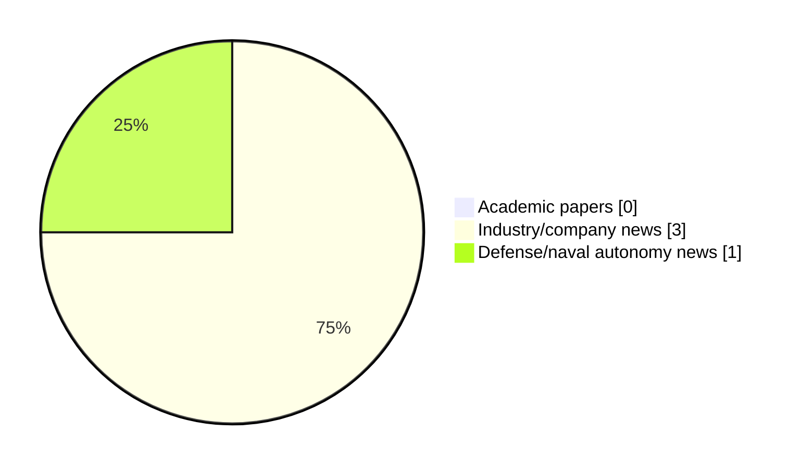

# Maritime Autonomy Watch — 2026-07-24

## Executive Summary

- Total selected items: 4
- Academic papers: 0
- Industry/company news: 3
- Defense/naval autonomy news: 1
- Failed/inaccessible sources: 0

## Contents

- [Analyst Brief](#analyst-brief)
- [Must Read](#must-read)
- [Top Signals Today](#top-signals-today)
- [Topic Signals](#topic-signals)
- [Freshness and Coverage](#freshness-and-coverage)
- [Quality Notes](#quality-notes)
- [Watchlist](#watchlist)
- [Academic Papers](#academic-papers)
- [Industry and Company News](#industry-and-company-news)
- [Defense and Naval Autonomy News](#defense-and-naval-autonomy-news)
- [Source Status Summary](#source-status-summary)

## Analyst Brief

Today's report selected 4 non-duplicate item(s), led by general autonomy, perception, critical infrastructure. The strongest item is [Ultra Maritime Demonstrates UUV Detection Capability at Navy Lanternfish 2026 Exercise](https://oceannews.com/news/defense/ultra-maritime-demonstrates-uuv-detection-capability-at-navy-lanternfish-2026-exercise/) from oceannews.com.
Coverage is weighted toward academic research (0), with 3 industry and 1 defense signal(s).
Quality caveat: low-score-unique=2.

## Must Read

- [Ultra Maritime Demonstrates UUV Detection Capability at Navy Lanternfish 2026 Exercise](https://oceannews.com/news/defense/ultra-maritime-demonstrates-uuv-detection-capability-at-navy-lanternfish-2026-exercise/) — Defense signal: perception
- [ACUA Ocean Pioneer USV demonstrates Long-Endurance Surveillance](https://massworld.news/acua-ocean-pioneer-usv-demonstrates-long-endurance-surveillance/) — Industry signal: USV operations
- [Oceanbotics Backs Championship College ROV Team to Build Next-Gen Engineering Talent](https://www.oceansciencetechnology.com/news/oceanbotics-backs-championship-college-rov-team-to-build-next-gen-engineering-talent/) — Industry signal: general autonomy
- [Saronic, Samsung Heavy Industries Collaborate on Autonomous Marine Systems](https://www.marinelink.com/news/saronic-samsung-heavy-industries-541490) — Industry signal: general autonomy

## Top Signals Today

- general autonomy: 2 selected item(s).
- perception: 1 selected item(s).
- critical infrastructure: 1 selected item(s).
- defense adoption: 1 selected item(s).
- USV operations: 1 selected item(s).

## Topic Signals

- general autonomy: 2
- perception: 1
- critical infrastructure: 1
- defense adoption: 1
- USV operations: 1

## Freshness and Coverage

- Newest selected item date: 2026-07-24
- Oldest selected item date: 2026-07-09
- Active/enabled sources: 5
- Sources with access problems: 2
- Quality flags: 2

## Quality Notes

- low-score-unique: 2

## Watchlist

- [Oceanbotics Backs Championship College ROV Team to Build Next-Gen Engineering Talent](https://www.oceansciencetechnology.com/news/oceanbotics-backs-championship-college-rov-team-to-build-next-gen-engineering-talent/) — low-score-unique
- [Saronic, Samsung Heavy Industries Collaborate on Autonomous Marine Systems](https://www.marinelink.com/news/saronic-samsung-heavy-industries-541490) — low-score-unique

### Category Snapshot

| Category | Selected items |
|---|---:|
| Academic papers | 0 |
| Industry/company news | 3 |
| Defense/naval autonomy news | 1 |

## Academic Papers

_Selected items: 0_

No selected items.

## Industry and Company News

_Selected items: 3_

### [ACUA Ocean Pioneer USV demonstrates Long-Endurance Surveillance](https://massworld.news/acua-ocean-pioneer-usv-demonstrates-long-endurance-surveillance/)

- Source: massworld.news
- Date: 2026-07-09
- Relevance score: 7.75
- Signal: Industry signal: USV operations
- Topic tags: USV operations

**Summary**

ACUA Ocean, a company that develops uncrewed surface vessels (USVs) for ocean monitoring and data collection, has its Mk1 USV PIONEER complete a five-day remotely operated offshore demonstration, validating the.

**Why it matters**

Signals momentum in surface-vessel operations, infrastructure monitoring; useful for tracking product direction, partnerships, and deployment opportunities.

---

### [Oceanbotics Backs Championship College ROV Team to Build Next-Gen Engineering Talent](https://www.oceansciencetechnology.com/news/oceanbotics-backs-championship-college-rov-team-to-build-next-gen-engineering-talent/)

- Source: oceansciencetechnology.com
- Date: 2026-07-24
- Relevance score: 3.5
- Signal: Industry signal: general autonomy
- Topic tags: general autonomy
- Quality flags: low-score-unique

**Summary**

The Titan ROV team from California State University, Fullerton (CSUF), sponsored by underwater robotics manufacturer Oceanbotics, secured first place in.

**Why it matters**

Signals momentum in underwater autonomy; useful for tracking product direction, partnerships, and deployment opportunities.

---

### [Saronic, Samsung Heavy Industries Collaborate on Autonomous Marine Systems](https://www.marinelink.com/news/saronic-samsung-heavy-industries-541490)

- Source: marinelink.com
- Date: 2026-07-23
- Relevance score: 3
- Signal: Industry signal: general autonomy
- Topic tags: general autonomy
- Quality flags: low-score-unique

**Summary**

Saronic and Samsung Heavy Industries (SHI) announced a strategic partnership to accelerate the development of autonomy-capable maritime systems and technologies to strengthen America’s shipbuilding industrial base. Through this partnership,…

**Why it matters**

This item may signal product, market, or deployment momentum in maritime autonomy.

---

## Defense and Naval Autonomy News

_Selected items: 1_

### [Ultra Maritime Demonstrates UUV Detection Capability at Navy Lanternfish 2026 Exercise](https://oceannews.com/news/defense/ultra-maritime-demonstrates-uuv-detection-capability-at-navy-lanternfish-2026-exercise/)

- Source: oceannews.com
- Date: 2026-07-23
- Relevance score: 9.25
- Signal: Defense signal: perception
- Topic tags: perception, critical infrastructure, defense adoption

**Summary**

In a major technological advancement for the protection of ports and critical infrastructure worldwide, Ultra Maritime has successfully demonstrated a groundbreaking capability to detect and classify advanced unmanned underwater vehicles (UUVs) during the US Navy's 2026 Lanternfish exercise.

**Why it matters**

Signals movement in underwater autonomy, infrastructure monitoring, naval adoption; useful for tracking operational concepts, procurement direction, and fleet integration.

---

## Inaccessible or Failed Sources

- None

## Source Status Summary

| Source | Status | Notes |
|---|---|---|
| arXiv | enabled | API source, 15 items fetched |
| OpenAlex | enabled | API source, 15 items fetched |
| RSS feeds | enabled | 107 RSS items fetched |
| SMI MASG News | enabled | HTML source, 10 items fetched |
| IEEE Xplore | disabled | Missing IEEE_XPLORE_API_KEY |
| Elsevier Scopus | enabled | API source, 15 items fetched |
| NewsAPI | disabled | Missing NEWS_API_KEY |

## Metadata

- Generated at: 2026-07-24T08:52:23.574170+02:00
- Date: 2026-07-24
- Repository: ferhannb/MarineRobotics
- Relevance threshold: 4.0
- Deduplication method: DOI, canonical URL, source ID, normalized title, similar recent titles, category caps, and novelty score
