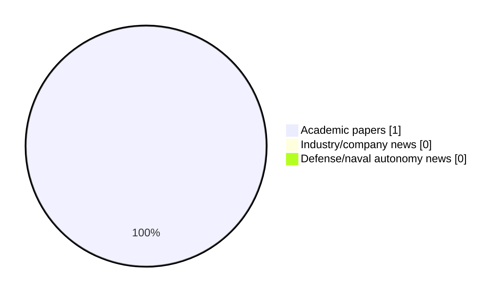

# Maritime Autonomy Watch — 2026-07-27

## Executive Summary

- Total selected items: 1
- Academic papers: 1
- Industry/company news: 0
- Defense/naval autonomy news: 0
- Failed/inaccessible sources: 1

## Contents

- [Analyst Brief](#analyst-brief)
- [Must Read](#must-read)
- [Top Signals Today](#top-signals-today)
- [Topic Signals](#topic-signals)
- [Freshness and Coverage](#freshness-and-coverage)
- [Quality Notes](#quality-notes)
- [Watchlist](#watchlist)
- [Academic Papers](#academic-papers)
- [Industry and Company News](#industry-and-company-news)
- [Defense and Naval Autonomy News](#defense-and-naval-autonomy-news)
- [Source Status Summary](#source-status-summary)

## Analyst Brief

Today's report selected 1 non-duplicate item(s), led by AUV navigation. The strongest item is [A Digital Twin Ocean: can we improve coastal ocean forecasts using targeted marine autonomy?](https://doi.org/10.5194/os-22-2083-2026) from OpenAlex.
Coverage is weighted toward academic research (1), with 0 industry and 0 defense signal(s).
Quality caveat: low-score-unique=1.

## Must Read

- [A Digital Twin Ocean: can we improve coastal ocean forecasts using targeted marine autonomy?](https://doi.org/10.5194/os-22-2083-2026) — Research signal: AUV navigation

## Top Signals Today

- AUV navigation: 1 selected item(s).

## Topic Signals

- AUV navigation: 1

## Freshness and Coverage

- Newest selected item date: 2026-07-01
- Oldest selected item date: 2026-07-01
- Active/enabled sources: 4
- Sources with access problems: 3
- Quality flags: 1

## Quality Notes

- low-score-unique: 1

## Watchlist

- [A Digital Twin Ocean: can we improve coastal ocean forecasts using targeted marine autonomy?](https://doi.org/10.5194/os-22-2083-2026) — low-score-unique

### Category Snapshot

| Category | Selected items |
|---|---:|
| Academic papers | 1 |
| Industry/company news | 0 |
| Defense/naval autonomy news | 0 |

## Academic Papers

_Selected items: 1_

### [A Digital Twin Ocean: can we improve coastal ocean forecasts using targeted marine autonomy?](https://doi.org/10.5194/os-22-2083-2026)

- Source: OpenAlex
- Date: 2026-07-01
- Relevance score: 3
- Authors: Dale Partridge, Deep Sankar Banerjee, David Ford, Ke Wang, Jozef Skákala, Juliane Wihsgott, Prathyush P. Menon, Susan Kay
- DOI: 10.5194/os-22-2083-2026
- Signal: Research signal: AUV navigation
- Topic tags: AUV navigation
- Quality flags: low-score-unique

**Abstract**

Abstract. This study outlines the development and testing of a Digital Twin Ocean (DTO) framework, aimed at improving coastal ocean forecasts through the use of autonomous underwater gliders. A fleet of gliders were deployed in the western English Channel during August–September 2024 to collect measurements of temperature, salinity, chlorophyll and oxygen, aiming to track the movement of the harmful algal bloom Karenia mikimotoi. Measurements were assimilated into a very high resolution (1.5 km) numerical forecast model, with an implementation of biogeochemistry data assimilation for this purpose. The model forecast was then used by a probabilistic uncertainty model to plan a series of waypoints to navigate the glider fleet towards features of interest.

**Why it matters**

Relevant to underwater autonomy; the work may inform maritime autonomy research, testing priorities, or system design.

---

## Industry and Company News

_Selected items: 0_

No selected items.

## Defense and Naval Autonomy News

_Selected items: 0_

No selected items.

## Inaccessible or Failed Sources

- arXiv: HTTP 429 for https://export.arxiv.org/api/query?search_query=all%3A%22maritime+autonomy%22+OR+all%3A%22marine+robotics%22+OR+all%3A%22autonomous+vessel%22+OR+all%3A%22autonomous+mission%22+OR+all%3A%22autonomous+surface+vessel%22+OR+all%3A%22autonomous+underwater+vehicle%22+OR+all%3A%22unmanned+surface+vehicle%22+OR+all%3A%22unmanned+underwater+vehicle%22&start=0&max_results=15&sortBy=submittedDate&sortOrder=descending

## Source Status Summary

| Source | Status | Notes |
|---|---|---|
| arXiv | failed | HTTP 429 for https://export.arxiv.org/api/query?search_query=all%3A%22maritime+autonomy%22+OR+all%3A%22marine+robotics%22+OR+all%3A%22autonomous+vessel%22+OR+all%3A%22autonomous+mission%22+OR+all%3A%22autonomous+surface+vessel%22+OR+all%3A%22autonomous+underwater+vehicle%22+OR+all%3A%22unmanned+surface+vehicle%22+OR+all%3A%22unmanned+underwater+vehicle%22&start=0&max_results=15&sortBy=submittedDate&sortOrder=descending |
| OpenAlex | enabled | API source, 15 items fetched |
| RSS feeds | enabled | 107 RSS items fetched |
| SMI MASG News | enabled | HTML source, 10 items fetched |
| IEEE Xplore | disabled | Missing IEEE_XPLORE_API_KEY |
| Elsevier Scopus | enabled | API source, 15 items fetched |
| NewsAPI | disabled | Missing NEWS_API_KEY |

## Metadata

- Generated at: 2026-07-27T09:10:11.942298+02:00
- Date: 2026-07-27
- Repository: ferhannb/MarineRobotics
- Relevance threshold: 4.0
- Deduplication method: DOI, canonical URL, source ID, normalized title, similar recent titles, category caps, and novelty score
