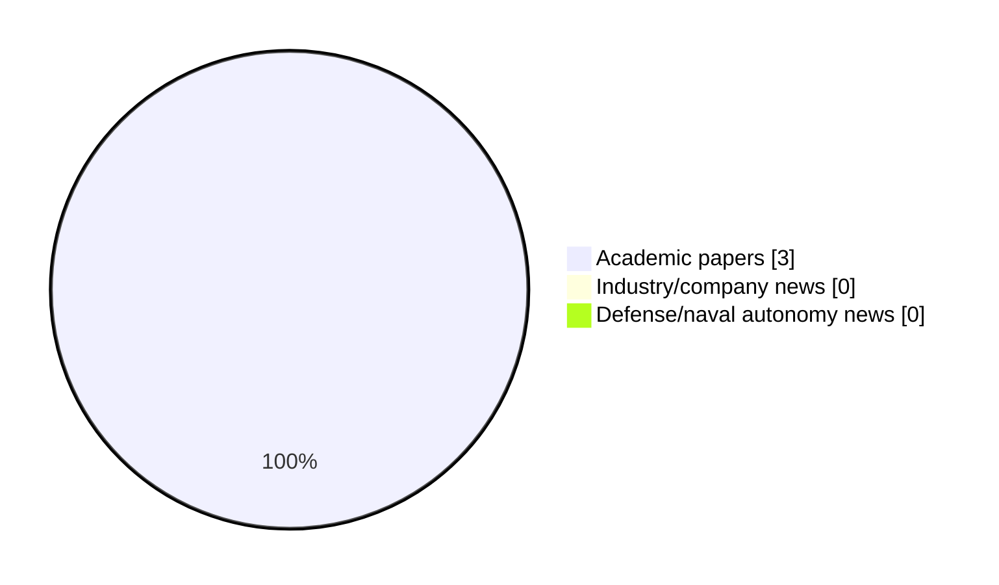

# Maritime Autonomy Watch — 2026-07-28

## Executive Summary

- Total selected items: 3
- Academic papers: 3
- Industry/company news: 0
- Defense/naval autonomy news: 0
- Failed/inaccessible sources: 0

## Contents

- [Analyst Brief](#analyst-brief)
- [Must Read](#must-read)
- [Top Signals Today](#top-signals-today)
- [Topic Signals](#topic-signals)
- [Freshness and Coverage](#freshness-and-coverage)
- [Quality Notes](#quality-notes)
- [Watchlist](#watchlist)
- [Academic Papers](#academic-papers)
- [Industry and Company News](#industry-and-company-news)
- [Defense and Naval Autonomy News](#defense-and-naval-autonomy-news)
- [Source Status Summary](#source-status-summary)

## Analyst Brief

Today's report selected 3 non-duplicate item(s), led by AUV navigation, planning/control, swarm autonomy. The strongest item is [CORAL-AUV: CFD Oriented Reinforcement Learning for Autonomous Underwater Vehicles](http://arxiv.org/abs/2607.09557v1) from arXiv.
Coverage is weighted toward academic research (3), with 0 industry and 0 defense signal(s).
Quality caveat: low-score-unique=1.

## Must Read

- [CORAL-AUV: CFD Oriented Reinforcement Learning for Autonomous Underwater Vehicles](http://arxiv.org/abs/2607.09557v1) — Research signal: AUV navigation
- [Resource-Aware Topology Management for ISAC-Enabled TDOA Localization in IoUT Networks](http://arxiv.org/abs/2607.24028v1) — Research signal: AUV navigation
- [Strategic Inference of Adversarial Navigation Objectives for Unmanned Underwater Vehicles](http://arxiv.org/abs/2607.21945v1) — Research signal: AUV navigation

## Top Signals Today

- AUV navigation: 3 selected item(s).
- planning/control: 2 selected item(s).
- swarm autonomy: 2 selected item(s).
- critical infrastructure: 1 selected item(s).
- underwater communications: 1 selected item(s).

## Topic Signals

- AUV navigation: 3
- planning/control: 2
- swarm autonomy: 2
- critical infrastructure: 1
- underwater communications: 1
- perception: 1

## Freshness and Coverage

- Newest selected item date: 2026-07-27
- Oldest selected item date: 2026-07-10
- Active/enabled sources: 4
- Sources with access problems: 3
- Quality flags: 1

## Quality Notes

- low-score-unique: 1

## Watchlist

- [Strategic Inference of Adversarial Navigation Objectives for Unmanned Underwater Vehicles](http://arxiv.org/abs/2607.21945v1) — low-score-unique

### Category Snapshot

| Category | Selected items |
|---|---:|
| Academic papers | 3 |
| Industry/company news | 0 |
| Defense/naval autonomy news | 0 |

## Academic Papers

_Selected items: 3_

### [CORAL-AUV: CFD Oriented Reinforcement Learning for Autonomous Underwater Vehicles](http://arxiv.org/abs/2607.09557v1)

- Source: arXiv
- Date: 2026-07-10
- Relevance score: 8.5
- Authors: Steven Roche, Milo Van Mooy, Nathan McGuire, Levi Cai, Jonathan P. How, Yogesh Girdhar
- Signal: Research signal: AUV navigation
- Topic tags: AUV navigation, planning/control, critical infrastructure

**Abstract**

Fine grain control and positioning of autonomous underwater vehicles (AUVs) is critical for sampling, maintenance, and survey applications. Traditional control methods for AUVs are labor intensive and are not robust to changes in the vehicle configuration or environmental conditions. Reinforcement learning (RL) promises rapid controller development while handling a range of deployment parameters via domain randomization (DR). However, DR is still limited by the capacity of the underlying simulation to model real physics. In particular, drag physics are difficult to model and are a large contributor to sim-to-real gaps. Meanwhile, computational fluid dynamics (CFD) provides high fidelity drag models but is challenging to leverage within reinforcement learning frameworks due to its computational overhead.

**Why it matters**

Relevant to underwater autonomy; the work may inform maritime autonomy research, testing priorities, or system design.

---

### [Resource-Aware Topology Management for ISAC-Enabled TDOA Localization in IoUT Networks](http://arxiv.org/abs/2607.24028v1)

- Source: arXiv
- Date: 2026-07-27
- Relevance score: 7
- Authors: Ruhul Amin Khalil
- Signal: Research signal: AUV navigation
- Topic tags: AUV navigation, underwater communications, swarm autonomy, perception

**Abstract**

Reliable localization in the Internet of Underwater Things (IoUT) is hindered by limited acoustic bandwidth, long propagation delays, multipath, Doppler shifts, and energy-constrained nodes. This letter proposes an integrated sensing and communication (ISAC)-enabled topology management and multi-stage adaptive estimation (ISAC-TM-MAE) framework for time-difference-of-arrival (TDOA) localization in IoUT networks. In the proposed framework, heterogeneous underwater sensors, seabed anchors, autonomous underwater vehicles (AUVs), and surface buoys exploit acoustic ISAC packets for joint communication and localization. The IoUT network is modeled as a graph, in which informative node pairs are selected subject to acoustic bandwidth, computation, energy, and link-reliability constraints.

**Why it matters**

Relevant to underwater autonomy, multi-vehicle coordination; the work may inform maritime autonomy research, testing priorities, or system design.

---

### [Strategic Inference of Adversarial Navigation Objectives for Unmanned Underwater Vehicles](http://arxiv.org/abs/2607.21945v1)

- Source: arXiv
- Date: 2026-07-24
- Relevance score: 3.5
- Authors: Ruimeng Hu, Xu Yang
- Signal: Research signal: AUV navigation
- Topic tags: AUV navigation, swarm autonomy, planning/control
- Quality flags: low-score-unique

**Abstract**

We study destination inference for adversarial unmanned underwater navigation in a spatially varying current field. The red vehicle is modeled as approximately following a Hamilton-Jacobi (HJ) time-optimal path toward an unknown destination, while a blue vehicle observes a noisy realization of that trajectory. We derive a continuous-time likelihood model for this problem and obtain a closed-form local maximum likelihood estimator, a constant-memory multi-period estimator, and an asymptotic Cramér-Rao efficiency result. The Fisher information is governed by a combined score kernel with two additive components, a policy-mean sensitivity and a reference-path sensitivity, and a multiplicative drift sensitivity whose leading geometric contribution is a contraction of the current Hessian with the Jacobi field of the HJ characteristic flow.

**Why it matters**

Relevant to underwater autonomy, multi-vehicle coordination, planning and control; the work may inform maritime autonomy research, testing priorities, or system design.

---

## Industry and Company News

_Selected items: 0_

No selected items.

## Defense and Naval Autonomy News

_Selected items: 0_

No selected items.

## Inaccessible or Failed Sources

- None

## Source Status Summary

| Source | Status | Notes |
|---|---|---|
| arXiv | enabled | API source, 15 items fetched |
| OpenAlex | enabled | API source, 15 items fetched |
| RSS feeds | partial | 85 RSS items fetched; failures: https://massworld.news/feed/: Invalid XML from https://massworld.news/feed/: mismatched tag: line 93, column 2; https://oceannews.com/feed/: Invalid XML from https://oceannews.com/feed/: mismatched tag: line 93, column 2 |
| SMI MASG News | enabled | HTML source, 0 items fetched |
| IEEE Xplore | disabled | Missing IEEE_XPLORE_API_KEY |
| Elsevier Scopus | enabled | API source, 15 items fetched |
| NewsAPI | disabled | Missing NEWS_API_KEY |

## Metadata

- Generated at: 2026-07-28T08:54:10.223767+02:00
- Date: 2026-07-28
- Repository: ferhannb/MarineRobotics
- Relevance threshold: 4.0
- Deduplication method: DOI, canonical URL, source ID, normalized title, similar recent titles, category caps, and novelty score
