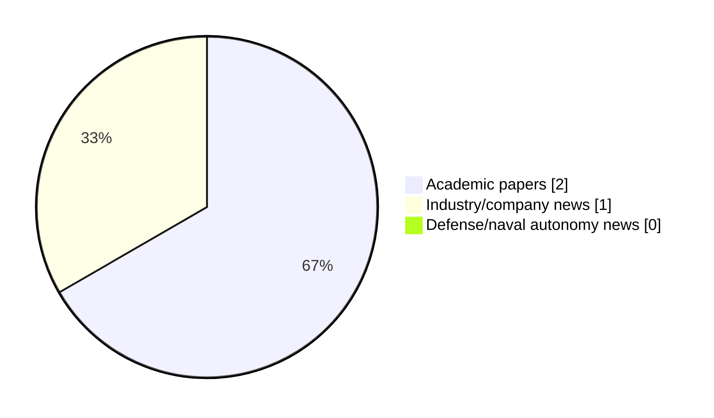

# Maritime Autonomy Watch — 2026-07-29

## Executive Summary

- Total selected items: 3
- Academic papers: 2
- Industry/company news: 1
- Defense/naval autonomy news: 0
- Failed/inaccessible sources: 1

## Contents

- [Analyst Brief](#analyst-brief)
- [Must Read](#must-read)
- [Top Signals Today](#top-signals-today)
- [Topic Signals](#topic-signals)
- [Freshness and Coverage](#freshness-and-coverage)
- [Quality Notes](#quality-notes)
- [Watchlist](#watchlist)
- [Academic Papers](#academic-papers)
- [Industry and Company News](#industry-and-company-news)
- [Defense and Naval Autonomy News](#defense-and-naval-autonomy-news)
- [Source Status Summary](#source-status-summary)

## Analyst Brief

Today's report selected 3 non-duplicate item(s), led by USV operations, swarm autonomy, planning/control. The strongest item is [Task Composition Method for Behavior-Based Control of Uncrewed Surface Vehicles](https://doi.org/10.26748/ksoe.2026.030) from OpenAlex.
Coverage is weighted toward academic research (2), with 1 industry and 0 defense signal(s).
Quality caveat: missing-summary=1, date-anomaly=1, low-score-unique=1.

## Must Read

- [Task Composition Method for Behavior-Based Control of Uncrewed Surface Vehicles](https://doi.org/10.26748/ksoe.2026.030) — Research signal: USV operations
- [Nauticus Robotics Completes First Prototype of Electric Manipulator for AUVs](https://oceannews.com/news/science-technology/nauticus-robotics-completes-first-prototype-of-electric-manipulator-for-auvs/) — Industry signal: AUV navigation

## Top Signals Today

- USV operations: 1 selected item(s).
- swarm autonomy: 1 selected item(s).
- planning/control: 1 selected item(s).
- AUV navigation: 1 selected item(s).
- critical infrastructure: 1 selected item(s).

## Topic Signals

- USV operations: 1
- swarm autonomy: 1
- planning/control: 1
- AUV navigation: 1
- critical infrastructure: 1
- general autonomy: 1

## Freshness and Coverage

- Newest selected item date: 2026-12-01
- Oldest selected item date: 2026-07-24
- Active/enabled sources: 4
- Sources with access problems: 3
- Quality flags: 3

## Quality Notes

- missing-summary: 1
- date-anomaly: 1
- low-score-unique: 1
- Date anomalies: [Dynamic reliability analysis for unmanned systems with epistemic uncertainty: An application to the variable buoyancy system of a self-powered underwater glider](https://api.elsevier.com/content/abstract/scopus_id/105039679575) reports 2026-12-01

## Watchlist

- [Dynamic reliability analysis for unmanned systems with epistemic uncertainty: An application to the variable buoyancy system of a self-powered underwater glider](https://api.elsevier.com/content/abstract/scopus_id/105039679575) — missing-summary, date-anomaly, low-score-unique

### Category Snapshot

| Category | Selected items |
|---|---:|
| Academic papers | 2 |
| Industry/company news | 1 |
| Defense/naval autonomy news | 0 |

## Academic Papers

_Selected items: 2_

### [Task Composition Method for Behavior-Based Control of Uncrewed Surface Vehicles](https://doi.org/10.26748/ksoe.2026.030)

- Source: OpenAlex
- Date: 2026-07-24
- Relevance score: 9.25
- Authors: Uijong Kim
- DOI: 10.26748/ksoe.2026.030
- Signal: Research signal: USV operations
- Topic tags: USV operations, swarm autonomy, planning/control

**Abstract**

As the autonomy of uncrewed systems advances, there is increasing demand for robust operation in complex environments. In the maritime domain, the dynamic and unstructured nature of the ocean poses significant challenges for uncrewed surface vehicles (USVs) to respond in real time using conventional optimization-based methods. This paper proposes a behavior-based control framework built from simple, modular behaviors. Each behavior is formulated as a real-valued objective function over a shared action space, and the behaviors are combined through task composition using lattice-algebraic operations-disjunction, conjunction, and negation. This approach yields a scalable arbitration scheme that integrates new behaviors by accounting for their logical interrelationships.

**Why it matters**

Relevant to surface-vessel operations, multi-vehicle coordination, navigation safety; the work may inform maritime autonomy research, testing priorities, or system design.

---

### [Dynamic reliability analysis for unmanned systems with epistemic uncertainty: An application to the variable buoyancy system of a self-powered underwater glider](https://api.elsevier.com/content/abstract/scopus_id/105039679575)

- Source: Elsevier Scopus
- Date: 2026-12-01
- Relevance score: 3.5
- DOI: 10.1016/j.ress.2026.112902
- Signal: Research signal: general autonomy
- Topic tags: general autonomy
- Quality flags: missing-summary, date-anomaly, low-score-unique

**Abstract**

No summary available.

**Why it matters**

Relevant to underwater autonomy; the work may inform maritime autonomy research, testing priorities, or system design.

---

## Industry and Company News

_Selected items: 1_

### [Nauticus Robotics Completes First Prototype of Electric Manipulator for AUVs](https://oceannews.com/news/science-technology/nauticus-robotics-completes-first-prototype-of-electric-manipulator-for-auvs/)

- Source: oceannews.com
- Date: 2026-07-28
- Relevance score: 7.75
- Signal: Industry signal: AUV navigation
- Topic tags: AUV navigation, critical infrastructure

**Summary**

Nauticus Robotics, Inc. (Nauticus), a leading innovator in autonomous subsea robotics and software solutions, has announced the successful completion of the first prototype of its internally developed next-generation electric manipulator, purpose-built for autonomous underwater vehicles (AUVs) and next-generation robotic systems.

**Why it matters**

Signals momentum in underwater autonomy; useful for tracking product direction, partnerships, and deployment opportunities.

---

## Defense and Naval Autonomy News

_Selected items: 0_

No selected items.

## Inaccessible or Failed Sources

- arXiv: HTTP 429 for https://export.arxiv.org/api/query?search_query=all%3A%22maritime+autonomy%22+OR+all%3A%22marine+robotics%22+OR+all%3A%22autonomous+vessel%22+OR+all%3A%22autonomous+mission%22+OR+all%3A%22autonomous+surface+vessel%22+OR+all%3A%22autonomous+underwater+vehicle%22+OR+all%3A%22unmanned+surface+vehicle%22+OR+all%3A%22unmanned+underwater+vehicle%22&start=0&max_results=15&sortBy=submittedDate&sortOrder=descending

## Source Status Summary

| Source | Status | Notes |
|---|---|---|
| arXiv | failed | HTTP 429 for https://export.arxiv.org/api/query?search_query=all%3A%22maritime+autonomy%22+OR+all%3A%22marine+robotics%22+OR+all%3A%22autonomous+vessel%22+OR+all%3A%22autonomous+mission%22+OR+all%3A%22autonomous+surface+vessel%22+OR+all%3A%22autonomous+underwater+vehicle%22+OR+all%3A%22unmanned+surface+vehicle%22+OR+all%3A%22unmanned+underwater+vehicle%22&start=0&max_results=15&sortBy=submittedDate&sortOrder=descending |
| OpenAlex | enabled | API source, 15 items fetched |
| RSS feeds | enabled | 107 RSS items fetched |
| SMI MASG News | enabled | HTML source, 10 items fetched |
| IEEE Xplore | disabled | Missing IEEE_XPLORE_API_KEY |
| Elsevier Scopus | enabled | API source, 15 items fetched |
| NewsAPI | disabled | Missing NEWS_API_KEY |

## Metadata

- Generated at: 2026-07-29T08:55:50.927661+02:00
- Date: 2026-07-29
- Repository: ferhannb/MarineRobotics
- Relevance threshold: 4.0
- Deduplication method: DOI, canonical URL, source ID, normalized title, similar recent titles, category caps, and novelty score
