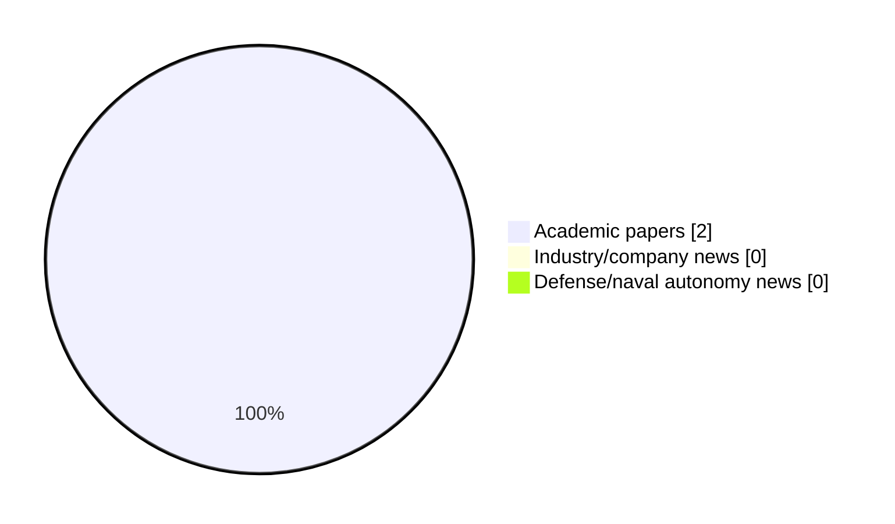

# Maritime Autonomy Watch — 2026-07-30

## Executive Summary

- Total selected items: 2
- Academic papers: 2
- Industry/company news: 0
- Defense/naval autonomy news: 0
- Failed/inaccessible sources: 0

## Contents

- [Analyst Brief](#analyst-brief)
- [Must Read](#must-read)
- [Top Signals Today](#top-signals-today)
- [Topic Signals](#topic-signals)
- [Freshness and Coverage](#freshness-and-coverage)
- [Quality Notes](#quality-notes)
- [Watchlist](#watchlist)
- [Academic Papers](#academic-papers)
- [Industry and Company News](#industry-and-company-news)
- [Defense and Naval Autonomy News](#defense-and-naval-autonomy-news)
- [Source Status Summary](#source-status-summary)

## Analyst Brief

Today's report selected 2 non-duplicate item(s), led by AUV navigation, planning/control, perception. The strongest item is [Hybrid Artificial Potential Fields and Spatio-Temporal Transformers for Real-Time AUV Path Planning](http://arxiv.org/abs/2607.25056v1) from arXiv.
Coverage is weighted toward academic research (2), with 0 industry and 0 defense signal(s).

## Must Read

- [Hybrid Artificial Potential Fields and Spatio-Temporal Transformers for Real-Time AUV Path Planning](http://arxiv.org/abs/2607.25056v1) — Research signal: AUV navigation
- [IBPA: Real-time Free-form Manifold Mesh Reconstruction via Incremental Ball Pivoting with Integrated Hole Detection](http://arxiv.org/abs/2607.11627v1) — Research signal: AUV navigation

## Top Signals Today

- AUV navigation: 2 selected item(s).
- planning/control: 1 selected item(s).
- perception: 1 selected item(s).

## Topic Signals

- AUV navigation: 2
- planning/control: 1
- perception: 1

## Freshness and Coverage

- Newest selected item date: 2026-07-27
- Oldest selected item date: 2026-07-13
- Active/enabled sources: 4
- Sources with access problems: 3
- Quality flags: 0

## Quality Notes

- No quality flags on selected items.

## Watchlist

- No watchlist items today.

### Category Snapshot

| Category | Selected items |
|---|---:|
| Academic papers | 2 |
| Industry/company news | 0 |
| Defense/naval autonomy news | 0 |

## Academic Papers

_Selected items: 2_

### [Hybrid Artificial Potential Fields and Spatio-Temporal Transformers for Real-Time AUV Path Planning](http://arxiv.org/abs/2607.25056v1)

- Source: arXiv
- Date: 2026-07-27
- Relevance score: 10
- Authors: Khadija Rais, Abdelmadjid Benmachiche, Imene Soualmia
- Signal: Research signal: AUV navigation
- Topic tags: AUV navigation, planning/control

**Abstract**

Autonomous Underwater Vehicles (AUVs) operate in complex, unstructured environments where efficient and safe path planning is critical for mission success and energy conservation. This paper presents a comprehensive comparative evaluation of thirteen path planning algorithms, ranging from classical graph-search methods (A*, Dijkstra) and sampling-based approaches (RRT*) to metaheuristics (PSO, GA, ACO, BCO) and learning-based architectures. Special emphasis is placed on a proposed hybrid approach combining Artificial Potential Fields (APF) with a Spatio-Temporal (ST) Transformer. Evaluated across five navigation scenarios on high-resolution underwater terrain maps, all algorithms achieved 100\% task completion; however, significant trade-offs emerged in path optimality, collision avoidance, and computational load. The Hybrid APF + ST-Transformer demonstrated superior balanced performance, achieving the shortest average path length (943.

**Why it matters**

Relevant to underwater autonomy, navigation safety, planning and control; the work may inform maritime autonomy research, testing priorities, or system design.

---

### [IBPA: Real-time Free-form Manifold Mesh Reconstruction via Incremental Ball Pivoting with Integrated Hole Detection](http://arxiv.org/abs/2607.11627v1)

- Source: arXiv
- Date: 2026-07-13
- Relevance score: 7
- Authors: Mauhing Yip, Mohit Singh, Kostas Alexis, Christian Schellewald, Annette Stahl
- Signal: Research signal: AUV navigation
- Topic tags: AUV navigation, perception

**Abstract**

Both Remotely Operated underwater Vehicles (ROVs) and Autonomous Underwater Vehicles (AUVs) are frequently deployed to acquire geometric bathymetric data. However, it is often discovered post-survey that the acquired data coverage is incomplete. Given the high operational cost associated with underwater deployments, it is essential to incrementally visualize surface coverage in real-time to support informed decision-making by both the operators of ROVs and the AUVs during data collection. In addition, traditional incremental surface reconstruction methods, such as Digital Terrain Models (DTMs), are inherently limited in expressiveness: they represent surfaces as height fields, allows only one elevation value per $(x, y)$ coordinate and thus cannot capture overhangs or vertical structures.

**Why it matters**

Relevant to underwater autonomy; the work may inform maritime autonomy research, testing priorities, or system design.

---

## Industry and Company News

_Selected items: 0_

No selected items.

## Defense and Naval Autonomy News

_Selected items: 0_

No selected items.

## Inaccessible or Failed Sources

- None

## Source Status Summary

| Source | Status | Notes |
|---|---|---|
| arXiv | enabled | API source, 15 items fetched |
| OpenAlex | enabled | API source, 15 items fetched |
| RSS feeds | partial | 85 RSS items fetched; failures: https://massworld.news/feed/: Invalid XML from https://massworld.news/feed/: mismatched tag: line 93, column 2; https://oceannews.com/feed/: Invalid XML from https://oceannews.com/feed/: mismatched tag: line 93, column 2 |
| SMI MASG News | enabled | HTML source, 0 items fetched |
| IEEE Xplore | disabled | Missing IEEE_XPLORE_API_KEY |
| Elsevier Scopus | enabled | API source, 15 items fetched |
| NewsAPI | disabled | Missing NEWS_API_KEY |

## Metadata

- Generated at: 2026-07-30T08:54:27.771830+02:00
- Date: 2026-07-30
- Repository: ferhannb/MarineRobotics
- Relevance threshold: 4.0
- Deduplication method: DOI, canonical URL, source ID, normalized title, similar recent titles, category caps, and novelty score
