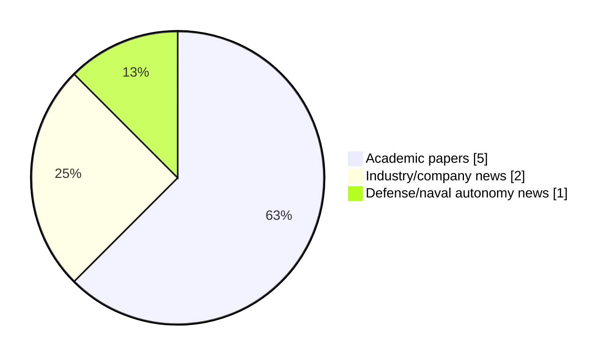

# Maritime Autonomy Watch — 2026-07-31

## Executive Summary

- Total selected items: 8
- Academic papers: 5
- Industry/company news: 2
- Defense/naval autonomy news: 1
- Failed/inaccessible sources: 0

## Contents

- [Analyst Brief](#analyst-brief)
- [Must Read](#must-read)
- [Top Signals Today](#top-signals-today)
- [Topic Signals](#topic-signals)
- [Freshness and Coverage](#freshness-and-coverage)
- [Quality Notes](#quality-notes)
- [Watchlist](#watchlist)
- [Academic Papers](#academic-papers)
- [Industry and Company News](#industry-and-company-news)
- [Defense and Naval Autonomy News](#defense-and-naval-autonomy-news)
- [Source Status Summary](#source-status-summary)

## Analyst Brief

Today's report selected 8 non-duplicate item(s), led by USV operations, perception, AUV navigation. The strongest item is [Design and Control of the "QuadBoat": A Quadruped Surface Vehicle for Drowning Rescue](http://arxiv.org/abs/2607.13633v1) from arXiv.
Coverage is weighted toward academic research (5), with 2 industry and 1 defense signal(s).

## Must Read

- [Design and Control of the "QuadBoat": A Quadruped Surface Vehicle for Drowning Rescue](http://arxiv.org/abs/2607.13633v1) — Research signal: USV operations
- [Research on the inspection technology and application of deep-sea marine cable based on underwater robots](https://doi.org/10.1051/ijmqe/2026008/pdf) — Research signal: AUV navigation
- [Task-Oriented Sensing and Covert Transmissions for Collaborative Multi-AUV Systems](http://arxiv.org/abs/2607.13880v1) — Research signal: AUV navigation
- [JPS-TEB Fusion Path Planning Based on COLREGs](https://doi.org/10.3390/oceans7040060) — Research signal: USV operations
- [OPT Delivers WAM-V USV to Stevens Institute of Technology](https://oceannews.com/news/milestones/opt-delivers-wam-v-usv-to-stevens-institute-of-technology/) — Industry signal: USV operations

## Top Signals Today

- USV operations: 4 selected item(s).
- perception: 4 selected item(s).
- AUV navigation: 3 selected item(s).
- planning/control: 2 selected item(s).
- underwater communications: 2 selected item(s).

## Topic Signals

- USV operations: 4
- perception: 4
- AUV navigation: 3
- planning/control: 2
- underwater communications: 2
- critical infrastructure: 1
- swarm autonomy: 1

## Freshness and Coverage

- Newest selected item date: 2026-07-30
- Oldest selected item date: 2026-07-13
- Active/enabled sources: 5
- Sources with access problems: 2
- Quality flags: 0

## Quality Notes

- No quality flags on selected items.

## Watchlist

- No watchlist items today.

### Category Snapshot

| Category | Selected items |
|---|---:|
| Academic papers | 5 |
| Industry/company news | 2 |
| Defense/naval autonomy news | 1 |

## Academic Papers

_Selected items: 5_

### [Design and Control of the "QuadBoat": A Quadruped Surface Vehicle for Drowning Rescue](http://arxiv.org/abs/2607.13633v1)

- Source: arXiv
- Date: 2026-07-15
- Relevance score: 10
- Authors: Lianxin Zhang, Yihan Huang, Huihuan Qian
- Signal: Research signal: USV operations
- Topic tags: USV operations, perception, planning/control

**Abstract**

Prompt extraction of victims from water is crucial in water surface rescue missions. However, previous research on rescue robots has seldom addressed this issue. This paper presents QuadBoat, a bio-inspired unmanned surface vehicle (USV) designed to track and retrieve victims from water. QuadBoat features a quadrupedal robot configuration, enabling it with highly adaptable and agile maneuverability through its actively adjustable posture. Employing an inverse kinematics-based controller and cascaded model predictive control (MPC)-PID controller for overall movement, QuadBoat can accurately track and retrieve objects on the water surface. Maneuverability demonstrations validate QuadBoat's high agility, while a series of tracking experiments, including leg action tracking and trajectory tracking, confirm its high motion accuracy and system mobility.

**Why it matters**

Relevant to surface-vessel operations, planning and control; the work may inform maritime autonomy research, testing priorities, or system design.

---

### [Research on the inspection technology and application of deep-sea marine cable based on underwater robots](https://doi.org/10.1051/ijmqe/2026008/pdf)

- Source: OpenAlex
- Date: 2026-07-28
- Relevance score: 8.5
- Authors: Wenbo Luo, Qingwen Zhang, Bin Lin
- DOI: 10.1051/ijmqe/2026008/pdf
- Signal: Research signal: AUV navigation
- Topic tags: AUV navigation, underwater communications, perception, critical infrastructure

**Abstract**

The growing dependence on deep-sea marine cables for telecommunications, power transmission, and scientific research has highlighted the importance of efficient inspection and maintenance strategies. Conventional techniques, including human divers, Remotely Operated Vehicles (ROVs), and Autonomous Underwater Vehicles (AUVs), have been used as main instruments for cable inspection. They are, however, plagued by several challenges, including high cost of operation, depth limitations, interference from the environment, and the danger to human life. This article discusses how underwater robots can transform the inspection and repair of deep-sea cables. In particular, the research focuses on the multiple underwater robotic platforms, i.e., ROVs, AUVs, and hybrid platforms such as Underwater Vehicle-Manipulator Systems (UVMS), with a focus on inspection, navigation, and repair.

**Why it matters**

Relevant to underwater autonomy, infrastructure monitoring; the work may inform maritime autonomy research, testing priorities, or system design.

---

### [Task-Oriented Sensing and Covert Transmissions for Collaborative Multi-AUV Systems](http://arxiv.org/abs/2607.13880v1)

- Source: arXiv
- Date: 2026-07-15
- Relevance score: 8.5
- Authors: Xueyao Zhang, Chenyang Yan, Bo Yang, Xuelin Cao, Zhiwen Yu, Bin Guo, George C. Alexandropoulos, Merouane Debbah, Chau Yuen
- Signal: Research signal: AUV navigation
- Topic tags: AUV navigation, underwater communications, swarm autonomy, perception

**Abstract**

In underwater covert cooperative missions, autonomous underwater vehicles (AUVs) often cannot rely on active sonar to continuously obtain complete information, since active sensing and frequent communications increase the risk of exposure. As a result, AUVs primarily rely on passive observation, an approach that yields incomplete local perception and limited task efficiency. Although underwater acoustic communications can mitigate this limitation through information sharing, they are simultaneously constrained by long delays, severe interference, low reliability, and the risk of covert exposure. Existing communications-oriented multi-agent reinforcement learning (MARL) studies often model communication as an ideal information flow, whereas traditional communication optimization primarily focuses on link-level performance.

**Why it matters**

Relevant to underwater autonomy, multi-vehicle coordination; the work may inform maritime autonomy research, testing priorities, or system design.

---

### [Machines that know they are aging: a framework for hardware-aware autonomous intelligence](http://arxiv.org/abs/2607.28451v1)

- Source: arXiv
- Date: 2026-07-30
- Relevance score: 4.25
- Authors: Cheng Siong Chin, Jianhua Zhang, Mohan Venkateshkumar
- Signal: Research signal: perception
- Topic tags: perception

**Abstract**

Autonomous systems inevitably age, yet their artificial intelligence typically assumes hardware remains in its original condition. Batteries degrade, sensors drift, processors accumulate timing errors, and memory reliability declines, creating a growing mismatch between assumed and actual capability. This can lead to agnostic collapse, where mission failure arises from accumulated hardware degradation rather than a single component fault. We propose Aging-Aware Autonomous Intelligence (AAAI), a framework that integrates hardware health directly into reasoning, planning, and mission execution.

**Why it matters**

This paper may influence autonomy, perception, planning, or control work for maritime robotic systems.

---

### [JPS-TEB Fusion Path Planning Based on COLREGs](https://doi.org/10.3390/oceans7040060)

- Source: OpenAlex
- Date: 2026-07-13
- Relevance score: 5
- Authors: Hongxiao Yu, Qiaoyan Cai, Jianqiang Zhang
- DOI: 10.3390/oceans7040060
- Signal: Research signal: USV operations
- Topic tags: USV operations, planning/control

**Abstract**

To address the lack of compliance with the International Regulations for Preventing Collisions at Sea (COLREGs) in conventional timed elastic band (TEB)—based dynamic path planning for autonomous surface vessels (ASVs), this study proposes an intelligent path-planning framework that integrates an improved jump point search (JPS) algorithm with a COLREGs-aware TEB approach. At the global planning layer, an enhanced JPS algorithm incorporating redundant-node elimination and cubic Bezier curve smoothing is developed to construct the JPS–PB method, thereby reducing path redundancy and improving trajectory continuity. At the local planning layer, COLREGs encounter rules are reformulated as differentiable cost functions and embedded into the TEB optimization framework, enabling rule-compliant collision avoidance in typical maritime encounter scenarios, including head-on, crossing, and overtaking situations.

**Why it matters**

Relevant to surface-vessel operations, navigation safety, planning and control; the work may inform maritime autonomy research, testing priorities, or system design.

---

## Industry and Company News

_Selected items: 2_

### [OPT Delivers WAM-V USV to Stevens Institute of Technology](https://oceannews.com/news/milestones/opt-delivers-wam-v-usv-to-stevens-institute-of-technology/)

- Source: oceannews.com
- Date: 2026-07-30
- Relevance score: 4.5
- Signal: Industry signal: USV operations
- Topic tags: USV operations

**Summary**

Ocean Power Technologies has announced the successful delivery of its WAM-V® USV to Stevens Institute of Technology, completing the order announced in June 2026.

**Why it matters**

Signals momentum in surface-vessel operations; useful for tracking product direction, partnerships, and deployment opportunities.

---

### [SubCtech Demonstrates 50 kW Continuous Power in 600 V-Class AUV Battery System](https://oceannews.com/news/science-technology/subctech-demonstrates-50-kw-continuous-power-in-600-v-class-auv-battery-system/)

- Source: oceannews.com
- Date: 2026-07-30
- Relevance score: 4.25
- Signal: Industry signal: AUV navigation
- Topic tags: AUV navigation

**Summary**

SubCtech has successfully achieved a major technical milestone in the development of a high-voltage, high-discharge-rate battery and charger system for a customer-defined underwater platform.

**Why it matters**

Signals momentum in underwater autonomy; useful for tracking product direction, partnerships, and deployment opportunities.

---

## Defense and Naval Autonomy News

_Selected items: 1_

### [MARTAC Builds Forward Sustainment Model for Autonomous Surface Vessel Fleets](https://oceannews.com/news/defense/martac-builds-forward-sustainment-model-for-autonomous-surface-vessel-fleets/)

- Source: oceannews.com
- Date: 2026-07-30
- Relevance score: 4.25
- Signal: Defense signal: USV operations
- Topic tags: USV operations

**Summary**

Vessel delivery is only the first requirement of building a new maritime capability. Sustaining that capability once it is operating is the harder and more consequential problem; this is where MARTAC is investing.

**Why it matters**

Signals movement in surface-vessel operations; useful for tracking operational concepts, procurement direction, and fleet integration.

---

## Inaccessible or Failed Sources

- None

## Source Status Summary

| Source | Status | Notes |
|---|---|---|
| arXiv | enabled | API source, 15 items fetched |
| OpenAlex | enabled | API source, 15 items fetched |
| RSS feeds | enabled | 107 RSS items fetched |
| SMI MASG News | enabled | HTML source, 10 items fetched |
| IEEE Xplore | disabled | Missing IEEE_XPLORE_API_KEY |
| Elsevier Scopus | enabled | API source, 15 items fetched |
| NewsAPI | disabled | Missing NEWS_API_KEY |

## Metadata

- Generated at: 2026-07-31T09:00:43.473951+02:00
- Date: 2026-07-31
- Repository: ferhannb/MarineRobotics
- Relevance threshold: 4.0
- Deduplication method: DOI, canonical URL, source ID, normalized title, similar recent titles, category caps, and novelty score
