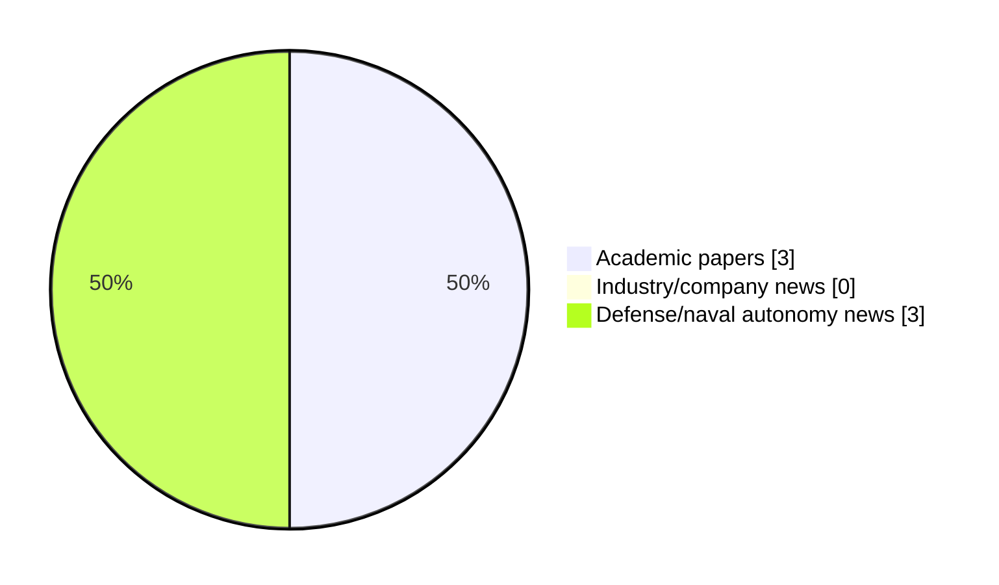

# Maritime Autonomy Watch — 2026-08-01

## Executive Summary

- Total selected items: 6
- Academic papers: 3
- Industry/company news: 0
- Defense/naval autonomy news: 3
- Failed/inaccessible sources: 0

## Contents

- [Analyst Brief](#analyst-brief)
- [Must Read](#must-read)
- [Top Signals Today](#top-signals-today)
- [Topic Signals](#topic-signals)
- [Freshness and Coverage](#freshness-and-coverage)
- [Quality Notes](#quality-notes)
- [Watchlist](#watchlist)
- [Academic Papers](#academic-papers)
- [Industry and Company News](#industry-and-company-news)
- [Defense and Naval Autonomy News](#defense-and-naval-autonomy-news)
- [Source Status Summary](#source-status-summary)

## Analyst Brief

Today's report selected 6 non-duplicate item(s), led by AUV navigation, USV operations, defense adoption. The strongest item is [Digital Twins for Marine Robotic Platforms: Architectures, Applications, and Challenges Across AUVs, ROVs, USVs, Underwater Gliders, and Emerging Platforms](https://doi.org/10.3390/jmse14151393) from OpenAlex.
Coverage is weighted toward academic research (3), with 0 industry and 3 defense signal(s).
Quality caveat: low-score-unique=2, missing-summary=1, date-anomaly=1.

## Must Read

- [Digital Twins for Marine Robotic Platforms: Architectures, Applications, and Challenges Across AUVs, ROVs, USVs, Underwater Gliders, and Emerging Platforms](https://doi.org/10.3390/jmse14151393) — Research signal: AUV navigation
- [Singapore Navy Deploys RTsys COMET-MCM Underwater Drones to Secure the Strait of Singapore](https://oceannews.com/news/defense/singapore-navy-deploys-rtsys-comet-mcm-underwater-drones-to-secure-the-strait-of-singapore/) — Defense signal: AUV navigation
- [Integrated Discovery and State-Aware Servicing for Mobile AUVs With UOWC: Modeling and Performance Analysis](http://arxiv.org/abs/2607.15183v2) — Research signal: AUV navigation
- [Shield AI and Thunder Tiger complete maritime teaming demo in Taiwan](https://www.navalnews.com/naval-news/2026/07/shield-ai-and-thunder-tiger-complete-maritime-teaming-demo-in-taiwan/) — Defense signal: USV operations
- [2 defense tech companies sue US Navy after losing out on MUSV program](https://www.defensenews.com/industry/techwatch/2026/07/16/2-defense-tech-companies-sue-us-navy-after-losing-out-on-musv-program/) — Defense signal: USV operations

## Top Signals Today

- AUV navigation: 4 selected item(s).
- USV operations: 3 selected item(s).
- defense adoption: 2 selected item(s).
- planning/control: 2 selected item(s).
- perception: 1 selected item(s).

## Topic Signals

- AUV navigation: 4
- USV operations: 3
- defense adoption: 2
- planning/control: 2
- perception: 1
- underwater communications: 1
- swarm autonomy: 1
- critical infrastructure: 1

## Freshness and Coverage

- Newest selected item date: 2026-12-01
- Oldest selected item date: 2026-07-16
- Active/enabled sources: 5
- Sources with access problems: 2
- Quality flags: 4

## Quality Notes

- low-score-unique: 2
- missing-summary: 1
- date-anomaly: 1
- Date anomalies: [Robust LPV pitch control of autonomous underwater vehicle with input constraints](https://api.elsevier.com/content/abstract/scopus_id/105044143294) reports 2026-12-01

## Watchlist

- [2 defense tech companies sue US Navy after losing out on MUSV program](https://www.defensenews.com/industry/techwatch/2026/07/16/2-defense-tech-companies-sue-us-navy-after-losing-out-on-musv-program/) — low-score-unique
- [Robust LPV pitch control of autonomous underwater vehicle with input constraints](https://api.elsevier.com/content/abstract/scopus_id/105044143294) — missing-summary, date-anomaly, low-score-unique

### Category Snapshot

| Category | Selected items |
|---|---:|
| Academic papers | 3 |
| Industry/company news | 0 |
| Defense/naval autonomy news | 3 |

## Academic Papers

_Selected items: 3_

### [Digital Twins for Marine Robotic Platforms: Architectures, Applications, and Challenges Across AUVs, ROVs, USVs, Underwater Gliders, and Emerging Platforms](https://doi.org/10.3390/jmse14151393)

- Source: OpenAlex
- Date: 2026-07-29
- Relevance score: 10
- Authors: Xuehao Wang, L.R. Chen, Dongyang Xue, Cheng Chen, Peng Wang
- DOI: 10.3390/jmse14151393
- Signal: Research signal: AUV navigation
- Topic tags: AUV navigation, USV operations, perception, planning/control

**Abstract**

Digital twin (DT) research spans autonomous underwater vehicles (AUVs), remotely operated vehicles (ROVs), unmanned surface vessels (USVs), underwater gliders, and emerging marine robotic platforms; however, reported systems differ widely in terms of their physical–virtual coupling and validation maturity. A structured Web of Science search retrieved 116 records, of which 107 were retained for analysis. This review synthesizes architectures, enabling technologies, applications, coupling modes, validation settings, and deployment barriers across the perception–decision–control chain. The reported workflows address model construction, multiphysics simulation, virtual testing, monitoring, control validation, and decision support.

**Why it matters**

Relevant to underwater autonomy, surface-vessel operations, infrastructure monitoring; the work may inform maritime autonomy research, testing priorities, or system design.

---

### [Integrated Discovery and State-Aware Servicing for Mobile AUVs With UOWC: Modeling and Performance Analysis](http://arxiv.org/abs/2607.15183v2)

- Source: arXiv
- Date: 2026-07-16
- Relevance score: 8.5
- Authors: Qiyu Ma, Jiajie Xu, Mohamed-Slim Alouini
- Signal: Research signal: AUV navigation
- Topic tags: AUV navigation, underwater communications, swarm autonomy, critical infrastructure

**Abstract**

Underwater wireless optical communication (UWOC) is an enabling technology for high-throughput subsea networks, yet its long-term deployment is constrained by the finite energy budget of underwater nodes. To address this challenge, we investigate a mobile system wherein an autonomous underwater vehicle (AUV) performs joint wireless information transfer (WIT) and wireless power transfer (WPT) for a network of randomly distributed sensor nodes. This paper develops \textcolor{blue}{an integrated mission-level framework} that combines stochastic node discovery with state-aware servicing. First, we present an analytical model for node discovery based on a signal-to-noise ratio (SNR) analysis, deriving performance metrics that include the probability distribution of the discovery distance.

**Why it matters**

Relevant to underwater autonomy, multi-vehicle coordination; the work may inform maritime autonomy research, testing priorities, or system design.

---

### [Robust LPV pitch control of autonomous underwater vehicle with input constraints](https://api.elsevier.com/content/abstract/scopus_id/105044143294)

- Source: Elsevier Scopus
- Date: 2026-12-01
- Relevance score: 3.5
- DOI: 10.1038/s41598-026-49350-0
- Signal: Research signal: AUV navigation
- Topic tags: AUV navigation, planning/control
- Quality flags: missing-summary, date-anomaly, low-score-unique

**Abstract**

No summary available.

**Why it matters**

Relevant to underwater autonomy; the work may inform maritime autonomy research, testing priorities, or system design.

---

## Industry and Company News

_Selected items: 0_

No selected items.

## Defense and Naval Autonomy News

_Selected items: 3_

### [Singapore Navy Deploys RTsys COMET-MCM Underwater Drones to Secure the Strait of Singapore](https://oceannews.com/news/defense/singapore-navy-deploys-rtsys-comet-mcm-underwater-drones-to-secure-the-strait-of-singapore/)

- Source: oceannews.com
- Date: 2026-07-31
- Relevance score: 9.75
- Signal: Defense signal: AUV navigation
- Topic tags: AUV navigation, defense adoption

**Summary**

RTsys Underwater Technologies, the Republic of Singapore Navy (RSN), and the Defence Science and Technology Agency (DSTA) have announced the operational deployment of several COMET-MCM autonomous underwater vehicles (AUVs), designed to detect and identify naval mines. This deployment marks a major milestone in the modernization of the Singapore Navy's mine countermeasures capabilities and confirms the international recognition of French expertise in underwater robotics.

**Why it matters**

Signals movement in underwater autonomy, naval adoption; useful for tracking operational concepts, procurement direction, and fleet integration.

---

### [Shield AI and Thunder Tiger complete maritime teaming demo in Taiwan](https://www.navalnews.com/naval-news/2026/07/shield-ai-and-thunder-tiger-complete-maritime-teaming-demo-in-taiwan/)

- Source: navalnews.com
- Date: 2026-07-31
- Relevance score: 7.5
- Signal: Defense signal: USV operations
- Topic tags: USV operations

**Summary**

Shield AI and Thunder Tiger Corp. announced the successful completion of Hivemind’s first multi-asset autonomous teaming demonstration on water, validating Shield AI’s Hivemind AI pilot aboard Thunder Tiger SeaShark unmanned surface vessels (USVs) in a coordinated mission. Shield AI press release During the demonstration in Pingtung, Taiwan, Thunder Tiger’s SeaShark 600 and SeaShark 800 USVs.

**Why it matters**

Signals movement in surface-vessel operations; useful for tracking operational concepts, procurement direction, and fleet integration.

---

### [2 defense tech companies sue US Navy after losing out on MUSV program](https://www.defensenews.com/industry/techwatch/2026/07/16/2-defense-tech-companies-sue-us-navy-after-losing-out-on-musv-program/)

- Source: defensenews.com
- Date: 2026-07-16
- Relevance score: 3.5
- Signal: Defense signal: USV operations
- Topic tags: USV operations, defense adoption
- Quality flags: low-score-unique

**Summary**

Two defense tech companies sued the U.S. government, alleging they were unfairly excluded from the Navy's Medium Unmanned Surface Vessel program.

**Why it matters**

Signals movement in surface-vessel operations, naval adoption; useful for tracking operational concepts, procurement direction, and fleet integration.

---

## Inaccessible or Failed Sources

- None

## Source Status Summary

| Source | Status | Notes |
|---|---|---|
| arXiv | enabled | API source, 15 items fetched |
| OpenAlex | enabled | API source, 15 items fetched |
| RSS feeds | enabled | 107 RSS items fetched |
| SMI MASG News | enabled | HTML source, 10 items fetched |
| IEEE Xplore | disabled | Missing IEEE_XPLORE_API_KEY |
| Elsevier Scopus | enabled | API source, 15 items fetched |
| NewsAPI | disabled | Missing NEWS_API_KEY |

## Metadata

- Generated at: 2026-08-01T08:51:26.703500+02:00
- Date: 2026-08-01
- Repository: ferhannb/MarineRobotics
- Relevance threshold: 4.0
- Deduplication method: DOI, canonical URL, source ID, normalized title, similar recent titles, category caps, and novelty score
