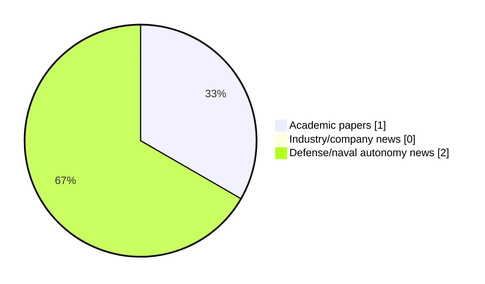

# Maritime Autonomy Watch — 2026-08-04

## Executive Summary

- Total selected items: 3
- Academic papers: 1
- Industry/company news: 0
- Defense/naval autonomy news: 2
- Failed/inaccessible sources: 0

## Contents

- [Analyst Brief](#analyst-brief)
- [Must Read](#must-read)
- [Top Signals Today](#top-signals-today)
- [Topic Signals](#topic-signals)
- [Freshness and Coverage](#freshness-and-coverage)
- [Quality Notes](#quality-notes)
- [Watchlist](#watchlist)
- [Academic Papers](#academic-papers)
- [Industry and Company News](#industry-and-company-news)
- [Defense and Naval Autonomy News](#defense-and-naval-autonomy-news)
- [Source Status Summary](#source-status-summary)

## Analyst Brief

Today's report selected 3 non-duplicate item(s), led by USV operations, perception, defense adoption. The strongest item is [Netherlands Commences USV Design for New ASW Frigates with Thales FLASH Sonar](https://www.navalnews.com/naval-news/2026/08/netherlands-asw-frigates-usv-thales-flash-sonar/) from navalnews.com.
Coverage is weighted toward academic research (1), with 0 industry and 2 defense signal(s).
Quality caveat: low-score-unique=1, missing-summary=1, date-anomaly=1.

## Must Read

- [Netherlands Commences USV Design for New ASW Frigates with Thales FLASH Sonar](https://www.navalnews.com/naval-news/2026/08/netherlands-asw-frigates-usv-thales-flash-sonar/) — Defense signal: USV operations
- [Autonomous Fleets & Robotics Set to Accelerate Global Seabed Mapping](https://www.oceansciencetechnology.com/news/autonomous-fleets-robotics-set-to-accelerate-global-seabed-mapping/) — Defense signal: general autonomy

## Top Signals Today

- USV operations: 2 selected item(s).
- perception: 1 selected item(s).
- defense adoption: 1 selected item(s).
- general autonomy: 1 selected item(s).
- swarm autonomy: 1 selected item(s).

## Topic Signals

- USV operations: 2
- perception: 1
- defense adoption: 1
- general autonomy: 1
- swarm autonomy: 1
- planning/control: 1

## Freshness and Coverage

- Newest selected item date: 2026-12-01
- Oldest selected item date: 2026-08-03
- Active/enabled sources: 4
- Sources with access problems: 3
- Quality flags: 3

## Quality Notes

- low-score-unique: 1
- missing-summary: 1
- date-anomaly: 1
- Date anomalies: [Formation tracking control of multiple USVs using ADRC with prescribed performance](https://api.elsevier.com/content/abstract/scopus_id/105035333345) reports 2026-12-01

## Watchlist

- [Autonomous Fleets & Robotics Set to Accelerate Global Seabed Mapping](https://www.oceansciencetechnology.com/news/autonomous-fleets-robotics-set-to-accelerate-global-seabed-mapping/) — low-score-unique
- [Formation tracking control of multiple USVs using ADRC with prescribed performance](https://api.elsevier.com/content/abstract/scopus_id/105035333345) — missing-summary, date-anomaly

### Category Snapshot

| Category | Selected items |
|---|---:|
| Academic papers | 1 |
| Industry/company news | 0 |
| Defense/naval autonomy news | 2 |

## Academic Papers

_Selected items: 1_

### [Formation tracking control of multiple USVs using ADRC with prescribed performance](https://api.elsevier.com/content/abstract/scopus_id/105035333345)

- Source: Elsevier Scopus
- Date: 2026-12-01
- Relevance score: 5.25
- DOI: 10.1038/s41598-026-37252-0
- Signal: Research signal: USV operations
- Topic tags: USV operations, swarm autonomy, planning/control
- Quality flags: missing-summary, date-anomaly

**Abstract**

No summary available.

**Why it matters**

Relevant to surface-vessel operations, multi-vehicle coordination; the work may inform maritime autonomy research, testing priorities, or system design.

---

## Industry and Company News

_Selected items: 0_

No selected items.

## Defense and Naval Autonomy News

_Selected items: 2_

### [Netherlands Commences USV Design for New ASW Frigates with Thales FLASH Sonar](https://www.navalnews.com/naval-news/2026/08/netherlands-asw-frigates-usv-thales-flash-sonar/)

- Source: navalnews.com
- Date: 2026-08-03
- Relevance score: 6
- Signal: Defense signal: USV operations
- Topic tags: USV operations, perception, defense adoption

**Summary**

The Dutch MoD has commissioned Dutch Naval Design to develop 12m uncrewed surface vessels carrying Thales FLASH dipping sonar for the new ASW frigates. The Dutch Ministry of Defence, acting through the Materiel and IT Command (COMMIT), has formally commissioned Dutch Naval Design (DND) to begin designing a 12-meter uncrewed surface vessel (USV) for anti-submarine.

**Why it matters**

Signals movement in surface-vessel operations, naval adoption; useful for tracking operational concepts, procurement direction, and fleet integration.

---

### [Autonomous Fleets & Robotics Set to Accelerate Global Seabed Mapping](https://www.oceansciencetechnology.com/news/autonomous-fleets-robotics-set-to-accelerate-global-seabed-mapping/)

- Source: oceansciencetechnology.com
- Date: 2026-08-03
- Relevance score: 3
- Signal: Defense signal: general autonomy
- Topic tags: general autonomy
- Quality flags: low-score-unique

**Summary**

Ulysses has partnered with the Nippon Foundation-GEBCO Seabed 2030 Project to expand global bathymetric data collection using autonomous marine systems. The collaboration will use networked fleets of autonomous surface and underwater vehicles to improve the coverage and efficiency of surveys in difficult-to-reach areas. Data gathered through the partnership will contribute to Seabed 2030’s goal of compiling a complete, publicly accessible map of the ocean floor.

**Why it matters**

Signals movement in underwater autonomy; useful for tracking operational concepts, procurement direction, and fleet integration.

---

## Inaccessible or Failed Sources

- None

## Source Status Summary

| Source | Status | Notes |
|---|---|---|
| arXiv | enabled | API source, 15 items fetched |
| OpenAlex | enabled | API source, 15 items fetched |
| RSS feeds | partial | 75 RSS items fetched; failures: https://www.marinelink.com/news/rss: HTTP 502 for https://www.marinelink.com/news/rss; https://massworld.news/feed/: Invalid XML from https://massworld.news/feed/: mismatched tag: line 93, column 2; https://oceannews.com/feed/: Invalid XML from https://oceannews.com/feed/: mismatched tag: line 93, column 2 |
| SMI MASG News | enabled | HTML source, 0 items fetched |
| IEEE Xplore | disabled | Missing IEEE_XPLORE_API_KEY |
| Elsevier Scopus | enabled | API source, 15 items fetched |
| NewsAPI | disabled | Missing NEWS_API_KEY |

## Metadata

- Generated at: 2026-08-04T08:54:01.373633+02:00
- Date: 2026-08-04
- Repository: ferhannb/MarineRobotics
- Relevance threshold: 4.0
- Deduplication method: DOI, canonical URL, source ID, normalized title, similar recent titles, category caps, and novelty score
