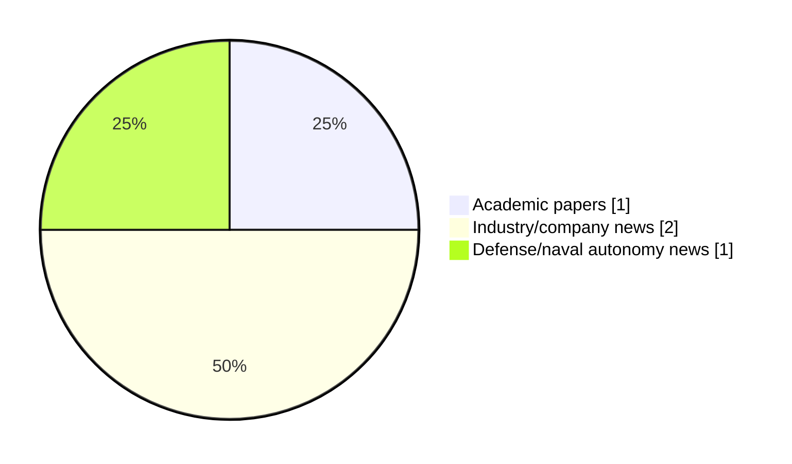

# Maritime Autonomy Watch — 2026-08-05

## Executive Summary

- Total selected items: 4
- Academic papers: 1
- Industry/company news: 2
- Defense/naval autonomy news: 1
- Failed/inaccessible sources: 1

## Contents

- [Analyst Brief](#analyst-brief)
- [Must Read](#must-read)
- [Top Signals Today](#top-signals-today)
- [Topic Signals](#topic-signals)
- [Freshness and Coverage](#freshness-and-coverage)
- [Quality Notes](#quality-notes)
- [Watchlist](#watchlist)
- [Academic Papers](#academic-papers)
- [Industry and Company News](#industry-and-company-news)
- [Defense and Naval Autonomy News](#defense-and-naval-autonomy-news)
- [Source Status Summary](#source-status-summary)

## Analyst Brief

Today's report selected 4 non-duplicate item(s), led by USV operations, defense adoption, planning/control. The strongest item is [MARTAC Delivers Strongest H1 Results in Company History](https://www.marinelink.com/news/martac-delivers-strongest-h-results-541778) from marinelink.com.
Coverage is weighted toward academic research (1), with 2 industry and 1 defense signal(s).
Quality caveat: low-score-unique=2.

## Must Read

- [MARTAC Delivers Strongest H1 Results in Company History](https://www.marinelink.com/news/martac-delivers-strongest-h-results-541778) — Industry signal: USV operations
- [Saildrone Voyager USV Enables Navy Seizure of Cocaine off Southern Border](https://oceannews.com/news/defense/saildrone-voyager-usv-enables-navy-seizure-of-cocaine-off-southern-border/) — Defense signal: USV operations
- [Disturbance-observer-based adaptive neuro-fuzzy sliding mode control for collaborative ASV and URV systems](https://doi.org/10.1007/s44465-026-00032-1) — Research signal: USV operations
- [Nauticus Robotics & Strangeworks Team Up to Optimize Subsea Fiber-Optic Sensing Deployment](https://oceannews.com/news/subsea-and-survey/nauticus-robotics-strangeworks-team-up-to-optimize-subsea-fiber-optic-sensing-deployment/) — Industry signal: perception

## Top Signals Today

- USV operations: 3 selected item(s).
- defense adoption: 1 selected item(s).
- planning/control: 1 selected item(s).
- regulation/legal: 1 selected item(s).
- perception: 1 selected item(s).

## Topic Signals

- USV operations: 3
- defense adoption: 1
- planning/control: 1
- regulation/legal: 1
- perception: 1
- critical infrastructure: 1

## Freshness and Coverage

- Newest selected item date: 2026-08-04
- Oldest selected item date: 2026-08-03
- Active/enabled sources: 3
- Sources with access problems: 4
- Quality flags: 2

## Quality Notes

- low-score-unique: 2

## Watchlist

- [Disturbance-observer-based adaptive neuro-fuzzy sliding mode control for collaborative ASV and URV systems](https://doi.org/10.1007/s44465-026-00032-1) — low-score-unique
- [Nauticus Robotics & Strangeworks Team Up to Optimize Subsea Fiber-Optic Sensing Deployment](https://oceannews.com/news/subsea-and-survey/nauticus-robotics-strangeworks-team-up-to-optimize-subsea-fiber-optic-sensing-deployment/) — low-score-unique

### Category Snapshot

| Category | Selected items |
|---|---:|
| Academic papers | 1 |
| Industry/company news | 2 |
| Defense/naval autonomy news | 1 |

## Academic Papers

_Selected items: 1_

### [Disturbance-observer-based adaptive neuro-fuzzy sliding mode control for collaborative ASV and URV systems](https://doi.org/10.1007/s44465-026-00032-1)

- Source: OpenAlex
- Date: 2026-08-03
- Relevance score: 3.75
- Authors: Mustafa Wassef Hasan, Nizar Hadi Abbas
- DOI: 10.1007/s44465-026-00032-1
- Signal: Research signal: USV operations
- Topic tags: USV operations, planning/control, regulation/legal
- Quality flags: low-score-unique

**Abstract**

This paper proposes a disturbance-observer-based adaptive neuro-fuzzy sliding mode control (DO-ANFSMC) framework for collaborative autonomous surface vehicle (ASV) and underwater robotic vehicle (URV) systems operating in search-and-rescue missions under environmental disturbances and obstacle-avoidance constraints. The proposed framework integrates an adaptive neuro-fuzzy system for approximating unknown nonlinear dynamics, a nonlinear disturbance observer for estimating lumped environmental disturbances and residual uncertainties, and a robust sliding-mode control law for trajectory tracking. The controller parameters are adaptively tuned online using an improved grey wolf optimizer with chaotic theory (IGWO-CT), whose optimization performance is first evaluated using standard benchmark functions. MATLAB simulations are conducted for one ASV and two URVs under identical mission conditions with eight static obstacles.

**Why it matters**

Relevant to underwater autonomy, planning and control; the work may inform maritime autonomy research, testing priorities, or system design.

---

## Industry and Company News

_Selected items: 2_

### [MARTAC Delivers Strongest H1 Results in Company History](https://www.marinelink.com/news/martac-delivers-strongest-h-results-541778)

- Source: marinelink.com
- Date: 2026-08-04
- Relevance score: 8.25
- Signal: Industry signal: USV operations
- Topic tags: USV operations

**Summary**

Maritime Tactical Systems, Inc. (MARTAC), a U.S.-based, leading provider of fully autonomous unmanned surface vessels (USVs), announced the strongest first-half results in the company’s 15-year history. MARTAC concluded record results for the six months ending June 30…

**Why it matters**

Signals momentum in surface-vessel operations; useful for tracking product direction, partnerships, and deployment opportunities.

---

### [Nauticus Robotics & Strangeworks Team Up to Optimize Subsea Fiber-Optic Sensing Deployment](https://oceannews.com/news/subsea-and-survey/nauticus-robotics-strangeworks-team-up-to-optimize-subsea-fiber-optic-sensing-deployment/)

- Source: oceannews.com
- Date: 2026-08-04
- Relevance score: 3
- Signal: Industry signal: perception
- Topic tags: perception, critical infrastructure
- Quality flags: low-score-unique

**Summary**

Nauticus Robotics, a developer of autonomous subsea robots and autonomy software, and Strangeworks, an advanced compute optimization company that transforms complex operational challenges into production decision systems, has announced a collaboration to explore optimization of the deployment of distributed fiber-optic sensing networks for maritime infrastructure protection.

**Why it matters**

This item may signal product, market, or deployment momentum in maritime autonomy.

---

## Defense and Naval Autonomy News

_Selected items: 1_

### [Saildrone Voyager USV Enables Navy Seizure of Cocaine off Southern Border](https://oceannews.com/news/defense/saildrone-voyager-usv-enables-navy-seizure-of-cocaine-off-southern-border/)

- Source: oceannews.com
- Date: 2026-08-04
- Relevance score: 5.25
- Signal: Defense signal: USV operations
- Topic tags: USV operations, defense adoption

**Summary**

The detection and interdiction of drug smugglers attempting to enter the United States by sea has remained a top priority across administrations and Pentagon and Coast Guard leadership. Patrolling the wide expanses of the southern maritime border is a daunting task for any fleet, and it is especially challenging for manned assets, which are limited in number and whose crews are most valuable when it is time to interdict.

**Why it matters**

Signals movement in surface-vessel operations, naval adoption; useful for tracking operational concepts, procurement direction, and fleet integration.

---

## Inaccessible or Failed Sources

- arXiv: The read operation timed out

## Source Status Summary

| Source | Status | Notes |
|---|---|---|
| arXiv | failed | The read operation timed out |
| OpenAlex | enabled | API source, 15 items fetched |
| RSS feeds | partial | 97 RSS items fetched; failures: https://www.navalnews.com/feed/: HTTP 503 for https://www.navalnews.com/feed/ |
| SMI MASG News | enabled | HTML source, 10 items fetched |
| IEEE Xplore | disabled | Missing IEEE_XPLORE_API_KEY |
| Elsevier Scopus | enabled | API source, 15 items fetched |
| NewsAPI | disabled | Missing NEWS_API_KEY |

## Metadata

- Generated at: 2026-08-05T08:55:16.463562+02:00
- Date: 2026-08-05
- Repository: ferhannb/MarineRobotics
- Relevance threshold: 4.0
- Deduplication method: DOI, canonical URL, source ID, normalized title, similar recent titles, category caps, and novelty score
