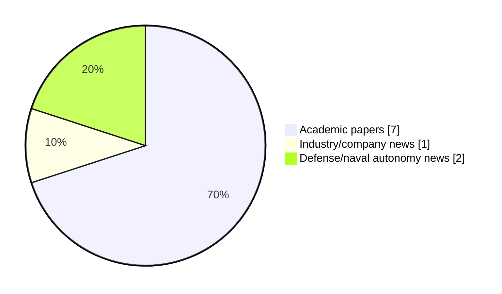

# Maritime Autonomy Watch — 2026-08-06

## Executive Summary

- Total selected items: 10
- Academic papers: 7
- Industry/company news: 1
- Defense/naval autonomy news: 2
- Failed/inaccessible sources: 0

## Contents

- [Analyst Brief](#analyst-brief)
- [Must Read](#must-read)
- [Top Signals Today](#top-signals-today)
- [Topic Signals](#topic-signals)
- [Freshness and Coverage](#freshness-and-coverage)
- [Quality Notes](#quality-notes)
- [Watchlist](#watchlist)
- [Academic Papers](#academic-papers)
- [Industry and Company News](#industry-and-company-news)
- [Defense and Naval Autonomy News](#defense-and-naval-autonomy-news)
- [Source Status Summary](#source-status-summary)

## Analyst Brief

Today's report selected 10 non-duplicate item(s), led by perception, planning/control, critical infrastructure. The strongest item is [A Vision-based Control Framework for Real-time Autonomous UUV Operations](http://arxiv.org/abs/2608.04723v1) from arXiv.
Coverage is weighted toward academic research (7), with 1 industry and 2 defense signal(s).
Quality caveat: low-score-unique=3.

## Must Read

- [A Vision-based Control Framework for Real-time Autonomous UUV Operations](http://arxiv.org/abs/2608.04723v1) — Research signal: perception
- [Remote Awareness of Seafloor Images Collected by AUVs over Low-Bandwidth Communication Links](http://arxiv.org/abs/2607.18013v1) — Research signal: AUV navigation
- [LLM-Assisted Mission Planning, Predictive Coordination, and Adaptive Topology Management for Resilient USV Swarm Control Under Communication Denial](https://doi.org/10.3390/drones10080594) — Research signal: USV operations
- [Robustness Verification of an Autonomous Underwater Vehicle-based Plankton Classifier](http://arxiv.org/abs/2607.04453v1) — Research signal: AUV navigation
- [Optimal mean-time path planning for unmanned underwater vehicles: a Hamilton-Jacobi approach](http://arxiv.org/abs/2607.03407v1) — Research signal: planning/control

## Top Signals Today

- perception: 4 selected item(s).
- planning/control: 4 selected item(s).
- critical infrastructure: 3 selected item(s).
- swarm autonomy: 3 selected item(s).
- AUV navigation: 3 selected item(s).

## Topic Signals

- perception: 4
- planning/control: 4
- critical infrastructure: 3
- swarm autonomy: 3
- AUV navigation: 3
- underwater communications: 3
- USV operations: 2
- defense adoption: 2

## Freshness and Coverage

- Newest selected item date: 2026-08-05
- Oldest selected item date: 2026-07-03
- Active/enabled sources: 4
- Sources with access problems: 3
- Quality flags: 3

## Quality Notes

- low-score-unique: 3

## Watchlist

- [Oshen C-Star Robots Prove Seabed-Mapping Capability in US Navy Trial](https://oceannews.com/news/science-technology/oshen-c-star-robots-prove-seabed-mapping-capability-in-us-navy-trial/) — low-score-unique
- [Human 5.0 in Maritime](https://doi.org/10.5152/jbass.2026.25045) — low-score-unique
- [DIVO: Continuous-time DVL-Inertial-Visual Odometry for Unmanned Underwater Vehicles](http://arxiv.org/abs/2607.04615v1) — low-score-unique

### Category Snapshot

| Category | Selected items |
|---|---:|
| Academic papers | 7 |
| Industry/company news | 1 |
| Defense/naval autonomy news | 2 |

## Academic Papers

_Selected items: 7_

### [A Vision-based Control Framework for Real-time Autonomous UUV Operations](http://arxiv.org/abs/2608.04723v1)

- Source: arXiv
- Date: 2026-08-05
- Relevance score: 10
- Authors: Erik Tjærand Frøland, Marco Job, Md Ether Deowan, Eleni Kelasidi
- Signal: Research signal: perception
- Topic tags: perception, planning/control, critical infrastructure

**Abstract**

This paper presents a fully integrated vision-based framework for real-time and robust localization, autonomous navigation, and mapping for unmanned underwater vehicles (UUVs) in dynamic, visually challenging environments. The proposed pipeline enables both net-relative and global localization while generating continuous 3D maps of the surroundings in real-time. The framework was validated on synthetic datasets with ground truth and tested onboard an UUV during autonomous net-relative navigation experiments. Results demonstrate real-time performance and enhanced robustness, supporting vision-driven autonomous navigation and enabling the field deployment of marine robots for critical inspection and mapping tasks in complex underwater environments.

**Why it matters**

Relevant to underwater autonomy, infrastructure monitoring; the work may inform maritime autonomy research, testing priorities, or system design.

---

### [LLM-Assisted Mission Planning, Predictive Coordination, and Adaptive Topology Management for Resilient USV Swarm Control Under Communication Denial](https://doi.org/10.3390/drones10080594)

- Source: OpenAlex
- Date: 2026-08-02
- Relevance score: 8
- Authors: Xingda Li, Jianqiang Zhang, Yiping Liu, Pengfei Zhang, Ling Tan
- DOI: 10.3390/drones10080594
- Signal: Research signal: USV operations
- Topic tags: USV operations, swarm autonomy, planning/control

**Abstract**

Unmanned surface vehicle (USV) swarms operating in communication-denied maritime environments face degraded formation control when inter-agent state exchange is disrupted. This paper presents a three-layer control architecture integrating (1) LLM-assisted strategic mission planning with formal safety verification, (2) predictive tactical coordination combining physics-based motion extrapolation with online-learned neighbor behavior models, and (3) DMPC + ADMM execution for constrained formation control. The predictive coordination module in simulation-based evaluation across five representative scenarios reduces formation error by 76.0% (under simulation conditions) during 60 s communication outages compared to zero-hold prediction (Cohen d=0.88, p<0.001, DMPC + ADMM validated).

**Why it matters**

Relevant to surface-vessel operations, multi-vehicle coordination; the work may inform maritime autonomy research, testing priorities, or system design.

---

### [Remote Awareness of Seafloor Images Collected by AUVs over Low-Bandwidth Communication Links](http://arxiv.org/abs/2607.18013v1)

- Source: arXiv
- Date: 2026-07-20
- Relevance score: 8.5
- Authors: Adrian Bodenmann, Cailei Liang, Miquel Massot-Campos, Samuel Simmons, Alexander B. Phillips, Alberto Consensi, Matthew Kingsland, Rashiid Sherif, Stan Brown, Adam Riese, Blair Thornton
- Signal: Research signal: AUV navigation
- Topic tags: AUV navigation, underwater communications, swarm autonomy

**Abstract**

This paper introduces a method for real-time processing and transmission of autonomous underwater vehicle (AUV) imagery over low-bandwidth communication links. It leverages artificial intelligence (AI) techniques to identify a set of images that best represent an entire dataset, or automatically finds the most similar images to a given query image for transmission to operators. Combined with metadata of a larger set of images, compressed versions of the selected images can be transmitted over satellite communication links or underwater modems, and provide operators on shore with information about the type of imagery the AUV is collecting while it is still deployed. Data from three deployments off the coast of the UK and in Gran Canaria using different AUVs and imaging systems demonstrate the method in the field.

**Why it matters**

Relevant to underwater autonomy, multi-vehicle coordination; the work may inform maritime autonomy research, testing priorities, or system design.

---

### [Robustness Verification of an Autonomous Underwater Vehicle-based Plankton Classifier](http://arxiv.org/abs/2607.04453v1)

- Source: arXiv
- Date: 2026-07-05
- Relevance score: 7.75
- Authors: Abdelrahman Sayed Sayed, Pierre-Jean Meyer, Asgeir J. Sørensen, Mohamed Ghazel
- Signal: Research signal: AUV navigation
- Topic tags: AUV navigation

**Abstract**

The assessment of planktonic standing stocks and microorganism structures is critical for understanding upper ocean biological processes. Currently, autonomous underwater vehicles (AUVs) equipped with in-situ optical imaging and artificial intelligence (AI) methods offer a promising solution for persistent surveillance, mapping and monitoring of planktonic life. However, current AI methods often lack robustness in dynamic, unstructured environments, where environmental noise and non-biological artifacts lead to frequent misclassifications. Standard convolutional neural network (CNN) classifiers often struggle with such conditions, leading to misclassifications that require time-consuming manual validation by marine biologists. To address this issue, we propose a novel robustness verification framework for in-situ plankton classifiers based on reachability analysis.

**Why it matters**

Relevant to underwater autonomy, infrastructure monitoring; the work may inform maritime autonomy research, testing priorities, or system design.

---

### [Optimal mean-time path planning for unmanned underwater vehicles: a Hamilton-Jacobi approach](http://arxiv.org/abs/2607.03407v1)

- Source: arXiv
- Date: 2026-07-03
- Relevance score: 7.75
- Authors: Jonathan Valyou, Jeremy Brandman, Sanghyun Lee
- Signal: Research signal: planning/control
- Topic tags: planning/control

**Abstract**

Unmanned underwater vehicles (UUV) integrate ocean forecasts with path planning algorithms in order to identify energy- or time-minimizing paths that enable mission completion. Typically, a well-defined deterministic ocean forecast is assumed to be available for path planning; however, in practice, different ocean forecasts can disagree. In this paper, we extend previous work on deterministic optimal path planning to identify optimal mean-time paths when presented with an ensemble of possible ocean forecasts. In particular, we formulate a system of time-independent Hamilton-Jacobi partial differential equations that incorporates forecast uncertainty and yields the optimal mean reachability travel time and the necessary controls to find the associated optimal path. An efficient numerical solution of this system of PDEs is obtained through an extension of the Fast Sweeping Method; verification and benchmarking results are provided.

**Why it matters**

Relevant to underwater autonomy, planning and control; the work may inform maritime autonomy research, testing priorities, or system design.

---

### [Human 5.0 in Maritime](https://doi.org/10.5152/jbass.2026.25045)

- Source: OpenAlex
- Date: 2026-08-03
- Relevance score: 3
- Authors: Gülsüm Koraltürk, Güzide Öncü Eroğlu Pektaş
- DOI: 10.5152/jbass.2026.25045
- Signal: Research signal: swarm autonomy
- Topic tags: swarm autonomy, critical infrastructure
- Quality flags: low-score-unique

**Abstract**

Human 5.0 is an approach that positions the human being as a decision-maker, a creative actor, and an individual with high ethical responsibility in a society where artificial intelligence, big data, robotics, autonomous systems, and digital infrastructure are fully integrated. This approach considers the individual from a perspective that prioritizes social and empathetic qualities, societal benefit, and sensitivity to sustainability principles. In the maritime domain, the concept of Human 5.0 can be defined through new-generation maritime operators and deck officers within the processes of maritime business management and ship operations. In other words, it refers to employee profiles operating across all work domains encompassing ship–port–logistics processes within the maritime industry.

**Why it matters**

Relevant to multi-vehicle coordination; the work may inform maritime autonomy research, testing priorities, or system design.

---

### [DIVO: Continuous-time DVL-Inertial-Visual Odometry for Unmanned Underwater Vehicles](http://arxiv.org/abs/2607.04615v1)

- Source: arXiv
- Date: 2026-07-06
- Relevance score: 3.5
- Authors: Kyungmin Jung, Angad Bajwa, Junha Yoo, Arturo Del Castillo Bernal, James Richard Forbes
- Signal: Research signal: underwater communications
- Topic tags: underwater communications, perception, planning/control, critical infrastructure
- Quality flags: low-score-unique

**Abstract**

This paper presents a novel acoustic-visual-inertial odometry solution leveraging a continuous-time trajectory estimation framework for unmanned underwater vehicles. Underwater environments present unique challenges for visual localization and mapping, such as light attenuation, illumination variance, and the presence of particulate matter. This motivates the use of additional sensing modalities and a visual tracking pipeline that is robust to diverse subsea conditions. The proposed system is the first continuous-time trajectory estimation framework based on Gaussian processes to fuse asynchronous measurements from a Doppler velocity log, a stereo camera, and an inertial measurement unit. Additionally, a novel visual frontend is proposed, incorporating learning-based feature extraction and matching that is robust to the specific challenges that subsea environments present.

**Why it matters**

Relevant to underwater autonomy, planning and control, infrastructure monitoring; the work may inform maritime autonomy research, testing priorities, or system design.

---

## Industry and Company News

_Selected items: 1_

### [AUV/ROV Sonar](https://www.oceansciencetechnology.com/suppliers/auv-rov-sonar/)

- Source: oceansciencetechnology.com
- Date: 2026-08-05
- Relevance score: 7
- Signal: Industry signal: AUV navigation
- Topic tags: AUV navigation, underwater communications, perception

**Summary**

Introduction to AUV, ROV & UUV Sonar Systems AUV and ROV sonar systems use transmitted acoustic pulses and returning echoes.

**Why it matters**

Signals momentum in underwater autonomy; useful for tracking product direction, partnerships, and deployment opportunities.

---

## Defense and Naval Autonomy News

_Selected items: 2_

### [US Navy, Saildrone to use unmanned systems in expanded counternarcotics role](https://www.defensenews.com/industry/techwatch/2026/08/05/us-navy-saildrone-to-use-unmanned-systems-in-expanded-counternarcotics-role/)

- Source: defensenews.com
- Date: 2026-08-05
- Relevance score: 4.75
- Signal: Defense signal: USV operations
- Topic tags: USV operations, defense adoption

**Summary**

The U.S. Navy is extending its use of Saildrone unmanned surface vehicles for an expanded counternarcotics mission.

**Why it matters**

Signals movement in surface-vessel operations, naval adoption; useful for tracking operational concepts, procurement direction, and fleet integration.

---

### [Oshen C-Star Robots Prove Seabed-Mapping Capability in US Navy Trial](https://oceannews.com/news/science-technology/oshen-c-star-robots-prove-seabed-mapping-capability-in-us-navy-trial/)

- Source: oceannews.com
- Date: 2026-08-05
- Relevance score: 3
- Signal: Defense signal: perception
- Topic tags: perception, defense adoption
- Quality flags: low-score-unique

**Summary**

Oshen, the UK maritime sensing and data company, has demonstrated the ability of its sail-powered robots to deliver rapid seabed mapping in a new trial with the US Navy. Its 1-meter-long, self-sailing vessel—known as a C-Star—overcame challenging sea conditions to image key underwater features as part of a program to accelerate the development of autonomous technologies and their integration into mainstream US naval operations.

**Why it matters**

Signals movement in underwater autonomy, naval adoption; useful for tracking operational concepts, procurement direction, and fleet integration.

---

## Inaccessible or Failed Sources

- None

## Source Status Summary

| Source | Status | Notes |
|---|---|---|
| arXiv | enabled | API source, 15 items fetched |
| OpenAlex | enabled | API source, 15 items fetched |
| RSS feeds | partial | 97 RSS items fetched; failures: https://www.navalnews.com/feed/: HTTP 503 for https://www.navalnews.com/feed/ |
| SMI MASG News | enabled | HTML source, 10 items fetched |
| IEEE Xplore | disabled | Missing IEEE_XPLORE_API_KEY |
| Elsevier Scopus | enabled | API source, 15 items fetched |
| NewsAPI | disabled | Missing NEWS_API_KEY |

## Metadata

- Generated at: 2026-08-06T10:29:33.664156+02:00
- Date: 2026-08-06
- Repository: ferhannb/MarineRobotics
- Relevance threshold: 4.0
- Deduplication method: DOI, canonical URL, source ID, normalized title, similar recent titles, category caps, and novelty score
