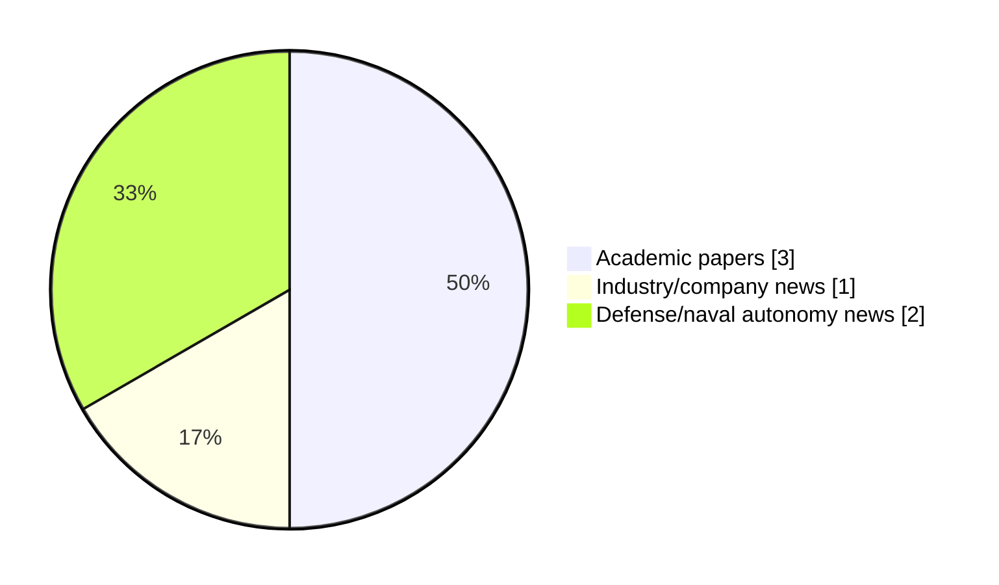

# Maritime Autonomy Watch — 2026-08-07

## Executive Summary

- Total selected items: 6
- Academic papers: 3
- Industry/company news: 1
- Defense/naval autonomy news: 2
- Failed/inaccessible sources: 0

## Contents

- [Analyst Brief](#analyst-brief)
- [Must Read](#must-read)
- [Top Signals Today](#top-signals-today)
- [Topic Signals](#topic-signals)
- [Freshness and Coverage](#freshness-and-coverage)
- [Quality Notes](#quality-notes)
- [Watchlist](#watchlist)
- [Academic Papers](#academic-papers)
- [Industry and Company News](#industry-and-company-news)
- [Defense and Naval Autonomy News](#defense-and-naval-autonomy-news)
- [Source Status Summary](#source-status-summary)

## Analyst Brief

Today's report selected 6 non-duplicate item(s), led by perception, critical infrastructure, AUV navigation. The strongest item is [Unified Planning-Learning Framework for Robust UUV Navigation Under Partial Observability](http://arxiv.org/abs/2608.05365v1) from arXiv.
Coverage is weighted toward academic research (3), with 1 industry and 2 defense signal(s).
Quality caveat: low-score-unique=1, missing-summary=1, date-anomaly=1.

## Must Read

- [Unified Planning-Learning Framework for Robust UUV Navigation Under Partial Observability](http://arxiv.org/abs/2608.05365v1) — Research signal: perception
- [Optimal Placement of Docking Stations and Resident AUVs for Subsea Pipeline Inspection](http://arxiv.org/abs/2607.19944v1) — Research signal: AUV navigation
- [Autonomous USVs & Advanced Sonar Unlock High-Precision Shallow-Water Mapping](https://www.oceansciencetechnology.com/news/autonomous-usvs-advanced-sonar-unlock-high-precision-shallow-water-mapping/) — Defense signal: USV operations
- [Bedrock Ocean Exploration and First Marine Solutions Launch North Sea AUV Partnership](https://oceannews.com/news/science-technology/bedrock-ocean-exploration-and-first-marine-solutions-launch-north-sea-auv-partnership/) — Industry signal: AUV navigation
- [HII Commits Up to $900 Million to Path Robotics and GrayMatter Robotics for AI Shipbuilding](https://oceannews.com/news/defense/hii-commits-up-to-900-million-to-path-robotics-and-graymatter-robotics-for-ai-shipbuilding/) — Defense signal: USV operations

## Top Signals Today

- perception: 3 selected item(s).
- critical infrastructure: 3 selected item(s).
- AUV navigation: 3 selected item(s).
- USV operations: 2 selected item(s).
- defense adoption: 2 selected item(s).

## Topic Signals

- perception: 3
- critical infrastructure: 3
- AUV navigation: 3
- USV operations: 2
- defense adoption: 2
- planning/control: 1

## Freshness and Coverage

- Newest selected item date: 2026-12-01
- Oldest selected item date: 2026-07-22
- Active/enabled sources: 4
- Sources with access problems: 3
- Quality flags: 3

## Quality Notes

- low-score-unique: 1
- missing-summary: 1
- date-anomaly: 1
- Date anomalies: [Ubiquitous sensing of marine activities via the cooperation of autonomous underwater vehicles](https://api.elsevier.com/content/abstract/scopus_id/105028115165) reports 2026-12-01

## Watchlist

- [HII Commits Up to $900 Million to Path Robotics and GrayMatter Robotics for AI Shipbuilding](https://oceannews.com/news/defense/hii-commits-up-to-900-million-to-path-robotics-and-graymatter-robotics-for-ai-shipbuilding/) — low-score-unique
- [Ubiquitous sensing of marine activities via the cooperation of autonomous underwater vehicles](https://api.elsevier.com/content/abstract/scopus_id/105028115165) — missing-summary, date-anomaly

### Category Snapshot

| Category | Selected items |
|---|---:|
| Academic papers | 3 |
| Industry/company news | 1 |
| Defense/naval autonomy news | 2 |

## Academic Papers

_Selected items: 3_

### [Unified Planning-Learning Framework for Robust UUV Navigation Under Partial Observability](http://arxiv.org/abs/2608.05365v1)

- Source: arXiv
- Date: 2026-08-05
- Relevance score: 9.25
- Authors: Md Ether Deowan, Eleni Kelasidi
- Signal: Research signal: perception
- Topic tags: perception, planning/control, critical infrastructure

**Abstract**

This paper presents an observation-only autonomy framework for Unmanned Underwater Vehicles (UUVs) navigation in dynamic underwater environments that integrates persistent occupancy mapping, global clearance-aware planning, and risk-aware local control. The proposed pipeline constructs occupancy maps solely from onboard sonar and depth image observations, adapts a clearance-constrained global planner (GP) to provide long-horizon structure, and integrates a reinforcement learning (RL) policy to handle short-range tracking and reactive avoidance. To further support decision-making under partial observability, the system learns a compact latent state representation from onboard sensor data, encoding environmental structure, obstacle dynamics, and uncertainty.

**Why it matters**

Relevant to underwater autonomy, navigation safety; the work may inform maritime autonomy research, testing priorities, or system design.

---

### [Optimal Placement of Docking Stations and Resident AUVs for Subsea Pipeline Inspection](http://arxiv.org/abs/2607.19944v1)

- Source: arXiv
- Date: 2026-07-22
- Relevance score: 7
- Authors: Gabrielė Kasparavičiūtė, Pasquale Grippa, Kjetil Skaugset, Asgeir J. Sørensen, Martin Ludvigsen
- Signal: Research signal: AUV navigation
- Topic tags: AUV navigation, critical infrastructure

**Abstract**

A two-stage mixed-integer linear programming framework is introduced for subsea pipeline incident response planning, jointly optimizing Subsea Docking Plate (SDP) placement and resident autonomous underwater vehicle allocation to minimize both maximum and average response times under spatial uncertainty. Phase 1 minimizes the maximum response time across all potential leak locations. Phase 2 reduces the average response time subject to the maximum bound. A case study based on the Johan Sverdrup oil and gas field in Norway, with 9 SDP options and 33 pipelines, shows that just a few well-placed SDPs are enough to achieve top performance. A cost versus time Pareto analysis reveals the trade-off between deployment expenditure and response efficiency, providing actionable guidance for designing resilient and cost-effective subsea inspection networks.

**Why it matters**

Relevant to underwater autonomy, infrastructure monitoring; the work may inform maritime autonomy research, testing priorities, or system design.

---

### [Ubiquitous sensing of marine activities via the cooperation of autonomous underwater vehicles](https://api.elsevier.com/content/abstract/scopus_id/105028115165)

- Source: Elsevier Scopus
- Date: 2026-12-01
- Relevance score: 4.25
- DOI: 10.1038/s41598-025-29532-y
- Signal: Research signal: AUV navigation
- Topic tags: AUV navigation, perception
- Quality flags: missing-summary, date-anomaly

**Abstract**

No summary available.

**Why it matters**

Relevant to underwater autonomy; the work may inform maritime autonomy research, testing priorities, or system design.

---

## Industry and Company News

_Selected items: 1_

### [Bedrock Ocean Exploration and First Marine Solutions Launch North Sea AUV Partnership](https://oceannews.com/news/science-technology/bedrock-ocean-exploration-and-first-marine-solutions-launch-north-sea-auv-partnership/)

- Source: oceannews.com
- Date: 2026-08-06
- Relevance score: 5
- Signal: Industry signal: AUV navigation
- Topic tags: AUV navigation, critical infrastructure

**Summary**

Bedrock Ocean Exploration (Bedrock), the intelligence infrastructure powering the ocean economy, has announced a multi-year strategic partnership with First Marine Solutions (FMS), an established leader in survey and positioning services to the offshore energy sector. The partnership establishes a UK and European operational hub for Bedrock's autonomous ocean intelligence technology at FMS's Aberdeen headquarters, creating an integrated offering that pairs Bedrock's intelligence stack with FMS's offshore...

**Why it matters**

Signals momentum in underwater autonomy; useful for tracking product direction, partnerships, and deployment opportunities.

---

## Defense and Naval Autonomy News

_Selected items: 2_

### [Autonomous USVs & Advanced Sonar Unlock High-Precision Shallow-Water Mapping](https://www.oceansciencetechnology.com/news/autonomous-usvs-advanced-sonar-unlock-high-precision-shallow-water-mapping/)

- Source: oceansciencetechnology.com
- Date: 2026-08-07
- Relevance score: 5.25
- Signal: Defense signal: USV operations
- Topic tags: USV operations, perception, defense adoption

**Summary**

The U.S. Navy and autonomous technology developer Oshen have successfully demonstrated the ability to map shallow coastal waters using a.

**Why it matters**

Signals movement in surface-vessel operations, naval adoption; useful for tracking operational concepts, procurement direction, and fleet integration.

---

### [HII Commits Up to $900 Million to Path Robotics and GrayMatter Robotics for AI Shipbuilding](https://oceannews.com/news/defense/hii-commits-up-to-900-million-to-path-robotics-and-graymatter-robotics-for-ai-shipbuilding/)

- Source: oceannews.com
- Date: 2026-08-06
- Relevance score: 3
- Signal: Defense signal: USV operations
- Topic tags: USV operations, defense adoption
- Quality flags: low-score-unique

**Summary**

HII has announced long-term performance-based production agreements with High-Yield Production Robotics (HYPR) team members GrayMatter Robotics and Path Robotics. The signed agreements are designed to accelerate the development and deployment of advanced physical AI automation across US Navy shipbuilding programs, including aircraft carriers, submarines, destroyers, amphibious ships, future frigates, and unmanned surface vessels.

**Why it matters**

Signals movement in surface-vessel operations, naval adoption; useful for tracking operational concepts, procurement direction, and fleet integration.

---

## Inaccessible or Failed Sources

- None

## Source Status Summary

| Source | Status | Notes |
|---|---|---|
| arXiv | enabled | API source, 15 items fetched |
| OpenAlex | enabled | API source, 15 items fetched |
| RSS feeds | partial | 97 RSS items fetched; failures: https://www.navalnews.com/feed/: HTTP 503 for https://www.navalnews.com/feed/ |
| SMI MASG News | enabled | HTML source, 10 items fetched |
| IEEE Xplore | disabled | Missing IEEE_XPLORE_API_KEY |
| Elsevier Scopus | enabled | API source, 15 items fetched |
| NewsAPI | disabled | Missing NEWS_API_KEY |

## Metadata

- Generated at: 2026-08-07T09:09:38.628122+02:00
- Date: 2026-08-07
- Repository: ferhannb/MarineRobotics
- Relevance threshold: 4.0
- Deduplication method: DOI, canonical URL, source ID, normalized title, similar recent titles, category caps, and novelty score
