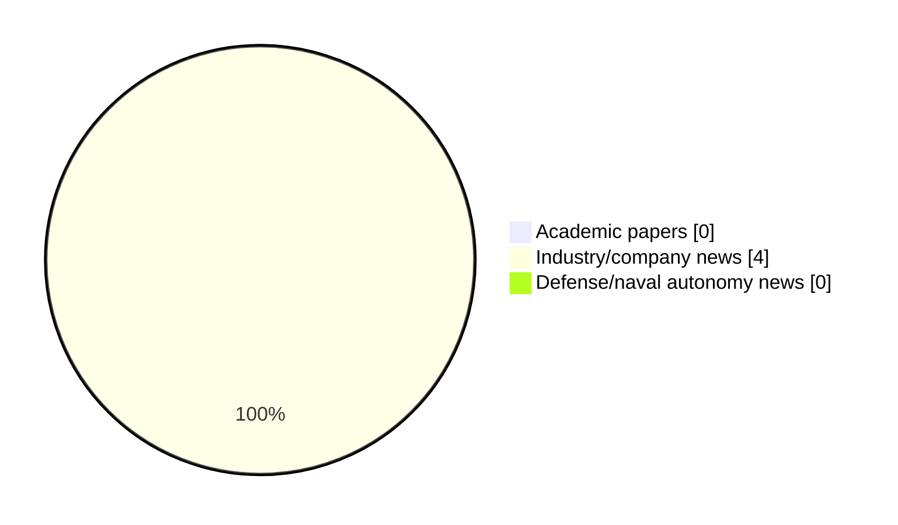

# Maritime Autonomy Watch — 2026-08-08

## Executive Summary

- Total selected items: 4
- Academic papers: 0
- Industry/company news: 4
- Defense/naval autonomy news: 0
- Failed/inaccessible sources: 1

## Contents

- [Analyst Brief](#analyst-brief)
- [Must Read](#must-read)
- [Top Signals Today](#top-signals-today)
- [Topic Signals](#topic-signals)
- [Freshness and Coverage](#freshness-and-coverage)
- [Quality Notes](#quality-notes)
- [Watchlist](#watchlist)
- [Academic Papers](#academic-papers)
- [Industry and Company News](#industry-and-company-news)
- [Defense and Naval Autonomy News](#defense-and-naval-autonomy-news)
- [Source Status Summary](#source-status-summary)

## Analyst Brief

Today's report selected 4 non-duplicate item(s), led by USV operations, AUV navigation, general autonomy. The strongest item is [Southern Miss AUV Team Reaches Semifinals at RoboSub 2026](https://oceannews.com/news/milestones/southern-miss-auv-team-reaches-semifinals-at-robosub-2026/) from oceannews.com.
Coverage is weighted toward academic research (0), with 4 industry and 0 defense signal(s).
Quality caveat: low-score-unique=1.

## Must Read

- [Southern Miss AUV Team Reaches Semifinals at RoboSub 2026](https://oceannews.com/news/milestones/southern-miss-auv-team-reaches-semifinals-at-robosub-2026/) — Industry signal: AUV navigation
- [ACUA Ocean Pioneer USV demonstrates Long-Endurance Surveillance](https://massworld.news/acua-ocean-pioneer-usv-demonstrates-long-endurance-surveillance/) — Industry signal: USV operations
- [USV Demonstrates Autonomous Ecosystem Monitoring for Floating Offshore Wind](https://oceannews.com/news/energy/usv-demonstrates-autonomous-ecosystem-monitoring-for-floating-offshore-wind/) — Industry signal: USV operations
- [MBARI Staff & Facilities Inspire Future Generation of Ocean Specialists](https://oceannews.com/news/milestones/mbari-staff-facilities-inspire-future-generation-of-ocean-specialists/) — Industry signal: general autonomy

## Top Signals Today

- USV operations: 2 selected item(s).
- AUV navigation: 1 selected item(s).
- general autonomy: 1 selected item(s).

## Topic Signals

- USV operations: 2
- AUV navigation: 1
- general autonomy: 1

## Freshness and Coverage

- Newest selected item date: 2026-08-07
- Oldest selected item date: 2026-07-09
- Active/enabled sources: 3
- Sources with access problems: 4
- Quality flags: 1

## Quality Notes

- low-score-unique: 1

## Watchlist

- [MBARI Staff & Facilities Inspire Future Generation of Ocean Specialists](https://oceannews.com/news/milestones/mbari-staff-facilities-inspire-future-generation-of-ocean-specialists/) — low-score-unique

### Category Snapshot

| Category | Selected items |
|---|---:|
| Academic papers | 0 |
| Industry/company news | 4 |
| Defense/naval autonomy news | 0 |

## Academic Papers

_Selected items: 0_

No selected items.

## Industry and Company News

_Selected items: 4_

### [Southern Miss AUV Team Reaches Semifinals at RoboSub 2026](https://oceannews.com/news/milestones/southern-miss-auv-team-reaches-semifinals-at-robosub-2026/)

- Source: oceannews.com
- Date: 2026-08-07
- Relevance score: 7.75
- Signal: Industry signal: AUV navigation
- Topic tags: AUV navigation

**Summary**

Students from The University of Southern Mississippi's School of Computing Sciences and Computer Engineering and School of Ocean Science and Engineering recently earned national recognition at the 2026 RoboSub Competition, advancing to the semifinal round and receiving a BlueRobotics Award for innovation in autonomous underwater vehicle (AUV) design.

**Why it matters**

Signals momentum in underwater autonomy; useful for tracking product direction, partnerships, and deployment opportunities.

---

### [ACUA Ocean Pioneer USV demonstrates Long-Endurance Surveillance](https://massworld.news/acua-ocean-pioneer-usv-demonstrates-long-endurance-surveillance/)

- Source: massworld.news
- Date: 2026-07-09
- Relevance score: 7.75
- Signal: Industry signal: USV operations
- Topic tags: USV operations

**Summary**

ACUA Ocean, a company that develops uncrewed surface vessels (USVs) for ocean monitoring and data collection, has its Mk1 USV PIONEER complete a five-day remotely operated offshore demonstration, validating the.

**Why it matters**

Signals momentum in surface-vessel operations, infrastructure monitoring; useful for tracking product direction, partnerships, and deployment opportunities.

---

### [USV Demonstrates Autonomous Ecosystem Monitoring for Floating Offshore Wind](https://oceannews.com/news/energy/usv-demonstrates-autonomous-ecosystem-monitoring-for-floating-offshore-wind/)

- Source: oceannews.com
- Date: 2026-08-07
- Relevance score: 5.25
- Signal: Industry signal: USV operations
- Topic tags: USV operations

**Summary**

A new autonomous ecosystem monitoring capability has been demonstrated that could help improve environmental assessment for future floating offshore wind developments. The technology was tested during a multi-partner field trial at Smart Sound Plymouth, as part of the EQUIFy project.

**Why it matters**

Signals momentum in surface-vessel operations, infrastructure monitoring; useful for tracking product direction, partnerships, and deployment opportunities.

---

### [MBARI Staff & Facilities Inspire Future Generation of Ocean Specialists](https://oceannews.com/news/milestones/mbari-staff-facilities-inspire-future-generation-of-ocean-specialists/)

- Source: oceannews.com
- Date: 2026-08-07
- Relevance score: 3.5
- Signal: Industry signal: general autonomy
- Topic tags: general autonomy
- Quality flags: low-score-unique

**Summary**

On July 23, MBARI hosted research interns from the Summer Systematics Institute program at the California Academy of Sciences, giving summer interns the opportunity to meet fellow undergraduate students researching topics like anthropology, botany, geology, invertebrate zoology, and scientific illustration.

**Why it matters**

Signals momentum in underwater autonomy; useful for tracking product direction, partnerships, and deployment opportunities.

---

## Defense and Naval Autonomy News

_Selected items: 0_

No selected items.

## Inaccessible or Failed Sources

- Elsevier Scopus: HTTP 400 for https://api.elsevier.com/content/search/scopus?query=TITLE-ABS-KEY%28%22maritime+autonomy%22%29+OR+TITLE-ABS-KEY%28%22marine+robotics%22%29+OR+TITLE-ABS-KEY%28%22autonomous+vessel%22%29+OR+TITLE-ABS-KEY%28%22autonomous+mission%22%29+OR+TITLE-ABS-KEY%28%22autonomous+surface+vessel%22%29+OR+TITLE-ABS-KEY%28%22autonomous+underwater+vehicle%22%29+OR+TITLE-ABS-KEY%28%22unmanned+surface+vehicle%22%29+OR+TITLE-ABS-KEY%28%22unmanned+underwater+vehicle%22%29+OR+TITLE-ABS-KEY%28%22unmanned+naval%22%29+OR+TITLE-ABS-KEY%28%22unmanned+systems%22%29+OR+TITLE-ABS-KEY%28%22naval+autonomy%22%29+OR+TITLE-ABS-KEY%28%22USV%22%29+OR+TITLE-ABS-KEY%28%22USV+autonomy%22%29+OR+TITLE-ABS-KEY%28%22AUV%22%29+OR+TITLE-ABS-KEY%28%22AUV+navigation%22%29+OR+TITLE-ABS-KEY%28%22UUV%22%29+OR+TITLE-ABS-KEY%28%22robotic+perception+marine%22%29+OR+TITLE-ABS-KEY%28%22underwater+robotics%22%29&count=15&sort=-coverDate

## Source Status Summary

| Source | Status | Notes |
|---|---|---|
| arXiv | enabled | API source, 15 items fetched |
| OpenAlex | enabled | API source, 15 items fetched |
| RSS feeds | partial | 97 RSS items fetched; failures: https://www.navalnews.com/feed/: HTTP 503 for https://www.navalnews.com/feed/ |
| SMI MASG News | enabled | HTML source, 10 items fetched |
| IEEE Xplore | disabled | Missing IEEE_XPLORE_API_KEY |
| Elsevier Scopus | failed | HTTP 400 for https://api.elsevier.com/content/search/scopus?query=TITLE-ABS-KEY%28%22maritime+autonomy%22%29+OR+TITLE-ABS-KEY%28%22marine+robotics%22%29+OR+TITLE-ABS-KEY%28%22autonomous+vessel%22%29+OR+TITLE-ABS-KEY%28%22autonomous+mission%22%29+OR+TITLE-ABS-KEY%28%22autonomous+surface+vessel%22%29+OR+TITLE-ABS-KEY%28%22autonomous+underwater+vehicle%22%29+OR+TITLE-ABS-KEY%28%22unmanned+surface+vehicle%22%29+OR+TITLE-ABS-KEY%28%22unmanned+underwater+vehicle%22%29+OR+TITLE-ABS-KEY%28%22unmanned+naval%22%29+OR+TITLE-ABS-KEY%28%22unmanned+systems%22%29+OR+TITLE-ABS-KEY%28%22naval+autonomy%22%29+OR+TITLE-ABS-KEY%28%22USV%22%29+OR+TITLE-ABS-KEY%28%22USV+autonomy%22%29+OR+TITLE-ABS-KEY%28%22AUV%22%29+OR+TITLE-ABS-KEY%28%22AUV+navigation%22%29+OR+TITLE-ABS-KEY%28%22UUV%22%29+OR+TITLE-ABS-KEY%28%22robotic+perception+marine%22%29+OR+TITLE-ABS-KEY%28%22underwater+robotics%22%29&count=15&sort=-coverDate |
| NewsAPI | disabled | Missing NEWS_API_KEY |

## Metadata

- Generated at: 2026-08-08T08:44:20.659083+02:00
- Date: 2026-08-08
- Repository: ferhannb/MarineRobotics
- Relevance threshold: 4.0
- Deduplication method: DOI, canonical URL, source ID, normalized title, similar recent titles, category caps, and novelty score
