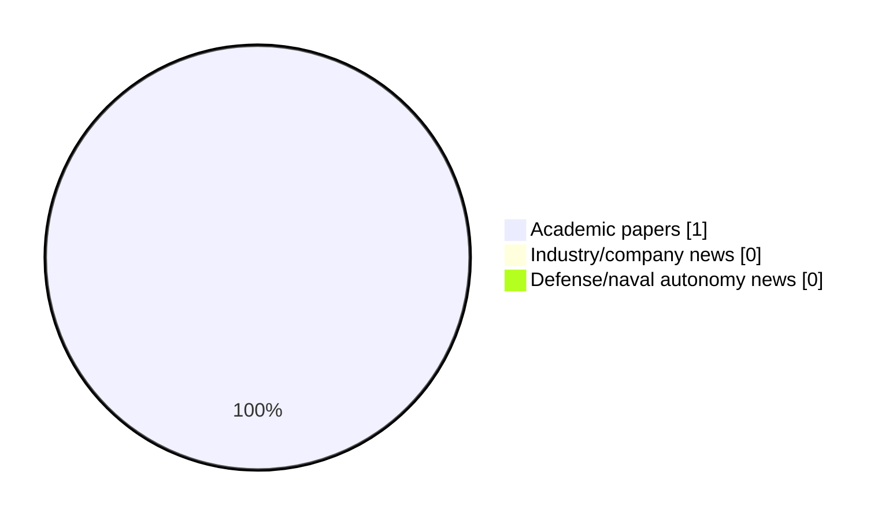

# Maritime Autonomy Watch — 2026-08-09

## Executive Summary

- Total selected items: 1
- Academic papers: 1
- Industry/company news: 0
- Defense/naval autonomy news: 0
- Failed/inaccessible sources: 1

## Contents

- [Analyst Brief](#analyst-brief)
- [Must Read](#must-read)
- [Top Signals Today](#top-signals-today)
- [Topic Signals](#topic-signals)
- [Freshness and Coverage](#freshness-and-coverage)
- [Quality Notes](#quality-notes)
- [Watchlist](#watchlist)
- [Academic Papers](#academic-papers)
- [Industry and Company News](#industry-and-company-news)
- [Defense and Naval Autonomy News](#defense-and-naval-autonomy-news)
- [Source Status Summary](#source-status-summary)

## Analyst Brief

Today's report selected 1 non-duplicate item(s), led by swarm autonomy, planning/control, regulation/legal. The strongest item is [Hydrodynamics-aware formation control for energy-efficient multi-vessel systems: A review](https://doi.org/10.1016/j.oceaneng.2026.127331) from OpenAlex.
Coverage is weighted toward academic research (1), with 0 industry and 0 defense signal(s).
Quality caveat: low-score-unique=1.

## Must Read

- [Hydrodynamics-aware formation control for energy-efficient multi-vessel systems: A review](https://doi.org/10.1016/j.oceaneng.2026.127331) — Research signal: swarm autonomy

## Top Signals Today

- swarm autonomy: 1 selected item(s).
- planning/control: 1 selected item(s).
- regulation/legal: 1 selected item(s).

## Topic Signals

- swarm autonomy: 1
- planning/control: 1
- regulation/legal: 1

## Freshness and Coverage

- Newest selected item date: 2026-08-05
- Oldest selected item date: 2026-08-05
- Active/enabled sources: 3
- Sources with access problems: 4
- Quality flags: 1

## Quality Notes

- low-score-unique: 1

## Watchlist

- [Hydrodynamics-aware formation control for energy-efficient multi-vessel systems: A review](https://doi.org/10.1016/j.oceaneng.2026.127331) — low-score-unique

### Category Snapshot

| Category | Selected items |
|---|---:|
| Academic papers | 1 |
| Industry/company news | 0 |
| Defense/naval autonomy news | 0 |

## Academic Papers

_Selected items: 1_

### [Hydrodynamics-aware formation control for energy-efficient multi-vessel systems: A review](https://doi.org/10.1016/j.oceaneng.2026.127331)

- Source: OpenAlex
- Date: 2026-08-05
- Relevance score: 3.5
- Authors: Xin Xiong, Rudy R. Negenborn, Yusong Pang
- DOI: 10.1016/j.oceaneng.2026.127331
- Signal: Research signal: swarm autonomy
- Topic tags: swarm autonomy, planning/control, regulation/legal
- Quality flags: low-score-unique

**Abstract**

Maritime decarbonization and the emergence of autonomous vessel fleets are motivating cooperative sailing concepts in which formation geometry serves not only as a coordination variable but also as a potential means of reducing hydrodynamic resistance. Although favorable wake and wave-interference patterns can reduce resistance in specific configurations, translating these benefits into deployable formation-control laws remains challenging. The central difficulty is cross-layer: hydrodynamic models must capture spacing- and speed-dependent interaction effects while remaining sufficiently compact, differentiable, and transferable for constrained real-time control. This review examines hydrodynamics-aware formation control for energy-efficient multi-vessel systems using a structured Scopus corpus of 193 publications.

**Why it matters**

Relevant to multi-vehicle coordination; the work may inform maritime autonomy research, testing priorities, or system design.

---

## Industry and Company News

_Selected items: 0_

No selected items.

## Defense and Naval Autonomy News

_Selected items: 0_

No selected items.

## Inaccessible or Failed Sources

- Elsevier Scopus: HTTP 400 for https://api.elsevier.com/content/search/scopus?query=TITLE-ABS-KEY%28%22maritime+autonomy%22%29+OR+TITLE-ABS-KEY%28%22marine+robotics%22%29+OR+TITLE-ABS-KEY%28%22autonomous+vessel%22%29+OR+TITLE-ABS-KEY%28%22autonomous+mission%22%29+OR+TITLE-ABS-KEY%28%22autonomous+surface+vessel%22%29+OR+TITLE-ABS-KEY%28%22autonomous+underwater+vehicle%22%29+OR+TITLE-ABS-KEY%28%22unmanned+surface+vehicle%22%29+OR+TITLE-ABS-KEY%28%22unmanned+underwater+vehicle%22%29+OR+TITLE-ABS-KEY%28%22unmanned+naval%22%29+OR+TITLE-ABS-KEY%28%22unmanned+systems%22%29+OR+TITLE-ABS-KEY%28%22naval+autonomy%22%29+OR+TITLE-ABS-KEY%28%22USV%22%29+OR+TITLE-ABS-KEY%28%22USV+autonomy%22%29+OR+TITLE-ABS-KEY%28%22AUV%22%29+OR+TITLE-ABS-KEY%28%22AUV+navigation%22%29+OR+TITLE-ABS-KEY%28%22UUV%22%29+OR+TITLE-ABS-KEY%28%22robotic+perception+marine%22%29+OR+TITLE-ABS-KEY%28%22underwater+robotics%22%29&count=15&sort=-coverDate

## Source Status Summary

| Source | Status | Notes |
|---|---|---|
| arXiv | enabled | API source, 15 items fetched |
| OpenAlex | enabled | API source, 15 items fetched |
| RSS feeds | partial | 97 RSS items fetched; failures: https://www.navalnews.com/feed/: HTTP 503 for https://www.navalnews.com/feed/ |
| SMI MASG News | enabled | HTML source, 10 items fetched |
| IEEE Xplore | disabled | Missing IEEE_XPLORE_API_KEY |
| Elsevier Scopus | failed | HTTP 400 for https://api.elsevier.com/content/search/scopus?query=TITLE-ABS-KEY%28%22maritime+autonomy%22%29+OR+TITLE-ABS-KEY%28%22marine+robotics%22%29+OR+TITLE-ABS-KEY%28%22autonomous+vessel%22%29+OR+TITLE-ABS-KEY%28%22autonomous+mission%22%29+OR+TITLE-ABS-KEY%28%22autonomous+surface+vessel%22%29+OR+TITLE-ABS-KEY%28%22autonomous+underwater+vehicle%22%29+OR+TITLE-ABS-KEY%28%22unmanned+surface+vehicle%22%29+OR+TITLE-ABS-KEY%28%22unmanned+underwater+vehicle%22%29+OR+TITLE-ABS-KEY%28%22unmanned+naval%22%29+OR+TITLE-ABS-KEY%28%22unmanned+systems%22%29+OR+TITLE-ABS-KEY%28%22naval+autonomy%22%29+OR+TITLE-ABS-KEY%28%22USV%22%29+OR+TITLE-ABS-KEY%28%22USV+autonomy%22%29+OR+TITLE-ABS-KEY%28%22AUV%22%29+OR+TITLE-ABS-KEY%28%22AUV+navigation%22%29+OR+TITLE-ABS-KEY%28%22UUV%22%29+OR+TITLE-ABS-KEY%28%22robotic+perception+marine%22%29+OR+TITLE-ABS-KEY%28%22underwater+robotics%22%29&count=15&sort=-coverDate |
| NewsAPI | disabled | Missing NEWS_API_KEY |

## Metadata

- Generated at: 2026-08-09T08:50:37.741397+02:00
- Date: 2026-08-09
- Repository: ferhannb/MarineRobotics
- Relevance threshold: 4.0
- Deduplication method: DOI, canonical URL, source ID, normalized title, similar recent titles, category caps, and novelty score
