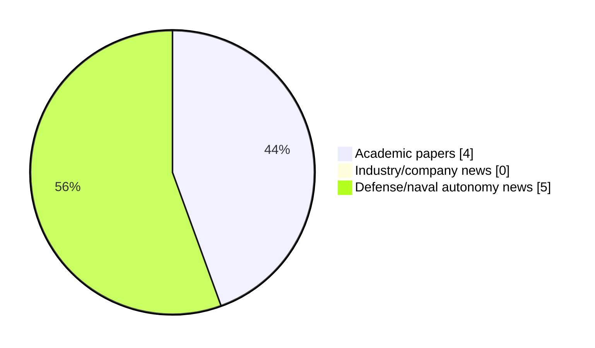

# Maritime Autonomy Watch — 2026-08-11

## Executive Summary

- Total selected items: 9
- Academic papers: 4
- Industry/company news: 0
- Defense/naval autonomy news: 5
- Failed/inaccessible sources: 0

## Contents

- [Analyst Brief](#analyst-brief)
- [Must Read](#must-read)
- [Top Signals Today](#top-signals-today)
- [Topic Signals](#topic-signals)
- [Freshness and Coverage](#freshness-and-coverage)
- [Quality Notes](#quality-notes)
- [Watchlist](#watchlist)
- [Academic Papers](#academic-papers)
- [Industry and Company News](#industry-and-company-news)
- [Defense and Naval Autonomy News](#defense-and-naval-autonomy-news)
- [Source Status Summary](#source-status-summary)

## Analyst Brief

Today's report selected 9 non-duplicate item(s), led by defense adoption, USV operations, swarm autonomy. The strongest item is [Raytheon and CET Successfully Test New Low-Cost Hadalus UUV for U.S. Navy](https://www.navalnews.com/naval-news/2026/08/raytheon-and-cet-successfully-test-new-low-cost-hadalus-uuv-for-u-s-navy/) from navalnews.com.
Coverage is weighted toward academic research (4), with 0 industry and 5 defense signal(s).
Quality caveat: missing-summary=4, date-anomaly=4, low-score-unique=2.

## Must Read

- [Raytheon and CET Successfully Test New Low-Cost Hadalus UUV for U.S. Navy](https://www.navalnews.com/naval-news/2026/08/raytheon-and-cet-successfully-test-new-low-cost-hadalus-uuv-for-u-s-navy/) — Defense signal: defense adoption
- [Indonesian Navy Debuts Kamikaze USV During Major Exercise](https://www.navalnews.com/naval-news/2026/08/indonesian-navy-debuts-kamikaze-usv-during-major-exercise/) — Defense signal: USV operations
- [MTS TechSurge to Unite Maritime Autonomy Leaders in Arlington](https://oceannews.com/news/milestones/mts-techsurge-to-unite-maritime-autonomy-leaders-in-arlington/) — Defense signal: defense adoption
- [UK MoD plays down leak fears over China-linked K3 USV cameras](https://www.naval-technology.com/news/uk-mod-k3-usv-china/) — Defense signal: USV operations
- [Hadalus UUV launches MCM effects in US Navy exercise](https://www.naval-technology.com/news/hadalus-uuv-launches-mcm-effects-in-us-navy-exercise/) — Defense signal: defense adoption

## Top Signals Today

- defense adoption: 6 selected item(s).
- USV operations: 4 selected item(s).
- swarm autonomy: 2 selected item(s).
- AUV navigation: 2 selected item(s).
- planning/control: 2 selected item(s).

## Topic Signals

- defense adoption: 6
- USV operations: 4
- swarm autonomy: 2
- AUV navigation: 2
- planning/control: 2
- perception: 1

## Freshness and Coverage

- Newest selected item date: 2027-03-01
- Oldest selected item date: 2026-08-05
- Active/enabled sources: 5
- Sources with access problems: 2
- Quality flags: 10

## Quality Notes

- missing-summary: 4
- date-anomaly: 4
- low-score-unique: 2
- Date anomalies: [Adaptive Risk-Aware Implicit Quantile Network: Towards Safe and Energy-Efficient USV Navigation in Dynamic Environments](https://api.elsevier.com/content/abstract/scopus_id/105046501877) reports 2027-01-01; [Graph-Enhanced Adaptive Residual Reinforcement Learning for Robust Multi-USV Cooperative Defense with Scalable Communication](https://api.elsevier.com/content/abstract/scopus_id/105046392000) reports 2027-01-01; [Formation control of AUVs for enabling safe and efficient marine operations](https://api.elsevier.com/content/abstract/scopus_id/105046585164) reports 2027-03-01; [Towards Transparent and Controllable LLM-Enhanced Reinforcement Learning for AUVs: Integrating Explainable AI and Multi-modal Feedback](https://api.elsevier.com/content/abstract/scopus_id/105046429658) reports 2027-01-01

## Watchlist

- [Hadalus UUV launches MCM effects in US Navy exercise](https://www.naval-technology.com/news/hadalus-uuv-launches-mcm-effects-in-us-navy-exercise/) — low-score-unique
- [Adaptive Risk-Aware Implicit Quantile Network: Towards Safe and Energy-Efficient USV Navigation in Dynamic Environments](https://api.elsevier.com/content/abstract/scopus_id/105046501877) — missing-summary, date-anomaly
- [Graph-Enhanced Adaptive Residual Reinforcement Learning for Robust Multi-USV Cooperative Defense with Scalable Communication](https://api.elsevier.com/content/abstract/scopus_id/105046392000) — missing-summary, date-anomaly
- [Formation control of AUVs for enabling safe and efficient marine operations](https://api.elsevier.com/content/abstract/scopus_id/105046585164) — missing-summary, date-anomaly
- [Towards Transparent and Controllable LLM-Enhanced Reinforcement Learning for AUVs: Integrating Explainable AI and Multi-modal Feedback](https://api.elsevier.com/content/abstract/scopus_id/105046429658) — missing-summary, date-anomaly, low-score-unique

### Category Snapshot

| Category | Selected items |
|---|---:|
| Academic papers | 4 |
| Industry/company news | 0 |
| Defense/naval autonomy news | 5 |

## Academic Papers

_Selected items: 4_

### [Adaptive Risk-Aware Implicit Quantile Network: Towards Safe and Energy-Efficient USV Navigation in Dynamic Environments](https://api.elsevier.com/content/abstract/scopus_id/105046501877)

- Source: Elsevier Scopus
- Date: 2027-01-01
- Relevance score: 4.5
- DOI: 10.1007/978-981-92-3381-6_34
- Signal: Research signal: USV operations
- Topic tags: USV operations
- Quality flags: missing-summary, date-anomaly

**Abstract**

No summary available.

**Why it matters**

Relevant to surface-vessel operations; the work may inform maritime autonomy research, testing priorities, or system design.

---

### [Graph-Enhanced Adaptive Residual Reinforcement Learning for Robust Multi-USV Cooperative Defense with Scalable Communication](https://api.elsevier.com/content/abstract/scopus_id/105046392000)

- Source: Elsevier Scopus
- Date: 2027-01-01
- Relevance score: 4.5
- DOI: 10.1007/978-981-92-3394-6_45
- Signal: Research signal: USV operations
- Topic tags: USV operations, swarm autonomy, defense adoption
- Quality flags: missing-summary, date-anomaly

**Abstract**

No summary available.

**Why it matters**

Relevant to surface-vessel operations, naval adoption; the work may inform maritime autonomy research, testing priorities, or system design.

---

### [Formation control of AUVs for enabling safe and efficient marine operations](https://api.elsevier.com/content/abstract/scopus_id/105046585164)

- Source: Elsevier Scopus
- Date: 2027-03-01
- Relevance score: 4.25
- DOI: 10.1016/j.apm.2026.117232
- Signal: Research signal: AUV navigation
- Topic tags: AUV navigation, swarm autonomy, planning/control
- Quality flags: missing-summary, date-anomaly

**Abstract**

No summary available.

**Why it matters**

Relevant to underwater autonomy, multi-vehicle coordination; the work may inform maritime autonomy research, testing priorities, or system design.

---

### [Towards Transparent and Controllable LLM-Enhanced Reinforcement Learning for AUVs: Integrating Explainable AI and Multi-modal Feedback](https://api.elsevier.com/content/abstract/scopus_id/105046429658)

- Source: Elsevier Scopus
- Date: 2027-01-01
- Relevance score: 3.5
- DOI: 10.1007/978-981-92-3394-6_44
- Signal: Research signal: AUV navigation
- Topic tags: AUV navigation, planning/control
- Quality flags: missing-summary, date-anomaly, low-score-unique

**Abstract**

No summary available.

**Why it matters**

Relevant to underwater autonomy; the work may inform maritime autonomy research, testing priorities, or system design.

---

## Industry and Company News

_Selected items: 0_

No selected items.

## Defense and Naval Autonomy News

_Selected items: 5_

### [Raytheon and CET Successfully Test New Low-Cost Hadalus UUV for U.S. Navy](https://www.navalnews.com/naval-news/2026/08/raytheon-and-cet-successfully-test-new-low-cost-hadalus-uuv-for-u-s-navy/)

- Source: navalnews.com
- Date: 2026-08-10
- Relevance score: 7
- Signal: Defense signal: defense adoption
- Topic tags: defense adoption
- Also reported by: https://oceannews.com/feed/

**Summary**

Raytheon and CET demonstrated the Hadalus low-cost, long-endurance UUV in a U.S. Navy test, proving submerged launch and autonomous mission capabilities. Raytheon press release Raytheon, an RTX business, and Composite Energy Technologies (CET) have successfully demonstrated the undersea launch capabilities of Hadalus, a new, low-cost, long-endurance unmanned undersea vehicle (UUV). During a recent U.S. Navy.

**Why it matters**

Signals movement in naval adoption; useful for tracking operational concepts, procurement direction, and fleet integration.

---

### [MTS TechSurge to Unite Maritime Autonomy Leaders in Arlington](https://oceannews.com/news/milestones/mts-techsurge-to-unite-maritime-autonomy-leaders-in-arlington/)

- Source: oceannews.com
- Date: 2026-08-10
- Relevance score: 5.75
- Signal: Defense signal: defense adoption
- Topic tags: defense adoption

**Summary**

Maritime autonomy is no longer a vision for the future; it is becoming an operational reality. From offshore energy and defense to ocean science, environmental monitoring, and commercial shipping, autonomous systems are transforming how we understand, monitor, and operate in the marine environment. Advances in uncrewed surface and underwater vehicles, intelligent sensors, artificial intelligence (AI), and data analytics are expanding what is possible across some of the world's most challenging environments.

**Why it matters**

Signals movement in underwater autonomy, infrastructure monitoring, naval adoption; useful for tracking operational concepts, procurement direction, and fleet integration.

---

### [Indonesian Navy Debuts Kamikaze USV During Major Exercise](https://www.navalnews.com/naval-news/2026/08/indonesian-navy-debuts-kamikaze-usv-during-major-exercise/)

- Source: navalnews.com
- Date: 2026-08-05
- Relevance score: 6
- Signal: Defense signal: USV operations
- Topic tags: USV operations, defense adoption

**Summary**

The Indonesian Navy (TNI AL) deployed a one-way attack (kamikaze/suicide) unmanned surface vessel (USV) for the first time during a major inter-service exercise in Dabo Singkep, Riau Islands, on 5 August. The exercise also saw the navy launching a loitering munition from a warship and firing two C-705 anti-ship missiles. The USV features an angular.

**Why it matters**

Signals movement in surface-vessel operations, naval adoption; useful for tracking operational concepts, procurement direction, and fleet integration.

---

### [UK MoD plays down leak fears over China-linked K3 USV cameras](https://www.naval-technology.com/news/uk-mod-k3-usv-china/)

- Source: naval-technology.com
- Date: 2026-08-10
- Relevance score: 4.5
- Signal: Defense signal: USV operations
- Topic tags: USV operations, perception, defense adoption

**Summary**

The UK Ministry of Defence (MoD) has said it found “no evidence” of security compromise following media reports that cameras fitted to Royal Navy K3 Scout surveillance vessels sent communication signals to an IP address in China.

**Why it matters**

Signals movement in surface-vessel operations, naval adoption; useful for tracking operational concepts, procurement direction, and fleet integration.

---

### [Hadalus UUV launches MCM effects in US Navy exercise](https://www.naval-technology.com/news/hadalus-uuv-launches-mcm-effects-in-us-navy-exercise/)

- Source: naval-technology.com
- Date: 2026-08-10
- Relevance score: 3.5
- Signal: Defense signal: defense adoption
- Topic tags: defense adoption
- Quality flags: low-score-unique

**Summary**

An XLUUV built by Composite Energy, equipped with Raytheon mission systems, participated in a US Navy exercise.

**Why it matters**

Signals movement in naval adoption; useful for tracking operational concepts, procurement direction, and fleet integration.

---

## Inaccessible or Failed Sources

- None

## Source Status Summary

| Source | Status | Notes |
|---|---|---|
| arXiv | enabled | API source, 15 items fetched |
| OpenAlex | enabled | API source, 15 items fetched |
| RSS feeds | enabled | 107 RSS items fetched |
| SMI MASG News | enabled | HTML source, 10 items fetched |
| IEEE Xplore | disabled | Missing IEEE_XPLORE_API_KEY |
| Elsevier Scopus | enabled | API source, 15 items fetched |
| NewsAPI | disabled | Missing NEWS_API_KEY |

## Metadata

- Generated at: 2026-08-11T09:00:43.820753+02:00
- Date: 2026-08-11
- Repository: ferhannb/MarineRobotics
- Relevance threshold: 4.0
- Deduplication method: DOI, canonical URL, source ID, normalized title, similar recent titles, category caps, and novelty score
