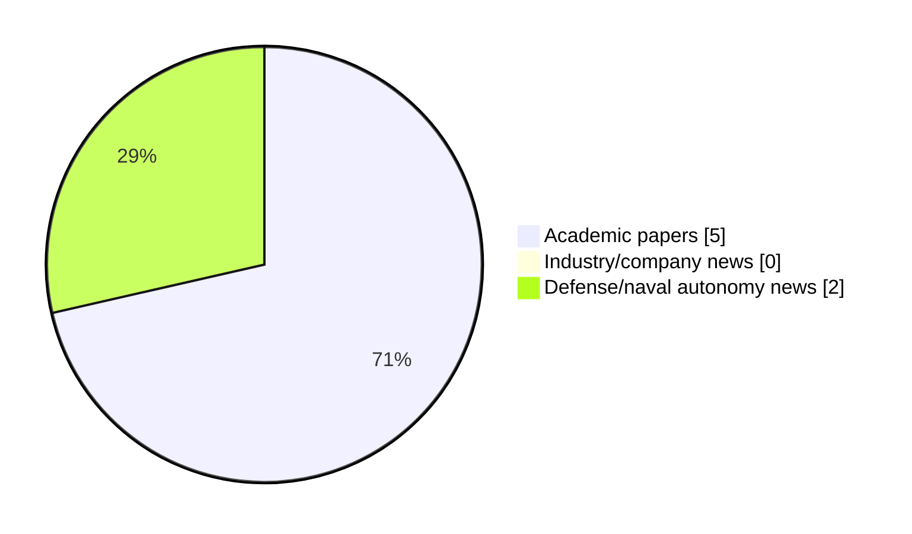

# Maritime Autonomy Watch — 2026-08-12

## Executive Summary

- Total selected items: 7
- Academic papers: 5
- Industry/company news: 0
- Defense/naval autonomy news: 2
- Failed/inaccessible sources: 0

## Contents

- [Analyst Brief](#analyst-brief)
- [Must Read](#must-read)
- [Top Signals Today](#top-signals-today)
- [Topic Signals](#topic-signals)
- [Freshness and Coverage](#freshness-and-coverage)
- [Quality Notes](#quality-notes)
- [Watchlist](#watchlist)
- [Academic Papers](#academic-papers)
- [Industry and Company News](#industry-and-company-news)
- [Defense and Naval Autonomy News](#defense-and-naval-autonomy-news)
- [Source Status Summary](#source-status-summary)

## Analyst Brief

Today's report selected 7 non-duplicate item(s), led by USV operations, planning/control, AUV navigation. The strongest item is [CORAL-AUV: CFD Oriented Reinforcement Learning for Autonomous Underwater Vehicles](http://arxiv.org/abs/2607.09557v1) from arXiv.
Coverage is weighted toward academic research (5), with 0 industry and 2 defense signal(s).
Quality caveat: low-score-unique=2, missing-summary=1.

## Must Read

- [CORAL-AUV: CFD Oriented Reinforcement Learning for Autonomous Underwater Vehicles](http://arxiv.org/abs/2607.09557v1) — Research signal: AUV navigation
- [HII & MetalCraft Marine Earn DIU Recognition After Autonomous Sea Tests of ROMULUS USV](https://oceannews.com/news/defense/hii-metalcraft-marine-earn-diu-recognition-after-autonomous-sea-tests-of-romulus-usv/) — Defense signal: USV operations
- [Resource-Aware Topology Management for ISAC-Enabled TDOA Localization in IoUT Networks](http://arxiv.org/abs/2607.24028v1) — Research signal: AUV navigation
- [Seeing above the waves: A modular sensing framework for data acquisition at sea](http://arxiv.org/abs/2608.10997v1) — Research signal: USV operations
- [Saronic Expands to Mississippi, Selects Port of Gulfport for Marauder On-Water Testing](https://www.navalnews.com/naval-news/2026/08/saronic-expands-to-mississippi-selects-port-of-gulfport-for-marauder-on-water-testing/) — Defense signal: USV operations

## Top Signals Today

- USV operations: 4 selected item(s).
- planning/control: 3 selected item(s).
- AUV navigation: 3 selected item(s).
- swarm autonomy: 2 selected item(s).
- perception: 2 selected item(s).

## Topic Signals

- USV operations: 4
- planning/control: 3
- AUV navigation: 3
- swarm autonomy: 2
- perception: 2
- defense adoption: 1
- critical infrastructure: 1
- underwater communications: 1

## Freshness and Coverage

- Newest selected item date: 2026-08-11
- Oldest selected item date: 2026-07-10
- Active/enabled sources: 5
- Sources with access problems: 2
- Quality flags: 3

## Quality Notes

- low-score-unique: 2
- missing-summary: 1

## Watchlist

- [Saronic Expands to Mississippi, Selects Port of Gulfport for Marauder On-Water Testing](https://www.navalnews.com/naval-news/2026/08/saronic-expands-to-mississippi-selects-port-of-gulfport-for-marauder-on-water-testing/) — low-score-unique
- [Autonomous Collision Avoidance Decision-Making Method for UAV-USV Based on PD3QN Algorithm](https://doi.org/10.21203/rs.3.rs-8528532/v1) — missing-summary
- [Strategic Inference of Adversarial Navigation Objectives for Unmanned Underwater Vehicles](http://arxiv.org/abs/2607.21945v1) — low-score-unique

### Category Snapshot

| Category | Selected items |
|---|---:|
| Academic papers | 5 |
| Industry/company news | 0 |
| Defense/naval autonomy news | 2 |

## Academic Papers

_Selected items: 5_

### [CORAL-AUV: CFD Oriented Reinforcement Learning for Autonomous Underwater Vehicles](http://arxiv.org/abs/2607.09557v1)

- Source: arXiv
- Date: 2026-07-10
- Relevance score: 8.5
- Authors: Steven Roche, Milo Van Mooy, Nathan McGuire, Levi Cai, Jonathan P. How, Yogesh Girdhar
- Signal: Research signal: AUV navigation
- Topic tags: AUV navigation, planning/control, critical infrastructure

**Abstract**

Fine grain control and positioning of autonomous underwater vehicles (AUVs) is critical for sampling, maintenance, and survey applications. Traditional control methods for AUVs are labor intensive and are not robust to changes in the vehicle configuration or environmental conditions. Reinforcement learning (RL) promises rapid controller development while handling a range of deployment parameters via domain randomization (DR). However, DR is still limited by the capacity of the underlying simulation to model real physics. In particular, drag physics are difficult to model and are a large contributor to sim-to-real gaps. Meanwhile, computational fluid dynamics (CFD) provides high fidelity drag models but is challenging to leverage within reinforcement learning frameworks due to its computational overhead.

**Why it matters**

Relevant to underwater autonomy; the work may inform maritime autonomy research, testing priorities, or system design.

---

### [Resource-Aware Topology Management for ISAC-Enabled TDOA Localization in IoUT Networks](http://arxiv.org/abs/2607.24028v1)

- Source: arXiv
- Date: 2026-07-27
- Relevance score: 7
- Authors: Ruhul Amin Khalil
- Signal: Research signal: AUV navigation
- Topic tags: AUV navigation, underwater communications, swarm autonomy, perception

**Abstract**

Reliable localization in the Internet of Underwater Things (IoUT) is hindered by limited acoustic bandwidth, long propagation delays, multipath, Doppler shifts, and energy-constrained nodes. This letter proposes an integrated sensing and communication (ISAC)-enabled topology management and multi-stage adaptive estimation (ISAC-TM-MAE) framework for time-difference-of-arrival (TDOA) localization in IoUT networks. In the proposed framework, heterogeneous underwater sensors, seabed anchors, autonomous underwater vehicles (AUVs), and surface buoys exploit acoustic ISAC packets for joint communication and localization. The IoUT network is modeled as a graph, in which informative node pairs are selected subject to acoustic bandwidth, computation, energy, and link-reliability constraints.

**Why it matters**

Relevant to underwater autonomy, multi-vehicle coordination; the work may inform maritime autonomy research, testing priorities, or system design.

---

### [Seeing above the waves: A modular sensing framework for data acquisition at sea](http://arxiv.org/abs/2608.10997v1)

- Source: arXiv
- Date: 2026-08-11
- Relevance score: 5
- Authors: Jonathan E. Schmidt, Julius Wirbel, P. Nicholas Hansen, Morgan Louédec, Christian L. H. Westerdahl, Dimitrios Dagdilelis, Roberto Galeazzi
- Signal: Research signal: USV operations
- Topic tags: USV operations, perception

**Abstract**

Advancing autonomy for surface vessels requires systematic evaluation of their sensing and perception subsystems. Yet, maritime environments impose unique challenges: sensor installation is constrained by vessel layout, environmental conditions such as fog or sea clutter are difficult to reproduce, and long-duration missions complicate data collection. This work addresses the question: How can we design a modular and reproducible sensor platform for maritime autonomy? We present a comprehensive design blueprint that incorporates diverse modalities - RADAR, LiDAR, IMU, GNSS, AIS, RGB and LWIR cameras, and weather sensors - to enhance environmental awareness and vessel proprioception. Supported by a dedicated ROS2-based software framework for data management, our modular platform enables long-term data collection, hardware-in-the-loop testing, and integration with existing sensors and algorithms.

**Why it matters**

Relevant to surface-vessel operations; the work may inform maritime autonomy research, testing priorities, or system design.

---

### [Autonomous Collision Avoidance Decision-Making Method for UAV-USV Based on PD3QN Algorithm](https://doi.org/10.21203/rs.3.rs-8528532/v1)

- Source: OpenAlex
- Date: 2026-08-10
- Relevance score: 5.25
- Authors: Sheng Qu, Wei Guan, Chunqi Luo, Tongbo Hu, Xianku Zhang
- DOI: 10.21203/rs.3.rs-8528532/v1
- Signal: Research signal: USV operations
- Topic tags: USV operations
- Quality flags: missing-summary

**Abstract**

No summary available.

**Why it matters**

Relevant to surface-vessel operations, navigation safety; the work may inform maritime autonomy research, testing priorities, or system design.

---

### [Strategic Inference of Adversarial Navigation Objectives for Unmanned Underwater Vehicles](http://arxiv.org/abs/2607.21945v1)

- Source: arXiv
- Date: 2026-07-24
- Relevance score: 3.5
- Authors: Ruimeng Hu, Xu Yang
- Signal: Research signal: AUV navigation
- Topic tags: AUV navigation, swarm autonomy, planning/control
- Quality flags: low-score-unique

**Abstract**

We study destination inference for adversarial unmanned underwater navigation in a spatially varying current field. The red vehicle is modeled as approximately following a Hamilton-Jacobi (HJ) time-optimal path toward an unknown destination, while a blue vehicle observes a noisy realization of that trajectory. We derive a continuous-time likelihood model for this problem and obtain a closed-form local maximum likelihood estimator, a constant-memory multi-period estimator, and an asymptotic Cramér-Rao efficiency result. The Fisher information is governed by a combined score kernel with two additive components, a policy-mean sensitivity and a reference-path sensitivity, and a multiplicative drift sensitivity whose leading geometric contribution is a contraction of the current Hessian with the Jacobi field of the HJ characteristic flow.

**Why it matters**

Relevant to underwater autonomy, multi-vehicle coordination, planning and control; the work may inform maritime autonomy research, testing priorities, or system design.

---

## Industry and Company News

_Selected items: 0_

No selected items.

## Defense and Naval Autonomy News

_Selected items: 2_

### [HII & MetalCraft Marine Earn DIU Recognition After Autonomous Sea Tests of ROMULUS USV](https://oceannews.com/news/defense/hii-metalcraft-marine-earn-diu-recognition-after-autonomous-sea-tests-of-romulus-usv/)

- Source: oceannews.com
- Date: 2026-08-11
- Relevance score: 8.25
- Signal: Defense signal: USV operations
- Topic tags: USV operations, planning/control, defense adoption
- Also reported by: https://www.marinelink.com/news/rss, https://www.navalnews.com/feed/

**Summary**

HII has announced that the US Defense Innovation Unit (DIU) has officially recognized the successful completion of the company's Production-Ready, Inexpensive, Maritime Expeditionary (PRIME) prototype project, featuring the Watcher small Unmanned Surface Vessel (sUSV), which is based on HII's ROMULUS-25 Unmanned Surface Vessel and powered by HII's Odyssey Autonomous Control System (ACS).

**Why it matters**

Signals movement in surface-vessel operations, naval adoption; useful for tracking operational concepts, procurement direction, and fleet integration.

---

### [Saronic Expands to Mississippi, Selects Port of Gulfport for Marauder On-Water Testing](https://www.navalnews.com/naval-news/2026/08/saronic-expands-to-mississippi-selects-port-of-gulfport-for-marauder-on-water-testing/)

- Source: navalnews.com
- Date: 2026-08-11
- Relevance score: 3.5
- Signal: Defense signal: USV operations
- Topic tags: USV operations
- Quality flags: low-score-unique

**Summary**

Saronic announced it has expanded its operations to Gulfport, Mississippi, establishing an initial site for on-water testing of the company’s Medium Unmanned Surface Vessel (MUSV), Marauder, at the Port of Gulfport. Saronic press release As production of Saronic’s Marauder platform continues to scale, the site will support testing and commissioning of the company’s 180 ft..

**Why it matters**

Signals movement in surface-vessel operations; useful for tracking operational concepts, procurement direction, and fleet integration.

---

## Inaccessible or Failed Sources

- None

## Source Status Summary

| Source | Status | Notes |
|---|---|---|
| arXiv | enabled | API source, 15 items fetched |
| OpenAlex | enabled | API source, 15 items fetched |
| RSS feeds | enabled | 107 RSS items fetched |
| SMI MASG News | enabled | HTML source, 10 items fetched |
| IEEE Xplore | disabled | Missing IEEE_XPLORE_API_KEY |
| Elsevier Scopus | enabled | API source, 15 items fetched |
| NewsAPI | disabled | Missing NEWS_API_KEY |

## Metadata

- Generated at: 2026-08-12T09:18:51.958740+02:00
- Date: 2026-08-12
- Repository: ferhannb/MarineRobotics
- Relevance threshold: 4.0
- Deduplication method: DOI, canonical URL, source ID, normalized title, similar recent titles, category caps, and novelty score
