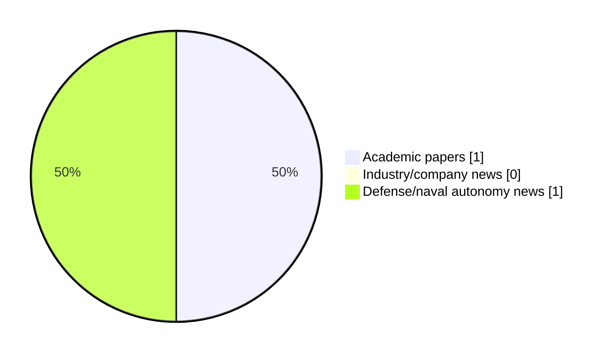

# Maritime Autonomy Watch — 2026-08-13

## Executive Summary

- Total selected items: 2
- Academic papers: 1
- Industry/company news: 0
- Defense/naval autonomy news: 1
- Failed/inaccessible sources: 0

## Contents

- [Analyst Brief](#analyst-brief)
- [Must Read](#must-read)
- [Top Signals Today](#top-signals-today)
- [Topic Signals](#topic-signals)
- [Freshness and Coverage](#freshness-and-coverage)
- [Quality Notes](#quality-notes)
- [Watchlist](#watchlist)
- [Academic Papers](#academic-papers)
- [Industry and Company News](#industry-and-company-news)
- [Defense and Naval Autonomy News](#defense-and-naval-autonomy-news)
- [Source Status Summary](#source-status-summary)

## Analyst Brief

Today's report selected 2 non-duplicate item(s), led by AUV navigation, defense adoption, USV operations. The strongest item is [Vatn Systems & NCSIST Partner to Advance Undersea AUV Autonomy for Taiwan’s Naval Defense](https://oceannews.com/news/defense/vatn-systems-ncsist-partner-to-advance-undersea-auv-autonomy-for-taiwans-naval-defense/) from oceannews.com.
Coverage is weighted toward academic research (1), with 0 industry and 1 defense signal(s).

## Must Read

- [Vatn Systems & NCSIST Partner to Advance Undersea AUV Autonomy for Taiwan’s Naval Defense](https://oceannews.com/news/defense/vatn-systems-ncsist-partner-to-advance-undersea-auv-autonomy-for-taiwans-naval-defense/) — Defense signal: AUV navigation
- [Task Composition Method for Behavior-Based Control of Uncrewed Surface Vehicles](https://doi.org/10.26748/ksoe.2026.030) — Research signal: USV operations

## Top Signals Today

- AUV navigation: 1 selected item(s).
- defense adoption: 1 selected item(s).
- USV operations: 1 selected item(s).
- swarm autonomy: 1 selected item(s).
- planning/control: 1 selected item(s).

## Topic Signals

- AUV navigation: 1
- defense adoption: 1
- USV operations: 1
- swarm autonomy: 1
- planning/control: 1

## Freshness and Coverage

- Newest selected item date: 2026-08-12
- Oldest selected item date: 2026-07-24
- Active/enabled sources: 5
- Sources with access problems: 2
- Quality flags: 0

## Quality Notes

- No quality flags on selected items.

## Watchlist

- No watchlist items today.

### Category Snapshot

| Category | Selected items |
|---|---:|
| Academic papers | 1 |
| Industry/company news | 0 |
| Defense/naval autonomy news | 1 |

## Academic Papers

_Selected items: 1_

### [Task Composition Method for Behavior-Based Control of Uncrewed Surface Vehicles](https://doi.org/10.26748/ksoe.2026.030)

- Source: OpenAlex
- Date: 2026-07-24
- Relevance score: 9.25
- Authors: Uijong Kim
- DOI: 10.26748/ksoe.2026.030
- Signal: Research signal: USV operations
- Topic tags: USV operations, swarm autonomy, planning/control

**Abstract**

As the autonomy of uncrewed systems advances, there is increasing demand for robust operation in complex environments. In the maritime domain, the dynamic and unstructured nature of the ocean poses significant challenges for uncrewed surface vehicles (USVs) to respond in real time using conventional optimization-based methods. This paper proposes a behavior-based control framework built from simple, modular behaviors. Each behavior is formulated as a real-valued objective function over a shared action space, and the behaviors are combined through task composition using lattice-algebraic operations-disjunction, conjunction, and negation. This approach yields a scalable arbitration scheme that integrates new behaviors by accounting for their logical interrelationships.

**Why it matters**

Relevant to surface-vessel operations, multi-vehicle coordination, navigation safety; the work may inform maritime autonomy research, testing priorities, or system design.

---

## Industry and Company News

_Selected items: 0_

No selected items.

## Defense and Naval Autonomy News

_Selected items: 1_

### [Vatn Systems & NCSIST Partner to Advance Undersea AUV Autonomy for Taiwan’s Naval Defense](https://oceannews.com/news/defense/vatn-systems-ncsist-partner-to-advance-undersea-auv-autonomy-for-taiwans-naval-defense/)

- Source: oceannews.com
- Date: 2026-08-12
- Relevance score: 9.25
- Signal: Defense signal: AUV navigation
- Topic tags: AUV navigation, defense adoption

**Summary**

Vatn Systems, a leading defense technology company building autonomous underwater vehicles (AUVs) and Taiwan's National Chung-Shan Institute of Science and Technology (NCSIST) have announced an agreement to explore joint naval defense projects on behalf of Taiwan's Ministry of National Defense. The agreement positions Vatn's technology to help modernize Taiwan's naval defenses and build sustainment capacity closer to home.

**Why it matters**

Signals movement in underwater autonomy, naval adoption; useful for tracking operational concepts, procurement direction, and fleet integration.

---

## Inaccessible or Failed Sources

- None

## Source Status Summary

| Source | Status | Notes |
|---|---|---|
| arXiv | enabled | API source, 15 items fetched |
| OpenAlex | enabled | API source, 15 items fetched |
| RSS feeds | enabled | 107 RSS items fetched |
| SMI MASG News | enabled | HTML source, 10 items fetched |
| IEEE Xplore | disabled | Missing IEEE_XPLORE_API_KEY |
| Elsevier Scopus | enabled | API source, 15 items fetched |
| NewsAPI | disabled | Missing NEWS_API_KEY |

## Metadata

- Generated at: 2026-08-13T09:21:08.279382+02:00
- Date: 2026-08-13
- Repository: ferhannb/MarineRobotics
- Relevance threshold: 4.0
- Deduplication method: DOI, canonical URL, source ID, normalized title, similar recent titles, category caps, and novelty score
