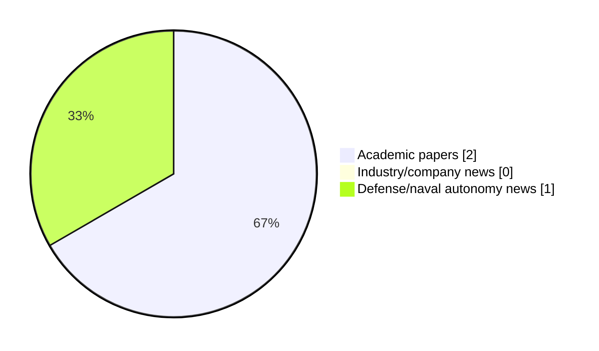

# Maritime Autonomy Watch — 2026-08-17

## Executive Summary

- Total selected items: 3
- Academic papers: 2
- Industry/company news: 0
- Defense/naval autonomy news: 1
- Failed/inaccessible sources: 0

## Contents

- [Analyst Brief](#analyst-brief)
- [Must Read](#must-read)
- [Top Signals Today](#top-signals-today)
- [Topic Signals](#topic-signals)
- [Freshness and Coverage](#freshness-and-coverage)
- [Quality Notes](#quality-notes)
- [Watchlist](#watchlist)
- [Academic Papers](#academic-papers)
- [Industry and Company News](#industry-and-company-news)
- [Defense and Naval Autonomy News](#defense-and-naval-autonomy-news)
- [Source Status Summary](#source-status-summary)

## Analyst Brief

Today's report selected 3 non-duplicate item(s), led by USV operations, swarm autonomy, perception. The strongest item is [MMUSV-Sim: A Perception-Oriented Simulation and Data-Generation Platform for Multi-USV Cooperative Perception](http://arxiv.org/abs/2608.14207v1) from arXiv.
Coverage is weighted toward academic research (2), with 0 industry and 1 defense signal(s).
Quality caveat: missing-summary=1, date-anomaly=1.

## Must Read

- [MMUSV-Sim: A Perception-Oriented Simulation and Data-Generation Platform for Multi-USV Cooperative Perception](http://arxiv.org/abs/2608.14207v1) — Research signal: USV operations
- [Saronic launches 52‑ft Mirage Autonomous Vessel](https://massworld.news/saronic-launches-52%e2%80%91ft-mirage-autonomous-vessel/) — Defense signal: USV operations

## Top Signals Today

- USV operations: 3 selected item(s).
- swarm autonomy: 2 selected item(s).
- perception: 1 selected item(s).

## Topic Signals

- USV operations: 3
- swarm autonomy: 2
- perception: 1

## Freshness and Coverage

- Newest selected item date: 2027-01-01
- Oldest selected item date: 2026-07-03
- Active/enabled sources: 5
- Sources with access problems: 2
- Quality flags: 2

## Quality Notes

- missing-summary: 1
- date-anomaly: 1
- Date anomalies: [Cooperative multi-USV coverage scheduling in obstacle-rich waters: A DRL-assisted adaptive evolutionary approach](https://api.elsevier.com/content/abstract/scopus_id/105044422334) reports 2027-01-01

## Watchlist

- [Cooperative multi-USV coverage scheduling in obstacle-rich waters: A DRL-assisted adaptive evolutionary approach](https://api.elsevier.com/content/abstract/scopus_id/105044422334) — missing-summary, date-anomaly

### Category Snapshot

| Category | Selected items |
|---|---:|
| Academic papers | 2 |
| Industry/company news | 0 |
| Defense/naval autonomy news | 1 |

## Academic Papers

_Selected items: 2_

### [MMUSV-Sim: A Perception-Oriented Simulation and Data-Generation Platform for Multi-USV Cooperative Perception](http://arxiv.org/abs/2608.14207v1)

- Source: arXiv
- Date: 2026-08-14
- Relevance score: 10
- Authors: Ziao Li, Jianxiong Ye, Biao Tang, Leping Zhang, Kun Zuo, Siyu Huang, Chenqiang Gao
- Signal: Research signal: USV operations
- Topic tags: USV operations, swarm autonomy, perception

**Abstract**

Cooperative perception among multiple unmanned surface vehicles (USVs) combines complementary observations to extend maritime target sensing beyond the view range and field of a single platform. Developing such systems at scale calls for a unified workflow for configurable multi-USV scenarios, multimodal acquisition, and shared annotations. We present MMUSV-Sim, a perception-oriented maritime simulation and data-generation platform built on Unreal Engine 5 and Project AirSim. It provides island, open-sea, and port environments; configurable weather, time of day, and wave conditions; a diverse vessel asset library; and spline-based multi-vessel motion. MMUSV-Sim acquires RGB, depth, semantic, LiDAR, and radar observations across multiple USVs and captures a common world state for per-agent annotation export.

**Why it matters**

Relevant to surface-vessel operations; the work may inform maritime autonomy research, testing priorities, or system design.

---

### [Cooperative multi-USV coverage scheduling in obstacle-rich waters: A DRL-assisted adaptive evolutionary approach](https://api.elsevier.com/content/abstract/scopus_id/105044422334)

- Source: Elsevier Scopus
- Date: 2027-01-01
- Relevance score: 4.5
- DOI: 10.1016/j.eswa.2026.133648
- Signal: Research signal: USV operations
- Topic tags: USV operations, swarm autonomy
- Quality flags: missing-summary, date-anomaly

**Abstract**

No summary available.

**Why it matters**

Relevant to surface-vessel operations; the work may inform maritime autonomy research, testing priorities, or system design.

---

## Industry and Company News

_Selected items: 0_

No selected items.

## Defense and Naval Autonomy News

_Selected items: 1_

### [Saronic launches 52‑ft Mirage Autonomous Vessel](https://massworld.news/saronic-launches-52%e2%80%91ft-mirage-autonomous-vessel/)

- Source: massworld.news
- Date: 2026-07-03
- Relevance score: 5.5
- Signal: Defense signal: USV operations
- Topic tags: USV operations

**Summary**

Saronic has launched its first Mirage, a 52‑ft dual‑use Autonomous Surface Vessel (ASV). Mirage joins the 24‑ft Corsair and 180‑ft Marauder as the third flagship platform in the company’s fleet..

**Why it matters**

Signals movement in surface-vessel operations; useful for tracking operational concepts, procurement direction, and fleet integration.

---

## Inaccessible or Failed Sources

- None

## Source Status Summary

| Source | Status | Notes |
|---|---|---|
| arXiv | enabled | API source, 15 items fetched |
| OpenAlex | enabled | API source, 15 items fetched |
| RSS feeds | enabled | 107 RSS items fetched |
| SMI MASG News | enabled | HTML source, 10 items fetched |
| IEEE Xplore | disabled | Missing IEEE_XPLORE_API_KEY |
| Elsevier Scopus | enabled | API source, 15 items fetched |
| NewsAPI | disabled | Missing NEWS_API_KEY |

## Metadata

- Generated at: 2026-08-17T08:46:59.484104+02:00
- Date: 2026-08-17
- Repository: ferhannb/MarineRobotics
- Relevance threshold: 4.0
- Deduplication method: DOI, canonical URL, source ID, normalized title, similar recent titles, category caps, and novelty score
