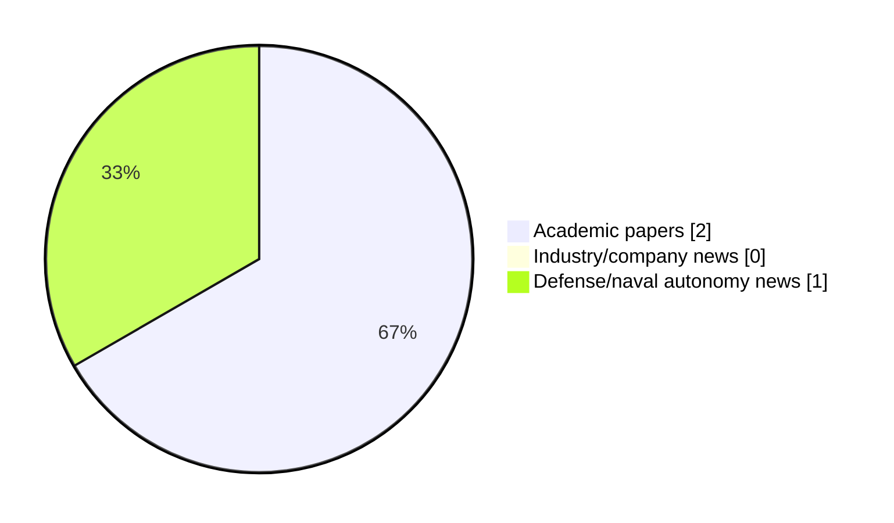

# Maritime Autonomy Watch — 2026-08-18

## Executive Summary

- Total selected items: 3
- Academic papers: 2
- Industry/company news: 0
- Defense/naval autonomy news: 1
- Failed/inaccessible sources: 0

## Contents

- [Analyst Brief](#analyst-brief)
- [Must Read](#must-read)
- [Top Signals Today](#top-signals-today)
- [Topic Signals](#topic-signals)
- [Freshness and Coverage](#freshness-and-coverage)
- [Quality Notes](#quality-notes)
- [Watchlist](#watchlist)
- [Academic Papers](#academic-papers)
- [Industry and Company News](#industry-and-company-news)
- [Defense and Naval Autonomy News](#defense-and-naval-autonomy-news)
- [Source Status Summary](#source-status-summary)

## Analyst Brief

Today's report selected 3 non-duplicate item(s), led by critical infrastructure, defense adoption, planning/control. The strongest item is [Subsea Robotics](https://doi.org/10.1201/9781003737476) from OpenAlex.
Coverage is weighted toward academic research (2), with 0 industry and 1 defense signal(s).
Quality caveat: low-score-unique=1.

## Must Read

- [Subsea Robotics](https://doi.org/10.1201/9781003737476) — Research signal: planning/control
- [U.S. Navy Looks to Carrier-Basing, Submarine Replenishment Missions for UUVs](https://www.navalnews.com/naval-news/2026/08/u-s-navy-looks-to-carrier-basing-submarine-replenishment-missions-for-uuvs/) — Defense signal: defense adoption
- [Multi-Objective Compliance-Integrated Coevolution For Simulated And Real-World Deployment Of Multi-Robot Marine Autonomy](https://openalex.org/W7172067804) — Research signal: critical infrastructure

## Top Signals Today

- critical infrastructure: 2 selected item(s).
- defense adoption: 2 selected item(s).
- planning/control: 1 selected item(s).
- regulation/legal: 1 selected item(s).

## Topic Signals

- critical infrastructure: 2
- defense adoption: 2
- planning/control: 1
- regulation/legal: 1

## Freshness and Coverage

- Newest selected item date: 2026-08-17
- Oldest selected item date: 2026-07-28
- Active/enabled sources: 5
- Sources with access problems: 2
- Quality flags: 1

## Quality Notes

- low-score-unique: 1

## Watchlist

- [Multi-Objective Compliance-Integrated Coevolution For Simulated And Real-World Deployment Of Multi-Robot Marine Autonomy](https://openalex.org/W7172067804) — low-score-unique

### Category Snapshot

| Category | Selected items |
|---|---:|
| Academic papers | 2 |
| Industry/company news | 0 |
| Defense/naval autonomy news | 1 |

## Academic Papers

_Selected items: 2_

### [Subsea Robotics](https://doi.org/10.1201/9781003737476)

- Source: OpenAlex
- Date: 2026-07-31
- Relevance score: 10
- Authors: Amit Ray
- DOI: 10.1201/9781003737476
- Signal: Research signal: planning/control
- Topic tags: planning/control, critical infrastructure, defense adoption

**Abstract**

Subsea Robotics addresses the complex challenges in underwater oceanographic data collection, submerged infrastructure inspection, and subsea defense missions. This book offers a comprehensive, system‑level perspective on subsea robotics by integrating engineering fundamentals with real‑world deployment practices. It covers design, propulsion, autonomy, navigation, communication, and operational standards. By combining core engineering principles with deployment realities, the book shows how subsea robots are designed and built to meet real‑world constraints.

**Why it matters**

Relevant to underwater autonomy, infrastructure monitoring, naval adoption; the work may inform maritime autonomy research, testing priorities, or system design.

---

### [Multi-Objective Compliance-Integrated Coevolution For Simulated And Real-World Deployment Of Multi-Robot Marine Autonomy](https://openalex.org/W7172067804)

- Source: OpenAlex
- Date: 2026-07-28
- Relevance score: 3
- Authors: Everardo Gonzalez, Tyler M. Paine, Manuel Agraz Vallejo, Gaurav Dixit, Michael R. Benjamin, Kagan Tumer
- Signal: Research signal: critical infrastructure
- Topic tags: critical infrastructure, regulation/legal
- Quality flags: low-score-unique

**Abstract**

Collaborative robots are well-suited to maritime missions that benefit from coordination, such as the exploration of unknown reef structures, inspection of subsea infrastructure, or search-and-rescue operations. These missions typically provide sparse feedback signals for measuring progress and require adherence to safety and regulatory norms, turning a mission into a multi-objective optimization problem. Coevolutionary algorithms can process these sparse feedback signals to generate coordinated behaviors, and in some cases extend behaviors to multiple objectives. However, incorporating high-level team objectives with low-level compliance considerations on the fly to balance norm adherence with team performance remains elusive. This paper introduces a multi-objective framework that blends coevolved behaviors with compliance behaviors to achieve a balance between maximizing team progress and minimizing norm violations.

**Why it matters**

Relevant to navigation safety, infrastructure monitoring; the work may inform maritime autonomy research, testing priorities, or system design.

---

## Industry and Company News

_Selected items: 0_

No selected items.

## Defense and Naval Autonomy News

_Selected items: 1_

### [U.S. Navy Looks to Carrier-Basing, Submarine Replenishment Missions for UUVs](https://www.navalnews.com/naval-news/2026/08/u-s-navy-looks-to-carrier-basing-submarine-replenishment-missions-for-uuvs/)

- Source: navalnews.com
- Date: 2026-08-17
- Relevance score: 5.75
- Signal: Defense signal: defense adoption
- Topic tags: defense adoption

**Summary**

The U.S. Navy's Pacific Fleet is testing new UUV roles, including carrier-basing and undersea resupply, to boost stealth in contested waters.

**Why it matters**

Signals movement in naval adoption; useful for tracking operational concepts, procurement direction, and fleet integration.

---

## Inaccessible or Failed Sources

- None

## Source Status Summary

| Source | Status | Notes |
|---|---|---|
| arXiv | enabled | API source, 15 items fetched |
| OpenAlex | enabled | API source, 15 items fetched |
| RSS feeds | enabled | 107 RSS items fetched |
| SMI MASG News | enabled | HTML source, 10 items fetched |
| IEEE Xplore | disabled | Missing IEEE_XPLORE_API_KEY |
| Elsevier Scopus | enabled | API source, 15 items fetched |
| NewsAPI | disabled | Missing NEWS_API_KEY |

## Metadata

- Generated at: 2026-08-18T08:36:48.117267+02:00
- Date: 2026-08-18
- Repository: ferhannb/MarineRobotics
- Relevance threshold: 4.0
- Deduplication method: DOI, canonical URL, source ID, normalized title, similar recent titles, category caps, and novelty score
