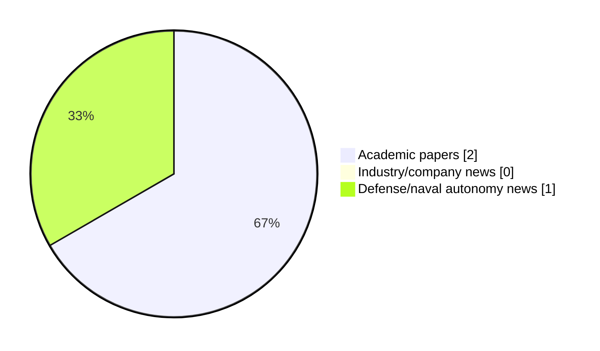

# Maritime Autonomy Watch — 2026-08-19

## Executive Summary

- Total selected items: 3
- Academic papers: 2
- Industry/company news: 0
- Defense/naval autonomy news: 1
- Failed/inaccessible sources: 1

## Contents

- [Analyst Brief](#analyst-brief)
- [Must Read](#must-read)
- [Top Signals Today](#top-signals-today)
- [Topic Signals](#topic-signals)
- [Freshness and Coverage](#freshness-and-coverage)
- [Quality Notes](#quality-notes)
- [Watchlist](#watchlist)
- [Academic Papers](#academic-papers)
- [Industry and Company News](#industry-and-company-news)
- [Defense and Naval Autonomy News](#defense-and-naval-autonomy-news)
- [Source Status Summary](#source-status-summary)

## Analyst Brief

Today's report selected 3 non-duplicate item(s), led by USV operations, planning/control, defense adoption. The strongest item is [Data-driven fuzzy distributed reinforcement learning optimal resilient control for multi-USV systems under DoS attacks](https://api.elsevier.com/content/abstract/scopus_id/105047024186) from Elsevier Scopus.
Coverage is weighted toward academic research (2), with 0 industry and 1 defense signal(s).
Quality caveat: missing-summary=2, date-anomaly=2, low-score-unique=1.

## Must Read

- [Blue Ops and Havoc Partner to Develop Open-Architecture Autonomous Maritime Defense Systems](https://www.navalnews.com/naval-news/2026/08/blue-ops-and-havoc-partner-to-develop-open-architecture-autonomous-maritime-defense-systems/) — Defense signal: defense adoption

## Top Signals Today

- USV operations: 2 selected item(s).
- planning/control: 2 selected item(s).
- defense adoption: 1 selected item(s).
- swarm autonomy: 1 selected item(s).

## Topic Signals

- USV operations: 2
- planning/control: 2
- defense adoption: 1
- swarm autonomy: 1

## Freshness and Coverage

- Newest selected item date: 2027-01-05
- Oldest selected item date: 2026-08-18
- Active/enabled sources: 4
- Sources with access problems: 3
- Quality flags: 5

## Quality Notes

- missing-summary: 2
- date-anomaly: 2
- low-score-unique: 1
- Date anomalies: [Data-driven fuzzy distributed reinforcement learning optimal resilient control for multi-USV systems under DoS attacks](https://api.elsevier.com/content/abstract/scopus_id/105047024186) reports 2027-01-05; [Prescribed-Time Formation Control for Multiple USVs Based on Adaptive Neural Networks](https://api.elsevier.com/content/abstract/scopus_id/105046192900) reports 2027-01-01

## Watchlist

- [Blue Ops and Havoc Partner to Develop Open-Architecture Autonomous Maritime Defense Systems](https://www.navalnews.com/naval-news/2026/08/blue-ops-and-havoc-partner-to-develop-open-architecture-autonomous-maritime-defense-systems/) — low-score-unique
- [Data-driven fuzzy distributed reinforcement learning optimal resilient control for multi-USV systems under DoS attacks](https://api.elsevier.com/content/abstract/scopus_id/105047024186) — missing-summary, date-anomaly
- [Prescribed-Time Formation Control for Multiple USVs Based on Adaptive Neural Networks](https://api.elsevier.com/content/abstract/scopus_id/105046192900) — missing-summary, date-anomaly

### Category Snapshot

| Category | Selected items |
|---|---:|
| Academic papers | 2 |
| Industry/company news | 0 |
| Defense/naval autonomy news | 1 |

## Academic Papers

_Selected items: 2_

### [Data-driven fuzzy distributed reinforcement learning optimal resilient control for multi-USV systems under DoS attacks](https://api.elsevier.com/content/abstract/scopus_id/105047024186)

- Source: Elsevier Scopus
- Date: 2027-01-05
- Relevance score: 4.5
- DOI: 10.1016/j.ins.2026.123998
- Signal: Research signal: USV operations
- Topic tags: USV operations, planning/control
- Quality flags: missing-summary, date-anomaly

**Abstract**

No summary available.

**Why it matters**

Relevant to surface-vessel operations; the work may inform maritime autonomy research, testing priorities, or system design.

---

### [Prescribed-Time Formation Control for Multiple USVs Based on Adaptive Neural Networks](https://api.elsevier.com/content/abstract/scopus_id/105046192900)

- Source: Elsevier Scopus
- Date: 2027-01-01
- Relevance score: 4.5
- DOI: 10.1007/978-981-92-3563-6_7
- Signal: Research signal: USV operations
- Topic tags: USV operations, swarm autonomy, planning/control
- Quality flags: missing-summary, date-anomaly

**Abstract**

No summary available.

**Why it matters**

Relevant to surface-vessel operations, multi-vehicle coordination; the work may inform maritime autonomy research, testing priorities, or system design.

---

## Industry and Company News

_Selected items: 0_

No selected items.

## Defense and Naval Autonomy News

_Selected items: 1_

### [Blue Ops and Havoc Partner to Develop Open-Architecture Autonomous Maritime Defense Systems](https://www.navalnews.com/naval-news/2026/08/blue-ops-and-havoc-partner-to-develop-open-architecture-autonomous-maritime-defense-systems/)

- Source: navalnews.com
- Date: 2026-08-18
- Relevance score: 3
- Signal: Defense signal: defense adoption
- Topic tags: defense adoption
- Quality flags: low-score-unique

**Summary**

Red Cat Holdings, Inc., a U.S.-based provider of advanced all-domain drone and robotic solutions for defense and national security, and Havoc, a leader in all-domain collaborative autonomy, announced a partnership, formalized through Red Cat’s maritime division, Blue Ops. Red Cat press release Under the partnership, Blue Ops and Havoc plan to integrate Havoc’s collaborative autonomy software.

**Why it matters**

Signals movement in naval adoption; useful for tracking operational concepts, procurement direction, and fleet integration.

---

## Inaccessible or Failed Sources

- OpenAlex: HTTP 429 for https://api.openalex.org/works?search=maritime+autonomy+marine+robotics+autonomous+vessel+autonomous+mission+autonomous+surface+vessel&per-page=15&sort=publication_date%3Adesc

## Source Status Summary

| Source | Status | Notes |
|---|---|---|
| arXiv | enabled | API source, 15 items fetched |
| OpenAlex | failed | HTTP 429 for https://api.openalex.org/works?search=maritime+autonomy+marine+robotics+autonomous+vessel+autonomous+mission+autonomous+surface+vessel&per-page=15&sort=publication_date%3Adesc |
| RSS feeds | enabled | 107 RSS items fetched |
| SMI MASG News | enabled | HTML source, 10 items fetched |
| IEEE Xplore | disabled | Missing IEEE_XPLORE_API_KEY |
| Elsevier Scopus | enabled | API source, 15 items fetched |
| NewsAPI | disabled | Missing NEWS_API_KEY |

## Metadata

- Generated at: 2026-08-19T08:37:34.432199+02:00
- Date: 2026-08-19
- Repository: ferhannb/MarineRobotics
- Relevance threshold: 4.0
- Deduplication method: DOI, canonical URL, source ID, normalized title, similar recent titles, category caps, and novelty score
