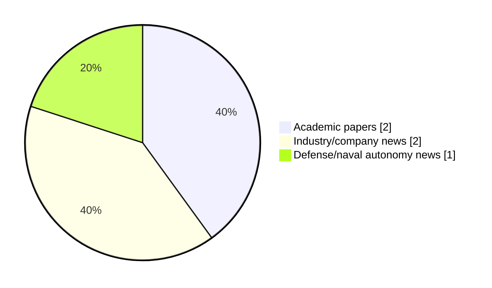

# Maritime Autonomy Watch — 2026-08-20

## Executive Summary

- Total selected items: 5
- Academic papers: 2
- Industry/company news: 2
- Defense/naval autonomy news: 1
- Failed/inaccessible sources: 0

## Contents

- [Analyst Brief](#analyst-brief)
- [Must Read](#must-read)
- [Top Signals Today](#top-signals-today)
- [Topic Signals](#topic-signals)
- [Freshness and Coverage](#freshness-and-coverage)
- [Quality Notes](#quality-notes)
- [Watchlist](#watchlist)
- [Academic Papers](#academic-papers)
- [Industry and Company News](#industry-and-company-news)
- [Defense and Naval Autonomy News](#defense-and-naval-autonomy-news)
- [Source Status Summary](#source-status-summary)

## Analyst Brief

Today's report selected 5 non-duplicate item(s), led by AUV navigation, defense adoption, USV operations. The strongest item is [Dynamic SpectraFormer for Ultra-High-Definition Underwater Image Enhancement](http://arxiv.org/abs/2608.18662v1) from arXiv.
Coverage is weighted toward academic research (2), with 2 industry and 1 defense signal(s).
Quality caveat: low-score-unique=3.

## Must Read

- [Dynamic SpectraFormer for Ultra-High-Definition Underwater Image Enhancement](http://arxiv.org/abs/2608.18662v1) — Research signal: AUV navigation
- [Bedrock Ocean Certifies First AUV Operators at First Marine Solutions Aberdeen Hub](https://oceannews.com/news/subsea-and-survey/bedrock-ocean-certifies-first-auv-operators-at-first-marine-solutions-aberdeen-hub/) — Industry signal: AUV navigation
- [Disturbance-observer-based adaptive neuro-fuzzy sliding mode control for collaborative ASV and URV systems](https://doi.org/10.1007/s44465-026-00032-1) — Research signal: USV operations
- [Pro-Oceanus Solu-Blu CO₂ Exchange Targets AUV and Drifter Integration](https://oceannews.com/news/science-technology/pro-oceanus-solu-blu-co%E2%82%82-exchange-targets-auv-and-drifter-integration/) — Industry signal: AUV navigation
- [Babcock Signs Three MOUs with Danish Firms to Advance Hybrid Naval Capabilities](https://oceannews.com/news/defense/babcock-signs-three-mous-with-danish-firms-to-advance-hybrid-naval-capabilities/) — Defense signal: defense adoption

## Top Signals Today

- AUV navigation: 3 selected item(s).
- defense adoption: 1 selected item(s).
- USV operations: 1 selected item(s).
- planning/control: 1 selected item(s).
- regulation/legal: 1 selected item(s).

## Topic Signals

- AUV navigation: 3
- defense adoption: 1
- USV operations: 1
- planning/control: 1
- regulation/legal: 1

## Freshness and Coverage

- Newest selected item date: 2026-08-19
- Oldest selected item date: 2026-08-03
- Active/enabled sources: 5
- Sources with access problems: 2
- Quality flags: 3

## Quality Notes

- low-score-unique: 3

## Watchlist

- [Pro-Oceanus Solu-Blu CO₂ Exchange Targets AUV and Drifter Integration](https://oceannews.com/news/science-technology/pro-oceanus-solu-blu-co%E2%82%82-exchange-targets-auv-and-drifter-integration/) — low-score-unique
- [Babcock Signs Three MOUs with Danish Firms to Advance Hybrid Naval Capabilities](https://oceannews.com/news/defense/babcock-signs-three-mous-with-danish-firms-to-advance-hybrid-naval-capabilities/) — low-score-unique
- [Disturbance-observer-based adaptive neuro-fuzzy sliding mode control for collaborative ASV and URV systems](https://doi.org/10.1007/s44465-026-00032-1) — low-score-unique

### Category Snapshot

| Category | Selected items |
|---|---:|
| Academic papers | 2 |
| Industry/company news | 2 |
| Defense/naval autonomy news | 1 |

## Academic Papers

_Selected items: 2_

### [Dynamic SpectraFormer for Ultra-High-Definition Underwater Image Enhancement](http://arxiv.org/abs/2608.18662v1)

- Source: arXiv
- Date: 2026-08-19
- Relevance score: 8.5
- Authors: Zhiqiang Hu, Tao Yu, Shouren Huang, Masatoshi Ishikawa
- Signal: Research signal: AUV navigation
- Topic tags: AUV navigation

**Abstract**

Underwater images suffer from color distortion, haze, and poor visibility due to light refraction and absorption in water. These challenges significantly impact the utilization of Autonomous Underwater Vehicles (AUVs) or marine robots. Typically, color and brightness distortions manifest at lower frequencies, while edge and texture distortions are prevalent at higher frequencies. Traditional methods struggle to concurrently rectify these mixed distortions as they primarily concentrate on the spatial domain. To address these issues, we introduce the Dynamic SpectraFormer, which enhances underwater images through a frequency domain transformer. The Dynamic SpectraFormer introduces an ultra-high-resolution sparse spectrum attention module, which could capture the long-term dependency without losing the universal approximating power.

**Why it matters**

Relevant to underwater autonomy; the work may inform maritime autonomy research, testing priorities, or system design.

---

### [Disturbance-observer-based adaptive neuro-fuzzy sliding mode control for collaborative ASV and URV systems](https://doi.org/10.1007/s44465-026-00032-1)

- Source: OpenAlex
- Date: 2026-08-03
- Relevance score: 3.75
- Authors: Mustafa Wassef Hasan, Nizar Hadi Abbas
- DOI: 10.1007/s44465-026-00032-1
- Signal: Research signal: USV operations
- Topic tags: USV operations, planning/control, regulation/legal
- Quality flags: low-score-unique

**Abstract**

This paper proposes a disturbance-observer-based adaptive neuro-fuzzy sliding mode control (DO-ANFSMC) framework for collaborative autonomous surface vehicle (ASV) and underwater robotic vehicle (URV) systems operating in search-and-rescue missions under environmental disturbances and obstacle-avoidance constraints. The proposed framework integrates an adaptive neuro-fuzzy system for approximating unknown nonlinear dynamics, a nonlinear disturbance observer for estimating lumped environmental disturbances and residual uncertainties, and a robust sliding-mode control law for trajectory tracking. The controller parameters are adaptively tuned online using an improved grey wolf optimizer with chaotic theory (IGWO-CT), whose optimization performance is first evaluated using standard benchmark functions. MATLAB simulations are conducted for one ASV and two URVs under identical mission conditions with eight static obstacles.

**Why it matters**

Relevant to underwater autonomy, planning and control; the work may inform maritime autonomy research, testing priorities, or system design.

---

## Industry and Company News

_Selected items: 2_

### [Bedrock Ocean Certifies First AUV Operators at First Marine Solutions Aberdeen Hub](https://oceannews.com/news/subsea-and-survey/bedrock-ocean-certifies-first-auv-operators-at-first-marine-solutions-aberdeen-hub/)

- Source: oceannews.com
- Date: 2026-08-19
- Relevance score: 5
- Signal: Industry signal: AUV navigation
- Topic tags: AUV navigation

**Summary**

Earlier this month, Bedrock announced a multi-year strategic partnership with First Marine Solutions (FMS), establishing a UK and European operational hub for Bedrock's autonomous ocean intelligence at FMS's headquarters in Aberdeen, Scotland. At the core of the partnership is an operating model that allows Bedrock partners to run its systems locally. That vision has officially been realized.

**Why it matters**

Signals momentum in underwater autonomy; useful for tracking product direction, partnerships, and deployment opportunities.

---

### [Pro-Oceanus Solu-Blu CO₂ Exchange Targets AUV and Drifter Integration](https://oceannews.com/news/science-technology/pro-oceanus-solu-blu-co%E2%82%82-exchange-targets-auv-and-drifter-integration/)

- Source: oceannews.com
- Date: 2026-08-19
- Relevance score: 3.5
- Signal: Industry signal: AUV navigation
- Topic tags: AUV navigation
- Quality flags: low-score-unique

**Summary**

Pro-Oceanus has introduced the Solu-Blu CO₂ Exchange, a compact and rugged CO2 sensor designed for monitoring air-water CO2 dynamics across freshwater, coastal, and mobile applications.

**Why it matters**

Signals momentum in underwater autonomy, infrastructure monitoring; useful for tracking product direction, partnerships, and deployment opportunities.

---

## Defense and Naval Autonomy News

_Selected items: 1_

### [Babcock Signs Three MOUs with Danish Firms to Advance Hybrid Naval Capabilities](https://oceannews.com/news/defense/babcock-signs-three-mous-with-danish-firms-to-advance-hybrid-naval-capabilities/)

- Source: oceannews.com
- Date: 2026-08-19
- Relevance score: 3.5
- Signal: Defense signal: defense adoption
- Topic tags: defense adoption
- Quality flags: low-score-unique

**Summary**

Babcock has signed Memoranda of Understanding (MOU) with Danish technology companies STORMBORN and CUBEDIN to examine future hybrid naval capabilities and autonomous systems integration—supporting its vision for a hybrid Danish fleet where crewed ships and unmanned systems operate together.

**Why it matters**

Signals movement in naval adoption; useful for tracking operational concepts, procurement direction, and fleet integration.

---

## Inaccessible or Failed Sources

- None

## Source Status Summary

| Source | Status | Notes |
|---|---|---|
| arXiv | enabled | API source, 15 items fetched |
| OpenAlex | enabled | API source, 15 items fetched |
| RSS feeds | enabled | 107 RSS items fetched |
| SMI MASG News | enabled | HTML source, 10 items fetched |
| IEEE Xplore | disabled | Missing IEEE_XPLORE_API_KEY |
| Elsevier Scopus | enabled | API source, 15 items fetched |
| NewsAPI | disabled | Missing NEWS_API_KEY |

## Metadata

- Generated at: 2026-08-20T08:39:04.325905+02:00
- Date: 2026-08-20
- Repository: ferhannb/MarineRobotics
- Relevance threshold: 4.0
- Deduplication method: DOI, canonical URL, source ID, normalized title, similar recent titles, category caps, and novelty score
