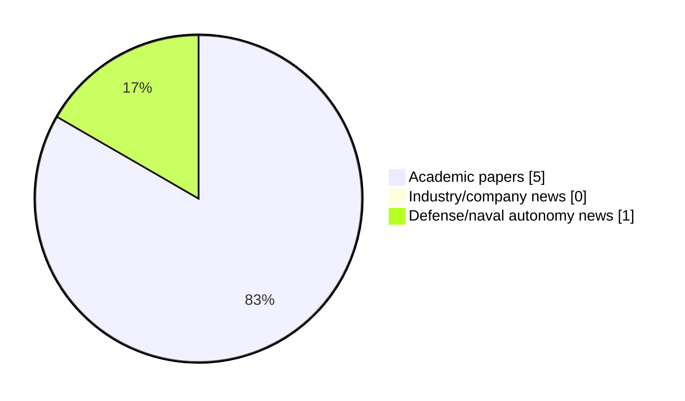

# Maritime Autonomy Watch — 2026-08-21

## Executive Summary

- Total selected items: 6
- Academic papers: 5
- Industry/company news: 0
- Defense/naval autonomy news: 1
- Failed/inaccessible sources: 0

## Contents

- [Analyst Brief](#analyst-brief)
- [Must Read](#must-read)
- [Top Signals Today](#top-signals-today)
- [Topic Signals](#topic-signals)
- [Freshness and Coverage](#freshness-and-coverage)
- [Quality Notes](#quality-notes)
- [Watchlist](#watchlist)
- [Academic Papers](#academic-papers)
- [Industry and Company News](#industry-and-company-news)
- [Defense and Naval Autonomy News](#defense-and-naval-autonomy-news)
- [Source Status Summary](#source-status-summary)

## Analyst Brief

Today's report selected 6 non-duplicate item(s), led by planning/control, critical infrastructure, USV operations. The strongest item is [A Vision-based Control Framework for Real-time Autonomous UUV Operations](http://arxiv.org/abs/2608.04723v1) from arXiv.
Coverage is weighted toward academic research (5), with 0 industry and 1 defense signal(s).
Quality caveat: low-score-unique=1.

## Must Read

- [A Vision-based Control Framework for Real-time Autonomous UUV Operations](http://arxiv.org/abs/2608.04723v1) — Research signal: perception
- [World-Model-Grounded LLM Planning for AUV and ASV Navigation Near Offshore Wind Farms](http://arxiv.org/abs/2608.19661v1) — Research signal: AUV navigation
- [Remote Awareness of Seafloor Images Collected by AUVs over Low-Bandwidth Communication Links](http://arxiv.org/abs/2607.18013v1) — Research signal: AUV navigation
- [LLM-Assisted Mission Planning, Predictive Coordination, and Adaptive Topology Management for Resilient USV Swarm Control Under Communication Denial](https://doi.org/10.3390/drones10080594) — Research signal: USV operations
- [US Navy, Saildrone to use unmanned systems in expanded counternarcotics role](https://www.defensenews.com/industry/techwatch/2026/08/05/us-navy-saildrone-to-use-unmanned-systems-in-expanded-counternarcotics-role/) — Defense signal: USV operations

## Top Signals Today

- planning/control: 3 selected item(s).
- critical infrastructure: 3 selected item(s).
- USV operations: 3 selected item(s).
- swarm autonomy: 3 selected item(s).
- AUV navigation: 2 selected item(s).

## Topic Signals

- planning/control: 3
- critical infrastructure: 3
- USV operations: 3
- swarm autonomy: 3
- AUV navigation: 2
- perception: 1
- underwater communications: 1
- defense adoption: 1

## Freshness and Coverage

- Newest selected item date: 2026-08-20
- Oldest selected item date: 2026-07-20
- Active/enabled sources: 5
- Sources with access problems: 2
- Quality flags: 1

## Quality Notes

- low-score-unique: 1

## Watchlist

- [Human 5.0 in Maritime](https://doi.org/10.5152/jbass.2026.25045) — low-score-unique

### Category Snapshot

| Category | Selected items |
|---|---:|
| Academic papers | 5 |
| Industry/company news | 0 |
| Defense/naval autonomy news | 1 |

## Academic Papers

_Selected items: 5_

### [A Vision-based Control Framework for Real-time Autonomous UUV Operations](http://arxiv.org/abs/2608.04723v1)

- Source: arXiv
- Date: 2026-08-05
- Relevance score: 10
- Authors: Erik Tjærand Frøland, Marco Job, Md Ether Deowan, Eleni Kelasidi
- Signal: Research signal: perception
- Topic tags: perception, planning/control, critical infrastructure

**Abstract**

This paper presents a fully integrated vision-based framework for real-time and robust localization, autonomous navigation, and mapping for unmanned underwater vehicles (UUVs) in dynamic, visually challenging environments. The proposed pipeline enables both net-relative and global localization while generating continuous 3D maps of the surroundings in real-time. The framework was validated on synthetic datasets with ground truth and tested onboard an UUV during autonomous net-relative navigation experiments. Results demonstrate real-time performance and enhanced robustness, supporting vision-driven autonomous navigation and enabling the field deployment of marine robots for critical inspection and mapping tasks in complex underwater environments.

**Why it matters**

Relevant to underwater autonomy, infrastructure monitoring; the work may inform maritime autonomy research, testing priorities, or system design.

---

### [World-Model-Grounded LLM Planning for AUV and ASV Navigation Near Offshore Wind Farms](http://arxiv.org/abs/2608.19661v1)

- Source: arXiv
- Date: 2026-08-20
- Relevance score: 8.5
- Authors: Markus Buchholz, Ignacio Carlucho, Yvan R. Petillot
- Signal: Research signal: AUV navigation
- Topic tags: AUV navigation, USV operations, planning/control, critical infrastructure

**Abstract**

Large language models can turn a natural-language mission into a sequence of robot actions, but they do not have a sense of physics: they cannot judge how long a command should run, or whether it will make the robot drift into an obstacle. We proposed the use of a world model to expand the capabilities of Large Language model-based planners. Our method has three components: a physics-grounded neural world model, a three-phase gradient-based trajectory optimizer, and a Model Predictive Controller (MPC)-style closed-loop replanner with a trust-region guard. The language model decides what to do, and the world model decides how long, whether that means driving eight thrusters through 6 DOF or two differential thrusters through 3 DOF. We evaluate two marine vehicle classes operating near offshore wind infrastructure: a 6-DOF Autonomous Underwater Vehicle (AUV) and a 3-DOF differential-drive Autonomous Surface Vehicle (ASV).

**Why it matters**

Relevant to underwater autonomy, navigation safety, planning and control; the work may inform maritime autonomy research, testing priorities, or system design.

---

### [Remote Awareness of Seafloor Images Collected by AUVs over Low-Bandwidth Communication Links](http://arxiv.org/abs/2607.18013v1)

- Source: arXiv
- Date: 2026-07-20
- Relevance score: 8.5
- Authors: Adrian Bodenmann, Cailei Liang, Miquel Massot-Campos, Samuel Simmons, Alexander B. Phillips, Alberto Consensi, Matthew Kingsland, Rashiid Sherif, Stan Brown, Adam Riese, Blair Thornton
- Signal: Research signal: AUV navigation
- Topic tags: AUV navigation, underwater communications, swarm autonomy

**Abstract**

This paper introduces a method for real-time processing and transmission of autonomous underwater vehicle (AUV) imagery over low-bandwidth communication links. It leverages artificial intelligence (AI) techniques to identify a set of images that best represent an entire dataset, or automatically finds the most similar images to a given query image for transmission to operators. Combined with metadata of a larger set of images, compressed versions of the selected images can be transmitted over satellite communication links or underwater modems, and provide operators on shore with information about the type of imagery the AUV is collecting while it is still deployed. Data from three deployments off the coast of the UK and in Gran Canaria using different AUVs and imaging systems demonstrate the method in the field.

**Why it matters**

Relevant to underwater autonomy, multi-vehicle coordination; the work may inform maritime autonomy research, testing priorities, or system design.

---

### [LLM-Assisted Mission Planning, Predictive Coordination, and Adaptive Topology Management for Resilient USV Swarm Control Under Communication Denial](https://doi.org/10.3390/drones10080594)

- Source: OpenAlex
- Date: 2026-08-02
- Relevance score: 8
- Authors: Xingda Li, Jianqiang Zhang, Yiping Liu, Pengfei Zhang, Ling Tan
- DOI: 10.3390/drones10080594
- Signal: Research signal: USV operations
- Topic tags: USV operations, swarm autonomy, planning/control

**Abstract**

Unmanned surface vehicle (USV) swarms operating in communication-denied maritime environments face degraded formation control when inter-agent state exchange is disrupted. This paper presents a three-layer control architecture integrating (1) LLM-assisted strategic mission planning with formal safety verification, (2) predictive tactical coordination combining physics-based motion extrapolation with online-learned neighbor behavior models, and (3) DMPC + ADMM execution for constrained formation control. The predictive coordination module in simulation-based evaluation across five representative scenarios reduces formation error by 76.0% (under simulation conditions) during 60 s communication outages compared to zero-hold prediction (Cohen d = 0.88, p < 0.001, DMPC + ADMM validated).

**Why it matters**

Relevant to surface-vessel operations, multi-vehicle coordination; the work may inform maritime autonomy research, testing priorities, or system design.

---

### [Human 5.0 in Maritime](https://doi.org/10.5152/jbass.2026.25045)

- Source: OpenAlex
- Date: 2026-08-03
- Relevance score: 3
- Authors: Gülsüm Koraltürk, Güzide Öncü Eroğlu Pektaş
- DOI: 10.5152/jbass.2026.25045
- Signal: Research signal: swarm autonomy
- Topic tags: swarm autonomy, critical infrastructure
- Quality flags: low-score-unique

**Abstract**

Human 5.0 is an approach that positions the human being as a decision-maker, a creative actor, and an individual with high ethical responsibility in a society where artificial intelligence, big data, robotics, autonomous systems, and digital infrastructure are fully integrated. This approach considers the individual from a perspective that prioritizes social and empathetic qualities, societal benefit, and sensitivity to sustainability principles. In the maritime domain, the concept of Human 5.0 can be defined through new-generation maritime operators and deck officers within the processes of maritime business management and ship operations. In other words, it refers to employee profiles operating across all work domains encompassing ship–port–logistics processes within the maritime industry.

**Why it matters**

Relevant to multi-vehicle coordination; the work may inform maritime autonomy research, testing priorities, or system design.

---

## Industry and Company News

_Selected items: 0_

No selected items.

## Defense and Naval Autonomy News

_Selected items: 1_

### [US Navy, Saildrone to use unmanned systems in expanded counternarcotics role](https://www.defensenews.com/industry/techwatch/2026/08/05/us-navy-saildrone-to-use-unmanned-systems-in-expanded-counternarcotics-role/)

- Source: defensenews.com
- Date: 2026-08-05
- Relevance score: 4.75
- Signal: Defense signal: USV operations
- Topic tags: USV operations, defense adoption

**Summary**

The U.S. Navy is extending its use of Saildrone unmanned surface vehicles for an expanded counternarcotics mission.

**Why it matters**

Signals movement in surface-vessel operations, naval adoption; useful for tracking operational concepts, procurement direction, and fleet integration.

---

## Inaccessible or Failed Sources

- None

## Source Status Summary

| Source | Status | Notes |
|---|---|---|
| arXiv | enabled | API source, 15 items fetched |
| OpenAlex | enabled | API source, 15 items fetched |
| RSS feeds | enabled | 107 RSS items fetched |
| SMI MASG News | enabled | HTML source, 10 items fetched |
| IEEE Xplore | disabled | Missing IEEE_XPLORE_API_KEY |
| Elsevier Scopus | enabled | API source, 15 items fetched |
| NewsAPI | disabled | Missing NEWS_API_KEY |

## Metadata

- Generated at: 2026-08-21T08:39:30.778641+02:00
- Date: 2026-08-21
- Repository: ferhannb/MarineRobotics
- Relevance threshold: 4.0
- Deduplication method: DOI, canonical URL, source ID, normalized title, similar recent titles, category caps, and novelty score
