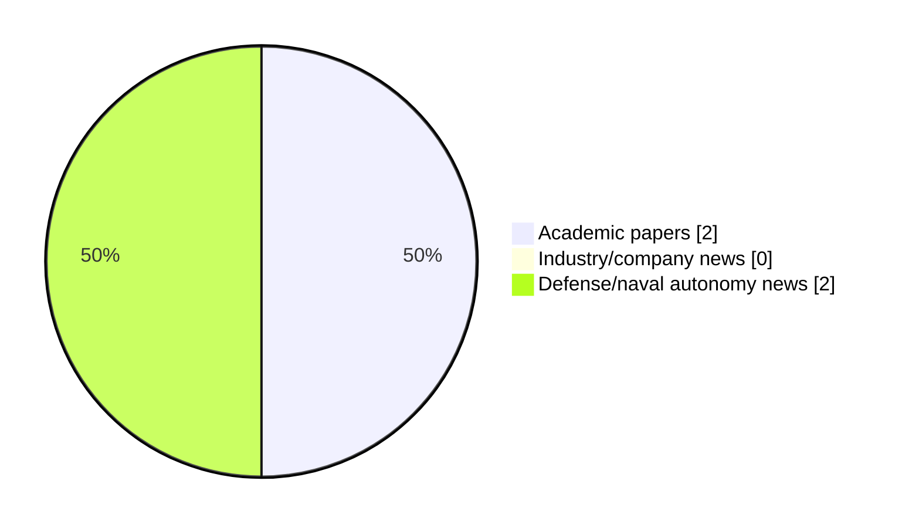

# Maritime Autonomy Watch — 2026-08-22

## Executive Summary

- Total selected items: 4
- Academic papers: 2
- Industry/company news: 0
- Defense/naval autonomy news: 2
- Failed/inaccessible sources: 0

## Contents

- [Analyst Brief](#analyst-brief)
- [Must Read](#must-read)
- [Top Signals Today](#top-signals-today)
- [Topic Signals](#topic-signals)
- [Freshness and Coverage](#freshness-and-coverage)
- [Quality Notes](#quality-notes)
- [Watchlist](#watchlist)
- [Academic Papers](#academic-papers)
- [Industry and Company News](#industry-and-company-news)
- [Defense and Naval Autonomy News](#defense-and-naval-autonomy-news)
- [Source Status Summary](#source-status-summary)

## Analyst Brief

Today's report selected 4 non-duplicate item(s), led by planning/control, critical infrastructure, USV operations. The strongest item is [Unified Planning-Learning Framework for Robust UUV Navigation Under Partial Observability](http://arxiv.org/abs/2608.05365v1) from arXiv.
Coverage is weighted toward academic research (2), with 0 industry and 2 defense signal(s).

## Must Read

- [Unified Planning-Learning Framework for Robust UUV Navigation Under Partial Observability](http://arxiv.org/abs/2608.05365v1) — Research signal: perception
- [Optimal Placement of Docking Stations and Resident AUVs for Subsea Pipeline Inspection](http://arxiv.org/abs/2607.19944v1) — Research signal: AUV navigation
- [Türkiye’s MARLIN USV Demonstrates Mine-Laying Capability With MALAMAN](https://www.navalnews.com/naval-news/2026/08/turkiyes-marlin-usv-demonstrates-mine-laying-capability-with-malaman/) — Defense signal: USV operations
- [GEOxyz Integrates dotOcean to Expand Autonomous USV & Defense Capabilities](https://oceannews.com/news/milestones/geoxyz-integrates-dotocean-to-expand-autonomous-usv-defense-capabilities/) — Defense signal: USV operations

## Top Signals Today

- planning/control: 3 selected item(s).
- critical infrastructure: 2 selected item(s).
- USV operations: 2 selected item(s).
- defense adoption: 2 selected item(s).
- perception: 1 selected item(s).

## Topic Signals

- planning/control: 3
- critical infrastructure: 2
- USV operations: 2
- defense adoption: 2
- perception: 1
- swarm autonomy: 1
- AUV navigation: 1

## Freshness and Coverage

- Newest selected item date: 2026-08-21
- Oldest selected item date: 2026-07-22
- Active/enabled sources: 5
- Sources with access problems: 2
- Quality flags: 0

## Quality Notes

- No quality flags on selected items.

## Watchlist

- No watchlist items today.

### Category Snapshot

| Category | Selected items |
|---|---:|
| Academic papers | 2 |
| Industry/company news | 0 |
| Defense/naval autonomy news | 2 |

## Academic Papers

_Selected items: 2_

### [Unified Planning-Learning Framework for Robust UUV Navigation Under Partial Observability](http://arxiv.org/abs/2608.05365v1)

- Source: arXiv
- Date: 2026-08-05
- Relevance score: 9.25
- Authors: Md Ether Deowan, Eleni Kelasidi
- Signal: Research signal: perception
- Topic tags: perception, planning/control, critical infrastructure

**Abstract**

This paper presents an observation-only autonomy framework for Unmanned Underwater Vehicles (UUVs) navigation in dynamic underwater environments that integrates persistent occupancy mapping, global clearance-aware planning, and risk-aware local control. The proposed pipeline constructs occupancy maps solely from onboard sonar and depth image observations, adapts a clearance-constrained global planner (GP) to provide long-horizon structure, and integrates a reinforcement learning (RL) policy to handle short-range tracking and reactive avoidance. To further support decision-making under partial observability, the system learns a compact latent state representation from onboard sensor data, encoding environmental structure, obstacle dynamics, and uncertainty.

**Why it matters**

Relevant to underwater autonomy, navigation safety; the work may inform maritime autonomy research, testing priorities, or system design.

---

### [Optimal Placement of Docking Stations and Resident AUVs for Subsea Pipeline Inspection](http://arxiv.org/abs/2607.19944v1)

- Source: arXiv
- Date: 2026-07-22
- Relevance score: 7
- Authors: Gabrielė Kasparavičiūtė, Pasquale Grippa, Kjetil Skaugset, Asgeir J. Sørensen, Martin Ludvigsen
- Signal: Research signal: AUV navigation
- Topic tags: AUV navigation, critical infrastructure

**Abstract**

A two-stage mixed-integer linear programming framework is introduced for subsea pipeline incident response planning, jointly optimizing Subsea Docking Plate (SDP) placement and resident autonomous underwater vehicle allocation to minimize both maximum and average response times under spatial uncertainty. Phase 1 minimizes the maximum response time across all potential leak locations. Phase 2 reduces the average response time subject to the maximum bound. A case study based on the Johan Sverdrup oil and gas field in Norway, with 9 SDP options and 33 pipelines, shows that just a few well-placed SDPs are enough to achieve top performance. A cost versus time Pareto analysis reveals the trade-off between deployment expenditure and response efficiency, providing actionable guidance for designing resilient and cost-effective subsea inspection networks.

**Why it matters**

Relevant to underwater autonomy, infrastructure monitoring; the work may inform maritime autonomy research, testing priorities, or system design.

---

## Industry and Company News

_Selected items: 0_

No selected items.

## Defense and Naval Autonomy News

_Selected items: 2_

### [Türkiye’s MARLIN USV Demonstrates Mine-Laying Capability With MALAMAN](https://www.navalnews.com/naval-news/2026/08/turkiyes-marlin-usv-demonstrates-mine-laying-capability-with-malaman/)

- Source: navalnews.com
- Date: 2026-08-21
- Relevance score: 6.75
- Signal: Defense signal: USV operations
- Topic tags: USV operations, swarm autonomy, planning/control, defense adoption

**Summary**

Türkiye’s MARLIN unmanned surface vessel (USV) has completed mine-laying trials using the MALAMAN smart bottom mine, adding a new mission set to the Turkish Navy’s first operational USV. The demonstration included the release of MALAMAN mines in both remotely controlled and autonomous modes. According to information released by state-owned Anadolu Agency on August 17, the.

**Why it matters**

Signals movement in surface-vessel operations, multi-vehicle coordination, naval adoption; useful for tracking operational concepts, procurement direction, and fleet integration.

---

### [GEOxyz Integrates dotOcean to Expand Autonomous USV & Defense Capabilities](https://oceannews.com/news/milestones/geoxyz-integrates-dotocean-to-expand-autonomous-usv-defense-capabilities/)

- Source: oceannews.com
- Date: 2026-08-21
- Relevance score: 6
- Signal: Defense signal: USV operations
- Topic tags: USV operations, planning/control, defense adoption

**Summary**

GEOxyz today announced the integration of dotOcean NV. The Belgian software company develops autonomous control systems and situational awareness solutions based on data intelligence for the maritime and defense sectors. dotOcean becomes a wholly owned subsidiary within GEO Group, continuing to operate under its own brand name.

**Why it matters**

Signals movement in surface-vessel operations, naval adoption; useful for tracking operational concepts, procurement direction, and fleet integration.

---

## Inaccessible or Failed Sources

- None

## Source Status Summary

| Source | Status | Notes |
|---|---|---|
| arXiv | enabled | API source, 15 items fetched |
| OpenAlex | enabled | API source, 15 items fetched |
| RSS feeds | enabled | 107 RSS items fetched |
| SMI MASG News | enabled | HTML source, 10 items fetched |
| IEEE Xplore | disabled | Missing IEEE_XPLORE_API_KEY |
| Elsevier Scopus | enabled | API source, 15 items fetched |
| NewsAPI | disabled | Missing NEWS_API_KEY |

## Metadata

- Generated at: 2026-08-22T08:33:27.013670+02:00
- Date: 2026-08-22
- Repository: ferhannb/MarineRobotics
- Relevance threshold: 4.0
- Deduplication method: DOI, canonical URL, source ID, normalized title, similar recent titles, category caps, and novelty score
