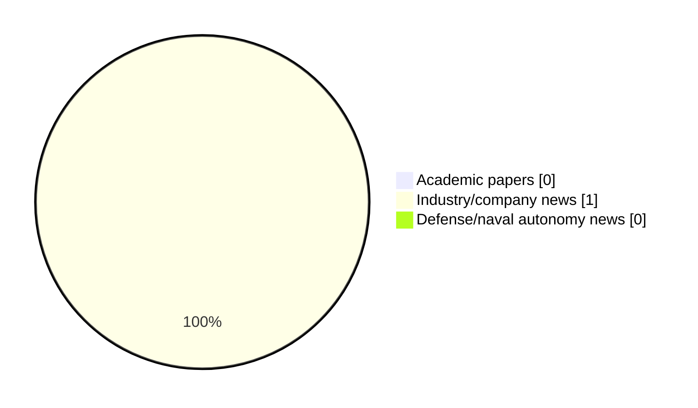

# Maritime Autonomy Watch — 2026-08-23

## Executive Summary

- Total selected items: 1
- Academic papers: 0
- Industry/company news: 1
- Defense/naval autonomy news: 0
- Failed/inaccessible sources: 0

## Contents

- [Analyst Brief](#analyst-brief)
- [Must Read](#must-read)
- [Top Signals Today](#top-signals-today)
- [Topic Signals](#topic-signals)
- [Freshness and Coverage](#freshness-and-coverage)
- [Quality Notes](#quality-notes)
- [Watchlist](#watchlist)
- [Academic Papers](#academic-papers)
- [Industry and Company News](#industry-and-company-news)
- [Defense and Naval Autonomy News](#defense-and-naval-autonomy-news)
- [Source Status Summary](#source-status-summary)

## Analyst Brief

Today's report selected 1 non-duplicate item(s), led by USV operations. The strongest item is [ACUA Ocean Pioneer USV demonstrates Long-Endurance Surveillance](https://massworld.news/acua-ocean-pioneer-usv-demonstrates-long-endurance-surveillance/) from massworld.news.
Coverage is weighted toward academic research (0), with 1 industry and 0 defense signal(s).

## Must Read

- [ACUA Ocean Pioneer USV demonstrates Long-Endurance Surveillance](https://massworld.news/acua-ocean-pioneer-usv-demonstrates-long-endurance-surveillance/) — Industry signal: USV operations

## Top Signals Today

- USV operations: 1 selected item(s).

## Topic Signals

- USV operations: 1

## Freshness and Coverage

- Newest selected item date: 2026-07-09
- Oldest selected item date: 2026-07-09
- Active/enabled sources: 5
- Sources with access problems: 2
- Quality flags: 0

## Quality Notes

- No quality flags on selected items.

## Watchlist

- No watchlist items today.

### Category Snapshot

| Category | Selected items |
|---|---:|
| Academic papers | 0 |
| Industry/company news | 1 |
| Defense/naval autonomy news | 0 |

## Academic Papers

_Selected items: 0_

No selected items.

## Industry and Company News

_Selected items: 1_

### [ACUA Ocean Pioneer USV demonstrates Long-Endurance Surveillance](https://massworld.news/acua-ocean-pioneer-usv-demonstrates-long-endurance-surveillance/)

- Source: massworld.news
- Date: 2026-07-09
- Relevance score: 7.75
- Signal: Industry signal: USV operations
- Topic tags: USV operations

**Summary**

ACUA Ocean, a company that develops uncrewed surface vessels (USVs) for ocean monitoring and data collection, has its Mk1 USV PIONEER complete a five-day remotely operated offshore demonstration, validating the.

**Why it matters**

Signals momentum in surface-vessel operations, infrastructure monitoring; useful for tracking product direction, partnerships, and deployment opportunities.

---

## Defense and Naval Autonomy News

_Selected items: 0_

No selected items.

## Inaccessible or Failed Sources

- None

## Source Status Summary

| Source | Status | Notes |
|---|---|---|
| arXiv | enabled | API source, 15 items fetched |
| OpenAlex | enabled | API source, 15 items fetched |
| RSS feeds | enabled | 107 RSS items fetched |
| SMI MASG News | enabled | HTML source, 10 items fetched |
| IEEE Xplore | disabled | Missing IEEE_XPLORE_API_KEY |
| Elsevier Scopus | enabled | API source, 15 items fetched |
| NewsAPI | disabled | Missing NEWS_API_KEY |

## Metadata

- Generated at: 2026-08-23T08:34:51.076992+02:00
- Date: 2026-08-23
- Repository: ferhannb/MarineRobotics
- Relevance threshold: 4.0
- Deduplication method: DOI, canonical URL, source ID, normalized title, similar recent titles, category caps, and novelty score
