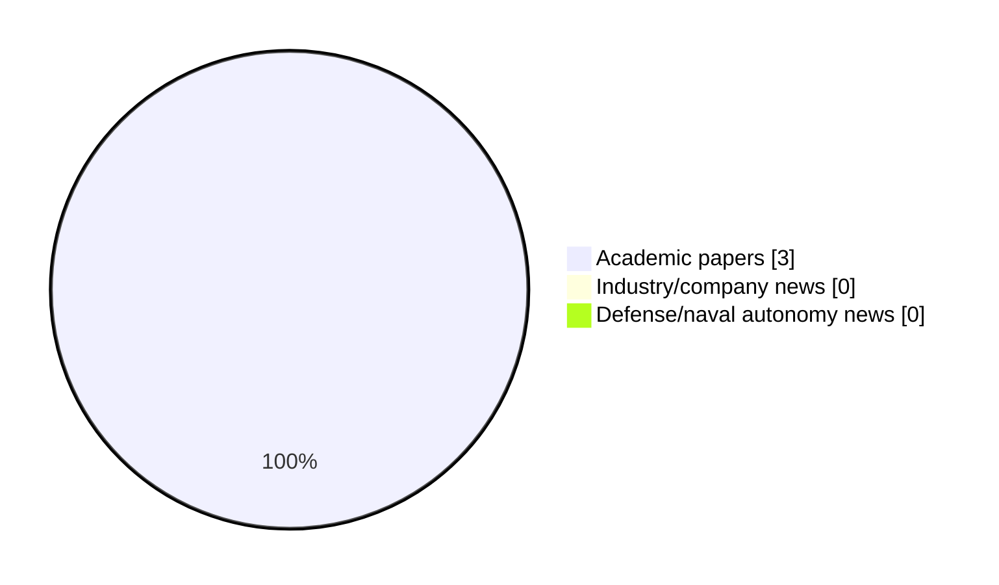

# Maritime Autonomy Watch — 2026-08-24

## Executive Summary

- Total selected items: 3
- Academic papers: 3
- Industry/company news: 0
- Defense/naval autonomy news: 0
- Failed/inaccessible sources: 0

## Contents

- [Analyst Brief](#analyst-brief)
- [Must Read](#must-read)
- [Top Signals Today](#top-signals-today)
- [Topic Signals](#topic-signals)
- [Freshness and Coverage](#freshness-and-coverage)
- [Quality Notes](#quality-notes)
- [Watchlist](#watchlist)
- [Academic Papers](#academic-papers)
- [Industry and Company News](#industry-and-company-news)
- [Defense and Naval Autonomy News](#defense-and-naval-autonomy-news)
- [Source Status Summary](#source-status-summary)

## Analyst Brief

Today's report selected 3 non-duplicate item(s), led by swarm autonomy, planning/control, critical infrastructure. The strongest item is [The Coastline as a Structural Constraint: Harnessing Scene Geometry for Autonomous Surface Vessel Localization](http://arxiv.org/abs/2608.21276v1) from arXiv.
Coverage is weighted toward academic research (3), with 0 industry and 0 defense signal(s).
Quality caveat: low-score-unique=2.

## Must Read

- [The Coastline as a Structural Constraint: Harnessing Scene Geometry for Autonomous Surface Vessel Localization](http://arxiv.org/abs/2608.21276v1) — Research signal: USV operations
- [A review of underwater robot technologies for inland waterway inspection and maintenance: the pinglu canal scenario](https://doi.org/10.1007/s44443-026-01136-0) — Research signal: perception
- [Hydrodynamics-aware formation control for energy-efficient multi-vessel systems: A review](https://doi.org/10.1016/j.oceaneng.2026.127331) — Research signal: swarm autonomy

## Top Signals Today

- swarm autonomy: 2 selected item(s).
- planning/control: 2 selected item(s).
- critical infrastructure: 2 selected item(s).
- USV operations: 1 selected item(s).
- perception: 1 selected item(s).

## Topic Signals

- swarm autonomy: 2
- planning/control: 2
- critical infrastructure: 2
- USV operations: 1
- perception: 1
- regulation/legal: 1

## Freshness and Coverage

- Newest selected item date: 2026-08-21
- Oldest selected item date: 2026-08-05
- Active/enabled sources: 5
- Sources with access problems: 2
- Quality flags: 2

## Quality Notes

- low-score-unique: 2

## Watchlist

- [A review of underwater robot technologies for inland waterway inspection and maintenance: the pinglu canal scenario](https://doi.org/10.1007/s44443-026-01136-0) — low-score-unique
- [Hydrodynamics-aware formation control for energy-efficient multi-vessel systems: A review](https://doi.org/10.1016/j.oceaneng.2026.127331) — low-score-unique

### Category Snapshot

| Category | Selected items |
|---|---:|
| Academic papers | 3 |
| Industry/company news | 0 |
| Defense/naval autonomy news | 0 |

## Academic Papers

_Selected items: 3_

### [The Coastline as a Structural Constraint: Harnessing Scene Geometry for Autonomous Surface Vessel Localization](http://arxiv.org/abs/2608.21276v1)

- Source: arXiv
- Date: 2026-08-21
- Relevance score: 4.25
- Authors: Derek R. Benham, Joshua G. Mangelson
- Signal: Research signal: USV operations
- Topic tags: USV operations, swarm autonomy, planning/control, critical infrastructure

**Abstract**

Coastal environments contain rich, largely unexploited geometric structure capable of providing globally referenced localization cues. In this work, we present two complementary localization frameworks that exploit shoreline and water-surface geometry for GPS-denied autonomous surface vessel localization. The first framework leverages LiDAR observations of the water surface to estimate roll, pitch, and heave (vertical motion), while recovering global position and heading through direct registration of shoreline observations against a satellite-derived coastline map. The second framework relies solely on passive imagery to detect the shoreline and horizon through semantic segmentation. Using the proposed coastal scene geometry, shoreline distance is inferred from monocular imagery.

**Why it matters**

Relevant to surface-vessel operations, multi-vehicle coordination, planning and control; the work may inform maritime autonomy research, testing priorities, or system design.

---

### [A review of underwater robot technologies for inland waterway inspection and maintenance: the pinglu canal scenario](https://doi.org/10.1007/s44443-026-01136-0)

- Source: OpenAlex
- Date: 2026-08-21
- Relevance score: 3.5
- Authors: Peijun Shi, Chee‐Onn Chow, Wei Ru Wong
- DOI: 10.1007/s44443-026-01136-0
- Signal: Research signal: perception
- Topic tags: perception, critical infrastructure
- Quality flags: low-score-unique

**Abstract**

Underwater robotics has advanced fastest in its individual capabilities. Learned optical enhancement, sonar interpretation, and tightly coupled multimodal fusion each report steady gains on dedicated benchmarks, yet whether those gains translate into reliable operation under deployment constraints remains largely untested. We examine this question for confined inland waterways, where narrow geometry, persistent turbidity, dense engineered structures, and GNSS denial jointly decide what a robot can and cannot do. The Pinglu Canal in Guangxi, China, serves as the reference scenario, and the analysis is organized around a scenario-centric evaluation framework rather than an isolated capability survey.

**Why it matters**

Relevant to underwater autonomy, infrastructure monitoring; the work may inform maritime autonomy research, testing priorities, or system design.

---

### [Hydrodynamics-aware formation control for energy-efficient multi-vessel systems: A review](https://doi.org/10.1016/j.oceaneng.2026.127331)

- Source: OpenAlex
- Date: 2026-08-05
- Relevance score: 3.5
- Authors: Xin Xiong, Rudy R. Negenborn, Yusong Pang
- DOI: 10.1016/j.oceaneng.2026.127331
- Signal: Research signal: swarm autonomy
- Topic tags: swarm autonomy, planning/control, regulation/legal
- Quality flags: low-score-unique

**Abstract**

Maritime decarbonization and the emergence of autonomous vessel fleets are motivating cooperative sailing concepts in which formation geometry serves not only as a coordination variable but also as a potential means of reducing hydrodynamic resistance. Although favorable wake and wave-interference patterns can reduce resistance in specific configurations, translating these benefits into deployable formation-control laws remains challenging. The central difficulty is cross-layer: hydrodynamic models must capture spacing- and speed-dependent interaction effects while remaining sufficiently compact, differentiable, and transferable for constrained real-time control. This review examines hydrodynamics-aware formation control for energy-efficient multi-vessel systems using a structured Scopus corpus of 193 publications.

**Why it matters**

Relevant to multi-vehicle coordination; the work may inform maritime autonomy research, testing priorities, or system design.

---

## Industry and Company News

_Selected items: 0_

No selected items.

## Defense and Naval Autonomy News

_Selected items: 0_

No selected items.

## Inaccessible or Failed Sources

- None

## Source Status Summary

| Source | Status | Notes |
|---|---|---|
| arXiv | enabled | API source, 15 items fetched |
| OpenAlex | enabled | API source, 15 items fetched |
| RSS feeds | enabled | 107 RSS items fetched |
| SMI MASG News | enabled | HTML source, 10 items fetched |
| IEEE Xplore | disabled | Missing IEEE_XPLORE_API_KEY |
| Elsevier Scopus | enabled | API source, 15 items fetched |
| NewsAPI | disabled | Missing NEWS_API_KEY |

## Metadata

- Generated at: 2026-08-24T08:50:50.656620+02:00
- Date: 2026-08-24
- Repository: ferhannb/MarineRobotics
- Relevance threshold: 4.0
- Deduplication method: DOI, canonical URL, source ID, normalized title, similar recent titles, category caps, and novelty score
