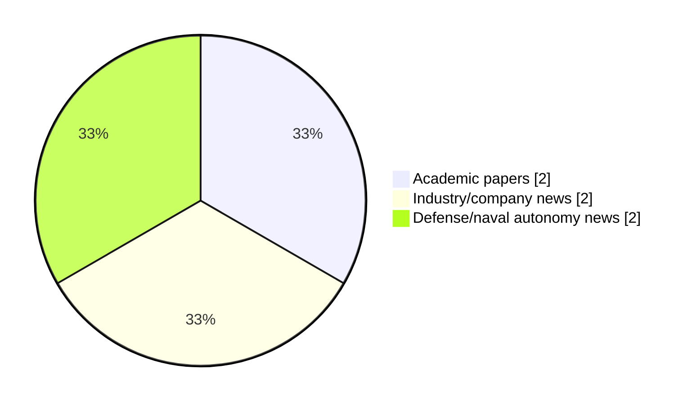

# Maritime Autonomy Watch — 2026-08-25

## Executive Summary

- Total selected items: 6
- Academic papers: 2
- Industry/company news: 2
- Defense/naval autonomy news: 2
- Failed/inaccessible sources: 0

## Contents

- [Analyst Brief](#analyst-brief)
- [Must Read](#must-read)
- [Top Signals Today](#top-signals-today)
- [Topic Signals](#topic-signals)
- [Freshness and Coverage](#freshness-and-coverage)
- [Quality Notes](#quality-notes)
- [Watchlist](#watchlist)
- [Academic Papers](#academic-papers)
- [Industry and Company News](#industry-and-company-news)
- [Defense and Naval Autonomy News](#defense-and-naval-autonomy-news)
- [Source Status Summary](#source-status-summary)

## Analyst Brief

Today's report selected 6 non-duplicate item(s), led by USV operations, AUV navigation, critical infrastructure. The strongest item is [Spiking Neural Networks for Energy-Efficient Object Detection in Forward-Looking Sonar Imagery](http://arxiv.org/abs/2608.22072v1) from arXiv.
Coverage is weighted toward academic research (2), with 2 industry and 2 defense signal(s).

## Must Read

- [Spiking Neural Networks for Energy-Efficient Object Detection in Forward-Looking Sonar Imagery](http://arxiv.org/abs/2608.22072v1) — Research signal: AUV navigation
- [A Unified Neural-Aided Alignment and Calibration Method for AUVs](http://arxiv.org/abs/2608.22496v1) — Research signal: AUV navigation
- [TUFAN Kamikaze USV Launched at TEKNOFEST Mavi Vatan 2026](https://www.navalnews.com/naval-news/2026/08/tufan-kamikaze-usv-launched-at-teknofest-mavi-vatan-2026/) — Defense signal: USV operations
- [ZeroUSV Achieves World First Autonomous Deployment of Oshen C-Star Drones from Oceanus12](https://oceannews.com/news/science-technology/zerousv-achieves-world-first-autonomous-deployment-of-oshen-c-star-drones-from-oceanus12/) — Industry signal: USV operations
- [Subsea Fenix Takes Delivery of HydroSurv REAV-60 USV for Survey Operations in Italy](https://oceannews.com/news/science-technology/subsea-fenix-takes-delivery-of-hydrosurv-reav-60-usv-for-survey-operations-in-italy/) — Industry signal: USV operations

## Top Signals Today

- USV operations: 4 selected item(s).
- AUV navigation: 2 selected item(s).
- critical infrastructure: 2 selected item(s).
- perception: 1 selected item(s).
- defense adoption: 1 selected item(s).

## Topic Signals

- USV operations: 4
- AUV navigation: 2
- critical infrastructure: 2
- perception: 1
- defense adoption: 1
- planning/control: 1

## Freshness and Coverage

- Newest selected item date: 2026-08-25
- Oldest selected item date: 2026-08-22
- Active/enabled sources: 5
- Sources with access problems: 2
- Quality flags: 0

## Quality Notes

- No quality flags on selected items.

## Watchlist

- No watchlist items today.

### Category Snapshot

| Category | Selected items |
|---|---:|
| Academic papers | 2 |
| Industry/company news | 2 |
| Defense/naval autonomy news | 2 |

## Academic Papers

_Selected items: 2_

### [Spiking Neural Networks for Energy-Efficient Object Detection in Forward-Looking Sonar Imagery](http://arxiv.org/abs/2608.22072v1)

- Source: arXiv
- Date: 2026-08-22
- Relevance score: 7.75
- Authors: Gwenevere Frank, Gert Cauwenberghs
- Signal: Research signal: AUV navigation
- Topic tags: AUV navigation, perception, defense adoption

**Abstract**

Autonomous underwater vehicles (AUVs) are increasingly important tools in industries ranging from research, to energy, to defense. AUVs are power-constrained platforms operating in remote environments with fixed battery capacities, where propulsion competes with compute and sensors for power over lengthy mission durations. AUVs frequently operate in dark or turbid waters where optical sensing is of limited value, and rely on sonar as their primary sensing modality. Convolutional neural networks (CNNs) are the state-of-the-art solution for object detection in forward-looking sonar imagery, but are energy expensive (e.g. YOLOv8m: 322 mJ/inference). Spiking neural networks (SNNs) rely on binary spike activations and thus sparse accumulate-only operations, allowing them to be remarkably energy efficient, particularly when paired with dedicated neuromorphic hardware.

**Why it matters**

Relevant to underwater autonomy, naval adoption; the work may inform maritime autonomy research, testing priorities, or system design.

---

### [A Unified Neural-Aided Alignment and Calibration Method for AUVs](http://arxiv.org/abs/2608.22496v1)

- Source: arXiv
- Date: 2026-08-23
- Relevance score: 7
- Authors: Guy Damari, Zeev Yampolsky, Itzik Klein
- Signal: Research signal: AUV navigation
- Topic tags: AUV navigation, planning/control, critical infrastructure

**Abstract**

Autonomous underwater vehicles (AUVs) rely on the fusion of inertial navigation systems (INS) and Doppler velocity logs (DVL) for accurate navigation. Before deployment, this fusion requires a DVL initialization pipeline consisting of two stages: alignment, which estimates the rotation between the INS and DVL frames, and calibration, which estimates the DVL error terms. Conventionally, both stages are solved with model-based algorithms that demand complex vehicle maneuvers, surface-level satellite reference measurements, and simplified error models, making initialization time-consuming, trajectory-dependent, and sensitive to sensor quality. In this work, we propose a fully neural- aided DVL initialization pipeline that replaces both stages with two complementary neural networks: ResAlignNet for alignment and DCNet for calibration.

**Why it matters**

Relevant to underwater autonomy, planning and control; the work may inform maritime autonomy research, testing priorities, or system design.

---

## Industry and Company News

_Selected items: 2_

### [ZeroUSV Achieves World First Autonomous Deployment of Oshen C-Star Drones from Oceanus12](https://oceannews.com/news/science-technology/zerousv-achieves-world-first-autonomous-deployment-of-oshen-c-star-drones-from-oceanus12/)

- Source: oceannews.com
- Date: 2026-08-24
- Relevance score: 6
- Signal: Industry signal: USV operations
- Topic tags: USV operations

**Summary**

ZeroUSV has achieved a world first by successfully demonstrating the autonomous deployment of multiple autonomous surface vehicles (ASVs) from a 12-meter Oceanus class uncrewed surface vessel (USV), marking an important milestone in proving the payload flexibility of the Oceanus class USV platforms.

**Why it matters**

Signals momentum in surface-vessel operations; useful for tracking product direction, partnerships, and deployment opportunities.

---

### [Subsea Fenix Takes Delivery of HydroSurv REAV-60 USV for Survey Operations in Italy](https://oceannews.com/news/science-technology/subsea-fenix-takes-delivery-of-hydrosurv-reav-60-usv-for-survey-operations-in-italy/)

- Source: oceannews.com
- Date: 2026-08-24
- Relevance score: 5.25
- Signal: Industry signal: USV operations
- Topic tags: USV operations, critical infrastructure

**Summary**

Italian survey contractor Subsea Fenix S.R.L. has taken delivery of a 5.7 m battery-hybrid uncrewed surface vessel (USV) combining hydrographic survey and ROV inspection capability, marking HydroSurv's first vessel delivery into the Italian market.

**Why it matters**

Signals momentum in surface-vessel operations, infrastructure monitoring; useful for tracking product direction, partnerships, and deployment opportunities.

---

## Defense and Naval Autonomy News

_Selected items: 2_

### [TUFAN Kamikaze USV Launched at TEKNOFEST Mavi Vatan 2026](https://www.navalnews.com/naval-news/2026/08/tufan-kamikaze-usv-launched-at-teknofest-mavi-vatan-2026/)

- Source: navalnews.com
- Date: 2026-08-24
- Relevance score: 6
- Signal: Defense signal: USV operations
- Topic tags: USV operations

**Summary**

TUFAN, a new kamikaze unmanned surface vessel (USV) developed by ASELSAN and built by ARES Shipyard, was launched during TEKNOFEST Mavi Vatan 2026

**Why it matters**

Signals movement in surface-vessel operations; useful for tracking operational concepts, procurement direction, and fleet integration.

---

### [STR8 Industries Reveals Made in Taiwan Ghostwake USV](https://www.navalnews.com/naval-news/2026/08/str8-industries-reveals-made-in-taiwan-ghostwake-usv/)

- Source: navalnews.com
- Date: 2026-08-25
- Relevance score: 4.5
- Signal: Defense signal: USV operations
- Topic tags: USV operations

**Summary**

Taiwan-based STR8 Industries unveils Ghostwake, a USV designed for regional operations and mass production.

**Why it matters**

Signals movement in surface-vessel operations; useful for tracking operational concepts, procurement direction, and fleet integration.

---

## Inaccessible or Failed Sources

- None

## Source Status Summary

| Source | Status | Notes |
|---|---|---|
| arXiv | enabled | API source, 15 items fetched |
| OpenAlex | enabled | API source, 15 items fetched |
| RSS feeds | enabled | 107 RSS items fetched |
| SMI MASG News | enabled | HTML source, 10 items fetched |
| IEEE Xplore | disabled | Missing IEEE_XPLORE_API_KEY |
| Elsevier Scopus | enabled | API source, 15 items fetched |
| NewsAPI | disabled | Missing NEWS_API_KEY |

## Metadata

- Generated at: 2026-08-25T08:39:43.673996+02:00
- Date: 2026-08-25
- Repository: ferhannb/MarineRobotics
- Relevance threshold: 4.0
- Deduplication method: DOI, canonical URL, source ID, normalized title, similar recent titles, category caps, and novelty score
