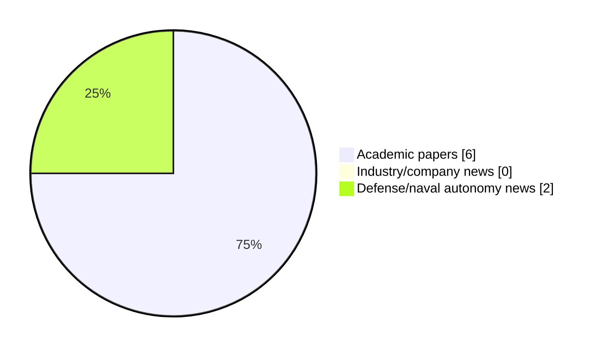

# Maritime Autonomy Watch — 2026-08-26

## Executive Summary

- Total selected items: 8
- Academic papers: 6
- Industry/company news: 0
- Defense/naval autonomy news: 2
- Failed/inaccessible sources: 0

## Contents

- [Analyst Brief](#analyst-brief)
- [Must Read](#must-read)
- [Top Signals Today](#top-signals-today)
- [Topic Signals](#topic-signals)
- [Freshness and Coverage](#freshness-and-coverage)
- [Quality Notes](#quality-notes)
- [Watchlist](#watchlist)
- [Academic Papers](#academic-papers)
- [Industry and Company News](#industry-and-company-news)
- [Defense and Naval Autonomy News](#defense-and-naval-autonomy-news)
- [Source Status Summary](#source-status-summary)

## Analyst Brief

Today's report selected 8 non-duplicate item(s), led by USV operations, planning/control, swarm autonomy. The strongest item is [Dynamical System-Based Imitation Learning and Neuroadaptive Control for Trajectory Recovery in Autonomous Ships](http://arxiv.org/abs/2608.23924v1) from arXiv.
Coverage is weighted toward academic research (6), with 0 industry and 2 defense signal(s).
Quality caveat: missing-summary=5, date-anomaly=5, low-score-unique=2.

## Must Read

- [Dynamical System-Based Imitation Learning and Neuroadaptive Control for Trajectory Recovery in Autonomous Ships](http://arxiv.org/abs/2608.23924v1) — Research signal: USV operations
- [Ocius Selects ThayerMahan and Thales Australia Thin-line Arrays for Bluebottle Fleets](https://www.navalnews.com/naval-news/2026/08/ocius-selects-thayermahan-and-thales-australia-thin-line-arrays-for-bluebottle-fleets/) — Defense signal: USV operations
- [Oceanus12 deploys two smaller USVs in UK trial](https://www.naval-technology.com/news/oceanus12-deploys-two-smaller-usvs-in-uk-trial/) — Defense signal: USV operations

## Top Signals Today

- USV operations: 5 selected item(s).
- planning/control: 3 selected item(s).
- swarm autonomy: 2 selected item(s).
- AUV navigation: 2 selected item(s).
- underwater communications: 1 selected item(s).

## Topic Signals

- USV operations: 5
- planning/control: 3
- swarm autonomy: 2
- AUV navigation: 2
- underwater communications: 1
- perception: 1
- defense adoption: 1
- general autonomy: 1

## Freshness and Coverage

- Newest selected item date: 2027-03-01
- Oldest selected item date: 2026-08-25
- Active/enabled sources: 5
- Sources with access problems: 2
- Quality flags: 12

## Quality Notes

- missing-summary: 5
- date-anomaly: 5
- low-score-unique: 2
- Date anomalies: [Adaptive Risk-Aware Implicit Quantile Network: Towards Safe and Energy-Efficient USV Navigation in Dynamic Environments](https://api.elsevier.com/content/abstract/scopus_id/105046501877) reports 2027-01-01; [Graph-Enhanced Adaptive Residual Reinforcement Learning for Robust Multi-USV Cooperative Defense with Scalable Communication](https://api.elsevier.com/content/abstract/scopus_id/105046392000) reports 2027-01-01; [Formation control of AUVs for enabling safe and efficient marine operations](https://api.elsevier.com/content/abstract/scopus_id/105046585164) reports 2027-03-01; [Mission-oriented dynamic resilience assessment for clustered autonomous intelligent unmanned systems: A non-Markovian load-memory and performance-health coupled evolution framework](https://api.elsevier.com/content/abstract/scopus_id/105047834390) reports 2027-01-01; [Towards Transparent and Controllable LLM-Enhanced Reinforcement Learning for AUVs: Integrating Explainable AI and Multi-modal Feedback](https://api.elsevier.com/content/abstract/scopus_id/105046429658) reports 2027-01-01

## Watchlist

- [Adaptive Risk-Aware Implicit Quantile Network: Towards Safe and Energy-Efficient USV Navigation in Dynamic Environments](https://api.elsevier.com/content/abstract/scopus_id/105046501877) — missing-summary, date-anomaly
- [Graph-Enhanced Adaptive Residual Reinforcement Learning for Robust Multi-USV Cooperative Defense with Scalable Communication](https://api.elsevier.com/content/abstract/scopus_id/105046392000) — missing-summary, date-anomaly
- [Formation control of AUVs for enabling safe and efficient marine operations](https://api.elsevier.com/content/abstract/scopus_id/105046585164) — missing-summary, date-anomaly
- [Mission-oriented dynamic resilience assessment for clustered autonomous intelligent unmanned systems: A non-Markovian load-memory and performance-health coupled evolution framework](https://api.elsevier.com/content/abstract/scopus_id/105047834390) — missing-summary, date-anomaly, low-score-unique
- [Towards Transparent and Controllable LLM-Enhanced Reinforcement Learning for AUVs: Integrating Explainable AI and Multi-modal Feedback](https://api.elsevier.com/content/abstract/scopus_id/105046429658) — missing-summary, date-anomaly, low-score-unique

### Category Snapshot

| Category | Selected items |
|---|---:|
| Academic papers | 6 |
| Industry/company news | 0 |
| Defense/naval autonomy news | 2 |

## Academic Papers

_Selected items: 6_

### [Dynamical System-Based Imitation Learning and Neuroadaptive Control for Trajectory Recovery in Autonomous Ships](http://arxiv.org/abs/2608.23924v1)

- Source: arXiv
- Date: 2026-08-25
- Relevance score: 10
- Authors: Yeyson A. Becerra-Mora, José Ángel Acosta
- Signal: Research signal: USV operations
- Topic tags: USV operations, planning/control

**Abstract**

Repetitive maritime operations can be effectively learned using the Imitation Learning (IL) paradigm, which transfers human expertise directly to Unmanned Surface Vehicle (USV) control systems. Dynamical Systems (DS) are widely used to model non-linear human demonstrations while offering inherent stability guarantees. However, real-world execution under persistent marine perturbations reveals a critical trade-off: standard DS-based IL approaches prioritize global target convergence at the expense of localized trajectory reproduction fidelity. To address this limitation, we present a hybrid learning-control architecture that integrates a DS-based IL reference generator with a neuroadaptive controller. Our approach introduces a control action that drives the USV back to the demonstrated path following exogenous disturbances, enabling dynamic human-like reactive alignment-termed behavioral tracking.

**Why it matters**

Relevant to surface-vessel operations, planning and control; the work may inform maritime autonomy research, testing priorities, or system design.

---

### [Adaptive Risk-Aware Implicit Quantile Network: Towards Safe and Energy-Efficient USV Navigation in Dynamic Environments](https://api.elsevier.com/content/abstract/scopus_id/105046501877)

- Source: Elsevier Scopus
- Date: 2027-01-01
- Relevance score: 4.5
- DOI: 10.1007/978-981-92-3381-6_34
- Signal: Research signal: USV operations
- Topic tags: USV operations
- Quality flags: missing-summary, date-anomaly

**Abstract**

No summary available.

**Why it matters**

Relevant to surface-vessel operations; the work may inform maritime autonomy research, testing priorities, or system design.

---

### [Graph-Enhanced Adaptive Residual Reinforcement Learning for Robust Multi-USV Cooperative Defense with Scalable Communication](https://api.elsevier.com/content/abstract/scopus_id/105046392000)

- Source: Elsevier Scopus
- Date: 2027-01-01
- Relevance score: 4.5
- DOI: 10.1007/978-981-92-3394-6_45
- Signal: Research signal: USV operations
- Topic tags: USV operations, swarm autonomy, defense adoption
- Quality flags: missing-summary, date-anomaly

**Abstract**

No summary available.

**Why it matters**

Relevant to surface-vessel operations, naval adoption; the work may inform maritime autonomy research, testing priorities, or system design.

---

### [Formation control of AUVs for enabling safe and efficient marine operations](https://api.elsevier.com/content/abstract/scopus_id/105046585164)

- Source: Elsevier Scopus
- Date: 2027-03-01
- Relevance score: 4.25
- DOI: 10.1016/j.apm.2026.117232
- Signal: Research signal: AUV navigation
- Topic tags: AUV navigation, swarm autonomy, planning/control
- Quality flags: missing-summary, date-anomaly

**Abstract**

No summary available.

**Why it matters**

Relevant to underwater autonomy, multi-vehicle coordination; the work may inform maritime autonomy research, testing priorities, or system design.

---

### [Mission-oriented dynamic resilience assessment for clustered autonomous intelligent unmanned systems: A non-Markovian load-memory and performance-health coupled evolution framework](https://api.elsevier.com/content/abstract/scopus_id/105047834390)

- Source: Elsevier Scopus
- Date: 2027-01-01
- Relevance score: 3.5
- DOI: 10.1016/j.ress.2026.113335
- Signal: Research signal: general autonomy
- Topic tags: general autonomy
- Quality flags: missing-summary, date-anomaly, low-score-unique

**Abstract**

No summary available.

**Why it matters**

This paper may influence autonomy, perception, planning, or control work for maritime robotic systems.

---

### [Towards Transparent and Controllable LLM-Enhanced Reinforcement Learning for AUVs: Integrating Explainable AI and Multi-modal Feedback](https://api.elsevier.com/content/abstract/scopus_id/105046429658)

- Source: Elsevier Scopus
- Date: 2027-01-01
- Relevance score: 3.5
- DOI: 10.1007/978-981-92-3394-6_44
- Signal: Research signal: AUV navigation
- Topic tags: AUV navigation, planning/control
- Quality flags: missing-summary, date-anomaly, low-score-unique

**Abstract**

No summary available.

**Why it matters**

Relevant to underwater autonomy; the work may inform maritime autonomy research, testing priorities, or system design.

---

## Industry and Company News

_Selected items: 0_

No selected items.

## Defense and Naval Autonomy News

_Selected items: 2_

### [Ocius Selects ThayerMahan and Thales Australia Thin-line Arrays for Bluebottle Fleets](https://www.navalnews.com/naval-news/2026/08/ocius-selects-thayermahan-and-thales-australia-thin-line-arrays-for-bluebottle-fleets/)

- Source: navalnews.com
- Date: 2026-08-25
- Relevance score: 5.25
- Signal: Defense signal: USV operations
- Topic tags: USV operations, underwater communications, perception

**Summary**

Ocius Technology has signed agreements to integrate advanced sonar systems from ThayerMahan and Thales Australia across its growing fleet of Australian-made Bluebottle uncrewed surface vessels (USVs). Ocius Technology press release The sonar systems include fully retractable thin-line acoustic arrays (TLAs) which will be deployed to support persistent surface and subsurface intelligence, surveillance and reconnaissance (ISR).

**Why it matters**

Signals movement in surface-vessel operations; useful for tracking operational concepts, procurement direction, and fleet integration.

---

### [Oceanus12 deploys two smaller USVs in UK trial](https://www.naval-technology.com/news/oceanus12-deploys-two-smaller-usvs-in-uk-trial/)

- Source: naval-technology.com
- Date: 2026-08-25
- Relevance score: 5.25
- Signal: Defense signal: USV operations
- Topic tags: USV operations

**Summary**

British maritime technology firm, ZeroUSV, have announced a “world-first” as its Oceanus12 platform deploys two smaller C-Star USVs.

**Why it matters**

Signals movement in surface-vessel operations; useful for tracking operational concepts, procurement direction, and fleet integration.

---

## Inaccessible or Failed Sources

- None

## Source Status Summary

| Source | Status | Notes |
|---|---|---|
| arXiv | enabled | API source, 15 items fetched |
| OpenAlex | enabled | API source, 15 items fetched |
| RSS feeds | enabled | 107 RSS items fetched |
| SMI MASG News | enabled | HTML source, 10 items fetched |
| IEEE Xplore | disabled | Missing IEEE_XPLORE_API_KEY |
| Elsevier Scopus | enabled | API source, 15 items fetched |
| NewsAPI | disabled | Missing NEWS_API_KEY |

## Metadata

- Generated at: 2026-08-26T08:41:21.075116+02:00
- Date: 2026-08-26
- Repository: ferhannb/MarineRobotics
- Relevance threshold: 4.0
- Deduplication method: DOI, canonical URL, source ID, normalized title, similar recent titles, category caps, and novelty score
