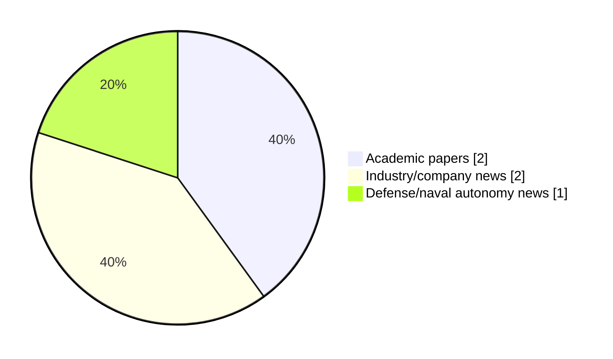

# Maritime Autonomy Watch — 2026-08-27

## Executive Summary

- Total selected items: 5
- Academic papers: 2
- Industry/company news: 2
- Defense/naval autonomy news: 1
- Failed/inaccessible sources: 0

## Contents

- [Analyst Brief](#analyst-brief)
- [Must Read](#must-read)
- [Top Signals Today](#top-signals-today)
- [Topic Signals](#topic-signals)
- [Freshness and Coverage](#freshness-and-coverage)
- [Quality Notes](#quality-notes)
- [Watchlist](#watchlist)
- [Academic Papers](#academic-papers)
- [Industry and Company News](#industry-and-company-news)
- [Defense and Naval Autonomy News](#defense-and-naval-autonomy-news)
- [Source Status Summary](#source-status-summary)

## Analyst Brief

Today's report selected 5 non-duplicate item(s), led by USV operations, perception, general autonomy. The strongest item is [Teledyne FLIR Launches M364C-USV Multispectral Camera for Autonomous Vessels](https://oceannews.com/news/science-technology/teledyne-flir-launches-m364c-usv-multispectral-camera-for-autonomous-vessels/) from oceannews.com.
Coverage is weighted toward academic research (2), with 2 industry and 1 defense signal(s).
Quality caveat: missing-summary=1.

## Must Read

- [Teledyne FLIR Launches M364C-USV Multispectral Camera for Autonomous Vessels](https://oceannews.com/news/science-technology/teledyne-flir-launches-m364c-usv-multispectral-camera-for-autonomous-vessels/) — Industry signal: USV operations
- [EGS Australia Christens Fremantle 02 to Scale Autonomous Survey Fleet](https://oceannews.com/news/science-technology/egs-australia-christens-fremantle-02-to-scale-autonomous-survey-fleet/) — Defense signal: USV operations
- [Seeing above the waves: A modular sensing framework for data acquisition at sea](http://arxiv.org/abs/2608.10997v1) — Research signal: USV operations
- [SMI Recruiting Director of MASG, MSTG and SMIFutures](https://www.maritimeindustries.org/news/smi-recruiting-director-masg-mstg-and-smifutures) — Industry signal: general autonomy

## Top Signals Today

- USV operations: 4 selected item(s).
- perception: 2 selected item(s).
- general autonomy: 1 selected item(s).

## Topic Signals

- USV operations: 4
- perception: 2
- general autonomy: 1

## Freshness and Coverage

- Newest selected item date: 2026-08-27
- Oldest selected item date: 2026-08-10
- Active/enabled sources: 5
- Sources with access problems: 2
- Quality flags: 1

## Quality Notes

- missing-summary: 1

## Watchlist

- [Autonomous Collision Avoidance Decision-Making Method for UAV-USV Based on PD3QN Algorithm](https://doi.org/10.21203/rs.3.rs-8528532/v1) — missing-summary

### Category Snapshot

| Category | Selected items |
|---|---:|
| Academic papers | 2 |
| Industry/company news | 2 |
| Defense/naval autonomy news | 1 |

## Academic Papers

_Selected items: 2_

### [Seeing above the waves: A modular sensing framework for data acquisition at sea](http://arxiv.org/abs/2608.10997v1)

- Source: arXiv
- Date: 2026-08-11
- Relevance score: 5
- Authors: Jonathan E. Schmidt, Julius Wirbel, P. Nicholas Hansen, Morgan Louédec, Christian L. H. Westerdahl, Dimitrios Dagdilelis, Roberto Galeazzi
- Signal: Research signal: USV operations
- Topic tags: USV operations, perception

**Abstract**

Advancing autonomy for surface vessels requires systematic evaluation of their sensing and perception subsystems. Yet, maritime environments impose unique challenges: sensor installation is constrained by vessel layout, environmental conditions such as fog or sea clutter are difficult to reproduce, and long-duration missions complicate data collection. This work addresses the question: How can we design a modular and reproducible sensor platform for maritime autonomy? We present a comprehensive design blueprint that incorporates diverse modalities - RADAR, LiDAR, IMU, GNSS, AIS, RGB and LWIR cameras, and weather sensors - to enhance environmental awareness and vessel proprioception. Supported by a dedicated ROS2-based software framework for data management, our modular platform enables long-term data collection, hardware-in-the-loop testing, and integration with existing sensors and algorithms.

**Why it matters**

Relevant to surface-vessel operations; the work may inform maritime autonomy research, testing priorities, or system design.

---

### [Autonomous Collision Avoidance Decision-Making Method for UAV-USV Based on PD3QN Algorithm](https://doi.org/10.21203/rs.3.rs-8528532/v1)

- Source: OpenAlex
- Date: 2026-08-10
- Relevance score: 5.25
- Authors: Sheng Qu, Wei Guan, Chunqi Luo, Tongbo Hu, Xianku Zhang
- DOI: 10.21203/rs.3.rs-8528532/v1
- Signal: Research signal: USV operations
- Topic tags: USV operations
- Quality flags: missing-summary

**Abstract**

No summary available.

**Why it matters**

Relevant to surface-vessel operations, navigation safety; the work may inform maritime autonomy research, testing priorities, or system design.

---

## Industry and Company News

_Selected items: 2_

### [Teledyne FLIR Launches M364C-USV Multispectral Camera for Autonomous Vessels](https://oceannews.com/news/science-technology/teledyne-flir-launches-m364c-usv-multispectral-camera-for-autonomous-vessels/)

- Source: oceannews.com
- Date: 2026-08-27
- Relevance score: 9.5
- Signal: Industry signal: USV operations
- Topic tags: USV operations, perception

**Summary**

Teledyne FLIR Marine, part of Teledyne Technologies Incorporated, has introduced the FLIR M364C-USV, a multispectral maritime camera system designed to help autonomous and uncrewed surface vessel (USV) operators navigate safely, detect hazards sooner, and maintain situational awareness in demanding marine environments. Combining thermal and visible imaging in a rugged, mission-ready platform, the M364C-USV enables reliable operation day or night and in challenging conditions such as glare, haze, and low visibility.

**Why it matters**

Signals momentum in surface-vessel operations; useful for tracking product direction, partnerships, and deployment opportunities.

---

### [SMI Recruiting Director of MASG, MSTG and SMIFutures](https://www.maritimeindustries.org/news/smi-recruiting-director-masg-mstg-and-smifutures)

- Source: maritimeindustries.org
- Date: 2026-08-26
- Relevance score: 4.25
- Signal: Industry signal: general autonomy
- Topic tags: general autonomy

**Summary**

SMI is recruiting for a director to lead our maritime autonomy, marine science and technology and SMIFutures working group activity. Applications will close on 9th September 2026.

**Why it matters**

This item may signal product, market, or deployment momentum in maritime autonomy.

---

## Defense and Naval Autonomy News

_Selected items: 1_

### [EGS Australia Christens Fremantle 02 to Scale Autonomous Survey Fleet](https://oceannews.com/news/science-technology/egs-australia-christens-fremantle-02-to-scale-autonomous-survey-fleet/)

- Source: oceannews.com
- Date: 2026-08-27
- Relevance score: 5.75
- Signal: Defense signal: USV operations
- Topic tags: USV operations

**Summary**

Australia is advancing scalable autonomous maritime capability with the christening of Fremantle 02, EGS Australia's second optionally crewed surface vessel, powered by Greenroom Robotics' GAMA maritime autonomy system.

**Why it matters**

Signals movement in surface-vessel operations; useful for tracking operational concepts, procurement direction, and fleet integration.

---

## Inaccessible or Failed Sources

- None

## Source Status Summary

| Source | Status | Notes |
|---|---|---|
| arXiv | enabled | API source, 15 items fetched |
| OpenAlex | enabled | API source, 15 items fetched |
| RSS feeds | enabled | 107 RSS items fetched |
| SMI MASG News | enabled | HTML source, 10 items fetched |
| IEEE Xplore | disabled | Missing IEEE_XPLORE_API_KEY |
| Elsevier Scopus | enabled | API source, 15 items fetched |
| NewsAPI | disabled | Missing NEWS_API_KEY |

## Metadata

- Generated at: 2026-08-27T19:17:08.207156+02:00
- Date: 2026-08-27
- Repository: ferhannb/MarineRobotics
- Relevance threshold: 4.0
- Deduplication method: DOI, canonical URL, source ID, normalized title, similar recent titles, category caps, and novelty score
