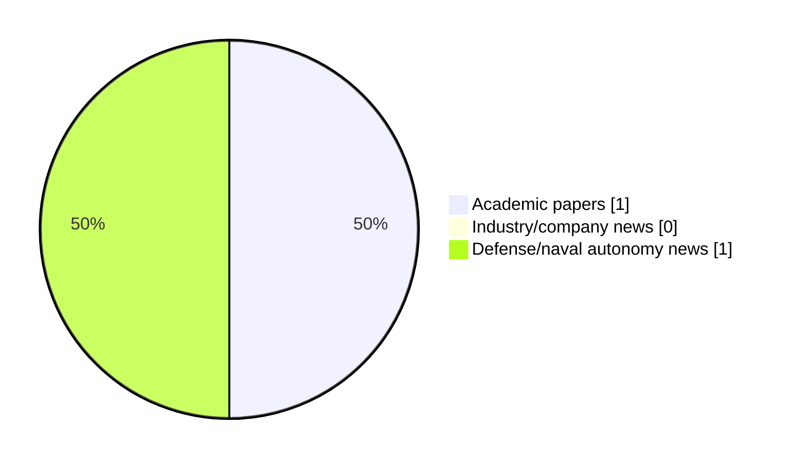

# Maritime Autonomy Watch — 2026-08-28

## Executive Summary

- Total selected items: 2
- Academic papers: 1
- Industry/company news: 0
- Defense/naval autonomy news: 1
- Failed/inaccessible sources: 0

## Contents

- [Analyst Brief](#analyst-brief)
- [Must Read](#must-read)
- [Top Signals Today](#top-signals-today)
- [Topic Signals](#topic-signals)
- [Freshness and Coverage](#freshness-and-coverage)
- [Quality Notes](#quality-notes)
- [Watchlist](#watchlist)
- [Academic Papers](#academic-papers)
- [Industry and Company News](#industry-and-company-news)
- [Defense and Naval Autonomy News](#defense-and-naval-autonomy-news)
- [Source Status Summary](#source-status-summary)

## Analyst Brief

Today's report selected 2 non-duplicate item(s), led by general autonomy, AUV navigation, perception. The strongest item is [Contact-Aided Factor-Graph Localization for Underwater Sampling](http://arxiv.org/abs/2608.26932v1) from arXiv.
Coverage is weighted toward academic research (1), with 0 industry and 1 defense signal(s).
Quality caveat: low-score-unique=2.

## Must Read

- [Contact-Aided Factor-Graph Localization for Underwater Sampling](http://arxiv.org/abs/2608.26932v1) — Research signal: AUV navigation
- [HAVELSAN Unveils AVISTA, New Underwater Autonomy Project](https://www.navalnews.com/naval-news/2026/08/havelsan-unveils-avista-new-underwater-autonomy-project/) — Defense signal: general autonomy

## Top Signals Today

- general autonomy: 1 selected item(s).
- AUV navigation: 1 selected item(s).
- perception: 1 selected item(s).
- planning/control: 1 selected item(s).

## Topic Signals

- general autonomy: 1
- AUV navigation: 1
- perception: 1
- planning/control: 1

## Freshness and Coverage

- Newest selected item date: 2026-08-28
- Oldest selected item date: 2026-08-27
- Active/enabled sources: 5
- Sources with access problems: 2
- Quality flags: 2

## Quality Notes

- low-score-unique: 2

## Watchlist

- [HAVELSAN Unveils AVISTA, New Underwater Autonomy Project](https://www.navalnews.com/naval-news/2026/08/havelsan-unveils-avista-new-underwater-autonomy-project/) — low-score-unique
- [Contact-Aided Factor-Graph Localization for Underwater Sampling](http://arxiv.org/abs/2608.26932v1) — low-score-unique

### Category Snapshot

| Category | Selected items |
|---|---:|
| Academic papers | 1 |
| Industry/company news | 0 |
| Defense/naval autonomy news | 1 |

## Academic Papers

_Selected items: 1_

### [Contact-Aided Factor-Graph Localization for Underwater Sampling](http://arxiv.org/abs/2608.26932v1)

- Source: arXiv
- Date: 2026-08-27
- Relevance score: 3.5
- Authors: Michele Grimaldi, Yosaku Maeda, Hitoshi Kakami, Ignacio Carlucho, Yvan R. Petillot, Tomoya Inoue
- Signal: Research signal: AUV navigation
- Topic tags: AUV navigation, perception, planning/control
- Quality flags: low-score-unique

**Abstract**

Accurate state estimation for autonomous underwater vehicles performing close-range seafloor sampling remains challenging. In low-altitude operation, down-looking cameras over featureless planar seabeds produce scale ambiguity, lateral degeneracy, and inconsistent feature tracking. Meanwhile, inertial-Doppler Velocity Log (DVL) fusion alone provides no mechanism for structural drift correction. We propose a Contact-Aided Factor-Graph Localization framework that treats physical interaction as an informative geometric constraint within a smoothing-based localization formulation. The method tightly fuses suction-based manipulator contact events with adaptive visual odometry, learned object detections, and on-board sensors.

**Why it matters**

Relevant to underwater autonomy, planning and control; the work may inform maritime autonomy research, testing priorities, or system design.

---

## Industry and Company News

_Selected items: 0_

No selected items.

## Defense and Naval Autonomy News

_Selected items: 1_

### [HAVELSAN Unveils AVISTA, New Underwater Autonomy Project](https://www.navalnews.com/naval-news/2026/08/havelsan-unveils-avista-new-underwater-autonomy-project/)

- Source: navalnews.com
- Date: 2026-08-28
- Relevance score: 3
- Signal: Defense signal: general autonomy
- Topic tags: general autonomy
- Quality flags: low-score-unique

**Summary**

Building on the expertise it has developed through SANCAR and RAFNAR in the field of unmanned marine vehicles, HAVELSAN unveiled AVISTA, its new self-funded R&D project, for the first time at TEKNOFEST Blue Homeland 2026 in Gölcük. HAVELSAN press release Through the AVISTA project, HAVELSAN aims to develop national capabilities for precise positioning in underwater.

**Why it matters**

Signals movement in underwater autonomy; useful for tracking operational concepts, procurement direction, and fleet integration.

---

## Inaccessible or Failed Sources

- None

## Source Status Summary

| Source | Status | Notes |
|---|---|---|
| arXiv | enabled | API source, 15 items fetched |
| OpenAlex | enabled | API source, 15 items fetched |
| RSS feeds | enabled | 107 RSS items fetched |
| SMI MASG News | enabled | HTML source, 10 items fetched |
| IEEE Xplore | disabled | Missing IEEE_XPLORE_API_KEY |
| Elsevier Scopus | enabled | API source, 15 items fetched |
| NewsAPI | disabled | Missing NEWS_API_KEY |

## Metadata

- Generated at: 2026-08-28T20:09:33.333695+02:00
- Date: 2026-08-28
- Repository: ferhannb/MarineRobotics
- Relevance threshold: 4.0
- Deduplication method: DOI, canonical URL, source ID, normalized title, similar recent titles, category caps, and novelty score
