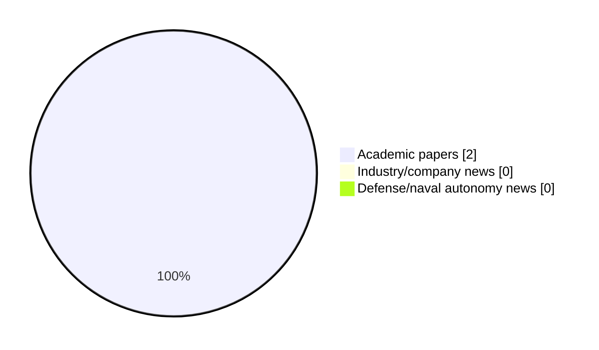

# Maritime Autonomy Watch — 2026-08-29

## Executive Summary

- Total selected items: 2
- Academic papers: 2
- Industry/company news: 0
- Defense/naval autonomy news: 0
- Failed/inaccessible sources: 0

## Contents

- [Analyst Brief](#analyst-brief)
- [Must Read](#must-read)
- [Top Signals Today](#top-signals-today)
- [Topic Signals](#topic-signals)
- [Freshness and Coverage](#freshness-and-coverage)
- [Quality Notes](#quality-notes)
- [Watchlist](#watchlist)
- [Academic Papers](#academic-papers)
- [Industry and Company News](#industry-and-company-news)
- [Defense and Naval Autonomy News](#defense-and-naval-autonomy-news)
- [Source Status Summary](#source-status-summary)

## Analyst Brief

Today's report selected 2 non-duplicate item(s), led by AUV navigation, swarm autonomy, perception. The strongest item is [AMR-Pose: An Active LED Marker-Based Relative Pose Estimation Framework With Probabilistic Switching PnP for Cooperative AUVs](http://arxiv.org/abs/2608.12866v1) from arXiv.
Coverage is weighted toward academic research (2), with 0 industry and 0 defense signal(s).

## Must Read

- [AMR-Pose: An Active LED Marker-Based Relative Pose Estimation Framework With Probabilistic Switching PnP for Cooperative AUVs](http://arxiv.org/abs/2608.12866v1) — Research signal: AUV navigation
- [Multi-AUV Ad-hoc network-based Target Tracking: A Value Gradient Guidance Multi-Agent Diffusion Reinforcement Learning Approach](http://arxiv.org/abs/2608.12436v1) — Research signal: AUV navigation

## Top Signals Today

- AUV navigation: 2 selected item(s).
- swarm autonomy: 2 selected item(s).
- perception: 2 selected item(s).
- underwater communications: 1 selected item(s).
- planning/control: 1 selected item(s).

## Topic Signals

- AUV navigation: 2
- swarm autonomy: 2
- perception: 2
- underwater communications: 1
- planning/control: 1

## Freshness and Coverage

- Newest selected item date: 2026-08-13
- Oldest selected item date: 2026-08-12
- Active/enabled sources: 5
- Sources with access problems: 2
- Quality flags: 0

## Quality Notes

- No quality flags on selected items.

## Watchlist

- No watchlist items today.

### Category Snapshot

| Category | Selected items |
|---|---:|
| Academic papers | 2 |
| Industry/company news | 0 |
| Defense/naval autonomy news | 0 |

## Academic Papers

_Selected items: 2_

### [AMR-Pose: An Active LED Marker-Based Relative Pose Estimation Framework With Probabilistic Switching PnP for Cooperative AUVs](http://arxiv.org/abs/2608.12866v1)

- Source: arXiv
- Date: 2026-08-13
- Relevance score: 10
- Authors: Zeyu Sha, Xiaorui Wang, Mingyang Yang, Feitian Zhang
- Signal: Research signal: AUV navigation
- Topic tags: AUV navigation, swarm autonomy, perception

**Abstract**

Reliable relative pose estimation between autonomous underwater vehicles (AUVs) is critical for cooperative ocean exploration, sampling, and multi-robot coordination. However, achieving robust vision-based relative localization in underwater environments remains challenging due to severe optical degradation, including turbidity, illumination variations, reflections, and intermittent feature occlusions. This paper presents AMR-Pose, an active LED marker-based relative pose estimation framework for cooperative AUVs. A compact marker module consisting of one red central LED and three blue peripheral LEDs is developed and integrated onto the leader AUV to provide distinctive visual features under complex underwater conditions.

**Why it matters**

Relevant to underwater autonomy; the work may inform maritime autonomy research, testing priorities, or system design.

---

### [Multi-AUV Ad-hoc network-based Target Tracking: A Value Gradient Guidance Multi-Agent Diffusion Reinforcement Learning Approach](http://arxiv.org/abs/2608.12436v1)

- Source: arXiv
- Date: 2026-08-12
- Relevance score: 8.5
- Authors: Jiaao Ma, Chuan Lin, Guangjie Han, Shengchao Zhu, Qian Zhu, Ying Liu, Zhenyu Wang
- Signal: Research signal: AUV navigation
- Topic tags: AUV navigation, underwater communications, swarm autonomy, perception, planning/control

**Abstract**

Multi-AUV ad-hoc network-based target tracking requires networked autonomous underwater vehicles (AUVs) to cooperatively track maneuvering targets under constrained acoustic communication, dynamic topology, and uncertain ocean disturbances. Although multi-agent reinforcement learning (MARL) enables decentralized coordination through centralized training, existing methods suffer from high-dimensional joint state-action modeling, noise-sensitive policy generation, leading to unstable training and degraded tracking. To address these issues, we propose VGG-MADiffRL, a value-gradient-guided multi-agent diffusion RL algorithm, and MDCA, a diffusion?based hierarchical control architecture. Leveraging underwater mission characteristics, we model sonar detection mechanisms and ocean current disturbances, formulating cooperative tracking for multi-AUV ad-hoc networks as an MDP.

**Why it matters**

Relevant to underwater autonomy; the work may inform maritime autonomy research, testing priorities, or system design.

---

## Industry and Company News

_Selected items: 0_

No selected items.

## Defense and Naval Autonomy News

_Selected items: 0_

No selected items.

## Inaccessible or Failed Sources

- None

## Source Status Summary

| Source | Status | Notes |
|---|---|---|
| arXiv | enabled | API source, 15 items fetched |
| OpenAlex | enabled | API source, 15 items fetched |
| RSS feeds | enabled | 107 RSS items fetched |
| SMI MASG News | enabled | HTML source, 10 items fetched |
| IEEE Xplore | disabled | Missing IEEE_XPLORE_API_KEY |
| Elsevier Scopus | enabled | API source, 15 items fetched |
| NewsAPI | disabled | Missing NEWS_API_KEY |

## Metadata

- Generated at: 2026-08-29T14:14:01.126323+02:00
- Date: 2026-08-29
- Repository: ferhannb/MarineRobotics
- Relevance threshold: 4.0
- Deduplication method: DOI, canonical URL, source ID, normalized title, similar recent titles, category caps, and novelty score
