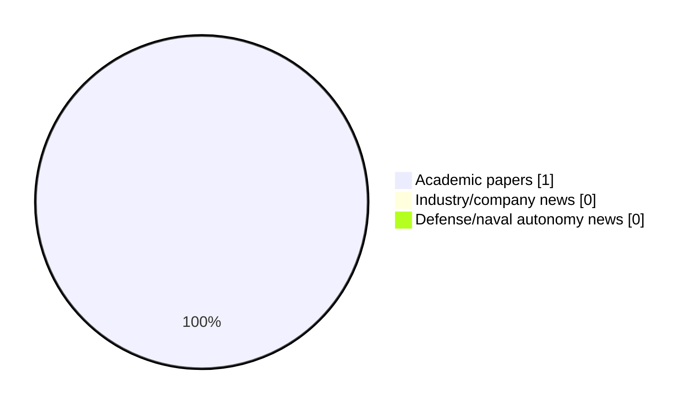

# Maritime Autonomy Watch — 2026-08-30

## Executive Summary

- Total selected items: 1
- Academic papers: 1
- Industry/company news: 0
- Defense/naval autonomy news: 0
- Failed/inaccessible sources: 0

## Contents

- [Analyst Brief](#analyst-brief)
- [Must Read](#must-read)
- [Top Signals Today](#top-signals-today)
- [Topic Signals](#topic-signals)
- [Freshness and Coverage](#freshness-and-coverage)
- [Quality Notes](#quality-notes)
- [Watchlist](#watchlist)
- [Academic Papers](#academic-papers)
- [Industry and Company News](#industry-and-company-news)
- [Defense and Naval Autonomy News](#defense-and-naval-autonomy-news)
- [Source Status Summary](#source-status-summary)

## Analyst Brief

Today's report selected 1 non-duplicate item(s), led by perception. The strongest item is [Machines that know they are aging: a framework for hardware-aware autonomous intelligence](http://arxiv.org/abs/2607.28451v1) from arXiv.
Coverage is weighted toward academic research (1), with 0 industry and 0 defense signal(s).

## Must Read

- [Machines that know they are aging: a framework for hardware-aware autonomous intelligence](http://arxiv.org/abs/2607.28451v1) — Research signal: perception

## Top Signals Today

- perception: 1 selected item(s).

## Topic Signals

- perception: 1

## Freshness and Coverage

- Newest selected item date: 2026-07-30
- Oldest selected item date: 2026-07-30
- Active/enabled sources: 5
- Sources with access problems: 2
- Quality flags: 0

## Quality Notes

- No quality flags on selected items.

## Watchlist

- No watchlist items today.

### Category Snapshot

| Category | Selected items |
|---|---:|
| Academic papers | 1 |
| Industry/company news | 0 |
| Defense/naval autonomy news | 0 |

## Academic Papers

_Selected items: 1_

### [Machines that know they are aging: a framework for hardware-aware autonomous intelligence](http://arxiv.org/abs/2607.28451v1)

- Source: arXiv
- Date: 2026-07-30
- Relevance score: 4.25
- Authors: Cheng Siong Chin, Jianhua Zhang, Mohan Venkateshkumar
- Signal: Research signal: perception
- Topic tags: perception

**Abstract**

Autonomous systems inevitably age, yet their artificial intelligence typically assumes hardware remains in its original condition. Batteries degrade, sensors drift, processors accumulate timing errors, and memory reliability declines, creating a growing mismatch between assumed and actual capability. This can lead to agnostic collapse, where mission failure arises from accumulated hardware degradation rather than a single component fault. We propose Aging-Aware Autonomous Intelligence (AAAI), a framework that integrates hardware health directly into reasoning, planning, and mission execution.

**Why it matters**

This paper may influence autonomy, perception, planning, or control work for maritime robotic systems.

---

## Industry and Company News

_Selected items: 0_

No selected items.

## Defense and Naval Autonomy News

_Selected items: 0_

No selected items.

## Inaccessible or Failed Sources

- None

## Source Status Summary

| Source | Status | Notes |
|---|---|---|
| arXiv | enabled | API source, 15 items fetched |
| OpenAlex | enabled | API source, 15 items fetched |
| RSS feeds | enabled | 107 RSS items fetched |
| SMI MASG News | enabled | HTML source, 10 items fetched |
| IEEE Xplore | disabled | Missing IEEE_XPLORE_API_KEY |
| Elsevier Scopus | enabled | API source, 15 items fetched |
| NewsAPI | disabled | Missing NEWS_API_KEY |

## Metadata

- Generated at: 2026-08-30T13:11:37.453827+02:00
- Date: 2026-08-30
- Repository: ferhannb/MarineRobotics
- Relevance threshold: 4.0
- Deduplication method: DOI, canonical URL, source ID, normalized title, similar recent titles, category caps, and novelty score
