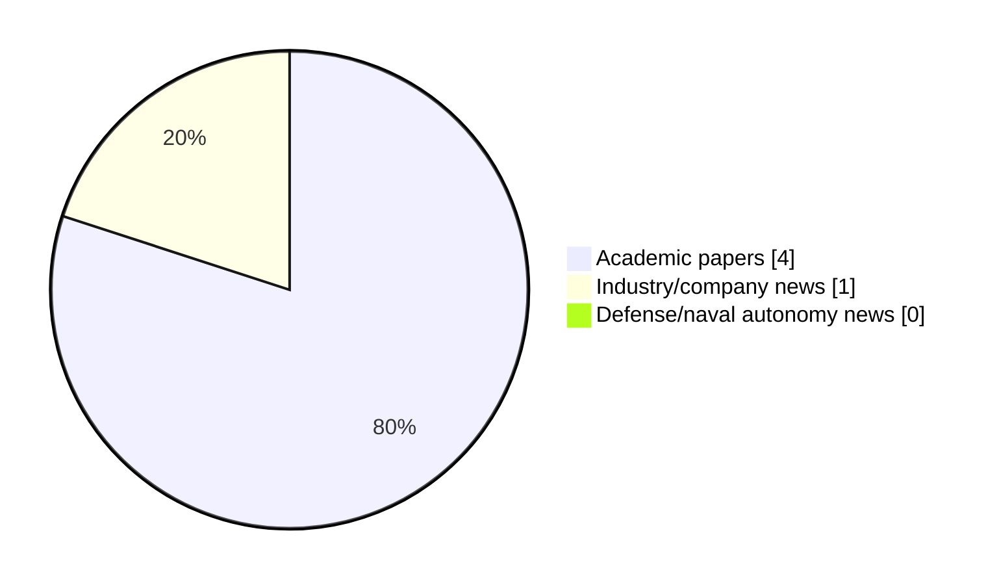

# Maritime Autonomy Watch — 2026-09-01

## Executive Summary

- Total selected items: 5
- Academic papers: 4
- Industry/company news: 1
- Defense/naval autonomy news: 0
- Failed/inaccessible sources: 0

## Contents

- [Analyst Brief](#analyst-brief)
- [Must Read](#must-read)
- [Top Signals Today](#top-signals-today)
- [Topic Signals](#topic-signals)
- [Freshness and Coverage](#freshness-and-coverage)
- [Quality Notes](#quality-notes)
- [Watchlist](#watchlist)
- [Academic Papers](#academic-papers)
- [Industry and Company News](#industry-and-company-news)
- [Defense and Naval Autonomy News](#defense-and-naval-autonomy-news)
- [Source Status Summary](#source-status-summary)

## Analyst Brief

Today's report selected 5 non-duplicate item(s), led by swarm autonomy, USV operations, AUV navigation. The strongest item is [A Cognitive Architecture for Shared Autonomy in AUV Operations](http://arxiv.org/abs/2608.29347v1) from arXiv.
Coverage is weighted toward academic research (4), with 1 industry and 0 defense signal(s).
Quality caveat: low-score-unique=1, missing-summary=1, date-anomaly=1.

## Must Read

- [A Cognitive Architecture for Shared Autonomy in AUV Operations](http://arxiv.org/abs/2608.29347v1) — Research signal: AUV navigation
- [MMUSV-Sim: A Perception-Oriented Simulation and Data-Generation Platform for Multi-USV Cooperative Perception](http://arxiv.org/abs/2608.14207v1) — Research signal: USV operations
- [New Portable Bathymetric Survey Pole Supports USV Hydrographic Surveying](https://www.oceansciencetechnology.com/news/new-portable-bathymetric-survey-pole-supports-usv-hydrographic-surveying/) — Industry signal: USV operations
- [Asynchronous Cooperative Online Learning for Multi-Robot Control under Computational Delays](http://arxiv.org/abs/2608.29562v1) — Research signal: USV operations

## Top Signals Today

- swarm autonomy: 4 selected item(s).
- USV operations: 4 selected item(s).
- AUV navigation: 1 selected item(s).
- perception: 1 selected item(s).
- planning/control: 1 selected item(s).

## Topic Signals

- swarm autonomy: 4
- USV operations: 4
- AUV navigation: 1
- perception: 1
- planning/control: 1
- regulation/legal: 1

## Freshness and Coverage

- Newest selected item date: 2027-01-01
- Oldest selected item date: 2026-08-14
- Active/enabled sources: 4
- Sources with access problems: 3
- Quality flags: 3

## Quality Notes

- low-score-unique: 1
- missing-summary: 1
- date-anomaly: 1
- Date anomalies: [Cooperative multi-USV coverage scheduling in obstacle-rich waters: A DRL-assisted adaptive evolutionary approach](https://api.elsevier.com/content/abstract/scopus_id/105044422334) reports 2027-01-01

## Watchlist

- [Asynchronous Cooperative Online Learning for Multi-Robot Control under Computational Delays](http://arxiv.org/abs/2608.29562v1) — low-score-unique
- [Cooperative multi-USV coverage scheduling in obstacle-rich waters: A DRL-assisted adaptive evolutionary approach](https://api.elsevier.com/content/abstract/scopus_id/105044422334) — missing-summary, date-anomaly

### Category Snapshot

| Category | Selected items |
|---|---:|
| Academic papers | 4 |
| Industry/company news | 1 |
| Defense/naval autonomy news | 0 |

## Academic Papers

_Selected items: 4_

### [A Cognitive Architecture for Shared Autonomy in AUV Operations](http://arxiv.org/abs/2608.29347v1)

- Source: arXiv
- Date: 2026-08-29
- Relevance score: 10
- Authors: Niamh Ellis, Thi Tran, Ignacio Carlucho, Yvan R. Petillot
- Signal: Research signal: AUV navigation
- Topic tags: AUV navigation, swarm autonomy

**Abstract**

Operators remain essential to Remotely Operated Vehicle (ROV) operation, yet often suffer from low situational awareness and high workload, both of which negatively affect safety. This paper presents a cognitive architecture consisting of an ontology and multiple Large Language Models (LLMs) to assist the operator at all stages of the mission. Each LLM is grounded with domain-specific information from the ontology and given a simple role to create a system that can support the operator at all stages of an operation. We are aiming to prove that using the two together will allow decisions to be grounded in the relevant domain knowledge, but also benefit from the reasoning capabilities of the LLM. Our framework determines if a mission is possible for a given Unmanned Underwater Vehicle (UUV), performs mission planning, and executes a given mission in simulation.

**Why it matters**

Relevant to underwater autonomy, multi-vehicle coordination; the work may inform maritime autonomy research, testing priorities, or system design.

---

### [MMUSV-Sim: A Perception-Oriented Simulation and Data-Generation Platform for Multi-USV Cooperative Perception](http://arxiv.org/abs/2608.14207v1)

- Source: arXiv
- Date: 2026-08-14
- Relevance score: 10
- Authors: Ziao Li, Jianxiong Ye, Biao Tang, Leping Zhang, Kun Zuo, Siyu Huang, Chenqiang Gao
- Signal: Research signal: USV operations
- Topic tags: USV operations, swarm autonomy, perception

**Abstract**

Cooperative perception among multiple unmanned surface vehicles (USVs) combines complementary observations to extend maritime target sensing beyond the view range and field of a single platform. Developing such systems at scale calls for a unified workflow for configurable multi-USV scenarios, multimodal acquisition, and shared annotations. We present MMUSV-Sim, a perception-oriented maritime simulation and data-generation platform built on Unreal Engine 5 and Project AirSim. It provides island, open-sea, and port environments; configurable weather, time of day, and wave conditions; a diverse vessel asset library; and spline-based multi-vessel motion. MMUSV-Sim acquires RGB, depth, semantic, LiDAR, and radar observations across multiple USVs and captures a common world state for per-agent annotation export.

**Why it matters**

Relevant to surface-vessel operations; the work may inform maritime autonomy research, testing priorities, or system design.

---

### [Asynchronous Cooperative Online Learning for Multi-Robot Control under Computational Delays](http://arxiv.org/abs/2608.29562v1)

- Source: arXiv
- Date: 2026-08-30
- Relevance score: 3.5
- Authors: Xiaobing Dai, Zewen Yang, Wei Ren, Sandra Hirche
- Signal: Research signal: USV operations
- Topic tags: USV operations, swarm autonomy, planning/control, regulation/legal
- Quality flags: low-score-unique

**Abstract**

Ensuring the safe operation of multi-agent systems (MASs) under uncertain environments is crucial for cooperative robotic, where external disturbances and inaccurate dynamic models can significantly compromise performance and reliability. To address this challenge, calibrated machine learning models, particularly Gaussian process (GP) regression, are extensively employed due to their interpretable performance quantification. As the interconnected communication of MASs facilitates cooperative learning, agents are able to enhance learning performance by exchanging local GP inferences with their neighbors and aggregating the received information via distributed GP strategies. However, variations in computational power and prediction tasks among agents inevitably lead to heterogeneous computational delays and differences in query points, which are often overlooked in existing aggregation methods.

**Why it matters**

Relevant to surface-vessel operations, multi-vehicle coordination; the work may inform maritime autonomy research, testing priorities, or system design.

---

### [Cooperative multi-USV coverage scheduling in obstacle-rich waters: A DRL-assisted adaptive evolutionary approach](https://api.elsevier.com/content/abstract/scopus_id/105044422334)

- Source: Elsevier Scopus
- Date: 2027-01-01
- Relevance score: 4.5
- DOI: 10.1016/j.eswa.2026.133648
- Signal: Research signal: USV operations
- Topic tags: USV operations, swarm autonomy
- Quality flags: missing-summary, date-anomaly

**Abstract**

No summary available.

**Why it matters**

Relevant to surface-vessel operations; the work may inform maritime autonomy research, testing priorities, or system design.

---

## Industry and Company News

_Selected items: 1_

### [New Portable Bathymetric Survey Pole Supports USV Hydrographic Surveying](https://www.oceansciencetechnology.com/news/new-portable-bathymetric-survey-pole-supports-usv-hydrographic-surveying/)

- Source: oceansciencetechnology.com
- Date: 2026-09-01
- Relevance score: 4.5
- Signal: Industry signal: USV operations
- Topic tags: USV operations

**Summary**

AGISTAR, in collaboration with GEOBSYS and DIRECT TOPO, has introduced the GEOSTIX, a portable bathymetric survey pole designed for hydrographic.

**Why it matters**

Signals momentum in surface-vessel operations; useful for tracking product direction, partnerships, and deployment opportunities.

---

## Defense and Naval Autonomy News

_Selected items: 0_

No selected items.

## Inaccessible or Failed Sources

- None

## Source Status Summary

| Source | Status | Notes |
|---|---|---|
| arXiv | enabled | API source, 15 items fetched |
| OpenAlex | enabled | API source, 15 items fetched |
| RSS feeds | partial | 97 RSS items fetched; failures: https://massworld.news/feed/: Invalid XML from https://massworld.news/feed/: mismatched tag: line 93, column 2 |
| SMI MASG News | enabled | HTML source, 0 items fetched |
| IEEE Xplore | disabled | Missing IEEE_XPLORE_API_KEY |
| Elsevier Scopus | enabled | API source, 15 items fetched |
| NewsAPI | disabled | Missing NEWS_API_KEY |

## Metadata

- Generated at: 2026-09-01T13:02:17.424630+02:00
- Date: 2026-09-01
- Repository: ferhannb/MarineRobotics
- Relevance threshold: 4.0
- Deduplication method: DOI, canonical URL, source ID, normalized title, similar recent titles, category caps, and novelty score
