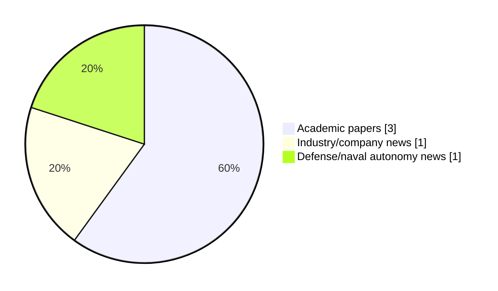

# Maritime Autonomy Watch — 2026-09-02

## Executive Summary

- Total selected items: 5
- Academic papers: 3
- Industry/company news: 1
- Defense/naval autonomy news: 1
- Failed/inaccessible sources: 0

## Contents

- [Analyst Brief](#analyst-brief)
- [Must Read](#must-read)
- [Top Signals Today](#top-signals-today)
- [Topic Signals](#topic-signals)
- [Freshness and Coverage](#freshness-and-coverage)
- [Quality Notes](#quality-notes)
- [Watchlist](#watchlist)
- [Academic Papers](#academic-papers)
- [Industry and Company News](#industry-and-company-news)
- [Defense and Naval Autonomy News](#defense-and-naval-autonomy-news)
- [Source Status Summary](#source-status-summary)

## Analyst Brief

Today's report selected 5 non-duplicate item(s), led by USV operations, defense adoption, planning/control. The strongest item is [Subsea Robotics](https://doi.org/10.1201/9781003737476) from OpenAlex.
Coverage is weighted toward academic research (3), with 1 industry and 1 defense signal(s).
Quality caveat: missing-summary=1, date-anomaly=1, low-score-unique=1.

## Must Read

- [Subsea Robotics](https://doi.org/10.1201/9781003737476) — Research signal: planning/control
- [Cambridge Pixel to Showcase USV Software Solutions at SMM Maritime Fair](https://www.oceansciencetechnology.com/news/cambridge-pixel-to-showcase-usv-software-solutions-at-smm-maritime-fair/) — Industry signal: USV operations
- [HII Odyssey ACS Software Bridges Manned & Unmanned Naval Fleets](https://oceannews.com/news/science-technology/hii-odyssey-acs-software-bridges-manned-unmanned-naval-fleets/) — Defense signal: USV operations
- [Autonomous robotic bridging using distributed swarm control without inter-agent communication](http://arxiv.org/abs/2609.01394v1) — Research signal: USV operations

## Top Signals Today

- USV operations: 3 selected item(s).
- defense adoption: 2 selected item(s).
- planning/control: 2 selected item(s).
- critical infrastructure: 1 selected item(s).
- swarm autonomy: 1 selected item(s).

## Topic Signals

- USV operations: 3
- defense adoption: 2
- planning/control: 2
- critical infrastructure: 1
- swarm autonomy: 1
- perception: 1
- AUV navigation: 1

## Freshness and Coverage

- Newest selected item date: 2027-01-01
- Oldest selected item date: 2026-07-31
- Active/enabled sources: 5
- Sources with access problems: 2
- Quality flags: 3

## Quality Notes

- missing-summary: 1
- date-anomaly: 1
- low-score-unique: 1
- Date anomalies: [Positioning System for Autonomous Underwater Vehicles Equipped with Multilink Manipulators Near Work Objects](https://api.elsevier.com/content/abstract/scopus_id/105048342838) reports 2027-01-01

## Watchlist

- [Positioning System for Autonomous Underwater Vehicles Equipped with Multilink Manipulators Near Work Objects](https://api.elsevier.com/content/abstract/scopus_id/105048342838) — missing-summary, date-anomaly, low-score-unique

### Category Snapshot

| Category | Selected items |
|---|---:|
| Academic papers | 3 |
| Industry/company news | 1 |
| Defense/naval autonomy news | 1 |

## Academic Papers

_Selected items: 3_

### [Subsea Robotics](https://doi.org/10.1201/9781003737476)

- Source: OpenAlex
- Date: 2026-07-31
- Relevance score: 10
- Authors: Amit Ray
- DOI: 10.1201/9781003737476
- Signal: Research signal: planning/control
- Topic tags: planning/control, critical infrastructure, defense adoption

**Abstract**

Subsea Robotics addresses the complex challenges in underwater oceanographic data collection, submerged infrastructure inspection, and subsea defense missions. This book offers a comprehensive, system‑level perspective on subsea robotics by integrating engineering fundamentals with real‑world deployment practices. It covers design, propulsion, autonomy, navigation, communication, and operational standards. By combining core engineering principles with deployment realities, the book shows how subsea robots are designed and built to meet real‑world constraints.

**Why it matters**

Relevant to underwater autonomy, infrastructure monitoring, naval adoption; the work may inform maritime autonomy research, testing priorities, or system design.

---

### [Autonomous robotic bridging using distributed swarm control without inter-agent communication](http://arxiv.org/abs/2609.01394v1)

- Source: arXiv
- Date: 2026-09-01
- Relevance score: 8.75
- Authors: Vishwaak C. Thamaraiselvan, Cody L. Lundberg, Michail Theofandis, Suhas Chelian, Nicholas R. Gans
- Signal: Research signal: USV operations
- Topic tags: USV operations, swarm autonomy, perception, planning/control

**Abstract**

We describe SCARAB--Swarm-Capable Autonomous Robotic Aquatic Bridging. Using distributed swarm control and multi-model sensing of agents and docking targets, agents can localize themselves, join into formations and proceed to desired target locations. Our technologies would eventually allow the Army to perform unpredictable, dispersed river crossings, enhance crew survivability, and minimize the logistics footprint compared to the current Improved Ribbon Bridge. Our methods operate without GPS or RF communications, though these can be used in non-contested environments (e.g., civilian disaster relief for flooding, etc.). We demonstrate our system via physics-engine-based simulation of several agents using unmanned surface vehicles (USVs) in the presence of currents and wind.

**Why it matters**

Relevant to surface-vessel operations, multi-vehicle coordination; the work may inform maritime autonomy research, testing priorities, or system design.

---

### [Positioning System for Autonomous Underwater Vehicles Equipped with Multilink Manipulators Near Work Objects](https://api.elsevier.com/content/abstract/scopus_id/105048342838)

- Source: Elsevier Scopus
- Date: 2027-01-01
- Relevance score: 3.5
- DOI: 10.1007/978-3-032-34387-1_13
- Signal: Research signal: AUV navigation
- Topic tags: AUV navigation
- Quality flags: missing-summary, date-anomaly, low-score-unique

**Abstract**

No summary available.

**Why it matters**

Relevant to underwater autonomy; the work may inform maritime autonomy research, testing priorities, or system design.

---

## Industry and Company News

_Selected items: 1_

### [Cambridge Pixel to Showcase USV Software Solutions at SMM Maritime Fair](https://www.oceansciencetechnology.com/news/cambridge-pixel-to-showcase-usv-software-solutions-at-smm-maritime-fair/)

- Source: oceansciencetechnology.com
- Date: 2026-09-02
- Relevance score: 8.75
- Signal: Industry signal: USV operations
- Topic tags: USV operations

**Summary**

Cambridge Pixel is demonstrating its software components for developers and integrators of uncrewed and autonomous surface vessels at the SMM.

**Why it matters**

Signals momentum in surface-vessel operations; useful for tracking product direction, partnerships, and deployment opportunities.

---

## Defense and Naval Autonomy News

_Selected items: 1_

### [HII Odyssey ACS Software Bridges Manned & Unmanned Naval Fleets](https://oceannews.com/news/science-technology/hii-odyssey-acs-software-bridges-manned-unmanned-naval-fleets/)

- Source: oceannews.com
- Date: 2026-09-01
- Relevance score: 8.75
- Signal: Defense signal: USV operations
- Topic tags: USV operations, defense adoption

**Summary**

A frigate operating near a contested maritime chokepoint detects indicators that enemy mines may have been laid overnight. Rather than send sailors into harm's way, the ship launches a ROMULUS unmanned surface vessel (USV) to conduct reconnaissance in the dangerous waters ahead.

**Why it matters**

Signals movement in surface-vessel operations, naval adoption; useful for tracking operational concepts, procurement direction, and fleet integration.

---

## Inaccessible or Failed Sources

- None

## Source Status Summary

| Source | Status | Notes |
|---|---|---|
| arXiv | enabled | API source, 15 items fetched |
| OpenAlex | enabled | API source, 15 items fetched |
| RSS feeds | enabled | 107 RSS items fetched |
| SMI MASG News | enabled | HTML source, 10 items fetched |
| IEEE Xplore | disabled | Missing IEEE_XPLORE_API_KEY |
| Elsevier Scopus | enabled | API source, 15 items fetched |
| NewsAPI | disabled | Missing NEWS_API_KEY |

## Metadata

- Generated at: 2026-09-02T12:33:59.096077+02:00
- Date: 2026-09-02
- Repository: ferhannb/MarineRobotics
- Relevance threshold: 4.0
- Deduplication method: DOI, canonical URL, source ID, normalized title, similar recent titles, category caps, and novelty score
