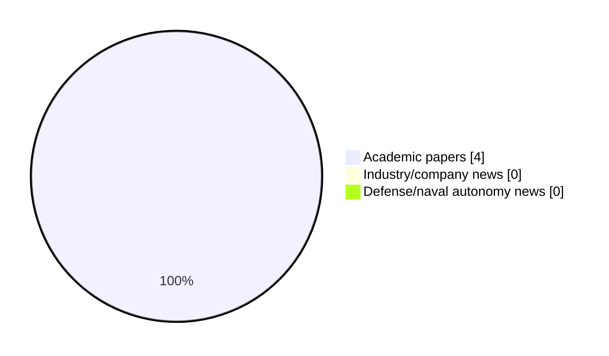

# Maritime Autonomy Watch — 2026-09-03

## Executive Summary

- Total selected items: 4
- Academic papers: 4
- Industry/company news: 0
- Defense/naval autonomy news: 0
- Failed/inaccessible sources: 0

## Contents

- [Analyst Brief](#analyst-brief)
- [Must Read](#must-read)
- [Top Signals Today](#top-signals-today)
- [Topic Signals](#topic-signals)
- [Freshness and Coverage](#freshness-and-coverage)
- [Quality Notes](#quality-notes)
- [Watchlist](#watchlist)
- [Academic Papers](#academic-papers)
- [Industry and Company News](#industry-and-company-news)
- [Defense and Naval Autonomy News](#defense-and-naval-autonomy-news)
- [Source Status Summary](#source-status-summary)

## Analyst Brief

Today's report selected 4 non-duplicate item(s), led by USV operations, planning/control, AUV navigation. The strongest item is [Advancing Accessible Underwater Robotics: The Mini-Girona I-AUV at RAMI 2025](http://arxiv.org/abs/2609.02605v1) from arXiv.
Coverage is weighted toward academic research (4), with 0 industry and 0 defense signal(s).
Quality caveat: missing-summary=2, date-anomaly=2, low-score-unique=1.

## Must Read

- [Advancing Accessible Underwater Robotics: The Mini-Girona I-AUV at RAMI 2025](http://arxiv.org/abs/2609.02605v1) — Research signal: AUV navigation
- [Development of a Solar Autonomous Boat Navigation Guidance System for Future Swarm Unmanned-Surface-Vehicle Implementation](https://doi.org/10.55981/jet.774) — Research signal: USV operations

## Top Signals Today

- USV operations: 3 selected item(s).
- planning/control: 3 selected item(s).
- AUV navigation: 1 selected item(s).
- perception: 1 selected item(s).
- swarm autonomy: 1 selected item(s).

## Topic Signals

- USV operations: 3
- planning/control: 3
- AUV navigation: 1
- perception: 1
- swarm autonomy: 1

## Freshness and Coverage

- Newest selected item date: 2027-01-05
- Oldest selected item date: 2026-08-31
- Active/enabled sources: 5
- Sources with access problems: 2
- Quality flags: 5

## Quality Notes

- missing-summary: 2
- date-anomaly: 2
- low-score-unique: 1
- Date anomalies: [Data-driven fuzzy distributed reinforcement learning optimal resilient control for multi-USV systems under DoS attacks](https://api.elsevier.com/content/abstract/scopus_id/105047024186) reports 2027-01-05; [Marine data-assisted motion control for unmanned surface vehicles in dynamic unknown environments: A distributed deep reinforcement learning approach](https://api.elsevier.com/content/abstract/scopus_id/105048469959) reports 2027-01-01

## Watchlist

- [Data-driven fuzzy distributed reinforcement learning optimal resilient control for multi-USV systems under DoS attacks](https://api.elsevier.com/content/abstract/scopus_id/105047024186) — missing-summary, date-anomaly
- [Marine data-assisted motion control for unmanned surface vehicles in dynamic unknown environments: A distributed deep reinforcement learning approach](https://api.elsevier.com/content/abstract/scopus_id/105048469959) — missing-summary, date-anomaly, low-score-unique

### Category Snapshot

| Category | Selected items |
|---|---:|
| Academic papers | 4 |
| Industry/company news | 0 |
| Defense/naval autonomy news | 0 |

## Academic Papers

_Selected items: 4_

### [Advancing Accessible Underwater Robotics: The Mini-Girona I-AUV at RAMI 2025](http://arxiv.org/abs/2609.02605v1)

- Source: arXiv
- Date: 2026-09-02
- Relevance score: 10
- Authors: Taqi Hamoda, Bilal Ahmed, Deborah Ele-Ojo, Thi Tran Ha Bao, Adel Saidani, Mazen Elgabalawy, Alaaeddine Chaarani, Sebastian Realpe, Patryk Cieslak, Pere Ridao, Narcis Palomeras, Nuno Gracias
- Signal: Research signal: AUV navigation
- Topic tags: AUV navigation, perception

**Abstract**

The Mini-Girona Intervention Autonomous Underwater Vehicle (I-AUV) represents an advancement in accessible underwater robotics, designed to bridge the gap between costly, specialized research AUVs and basic Remotely Operated Vehicles (ROVs). Developed with a focus on affordability and usability, the Mini-Girona, priced at approximately $50,000, integrates advanced components such as a 5-DOF manipulator arm, stereo vision, and AI-driven processing for autonomous navigation and intervention tasks. This paper presents the design and development of the Mini-Girona, detailing its performance during the RAMI 2025 student competition. Despite challenges such as thermal management issues and restricted team access, the Mini-Girona achieved second place overall, excelling in vision-based perception and intervention tasks.

**Why it matters**

Relevant to underwater autonomy; the work may inform maritime autonomy research, testing priorities, or system design.

---

### [Development of a Solar Autonomous Boat Navigation Guidance System for Future Swarm Unmanned-Surface-Vehicle Implementation](https://doi.org/10.55981/jet.774)

- Source: OpenAlex
- Date: 2026-08-31
- Relevance score: 10
- Authors: Denny Darlis, Nurul Fahmi Adani Syam, Aris Hartaman
- DOI: 10.55981/jet.774
- Signal: Research signal: USV operations
- Topic tags: USV operations, swarm autonomy, planning/control

**Abstract**

Changes in the quality of the lake environment due to human activities demand efficient and sustainable monitoring solutions. This research designed a navigation guidance system for the solar autonomous boat that operates independently using solar energy and designed as a modular navigation unit to support future swarm-based cooperation between multiple vessels. The system relies on GPS ATGM336H and GY-271 digital compass sensor as positioning and direction determinants, controlled by a TTGO ESP32 LoRa microcontroller. Navigation data is processed in real-time and sent over the LoRa network to a central or intership gateway. This research focuses on the development and validation of the autonomous navigation core, providing the necessary guidance capabilities for integration into a swarm unmanned surface vehicle (USV) framework.

**Why it matters**

Relevant to surface-vessel operations, multi-vehicle coordination, planning and control; the work may inform maritime autonomy research, testing priorities, or system design.

---

### [Data-driven fuzzy distributed reinforcement learning optimal resilient control for multi-USV systems under DoS attacks](https://api.elsevier.com/content/abstract/scopus_id/105047024186)

- Source: Elsevier Scopus
- Date: 2027-01-05
- Relevance score: 4.5
- DOI: 10.1016/j.ins.2026.123998
- Signal: Research signal: USV operations
- Topic tags: USV operations, planning/control
- Quality flags: missing-summary, date-anomaly

**Abstract**

No summary available.

**Why it matters**

Relevant to surface-vessel operations; the work may inform maritime autonomy research, testing priorities, or system design.

---

### [Marine data-assisted motion control for unmanned surface vehicles in dynamic unknown environments: A distributed deep reinforcement learning approach](https://api.elsevier.com/content/abstract/scopus_id/105048469959)

- Source: Elsevier Scopus
- Date: 2027-01-01
- Relevance score: 3.5
- DOI: 10.1016/j.tre.2026.105193
- Signal: Research signal: USV operations
- Topic tags: USV operations, planning/control
- Quality flags: missing-summary, date-anomaly, low-score-unique

**Abstract**

No summary available.

**Why it matters**

Relevant to surface-vessel operations; the work may inform maritime autonomy research, testing priorities, or system design.

---

## Industry and Company News

_Selected items: 0_

No selected items.

## Defense and Naval Autonomy News

_Selected items: 0_

No selected items.

## Inaccessible or Failed Sources

- None

## Source Status Summary

| Source | Status | Notes |
|---|---|---|
| arXiv | enabled | API source, 15 items fetched |
| OpenAlex | enabled | API source, 15 items fetched |
| RSS feeds | enabled | 107 RSS items fetched |
| SMI MASG News | enabled | HTML source, 10 items fetched |
| IEEE Xplore | disabled | Missing IEEE_XPLORE_API_KEY |
| Elsevier Scopus | enabled | API source, 15 items fetched |
| NewsAPI | disabled | Missing NEWS_API_KEY |

## Metadata

- Generated at: 2026-09-03T12:37:47.734215+02:00
- Date: 2026-09-03
- Repository: ferhannb/MarineRobotics
- Relevance threshold: 4.0
- Deduplication method: DOI, canonical URL, source ID, normalized title, similar recent titles, category caps, and novelty score
