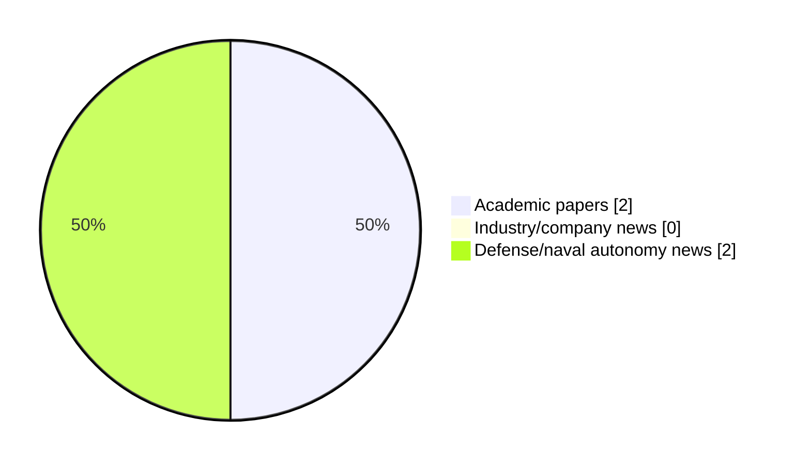

# Maritime Autonomy Watch — 2026-09-04

## Executive Summary

- Total selected items: 4
- Academic papers: 2
- Industry/company news: 0
- Defense/naval autonomy news: 2
- Failed/inaccessible sources: 0

## Contents

- [Analyst Brief](#analyst-brief)
- [Must Read](#must-read)
- [Top Signals Today](#top-signals-today)
- [Topic Signals](#topic-signals)
- [Freshness and Coverage](#freshness-and-coverage)
- [Quality Notes](#quality-notes)
- [Watchlist](#watchlist)
- [Academic Papers](#academic-papers)
- [Industry and Company News](#industry-and-company-news)
- [Defense and Naval Autonomy News](#defense-and-naval-autonomy-news)
- [Source Status Summary](#source-status-summary)

## Analyst Brief

Today's report selected 4 non-duplicate item(s), led by USV operations, defense adoption, AUV navigation. The strongest item is [U.S. Navy Demonstrates USV Refueling At Sea Using Robotic Towed Connector](https://www.navalnews.com/naval-news/2026/09/u-s-navy-demonstrates-usv-refueling-at-sea-using-robotic-towed-connector/) from navalnews.com.
Coverage is weighted toward academic research (2), with 0 industry and 2 defense signal(s).
Quality caveat: low-score-unique=2.

## Must Read

- [U.S. Navy Demonstrates USV Refueling At Sea Using Robotic Towed Connector](https://www.navalnews.com/naval-news/2026/09/u-s-navy-demonstrates-usv-refueling-at-sea-using-robotic-towed-connector/) — Defense signal: USV operations
- [Dynamic SpectraFormer for Ultra-High-Definition Underwater Image Enhancement](http://arxiv.org/abs/2608.18662v1) — Research signal: AUV navigation
- [Disturbance-observer-based adaptive neuro-fuzzy sliding mode control for collaborative ASV and URV systems](https://doi.org/10.1007/s44465-026-00032-1) — Research signal: USV operations
- [US Navy Certifies Rolls-Royce mtu Engines for Autonomous Ships](https://www.navalnews.com/naval-news/2026/09/us-navy-certifies-rolls-royce-mtu-engines-for-autonomous-ships/) — Defense signal: defense adoption

## Top Signals Today

- USV operations: 2 selected item(s).
- defense adoption: 2 selected item(s).
- AUV navigation: 1 selected item(s).
- planning/control: 1 selected item(s).
- regulation/legal: 1 selected item(s).

## Topic Signals

- USV operations: 2
- defense adoption: 2
- AUV navigation: 1
- planning/control: 1
- regulation/legal: 1

## Freshness and Coverage

- Newest selected item date: 2026-09-04
- Oldest selected item date: 2026-08-03
- Active/enabled sources: 5
- Sources with access problems: 2
- Quality flags: 2

## Quality Notes

- low-score-unique: 2

## Watchlist

- [US Navy Certifies Rolls-Royce mtu Engines for Autonomous Ships](https://www.navalnews.com/naval-news/2026/09/us-navy-certifies-rolls-royce-mtu-engines-for-autonomous-ships/) — low-score-unique
- [Disturbance-observer-based adaptive neuro-fuzzy sliding mode control for collaborative ASV and URV systems](https://doi.org/10.1007/s44465-026-00032-1) — low-score-unique

### Category Snapshot

| Category | Selected items |
|---|---:|
| Academic papers | 2 |
| Industry/company news | 0 |
| Defense/naval autonomy news | 2 |

## Academic Papers

_Selected items: 2_

### [Dynamic SpectraFormer for Ultra-High-Definition Underwater Image Enhancement](http://arxiv.org/abs/2608.18662v1)

- Source: arXiv
- Date: 2026-08-19
- Relevance score: 8.5
- Authors: Zhiqiang Hu, Tao Yu, Shouren Huang, Masatoshi Ishikawa
- Signal: Research signal: AUV navigation
- Topic tags: AUV navigation

**Abstract**

Underwater images suffer from color distortion, haze, and poor visibility due to light refraction and absorption in water. These challenges significantly impact the utilization of Autonomous Underwater Vehicles (AUVs) or marine robots. Typically, color and brightness distortions manifest at lower frequencies, while edge and texture distortions are prevalent at higher frequencies. Traditional methods struggle to concurrently rectify these mixed distortions as they primarily concentrate on the spatial domain. To address these issues, we introduce the Dynamic SpectraFormer, which enhances underwater images through a frequency domain transformer. The Dynamic SpectraFormer introduces an ultra-high-resolution sparse spectrum attention module, which could capture the long-term dependency without losing the universal approximating power.

**Why it matters**

Relevant to underwater autonomy; the work may inform maritime autonomy research, testing priorities, or system design.

---

### [Disturbance-observer-based adaptive neuro-fuzzy sliding mode control for collaborative ASV and URV systems](https://doi.org/10.1007/s44465-026-00032-1)

- Source: OpenAlex
- Date: 2026-08-03
- Relevance score: 3.75
- Authors: Mustafa Wassef Hasan, Nizar Hadi Abbas
- DOI: 10.1007/s44465-026-00032-1
- Signal: Research signal: USV operations
- Topic tags: USV operations, planning/control, regulation/legal
- Quality flags: low-score-unique

**Abstract**

This paper proposes a disturbance-observer-based adaptive neuro-fuzzy sliding mode control (DO-ANFSMC) framework for collaborative autonomous surface vehicle (ASV) and underwater robotic vehicle (URV) systems operating in search-and-rescue missions under environmental disturbances and obstacle-avoidance constraints. The proposed framework integrates an adaptive neuro-fuzzy system for approximating unknown nonlinear dynamics, a nonlinear disturbance observer for estimating lumped environmental disturbances and residual uncertainties, and a robust sliding-mode control law for trajectory tracking. The controller parameters are adaptively tuned online using an improved grey wolf optimizer with chaotic theory (IGWO-CT), whose optimization performance is first evaluated using standard benchmark functions. MATLAB simulations are conducted for one ASV and two URVs under identical mission conditions with eight static obstacles.

**Why it matters**

Relevant to underwater autonomy, planning and control; the work may inform maritime autonomy research, testing priorities, or system design.

---

## Industry and Company News

_Selected items: 0_

No selected items.

## Defense and Naval Autonomy News

_Selected items: 2_

### [U.S. Navy Demonstrates USV Refueling At Sea Using Robotic Towed Connector](https://www.navalnews.com/naval-news/2026/09/u-s-navy-demonstrates-usv-refueling-at-sea-using-robotic-towed-connector/)

- Source: navalnews.com
- Date: 2026-09-04
- Relevance score: 8.75
- Signal: Defense signal: USV operations
- Topic tags: USV operations, defense adoption

**Summary**

The U.S. Navy's NAWCWD has successfully demonstrated USV refueling at sea using a Robotic Towed Connector, advancing autonomous surface vessel operations.

**Why it matters**

Signals movement in surface-vessel operations, naval adoption; useful for tracking operational concepts, procurement direction, and fleet integration.

---

### [US Navy Certifies Rolls-Royce mtu Engines for Autonomous Ships](https://www.navalnews.com/naval-news/2026/09/us-navy-certifies-rolls-royce-mtu-engines-for-autonomous-ships/)

- Source: navalnews.com
- Date: 2026-09-04
- Relevance score: 3
- Signal: Defense signal: defense adoption
- Topic tags: defense adoption
- Quality flags: low-score-unique

**Summary**

Rolls-Royce announced that its MTU Series 4000 and Series 2000 marine engines have received certification from the U.S. Navy for use in autonomous naval vessel operations, marking a significant milestone in the advancement of unmanned maritime capabilities. Rolls-Royce press release After passing two 720-hour durability tests, mtu Series 4000 engines were certified for use in.

**Why it matters**

Signals movement in naval adoption; useful for tracking operational concepts, procurement direction, and fleet integration.

---

## Inaccessible or Failed Sources

- None

## Source Status Summary

| Source | Status | Notes |
|---|---|---|
| arXiv | enabled | API source, 15 items fetched |
| OpenAlex | enabled | API source, 15 items fetched |
| RSS feeds | enabled | 107 RSS items fetched |
| SMI MASG News | enabled | HTML source, 10 items fetched |
| IEEE Xplore | disabled | Missing IEEE_XPLORE_API_KEY |
| Elsevier Scopus | enabled | API source, 15 items fetched |
| NewsAPI | disabled | Missing NEWS_API_KEY |

## Metadata

- Generated at: 2026-09-04T12:31:21.714910+02:00
- Date: 2026-09-04
- Repository: ferhannb/MarineRobotics
- Relevance threshold: 4.0
- Deduplication method: DOI, canonical URL, source ID, normalized title, similar recent titles, category caps, and novelty score
