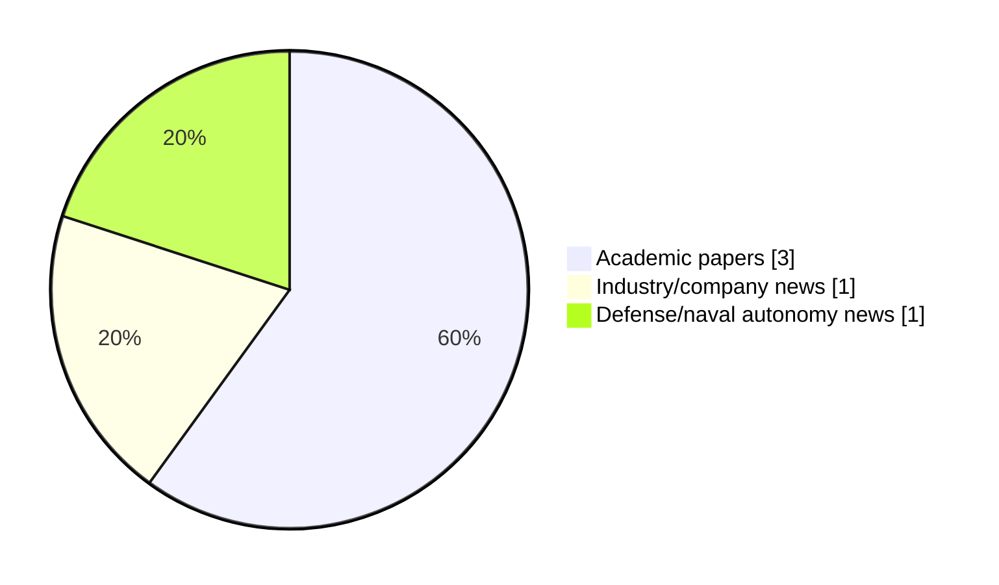

# Maritime Autonomy Watch — 2026-09-05

## Executive Summary

- Total selected items: 5
- Academic papers: 3
- Industry/company news: 1
- Defense/naval autonomy news: 1
- Failed/inaccessible sources: 1

## Contents

- [Analyst Brief](#analyst-brief)
- [Must Read](#must-read)
- [Top Signals Today](#top-signals-today)
- [Topic Signals](#topic-signals)
- [Freshness and Coverage](#freshness-and-coverage)
- [Quality Notes](#quality-notes)
- [Watchlist](#watchlist)
- [Academic Papers](#academic-papers)
- [Industry and Company News](#industry-and-company-news)
- [Defense and Naval Autonomy News](#defense-and-naval-autonomy-news)
- [Source Status Summary](#source-status-summary)

## Analyst Brief

Today's report selected 5 non-duplicate item(s), led by USV operations, swarm autonomy, planning/control. The strongest item is [LLM-Assisted Mission Planning, Predictive Coordination, and Adaptive Topology Management for Resilient USV Swarm Control Under Communication Denial](https://doi.org/10.3390/drones10080594) from OpenAlex.
Coverage is weighted toward academic research (3), with 1 industry and 1 defense signal(s).
Quality caveat: low-score-unique=1.

## Must Read

- [LLM-Assisted Mission Planning, Predictive Coordination, and Adaptive Topology Management for Resilient USV Swarm Control Under Communication Denial](https://doi.org/10.3390/drones10080594) — Research signal: USV operations
- [SubSea Craft Launches Modular Cassette System to Rapidly Reconfigure MARS USV](https://oceannews.com/news/science-technology/subsea-craft-launches-modular-cassette-system-to-rapidly-reconfigure-mars-usv/) — Industry signal: USV operations
- [US Navy, Saildrone to use unmanned systems in expanded counternarcotics role](https://www.defensenews.com/industry/techwatch/2026/08/05/us-navy-saildrone-to-use-unmanned-systems-in-expanded-counternarcotics-role/) — Defense signal: USV operations
- [Model Predictive Control for Multimodal Intelligent Transportation Systems: A Cross-Domain Review of Ground, Rail, Low-Altitude, and Marine Applications](https://doi.org/10.56578/mits050303) — Research signal: planning/control
- [Human 5.0 in Maritime](https://doi.org/10.5152/jbass.2026.25045) — Research signal: swarm autonomy

## Top Signals Today

- USV operations: 3 selected item(s).
- swarm autonomy: 2 selected item(s).
- planning/control: 2 selected item(s).
- critical infrastructure: 2 selected item(s).
- defense adoption: 1 selected item(s).

## Topic Signals

- USV operations: 3
- swarm autonomy: 2
- planning/control: 2
- critical infrastructure: 2
- defense adoption: 1

## Freshness and Coverage

- Newest selected item date: 2026-09-04
- Oldest selected item date: 2026-08-02
- Active/enabled sources: 4
- Sources with access problems: 3
- Quality flags: 1

## Quality Notes

- low-score-unique: 1

## Watchlist

- [Human 5.0 in Maritime](https://doi.org/10.5152/jbass.2026.25045) — low-score-unique

### Category Snapshot

| Category | Selected items |
|---|---:|
| Academic papers | 3 |
| Industry/company news | 1 |
| Defense/naval autonomy news | 1 |

## Academic Papers

_Selected items: 3_

### [LLM-Assisted Mission Planning, Predictive Coordination, and Adaptive Topology Management for Resilient USV Swarm Control Under Communication Denial](https://doi.org/10.3390/drones10080594)

- Source: OpenAlex
- Date: 2026-08-02
- Relevance score: 8
- Authors: Xingda Li, Jianqiang Zhang, Yiping Liu, Pengfei Zhang, Ling Tan
- DOI: 10.3390/drones10080594
- Signal: Research signal: USV operations
- Topic tags: USV operations, swarm autonomy, planning/control

**Abstract**

Unmanned surface vehicle (USV) swarms operating in communication-denied maritime environments face degraded formation control when inter-agent state exchange is disrupted. This paper presents a three-layer control architecture integrating (1) LLM-assisted strategic mission planning with formal safety verification, (2) predictive tactical coordination combining physics-based motion extrapolation with online-learned neighbor behavior models, and (3) DMPC + ADMM execution for constrained formation control. The predictive coordination module in simulation-based evaluation across five representative scenarios reduces formation error by 76.0% (under simulation conditions) during 60 s communication outages compared to zero-hold prediction (Cohen d = 0.88, p < 0.001, DMPC + ADMM validated).

**Why it matters**

Relevant to surface-vessel operations, multi-vehicle coordination; the work may inform maritime autonomy research, testing priorities, or system design.

---

### [Model Predictive Control for Multimodal Intelligent Transportation Systems: A Cross-Domain Review of Ground, Rail, Low-Altitude, and Marine Applications](https://doi.org/10.56578/mits050303)

- Source: OpenAlex
- Date: 2026-08-31
- Relevance score: 4.5
- Authors: Yougang Sun, Dandan Zhang, Bing Ren, Huitong Xie, Yuejian Chen
- DOI: 10.56578/mits050303
- Signal: Research signal: planning/control
- Topic tags: planning/control

**Abstract**

Intelligent transportation systems increasingly rely on connected and autonomous platforms operating across road, rail, low-altitude, and marine environments. These systems must accommodate nonlinear and timevarying dynamics, environmental uncertainty, communication limitations, safety requirements, and tightly coupled operational constraints. Model predictive control (MPC) is well suited to such conditions because it combines futurestate prediction, constrained optimization, and closed-loop correction within a receding-horizon framework. This review examines the theoretical foundations, major formulations, and transportation applications of MPC across four domains: ground vehicles and traffic networks, railway systems, low-altitude unmanned aerial transportation, and marine autonomous systems.

**Why it matters**

Relevant to underwater autonomy, navigation safety, planning and control; the work may inform maritime autonomy research, testing priorities, or system design.

---

### [Human 5.0 in Maritime](https://doi.org/10.5152/jbass.2026.25045)

- Source: OpenAlex
- Date: 2026-08-03
- Relevance score: 3
- Authors: Gülsüm Koraltürk, Güzide Öncü Eroğlu Pektaş
- DOI: 10.5152/jbass.2026.25045
- Signal: Research signal: swarm autonomy
- Topic tags: swarm autonomy, critical infrastructure
- Quality flags: low-score-unique

**Abstract**

Human 5.0 is an approach that positions the human being as a decision-maker, a creative actor, and an individual with high ethical responsibility in a society where artificial intelligence, big data, robotics, autonomous systems, and digital infrastructure are fully integrated. This approach considers the individual from a perspective that prioritizes social and empathetic qualities, societal benefit, and sensitivity to sustainability principles. In the maritime domain, the concept of Human 5.0 can be defined through new-generation maritime operators and deck officers within the processes of maritime business management and ship operations. In other words, it refers to employee profiles operating across all work domains encompassing ship–port–logistics processes within the maritime industry.

**Why it matters**

Relevant to multi-vehicle coordination; the work may inform maritime autonomy research, testing priorities, or system design.

---

## Industry and Company News

_Selected items: 1_

### [SubSea Craft Launches Modular Cassette System to Rapidly Reconfigure MARS USV](https://oceannews.com/news/science-technology/subsea-craft-launches-modular-cassette-system-to-rapidly-reconfigure-mars-usv/)

- Source: oceannews.com
- Date: 2026-09-04
- Relevance score: 6
- Signal: Industry signal: USV operations
- Topic tags: USV operations, critical infrastructure
- Also reported by: https://www.navalnews.com/feed/

**Summary**

SubSea Craft (SSC) has unveiled a new modular payload cassette system for MARS, their compact Unmanned Surface Vessel (USV), enabling the delivery of mission-configurable effects in contested environments.

**Why it matters**

Signals momentum in surface-vessel operations; useful for tracking product direction, partnerships, and deployment opportunities.

---

## Defense and Naval Autonomy News

_Selected items: 1_

### [US Navy, Saildrone to use unmanned systems in expanded counternarcotics role](https://www.defensenews.com/industry/techwatch/2026/08/05/us-navy-saildrone-to-use-unmanned-systems-in-expanded-counternarcotics-role/)

- Source: defensenews.com
- Date: 2026-08-05
- Relevance score: 4.75
- Signal: Defense signal: USV operations
- Topic tags: USV operations, defense adoption

**Summary**

The U.S. Navy is extending its use of Saildrone unmanned surface vehicles for an expanded counternarcotics mission.

**Why it matters**

Signals movement in surface-vessel operations, naval adoption; useful for tracking operational concepts, procurement direction, and fleet integration.

---

## Inaccessible or Failed Sources

- arXiv: HTTP 429 for https://export.arxiv.org/api/query?search_query=all%3A%22maritime+autonomy%22+OR+all%3A%22marine+robotics%22+OR+all%3A%22autonomous+vessel%22+OR+all%3A%22autonomous+mission%22+OR+all%3A%22autonomous+surface+vessel%22+OR+all%3A%22autonomous+underwater+vehicle%22+OR+all%3A%22unmanned+surface+vehicle%22+OR+all%3A%22unmanned+underwater+vehicle%22&start=0&max_results=15&sortBy=submittedDate&sortOrder=descending

## Source Status Summary

| Source | Status | Notes |
|---|---|---|
| arXiv | failed | HTTP 429 for https://export.arxiv.org/api/query?search_query=all%3A%22maritime+autonomy%22+OR+all%3A%22marine+robotics%22+OR+all%3A%22autonomous+vessel%22+OR+all%3A%22autonomous+mission%22+OR+all%3A%22autonomous+surface+vessel%22+OR+all%3A%22autonomous+underwater+vehicle%22+OR+all%3A%22unmanned+surface+vehicle%22+OR+all%3A%22unmanned+underwater+vehicle%22&start=0&max_results=15&sortBy=submittedDate&sortOrder=descending |
| OpenAlex | enabled | API source, 15 items fetched |
| RSS feeds | enabled | 107 RSS items fetched |
| SMI MASG News | enabled | HTML source, 10 items fetched |
| IEEE Xplore | disabled | Missing IEEE_XPLORE_API_KEY |
| Elsevier Scopus | enabled | API source, 15 items fetched |
| NewsAPI | disabled | Missing NEWS_API_KEY |

## Metadata

- Generated at: 2026-09-05T11:55:01.786254+02:00
- Date: 2026-09-05
- Repository: ferhannb/MarineRobotics
- Relevance threshold: 4.0
- Deduplication method: DOI, canonical URL, source ID, normalized title, similar recent titles, category caps, and novelty score
