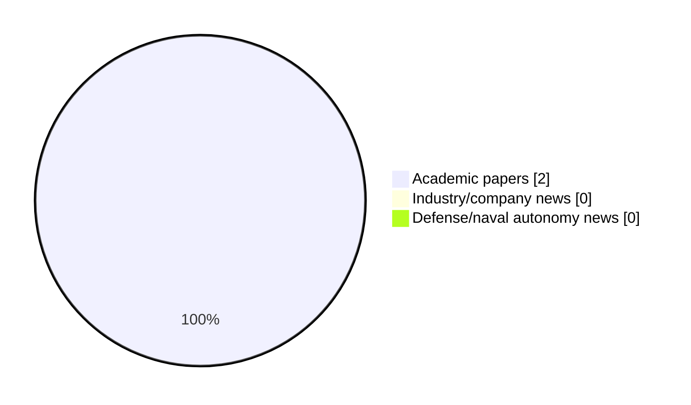

# Maritime Autonomy Watch — 2026-09-06

## Executive Summary

- Total selected items: 2
- Academic papers: 2
- Industry/company news: 0
- Defense/naval autonomy news: 0
- Failed/inaccessible sources: 0

## Contents

- [Analyst Brief](#analyst-brief)
- [Must Read](#must-read)
- [Top Signals Today](#top-signals-today)
- [Topic Signals](#topic-signals)
- [Freshness and Coverage](#freshness-and-coverage)
- [Quality Notes](#quality-notes)
- [Watchlist](#watchlist)
- [Academic Papers](#academic-papers)
- [Industry and Company News](#industry-and-company-news)
- [Defense and Naval Autonomy News](#defense-and-naval-autonomy-news)
- [Source Status Summary](#source-status-summary)

## Analyst Brief

Today's report selected 2 non-duplicate item(s), led by AUV navigation, USV operations, planning/control. The strongest item is [World-Model-Grounded LLM Planning for AUV and ASV Navigation Near Offshore Wind Farms](http://arxiv.org/abs/2608.19661v1) from arXiv.
Coverage is weighted toward academic research (2), with 0 industry and 0 defense signal(s).
Quality caveat: missing-summary=1, date-anomaly=1, low-score-unique=1.

## Must Read

- [World-Model-Grounded LLM Planning for AUV and ASV Navigation Near Offshore Wind Farms](http://arxiv.org/abs/2608.19661v1) — Research signal: AUV navigation

## Top Signals Today

- AUV navigation: 2 selected item(s).
- USV operations: 1 selected item(s).
- planning/control: 1 selected item(s).
- critical infrastructure: 1 selected item(s).

## Topic Signals

- AUV navigation: 2
- USV operations: 1
- planning/control: 1
- critical infrastructure: 1

## Freshness and Coverage

- Newest selected item date: 2027-01-01
- Oldest selected item date: 2026-08-20
- Active/enabled sources: 5
- Sources with access problems: 2
- Quality flags: 3

## Quality Notes

- missing-summary: 1
- date-anomaly: 1
- low-score-unique: 1
- Date anomalies: [A Communication-Efficient Modified Consensus-Based Auction Algorithm for Distributed AUV Task Allocation](https://api.elsevier.com/content/abstract/scopus_id/105048663072) reports 2027-01-01

## Watchlist

- [A Communication-Efficient Modified Consensus-Based Auction Algorithm for Distributed AUV Task Allocation](https://api.elsevier.com/content/abstract/scopus_id/105048663072) — missing-summary, date-anomaly, low-score-unique

### Category Snapshot

| Category | Selected items |
|---|---:|
| Academic papers | 2 |
| Industry/company news | 0 |
| Defense/naval autonomy news | 0 |

## Academic Papers

_Selected items: 2_

### [World-Model-Grounded LLM Planning for AUV and ASV Navigation Near Offshore Wind Farms](http://arxiv.org/abs/2608.19661v1)

- Source: arXiv
- Date: 2026-08-20
- Relevance score: 8.5
- Authors: Markus Buchholz, Ignacio Carlucho, Yvan R. Petillot
- Signal: Research signal: AUV navigation
- Topic tags: AUV navigation, USV operations, planning/control, critical infrastructure

**Abstract**

Large language models can turn a natural-language mission into a sequence of robot actions, but they do not have a sense of physics: they cannot judge how long a command should run, or whether it will make the robot drift into an obstacle. We proposed the use of a world model to expand the capabilities of Large Language model-based planners. Our method has three components: a physics-grounded neural world model, a three-phase gradient-based trajectory optimizer, and a Model Predictive Controller (MPC)-style closed-loop replanner with a trust-region guard. The language model decides what to do, and the world model decides how long, whether that means driving eight thrusters through 6 DOF or two differential thrusters through 3 DOF. We evaluate two marine vehicle classes operating near offshore wind infrastructure: a 6-DOF Autonomous Underwater Vehicle (AUV) and a 3-DOF differential-drive Autonomous Surface Vehicle (ASV).

**Why it matters**

Relevant to underwater autonomy, navigation safety, planning and control; the work may inform maritime autonomy research, testing priorities, or system design.

---

### [A Communication-Efficient Modified Consensus-Based Auction Algorithm for Distributed AUV Task Allocation](https://api.elsevier.com/content/abstract/scopus_id/105048663072)

- Source: Elsevier Scopus
- Date: 2027-01-01
- Relevance score: 3.5
- DOI: 10.1007/978-3-032-34384-0_24
- Signal: Research signal: AUV navigation
- Topic tags: AUV navigation
- Quality flags: missing-summary, date-anomaly, low-score-unique

**Abstract**

No summary available.

**Why it matters**

Relevant to underwater autonomy; the work may inform maritime autonomy research, testing priorities, or system design.

---

## Industry and Company News

_Selected items: 0_

No selected items.

## Defense and Naval Autonomy News

_Selected items: 0_

No selected items.

## Inaccessible or Failed Sources

- None

## Source Status Summary

| Source | Status | Notes |
|---|---|---|
| arXiv | enabled | API source, 15 items fetched |
| OpenAlex | enabled | API source, 15 items fetched |
| RSS feeds | enabled | 107 RSS items fetched |
| SMI MASG News | enabled | HTML source, 10 items fetched |
| IEEE Xplore | disabled | Missing IEEE_XPLORE_API_KEY |
| Elsevier Scopus | enabled | API source, 15 items fetched |
| NewsAPI | disabled | Missing NEWS_API_KEY |

## Metadata

- Generated at: 2026-09-06T12:12:50.977101+02:00
- Date: 2026-09-06
- Repository: ferhannb/MarineRobotics
- Relevance threshold: 4.0
- Deduplication method: DOI, canonical URL, source ID, normalized title, similar recent titles, category caps, and novelty score
