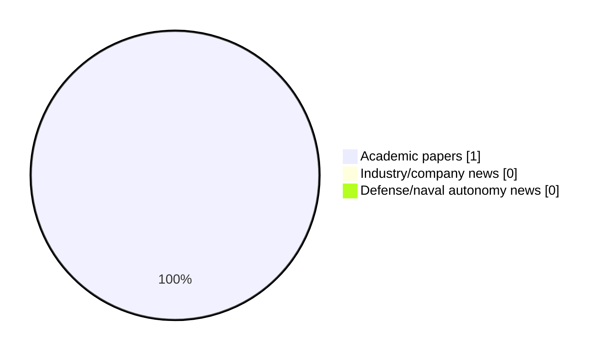

# Maritime Autonomy Watch — 2026-09-07

## Executive Summary

- Total selected items: 1
- Academic papers: 1
- Industry/company news: 0
- Defense/naval autonomy news: 0
- Failed/inaccessible sources: 0

## Contents

- [Analyst Brief](#analyst-brief)
- [Must Read](#must-read)
- [Top Signals Today](#top-signals-today)
- [Topic Signals](#topic-signals)
- [Freshness and Coverage](#freshness-and-coverage)
- [Quality Notes](#quality-notes)
- [Watchlist](#watchlist)
- [Academic Papers](#academic-papers)
- [Industry and Company News](#industry-and-company-news)
- [Defense and Naval Autonomy News](#defense-and-naval-autonomy-news)
- [Source Status Summary](#source-status-summary)

## Analyst Brief

Today's report selected 1 non-duplicate item(s), led by USV operations, swarm autonomy, perception. The strongest item is [Ocean-aware deep learning for civilian maritime object detection and tracking in complex ocean environments: a comprehensive review](https://doi.org/10.3389/fmars.2026.1929278) from OpenAlex.
Coverage is weighted toward academic research (1), with 0 industry and 0 defense signal(s).

## Must Read

- [Ocean-aware deep learning for civilian maritime object detection and tracking in complex ocean environments: a comprehensive review](https://doi.org/10.3389/fmars.2026.1929278) — Research signal: USV operations

## Top Signals Today

- USV operations: 1 selected item(s).
- swarm autonomy: 1 selected item(s).
- perception: 1 selected item(s).
- critical infrastructure: 1 selected item(s).

## Topic Signals

- USV operations: 1
- swarm autonomy: 1
- perception: 1
- critical infrastructure: 1

## Freshness and Coverage

- Newest selected item date: 2026-09-04
- Oldest selected item date: 2026-09-04
- Active/enabled sources: 5
- Sources with access problems: 2
- Quality flags: 0

## Quality Notes

- No quality flags on selected items.

## Watchlist

- No watchlist items today.

### Category Snapshot

| Category | Selected items |
|---|---:|
| Academic papers | 1 |
| Industry/company news | 0 |
| Defense/naval autonomy news | 0 |

## Academic Papers

_Selected items: 1_

### [Ocean-aware deep learning for civilian maritime object detection and tracking in complex ocean environments: a comprehensive review](https://doi.org/10.3389/fmars.2026.1929278)

- Source: OpenAlex
- Date: 2026-09-04
- Relevance score: 9.5
- Authors: Faisal Alsaaq
- DOI: 10.3389/fmars.2026.1929278
- Signal: Research signal: USV operations
- Topic tags: USV operations, swarm autonomy, perception, critical infrastructure

**Abstract**

Reliable maritime object detection and tracking are essential for civilian ocean engineering applications, including vessel traffic monitoring, offshore infrastructure inspection, port management, marine debris surveillance, sea ice observation, hydrographic surveying, and environmental risk assessment. However, complex ocean environments present substantial challenges for automated perception systems because of dynamic sea surfaces, sea clutter, low SNRs, atmospheric interference, scale variation, occlusion, weak target signatures, and limited annotated datasets.

**Why it matters**

Relevant to surface-vessel operations, multi-vehicle coordination, infrastructure monitoring; the work may inform maritime autonomy research, testing priorities, or system design.

---

## Industry and Company News

_Selected items: 0_

No selected items.

## Defense and Naval Autonomy News

_Selected items: 0_

No selected items.

## Inaccessible or Failed Sources

- None

## Source Status Summary

| Source | Status | Notes |
|---|---|---|
| arXiv | enabled | API source, 15 items fetched |
| OpenAlex | enabled | API source, 15 items fetched |
| RSS feeds | enabled | 107 RSS items fetched |
| SMI MASG News | enabled | HTML source, 10 items fetched |
| IEEE Xplore | disabled | Missing IEEE_XPLORE_API_KEY |
| Elsevier Scopus | enabled | API source, 15 items fetched |
| NewsAPI | disabled | Missing NEWS_API_KEY |

## Metadata

- Generated at: 2026-09-07T13:29:54.536662+02:00
- Date: 2026-09-07
- Repository: ferhannb/MarineRobotics
- Relevance threshold: 4.0
- Deduplication method: DOI, canonical URL, source ID, normalized title, similar recent titles, category caps, and novelty score
