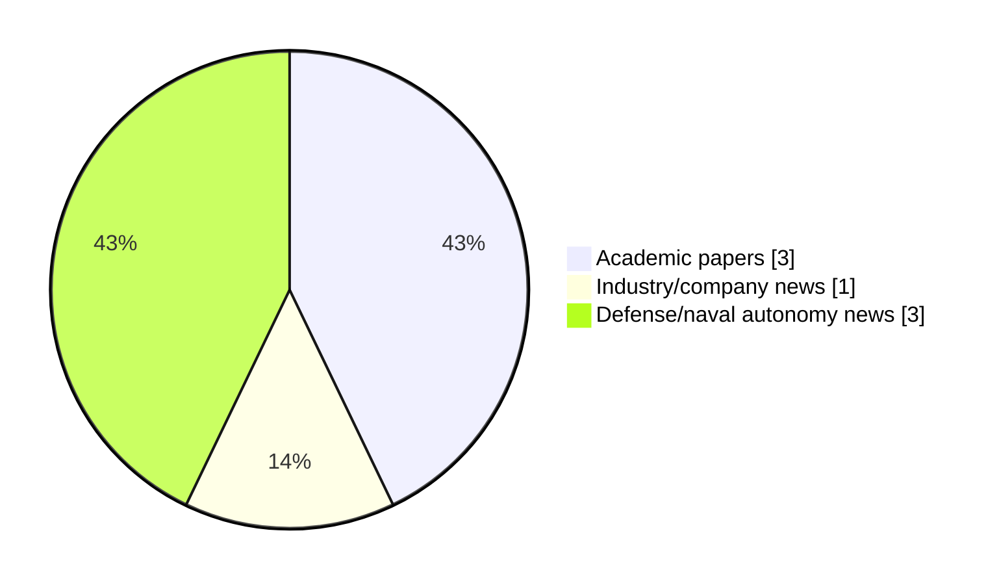

# Maritime Autonomy Watch — 2026-09-09

## Executive Summary

- Total selected items: 7
- Academic papers: 3
- Industry/company news: 1
- Defense/naval autonomy news: 3
- Failed/inaccessible sources: 0

## Contents

- [Analyst Brief](#analyst-brief)
- [Must Read](#must-read)
- [Top Signals Today](#top-signals-today)
- [Topic Signals](#topic-signals)
- [Freshness and Coverage](#freshness-and-coverage)
- [Quality Notes](#quality-notes)
- [Watchlist](#watchlist)
- [Academic Papers](#academic-papers)
- [Industry and Company News](#industry-and-company-news)
- [Defense and Naval Autonomy News](#defense-and-naval-autonomy-news)
- [Source Status Summary](#source-status-summary)

## Analyst Brief

Today's report selected 7 non-duplicate item(s), led by AUV navigation, defense adoption, USV operations. The strongest item is [A Distributed Consensus Particle Filter for Target Tracking using Autonomous Surface Vessels](http://arxiv.org/abs/2609.09066v1) from arXiv.
Coverage is weighted toward academic research (3), with 1 industry and 3 defense signal(s).
Quality caveat: low-score-unique=2.

## Must Read

- [A Distributed Consensus Particle Filter for Target Tracking using Autonomous Surface Vessels](http://arxiv.org/abs/2609.09066v1) — Research signal: USV operations
- [Spiking Neural Networks for Energy-Efficient Object Detection in Forward-Looking Sonar Imagery](http://arxiv.org/abs/2608.22072v1) — Research signal: AUV navigation
- [Underwater Drone Captured By Iran Matches American Anduril Model](https://www.navalnews.com/naval-news/2026/09/underwater-drone-captured-by-iran-matches-american-anduril-model/) — Defense signal: AUV navigation
- [A Unified Neural-Aided Alignment and Calibration Method for AUVs](http://arxiv.org/abs/2608.22496v1) — Research signal: AUV navigation
- [HII and Breaux Brothers Complete ROMULUS 151 Hull Flip Advancing USV Production](https://oceannews.com/news/defense/hii-and-breaux-brothers-complete-romulus-151-hull-flip-advancing-usv-production/) — Industry signal: USV operations

## Top Signals Today

- AUV navigation: 3 selected item(s).
- defense adoption: 3 selected item(s).
- USV operations: 2 selected item(s).
- swarm autonomy: 1 selected item(s).
- perception: 1 selected item(s).

## Topic Signals

- AUV navigation: 3
- defense adoption: 3
- USV operations: 2
- swarm autonomy: 1
- perception: 1
- planning/control: 1
- critical infrastructure: 1

## Freshness and Coverage

- Newest selected item date: 2026-09-09
- Oldest selected item date: 2026-08-22
- Active/enabled sources: 5
- Sources with access problems: 2
- Quality flags: 2

## Quality Notes

- low-score-unique: 2

## Watchlist

- [DNV and Fassmer to Cooperate on Autonomous Naval Vessels](https://www.navalnews.com/naval-news/2026/09/dnv-and-fassmer-to-cooperate-on-autonomous-naval-vessels/) — low-score-unique
- [Sea Hunter and Seahawk Hit Milestones at RIMPAC and with Carrier Strike Group](https://oceannews.com/news/defense/sea-hunter-and-seahawk-hit-milestones-at-rimpac-and-with-carrier-strike-group/) — low-score-unique

### Category Snapshot

| Category | Selected items |
|---|---:|
| Academic papers | 3 |
| Industry/company news | 1 |
| Defense/naval autonomy news | 3 |

## Academic Papers

_Selected items: 3_

### [A Distributed Consensus Particle Filter for Target Tracking using Autonomous Surface Vessels](http://arxiv.org/abs/2609.09066v1)

- Source: arXiv
- Date: 2026-09-08
- Relevance score: 9.5
- Authors: Carter Noh, Kyle Crandall, Connor Yates, Corbin Wilhelmi
- Signal: Research signal: USV operations
- Topic tags: USV operations, swarm autonomy

**Abstract**

Maritime target tracking over large distances often requires multi-agent teams without centralized coordination, and intermittent communication. Each agent must maintain an independent estimate that can take advantage of opportunistic communications availability when possible. This can lead to overly confident local estimates in the absence of external data. In this work, we propose an augmentation to a classical particle filter implementation that accounts for this potential source of error by forcing particles to spread strategically in the absence of informative updates from other sensor nodes. We demonstrate our method using Unmanned Surface Vessels (USVs) on a lake, and show that our augmentations do not deteriorate nominal performance, and provide an advantage in some specific edge cases.

**Why it matters**

Relevant to surface-vessel operations; the work may inform maritime autonomy research, testing priorities, or system design.

---

### [Spiking Neural Networks for Energy-Efficient Object Detection in Forward-Looking Sonar Imagery](http://arxiv.org/abs/2608.22072v1)

- Source: arXiv
- Date: 2026-08-22
- Relevance score: 7.75
- Authors: Gwenevere Frank, Gert Cauwenberghs
- Signal: Research signal: AUV navigation
- Topic tags: AUV navigation, perception, defense adoption

**Abstract**

Autonomous underwater vehicles (AUVs) are increasingly important tools in industries ranging from research, to energy, to defense. AUVs are power-constrained platforms operating in remote environments with fixed battery capacities, where propulsion competes with compute and sensors for power over lengthy mission durations. AUVs frequently operate in dark or turbid waters where optical sensing is of limited value, and rely on sonar as their primary sensing modality. Convolutional neural networks (CNNs) are the state-of-the-art solution for object detection in forward-looking sonar imagery, but are energy expensive (e.g. YOLOv8m: 322 mJ/inference). Spiking neural networks (SNNs) rely on binary spike activations and thus sparse accumulate-only operations, allowing them to be remarkably energy efficient, particularly when paired with dedicated neuromorphic hardware.

**Why it matters**

Relevant to underwater autonomy, naval adoption; the work may inform maritime autonomy research, testing priorities, or system design.

---

### [A Unified Neural-Aided Alignment and Calibration Method for AUVs](http://arxiv.org/abs/2608.22496v1)

- Source: arXiv
- Date: 2026-08-23
- Relevance score: 7
- Authors: Guy Damari, Zeev Yampolsky, Itzik Klein
- Signal: Research signal: AUV navigation
- Topic tags: AUV navigation, planning/control, critical infrastructure

**Abstract**

Autonomous underwater vehicles (AUVs) rely on the fusion of inertial navigation systems (INS) and Doppler velocity logs (DVL) for accurate navigation. Before deployment, this fusion requires a DVL initialization pipeline consisting of two stages: alignment, which estimates the rotation between the INS and DVL frames, and calibration, which estimates the DVL error terms. Conventionally, both stages are solved with model-based algorithms that demand complex vehicle maneuvers, surface-level satellite reference measurements, and simplified error models, making initialization time-consuming, trajectory-dependent, and sensitive to sensor quality. In this work, we propose a fully neural- aided DVL initialization pipeline that replaces both stages with two complementary neural networks: ResAlignNet for alignment and DCNet for calibration.

**Why it matters**

Relevant to underwater autonomy, planning and control; the work may inform maritime autonomy research, testing priorities, or system design.

---

## Industry and Company News

_Selected items: 1_

### [HII and Breaux Brothers Complete ROMULUS 151 Hull Flip Advancing USV Production](https://oceannews.com/news/defense/hii-and-breaux-brothers-complete-romulus-151-hull-flip-advancing-usv-production/)

- Source: oceannews.com
- Date: 2026-09-08
- Relevance score: 6
- Signal: Industry signal: USV operations
- Topic tags: USV operations

**Summary**

HII's ROMULUS unmanned surface vessel (USV) program has reached another major milestone thanks to the strong partnership with Breaux Brothers Enterprises in New Iberia, Louisiana. Together, the teams have completed the structural build of the first ROMULUS 151 USV hull and successfully flipped the vessel, an essential step that now opens the way for deck and pilothouse construction.

**Why it matters**

Signals momentum in surface-vessel operations; useful for tracking product direction, partnerships, and deployment opportunities.

---

## Defense and Naval Autonomy News

_Selected items: 3_

### [Underwater Drone Captured By Iran Matches American Anduril Model](https://www.navalnews.com/naval-news/2026/09/underwater-drone-captured-by-iran-matches-american-anduril-model/)

- Source: navalnews.com
- Date: 2026-09-08
- Relevance score: 7
- Signal: Defense signal: AUV navigation
- Topic tags: AUV navigation

**Summary**

An underwater drone shown by Iran closely matches the American-designed Anduril Dive-LD model. The large AUV (autonomous underwater vehicle) was reportedly captured in the Straits of Hormuz earlier today.

**Why it matters**

Signals movement in underwater autonomy; useful for tracking operational concepts, procurement direction, and fleet integration.

---

### [DNV and Fassmer to Cooperate on Autonomous Naval Vessels](https://www.navalnews.com/naval-news/2026/09/dnv-and-fassmer-to-cooperate-on-autonomous-naval-vessels/)

- Source: navalnews.com
- Date: 2026-09-09
- Relevance score: 3.5
- Signal: Defense signal: defense adoption
- Topic tags: defense adoption
- Quality flags: low-score-unique

**Summary**

DNV and Fr. Fassmer GmbH & Co. KG have signed a Memorandum of Understanding (MoU) to jointly develop and classify autonomous and remotely operated vessels for naval and government customers. The signing took place at the SMM trade fair in Hamburg. Fassmer press release The partnership supports Fassmer’s growing portfolio of unmanned systems. DNV will.

**Why it matters**

Signals movement in naval adoption; useful for tracking operational concepts, procurement direction, and fleet integration.

---

### [Sea Hunter and Seahawk Hit Milestones at RIMPAC and with Carrier Strike Group](https://oceannews.com/news/defense/sea-hunter-and-seahawk-hit-milestones-at-rimpac-and-with-carrier-strike-group/)

- Source: oceannews.com
- Date: 2026-09-08
- Relevance score: 3.5
- Signal: Defense signal: defense adoption
- Topic tags: defense adoption
- Quality flags: low-score-unique

**Summary**

Leidos maritime autonomy recently reached two significant milestones supporting US Navy operations, with Sea Hunter at Rim of the Pacific 2026 (RIMPAC) and Seahawk operating with the USS Theodore Roosevelt Carrier Strike Group.

**Why it matters**

Signals movement in naval adoption; useful for tracking operational concepts, procurement direction, and fleet integration.

---

## Inaccessible or Failed Sources

- None

## Source Status Summary

| Source | Status | Notes |
|---|---|---|
| arXiv | enabled | API source, 15 items fetched |
| OpenAlex | enabled | API source, 15 items fetched |
| RSS feeds | enabled | 107 RSS items fetched |
| SMI MASG News | enabled | HTML source, 10 items fetched |
| IEEE Xplore | disabled | Missing IEEE_XPLORE_API_KEY |
| Elsevier Scopus | enabled | API source, 15 items fetched |
| NewsAPI | disabled | Missing NEWS_API_KEY |

## Metadata

- Generated at: 2026-09-09T12:43:07.287868+02:00
- Date: 2026-09-09
- Repository: ferhannb/MarineRobotics
- Relevance threshold: 4.0
- Deduplication method: DOI, canonical URL, source ID, normalized title, similar recent titles, category caps, and novelty score
