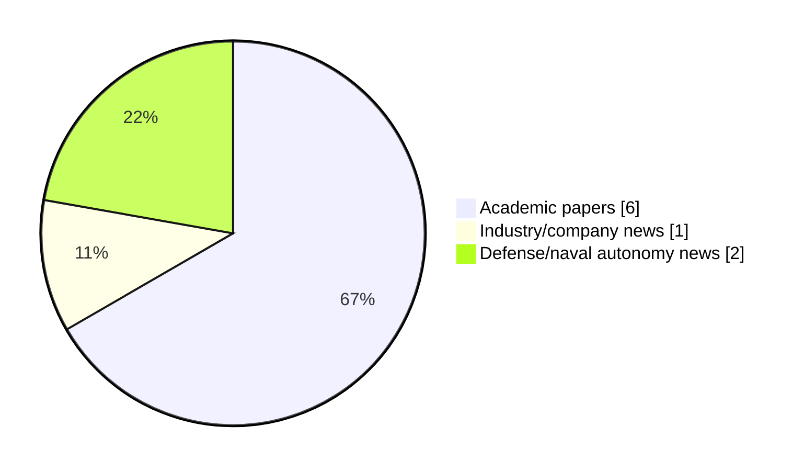

# Maritime Autonomy Watch — 2026-09-10

## Executive Summary

- Total selected items: 9
- Academic papers: 6
- Industry/company news: 1
- Defense/naval autonomy news: 2
- Failed/inaccessible sources: 0

## Contents

- [Analyst Brief](#analyst-brief)
- [Must Read](#must-read)
- [Top Signals Today](#top-signals-today)
- [Topic Signals](#topic-signals)
- [Freshness and Coverage](#freshness-and-coverage)
- [Quality Notes](#quality-notes)
- [Watchlist](#watchlist)
- [Academic Papers](#academic-papers)
- [Industry and Company News](#industry-and-company-news)
- [Defense and Naval Autonomy News](#defense-and-naval-autonomy-news)
- [Source Status Summary](#source-status-summary)

## Analyst Brief

Today's report selected 9 non-duplicate item(s), led by USV operations, planning/control, critical infrastructure. The strongest item is [Coastal Environment Generation with HoloOcean](http://arxiv.org/abs/2609.10484v1) from arXiv.
Coverage is weighted toward academic research (6), with 1 industry and 2 defense signal(s).
Quality caveat: low-score-unique=2, missing-summary=2, date-anomaly=2.

## Must Read

- [Coastal Environment Generation with HoloOcean](http://arxiv.org/abs/2609.10484v1) — Research signal: USV operations
- [Dynamical System-Based Imitation Learning and Neuroadaptive Control for Trajectory Recovery in Autonomous Ships](http://arxiv.org/abs/2608.23924v1) — Research signal: USV operations
- [CougarTail & CUB: A General-Purpose Mast and Central Utility Board for Cylindrical Underwater Enclosures](http://arxiv.org/abs/2609.10230v1) — Research signal: planning/control
- [Video: Saildrone Surveyor USV Fires Lockheed Martin JAGM during RIMPAC](https://www.navalnews.com/naval-news/2026/09/saildrone-surveyor-usv-fires-lockheed-martin-jagm-rimpac-video/) — Defense signal: USV operations
- [An Information‐Driven Multilevel Path Planning Framework for Unmanned Surface Vehicles in Environmental Monitoring of Uninhabited Islands and Reefs](https://doi.org/10.1002/rob.70322) — Research signal: USV operations

## Top Signals Today

- USV operations: 5 selected item(s).
- planning/control: 5 selected item(s).
- critical infrastructure: 2 selected item(s).
- swarm autonomy: 2 selected item(s).
- perception: 1 selected item(s).

## Topic Signals

- USV operations: 5
- planning/control: 5
- critical infrastructure: 2
- swarm autonomy: 2
- perception: 1
- defense adoption: 1
- AUV navigation: 1

## Freshness and Coverage

- Newest selected item date: 2027-03-01
- Oldest selected item date: 2026-08-25
- Active/enabled sources: 5
- Sources with access problems: 2
- Quality flags: 6

## Quality Notes

- low-score-unique: 2
- missing-summary: 2
- date-anomaly: 2
- Date anomalies: [Adaptive Risk-Aware Implicit Quantile Network: Towards Safe and Energy-Efficient USV Navigation in Dynamic Environments](https://api.elsevier.com/content/abstract/scopus_id/105046501877) reports 2027-01-01; [Formation control of AUVs for enabling safe and efficient marine operations](https://api.elsevier.com/content/abstract/scopus_id/105046585164) reports 2027-03-01

## Watchlist

- [Nauticus Robotics Launches ToolKITT Autonomy Suite for Existing ROV Fleets](https://oceannews.com/news/science-technology/nauticus-robotics-launches-toolkitt-autonomy-suite-for-existing-rov-fleets/) — low-score-unique
- [Sea Machines Robotics Wins SOF Contract for Drop-In Autonomy Kits](https://oceannews.com/news/defense/sea-machines-robotics-wins-sof-contract-for-drop-in-autonomy-kits/) — low-score-unique
- [Adaptive Risk-Aware Implicit Quantile Network: Towards Safe and Energy-Efficient USV Navigation in Dynamic Environments](https://api.elsevier.com/content/abstract/scopus_id/105046501877) — missing-summary, date-anomaly
- [Formation control of AUVs for enabling safe and efficient marine operations](https://api.elsevier.com/content/abstract/scopus_id/105046585164) — missing-summary, date-anomaly

### Category Snapshot

| Category | Selected items |
|---|---:|
| Academic papers | 6 |
| Industry/company news | 1 |
| Defense/naval autonomy news | 2 |

## Academic Papers

_Selected items: 6_

### [Coastal Environment Generation with HoloOcean](http://arxiv.org/abs/2609.10484v1)

- Source: arXiv
- Date: 2026-09-09
- Relevance score: 10
- Authors: Abigail Austin, Brady Moon, Joshua G. Mangelson
- Signal: Research signal: USV operations
- Topic tags: USV operations, perception, critical infrastructure

**Abstract**

Marine robotic simulation provides a safe and inexpensive method of developing and testing algorithms for unmanned underwater vehicle (UUV) and unmanned surface vessel (USV) autonomy and perception before full field deployment. However, these simulations are often limited by the availability of simulated environments. Current marine robotics simulation suites offer manual ways to edit or create environments, but they require existing data or specialized knowledge of the environment system. To address these issues, we introduce a novel Unreal Engine 5 level generation pipeline that enables automatic creation of coastal environments for HoloOcean. Our pipeline relies on a user-provided overhead image of a coastal scene. The pipeline then uses the image to generate height map data, as well as automatically select assets and place them in the environment.

**Why it matters**

Relevant to underwater autonomy, surface-vessel operations; the work may inform maritime autonomy research, testing priorities, or system design.

---

### [Dynamical System-Based Imitation Learning and Neuroadaptive Control for Trajectory Recovery in Autonomous Ships](http://arxiv.org/abs/2608.23924v1)

- Source: arXiv
- Date: 2026-08-25
- Relevance score: 10
- Authors: Yeyson A. Becerra-Mora, José Ángel Acosta
- Signal: Research signal: USV operations
- Topic tags: USV operations, planning/control

**Abstract**

Repetitive maritime operations can be effectively learned using the Imitation Learning (IL) paradigm, which transfers human expertise directly to Unmanned Surface Vehicle (USV) control systems. Dynamical Systems (DS) are widely used to model non-linear human demonstrations while offering inherent stability guarantees. However, real-world execution under persistent marine perturbations reveals a critical trade-off: standard DS-based IL approaches prioritize global target convergence at the expense of localized trajectory reproduction fidelity. To address this limitation, we present a hybrid learning-control architecture that integrates a DS-based IL reference generator with a neuroadaptive controller. Our approach introduces a control action that drives the USV back to the demonstrated path following exogenous disturbances, enabling dynamic human-like reactive alignment-termed behavioral tracking.

**Why it matters**

Relevant to surface-vessel operations, planning and control; the work may inform maritime autonomy research, testing priorities, or system design.

---

### [CougarTail & CUB: A General-Purpose Mast and Central Utility Board for Cylindrical Underwater Enclosures](http://arxiv.org/abs/2609.10230v1)

- Source: arXiv
- Date: 2026-09-09
- Relevance score: 7
- Authors: Ben Washburn, Clayton Smith, Eli Gaskin, Brighton Anderson, Braden Meyers, Brady Moon, Joshua Mangelson
- Signal: Research signal: planning/control
- Topic tags: planning/control

**Abstract**

Cylindrical watertight enclosures are widely used across various underwater systems, from unmanned underwater vehicles (UUVs), to remotely operated vehicles (ROVs), to various sensor platforms. However, electronics are typically built on rectangular PCBs arranged in horizontal stacks, which inefficiently occupy the circular cross-section volume that is critical for both payload capacity and buoyancy management. This paper presents CUB (Central Utility Board) and CougarTail, a general-purpose system designed to address this gap. CUB is a circular PCB sized for 4-inch-diameter enclosures that consolidates a Raspberry Pi Compute Module 5 (CM5) and an STM32 microcontroller, while also providing power management features and auxiliary connections. Mounted coaxially, CUB reduces the electronics stack of our CougUV from 200 mm of tube length and 709 g to 25 mm and 156 g, returning that length and mass budget to payload and buoyancy trim.

**Why it matters**

Relevant to underwater autonomy; the work may inform maritime autonomy research, testing priorities, or system design.

---

### [An Information‐Driven Multilevel Path Planning Framework for Unmanned Surface Vehicles in Environmental Monitoring of Uninhabited Islands and Reefs](https://doi.org/10.1002/rob.70322)

- Source: OpenAlex
- Date: 2026-09-07
- Relevance score: 4.25
- Authors: Lin Zhou, Zhuo Wang, Nan Zhou, Zhongchao Deng, Hongde Qin, Yifan Xue
- DOI: 10.1002/rob.70322
- Signal: Research signal: USV operations
- Topic tags: USV operations, swarm autonomy, planning/control

**Abstract**

ABSTRACT With the expansion of marine resource development, the ecological health of Uninhabited Islands and Reefs urgently requires prolonged and precise monitoring. Nevertheless, the extensive spatial scale, complex topography, and dynamic temporal variations caused by tidal processes in reef regions make it challenging for traditional methods based on predefined trajectories to balance observation efficiency and accuracy. Therefore, an Information‐Driven Multilevel Path Planning Framework is proposed to achieve dual mission requirements of topographic mapping and ecological data sampling. At the global level, the Boundary Adaptive Coverage based on Grid Completeness algorithm is proposed to enhance coarse mapping coverage in irregular island and reef areas.

**Why it matters**

Relevant to surface-vessel operations, multi-vehicle coordination, planning and control; the work may inform maritime autonomy research, testing priorities, or system design.

---

### [Adaptive Risk-Aware Implicit Quantile Network: Towards Safe and Energy-Efficient USV Navigation in Dynamic Environments](https://api.elsevier.com/content/abstract/scopus_id/105046501877)

- Source: Elsevier Scopus
- Date: 2027-01-01
- Relevance score: 4.5
- DOI: 10.1007/978-981-92-3381-6_34
- Signal: Research signal: USV operations
- Topic tags: USV operations
- Quality flags: missing-summary, date-anomaly

**Abstract**

No summary available.

**Why it matters**

Relevant to surface-vessel operations; the work may inform maritime autonomy research, testing priorities, or system design.

---

### [Formation control of AUVs for enabling safe and efficient marine operations](https://api.elsevier.com/content/abstract/scopus_id/105046585164)

- Source: Elsevier Scopus
- Date: 2027-03-01
- Relevance score: 4.25
- DOI: 10.1016/j.apm.2026.117232
- Signal: Research signal: AUV navigation
- Topic tags: AUV navigation, swarm autonomy, planning/control
- Quality flags: missing-summary, date-anomaly

**Abstract**

No summary available.

**Why it matters**

Relevant to underwater autonomy, multi-vehicle coordination; the work may inform maritime autonomy research, testing priorities, or system design.

---

## Industry and Company News

_Selected items: 1_

### [Sea Machines Robotics Wins SOF Contract for Drop-In Autonomy Kits](https://oceannews.com/news/defense/sea-machines-robotics-wins-sof-contract-for-drop-in-autonomy-kits/)

- Source: oceannews.com
- Date: 2026-09-09
- Relevance score: 3
- Signal: Industry signal: planning/control
- Topic tags: planning/control
- Quality flags: low-score-unique

**Summary**

Sea Machines Robotics has announced a five-year Indefinite Delivery Indefinite Quantity (IDIQ) contract to supply its commercial, non-developmental, TRL-9, rapidly deployable autonomy kits to US Special Operations Forces (SOF). The contract enables SOF to leverage Sea Machines to supply "drop-in" capability for autonomous command and control on global vessels of opportunity to enhance expeditionary logistics, as well as Intelligence, Surveillance and Reconnaissance (ISR) and maritime security at the tactical edge.

**Why it matters**

This item may signal product, market, or deployment momentum in maritime autonomy.

---

## Defense and Naval Autonomy News

_Selected items: 2_

### [Video: Saildrone Surveyor USV Fires Lockheed Martin JAGM during RIMPAC](https://www.navalnews.com/naval-news/2026/09/saildrone-surveyor-usv-fires-lockheed-martin-jagm-rimpac-video/)

- Source: navalnews.com
- Date: 2026-09-10
- Relevance score: 4.5
- Signal: Defense signal: USV operations
- Topic tags: USV operations

**Summary**

Saildrone and Lockheed Martin successfully executed the first-ever missile launch from a Saildrone Surveyor USV using the JAGM during RIMPAC 2026.

**Why it matters**

Signals movement in surface-vessel operations; useful for tracking operational concepts, procurement direction, and fleet integration.

---

### [Nauticus Robotics Launches ToolKITT Autonomy Suite for Existing ROV Fleets](https://oceannews.com/news/science-technology/nauticus-robotics-launches-toolkitt-autonomy-suite-for-existing-rov-fleets/)

- Source: oceannews.com
- Date: 2026-09-09
- Relevance score: 3
- Signal: Defense signal: critical infrastructure
- Topic tags: critical infrastructure, defense adoption
- Quality flags: low-score-unique

**Summary**

Nauticus Robotics, Inc. (Nauticus), a developer of autonomous subsea robots and autonomy software, announced during its most recent earnings call the commercial release of Nauticus ToolKITT™, its autonomy suite for underwater vehicles, and provided additional release details. Nauticus ToolKITT is now available to fleet operators, vehicle manufacturers, and defense contractors as a licensed software product available with its Pilot Assist module.

**Why it matters**

Signals movement in underwater autonomy, naval adoption; useful for tracking operational concepts, procurement direction, and fleet integration.

---

## Inaccessible or Failed Sources

- None

## Source Status Summary

| Source | Status | Notes |
|---|---|---|
| arXiv | enabled | API source, 15 items fetched |
| OpenAlex | enabled | API source, 15 items fetched |
| RSS feeds | enabled | 107 RSS items fetched |
| SMI MASG News | enabled | HTML source, 10 items fetched |
| IEEE Xplore | disabled | Missing IEEE_XPLORE_API_KEY |
| Elsevier Scopus | enabled | API source, 15 items fetched |
| NewsAPI | disabled | Missing NEWS_API_KEY |

## Metadata

- Generated at: 2026-09-10T12:32:46.021572+02:00
- Date: 2026-09-10
- Repository: ferhannb/MarineRobotics
- Relevance threshold: 4.0
- Deduplication method: DOI, canonical URL, source ID, normalized title, similar recent titles, category caps, and novelty score
