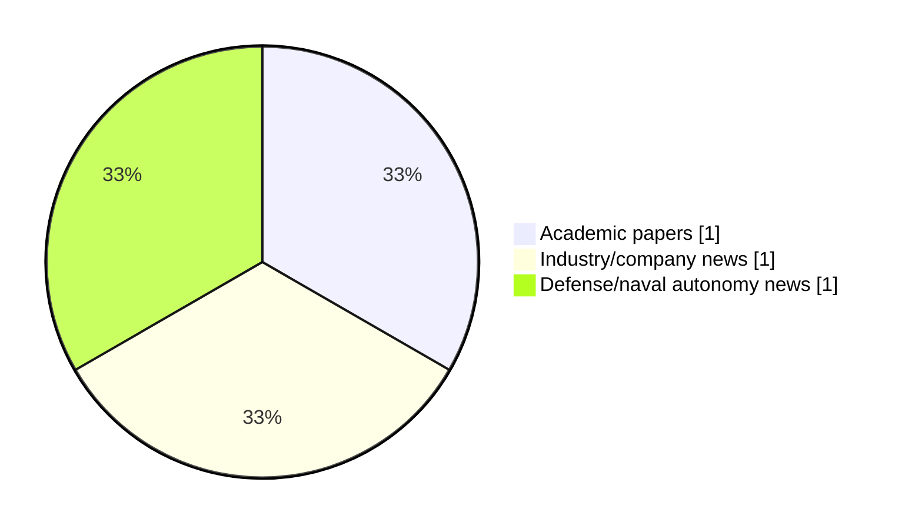

# Maritime Autonomy Watch — 2026-09-12

## Executive Summary

- Total selected items: 3
- Academic papers: 1
- Industry/company news: 1
- Defense/naval autonomy news: 1
- Failed/inaccessible sources: 0

## Contents

- [Analyst Brief](#analyst-brief)
- [Must Read](#must-read)
- [Top Signals Today](#top-signals-today)
- [Topic Signals](#topic-signals)
- [Freshness and Coverage](#freshness-and-coverage)
- [Quality Notes](#quality-notes)
- [Watchlist](#watchlist)
- [Academic Papers](#academic-papers)
- [Industry and Company News](#industry-and-company-news)
- [Defense and Naval Autonomy News](#defense-and-naval-autonomy-news)
- [Source Status Summary](#source-status-summary)

## Analyst Brief

Today's report selected 3 non-duplicate item(s), led by USV operations, AUV navigation, perception. The strongest item is [US refutes claims that Iran captured Saildrone USV](https://www.defensenews.com/industry/techwatch/2026/09/11/us-refutes-claims-that-iran-captured-saildrone-usv/) from defensenews.com.
Coverage is weighted toward academic research (1), with 1 industry and 1 defense signal(s).
Quality caveat: low-score-unique=1.

## Must Read

- [US refutes claims that Iran captured Saildrone USV](https://www.defensenews.com/industry/techwatch/2026/09/11/us-refutes-claims-that-iran-captured-saildrone-usv/) — Defense signal: USV operations
- [Havoc and CSBC Partner to Co-Produce Autonomous Surface Vessels for Taiwan](https://oceannews.com/news/science-technology/havoc-and-csbc-partner-to-co-produce-autonomous-surface-vessels-for-taiwan/) — Industry signal: USV operations
- [Contact-Aided Factor-Graph Localization for Underwater Sampling](http://arxiv.org/abs/2608.26932v2) — Research signal: AUV navigation

## Top Signals Today

- USV operations: 2 selected item(s).
- AUV navigation: 1 selected item(s).
- perception: 1 selected item(s).
- planning/control: 1 selected item(s).

## Topic Signals

- USV operations: 2
- AUV navigation: 1
- perception: 1
- planning/control: 1

## Freshness and Coverage

- Newest selected item date: 2026-09-11
- Oldest selected item date: 2026-08-27
- Active/enabled sources: 5
- Sources with access problems: 2
- Quality flags: 1

## Quality Notes

- low-score-unique: 1

## Watchlist

- [Contact-Aided Factor-Graph Localization for Underwater Sampling](http://arxiv.org/abs/2608.26932v2) — low-score-unique

### Category Snapshot

| Category | Selected items |
|---|---:|
| Academic papers | 1 |
| Industry/company news | 1 |
| Defense/naval autonomy news | 1 |

## Academic Papers

_Selected items: 1_

### [Contact-Aided Factor-Graph Localization for Underwater Sampling](http://arxiv.org/abs/2608.26932v2)

- Source: arXiv
- Date: 2026-08-27
- Relevance score: 3.5
- Authors: Michele Grimaldi, Yosaku Maeda, Hitoshi Kakami, Ignacio Carlucho, Yvan R. Petillot, Tomoya Inoue
- Signal: Research signal: AUV navigation
- Topic tags: AUV navigation, perception, planning/control
- Quality flags: low-score-unique

**Abstract**

Accurate state estimation for autonomous underwater vehicles performing close-range seafloor sampling remains challenging. In low-altitude operation, down-looking cameras over featureless planar seabeds produce scale ambiguity, lateral degeneracy, and inconsistent feature tracking. Meanwhile, inertial-Doppler Velocity Log (DVL) fusion alone provides no mechanism for structural drift correction. We propose a Contact-Aided Factor-Graph Localization framework that treats physical interaction as an informative geometric constraint within a smoothing-based localization formulation. The method tightly fuses suction-based manipulator contact events with adaptive visual odometry, learned object detections, and on-board sensors.

**Why it matters**

Relevant to underwater autonomy, planning and control; the work may inform maritime autonomy research, testing priorities, or system design.

---

## Industry and Company News

_Selected items: 1_

### [Havoc and CSBC Partner to Co-Produce Autonomous Surface Vessels for Taiwan](https://oceannews.com/news/science-technology/havoc-and-csbc-partner-to-co-produce-autonomous-surface-vessels-for-taiwan/)

- Source: oceannews.com
- Date: 2026-09-11
- Relevance score: 5
- Signal: Industry signal: USV operations
- Topic tags: USV operations

**Summary**

Havoc, the all-domain collaborative autonomy company, and CSBC Corporation, Taiwan (CSBC), Taiwan's largest shipbuilder, have announced a partnership to pursue licensed co-production of autonomous surface vessels (ASVs) for Taiwan's maritime security.

**Why it matters**

Signals momentum in surface-vessel operations; useful for tracking product direction, partnerships, and deployment opportunities.

---

## Defense and Naval Autonomy News

_Selected items: 1_

### [US refutes claims that Iran captured Saildrone USV](https://www.defensenews.com/industry/techwatch/2026/09/11/us-refutes-claims-that-iran-captured-saildrone-usv/)

- Source: defensenews.com
- Date: 2026-09-11
- Relevance score: 5.25
- Signal: Defense signal: USV operations
- Topic tags: USV operations

**Summary**

A U.S. official denied the video shared by Iran purported to show an American Saildrone USV near the Strait of Hormuz in flames.

**Why it matters**

Signals movement in surface-vessel operations; useful for tracking operational concepts, procurement direction, and fleet integration.

---

## Inaccessible or Failed Sources

- None

## Source Status Summary

| Source | Status | Notes |
|---|---|---|
| arXiv | enabled | API source, 15 items fetched |
| OpenAlex | enabled | API source, 15 items fetched |
| RSS feeds | enabled | 107 RSS items fetched |
| SMI MASG News | enabled | HTML source, 10 items fetched |
| IEEE Xplore | disabled | Missing IEEE_XPLORE_API_KEY |
| Elsevier Scopus | enabled | API source, 15 items fetched |
| NewsAPI | disabled | Missing NEWS_API_KEY |

## Metadata

- Generated at: 2026-09-12T12:01:37.060115+02:00
- Date: 2026-09-12
- Repository: ferhannb/MarineRobotics
- Relevance threshold: 4.0
- Deduplication method: DOI, canonical URL, source ID, normalized title, similar recent titles, category caps, and novelty score
