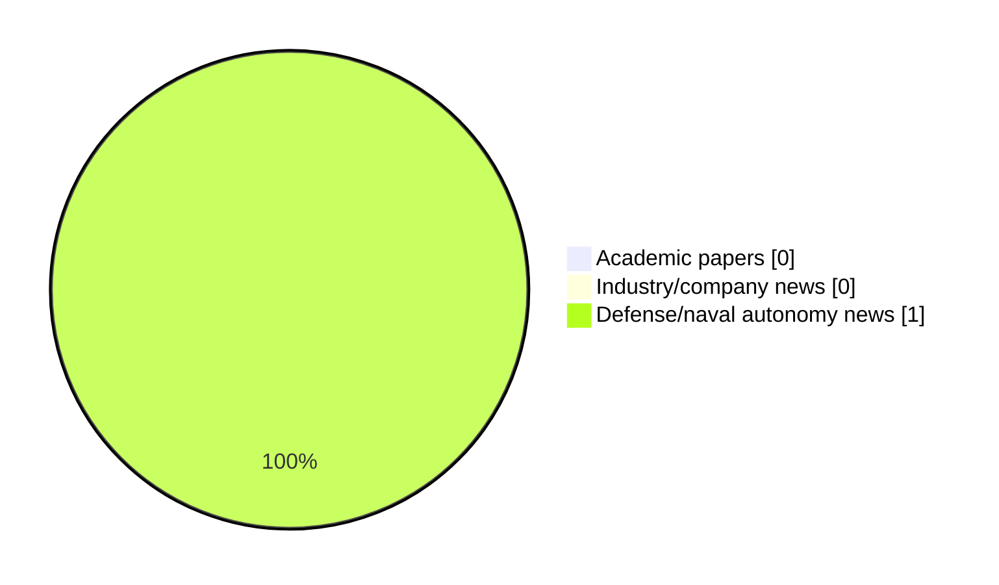

# Maritime Autonomy Watch — 2026-09-13

## Executive Summary

- Total selected items: 1
- Academic papers: 0
- Industry/company news: 0
- Defense/naval autonomy news: 1
- Failed/inaccessible sources: 1

## Contents

- [Analyst Brief](#analyst-brief)
- [Must Read](#must-read)
- [Top Signals Today](#top-signals-today)
- [Topic Signals](#topic-signals)
- [Freshness and Coverage](#freshness-and-coverage)
- [Quality Notes](#quality-notes)
- [Watchlist](#watchlist)
- [Academic Papers](#academic-papers)
- [Industry and Company News](#industry-and-company-news)
- [Defense and Naval Autonomy News](#defense-and-naval-autonomy-news)
- [Source Status Summary](#source-status-summary)

## Analyst Brief

Today's report selected 1 non-duplicate item(s), led by USV operations, defense adoption. The strongest item is [World’s First Naval Drone Duel Results In Ukrainian Success](https://www.navalnews.com/naval-news/2026/09/worlds-first-naval-drone-duel-results-in-ukrainian-success/) from navalnews.com.
Coverage is weighted toward academic research (0), with 0 industry and 1 defense signal(s).

## Must Read

- [World’s First Naval Drone Duel Results In Ukrainian Success](https://www.navalnews.com/naval-news/2026/09/worlds-first-naval-drone-duel-results-in-ukrainian-success/) — Defense signal: USV operations

## Top Signals Today

- USV operations: 1 selected item(s).
- defense adoption: 1 selected item(s).

## Topic Signals

- USV operations: 1
- defense adoption: 1

## Freshness and Coverage

- Newest selected item date: 2026-09-12
- Oldest selected item date: 2026-09-12
- Active/enabled sources: 4
- Sources with access problems: 3
- Quality flags: 0

## Quality Notes

- No quality flags on selected items.

## Watchlist

- No watchlist items today.

### Category Snapshot

| Category | Selected items |
|---|---:|
| Academic papers | 0 |
| Industry/company news | 0 |
| Defense/naval autonomy news | 1 |

## Academic Papers

_Selected items: 0_

No selected items.

## Industry and Company News

_Selected items: 0_

No selected items.

## Defense and Naval Autonomy News

_Selected items: 1_

### [World’s First Naval Drone Duel Results In Ukrainian Success](https://www.navalnews.com/naval-news/2026/09/worlds-first-naval-drone-duel-results-in-ukrainian-success/)

- Source: navalnews.com
- Date: 2026-09-12
- Relevance score: 4.5
- Signal: Defense signal: USV operations
- Topic tags: USV operations, defense adoption

**Summary**

In a world first, two naval drones engaged in combat. A Ukrainian Sargan-3000 USV sunk a Russian USV.

**Why it matters**

Signals movement in surface-vessel operations, naval adoption; useful for tracking operational concepts, procurement direction, and fleet integration.

---

## Inaccessible or Failed Sources

- arXiv: HTTP 429 for https://export.arxiv.org/api/query?search_query=all%3A%22maritime+autonomy%22+OR+all%3A%22marine+robotics%22+OR+all%3A%22autonomous+vessel%22+OR+all%3A%22autonomous+mission%22+OR+all%3A%22autonomous+surface+vessel%22+OR+all%3A%22autonomous+underwater+vehicle%22+OR+all%3A%22unmanned+surface+vehicle%22+OR+all%3A%22unmanned+underwater+vehicle%22&start=0&max_results=15&sortBy=submittedDate&sortOrder=descending

## Source Status Summary

| Source | Status | Notes |
|---|---|---|
| arXiv | failed | HTTP 429 for https://export.arxiv.org/api/query?search_query=all%3A%22maritime+autonomy%22+OR+all%3A%22marine+robotics%22+OR+all%3A%22autonomous+vessel%22+OR+all%3A%22autonomous+mission%22+OR+all%3A%22autonomous+surface+vessel%22+OR+all%3A%22autonomous+underwater+vehicle%22+OR+all%3A%22unmanned+surface+vehicle%22+OR+all%3A%22unmanned+underwater+vehicle%22&start=0&max_results=15&sortBy=submittedDate&sortOrder=descending |
| OpenAlex | enabled | API source, 15 items fetched |
| RSS feeds | enabled | 107 RSS items fetched |
| SMI MASG News | enabled | HTML source, 10 items fetched |
| IEEE Xplore | disabled | Missing IEEE_XPLORE_API_KEY |
| Elsevier Scopus | enabled | API source, 15 items fetched |
| NewsAPI | disabled | Missing NEWS_API_KEY |

## Metadata

- Generated at: 2026-09-13T13:03:03.095373+02:00
- Date: 2026-09-13
- Repository: ferhannb/MarineRobotics
- Relevance threshold: 4.0
- Deduplication method: DOI, canonical URL, source ID, normalized title, similar recent titles, category caps, and novelty score
