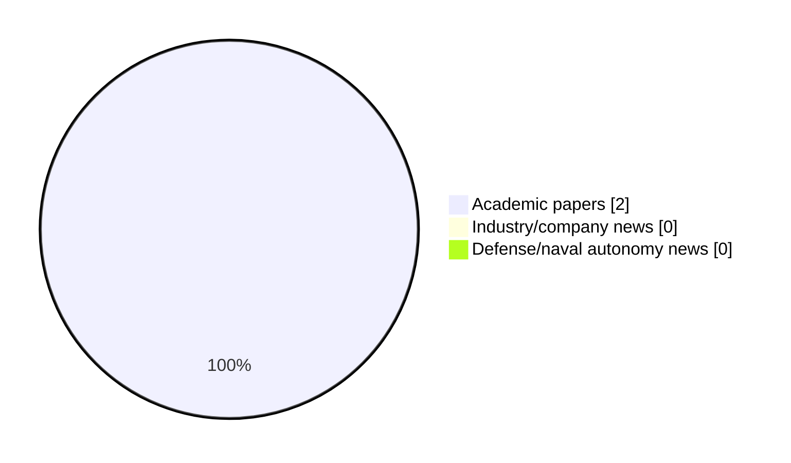

# Maritime Autonomy Watch — 2026-09-14

## Executive Summary

- Total selected items: 2
- Academic papers: 2
- Industry/company news: 0
- Defense/naval autonomy news: 0
- Failed/inaccessible sources: 1

## Contents

- [Analyst Brief](#analyst-brief)
- [Must Read](#must-read)
- [Top Signals Today](#top-signals-today)
- [Topic Signals](#topic-signals)
- [Freshness and Coverage](#freshness-and-coverage)
- [Quality Notes](#quality-notes)
- [Watchlist](#watchlist)
- [Academic Papers](#academic-papers)
- [Industry and Company News](#industry-and-company-news)
- [Defense and Naval Autonomy News](#defense-and-naval-autonomy-news)
- [Source Status Summary](#source-status-summary)

## Analyst Brief

Today's report selected 2 non-duplicate item(s), led by perception, planning/control, critical infrastructure. The strongest item is [Green Maritime Intelligence for Autonomous Shipping, Smart Ports and Low-Carbon Global Logistics](https://doi.org/10.62311/nesx/rb18ag-978-81-68314-82-5) from OpenAlex.
Coverage is weighted toward academic research (2), with 0 industry and 0 defense signal(s).
Quality caveat: low-score-unique=1.

## Must Read

- [Green Maritime Intelligence for Autonomous Shipping, Smart Ports and Low-Carbon Global Logistics](https://doi.org/10.62311/nesx/rb18ag-978-81-68314-82-5) — Research signal: perception
- [AI-Enabled Naval Architecture and Ocean Engineering for Autonomous Marine Vehicles, Offshore Structures and Renewable Ocean Systems](https://doi.org/10.62311/nesx/rb17ag-978-81-68314-83-2) — Research signal: perception

## Top Signals Today

- perception: 2 selected item(s).
- planning/control: 1 selected item(s).
- critical infrastructure: 1 selected item(s).
- defense adoption: 1 selected item(s).
- regulation/legal: 1 selected item(s).

## Topic Signals

- perception: 2
- planning/control: 1
- critical infrastructure: 1
- defense adoption: 1
- regulation/legal: 1

## Freshness and Coverage

- Newest selected item date: 2026-08-30
- Oldest selected item date: 2026-08-30
- Active/enabled sources: 4
- Sources with access problems: 3
- Quality flags: 1

## Quality Notes

- low-score-unique: 1

## Watchlist

- [AI-Enabled Naval Architecture and Ocean Engineering for Autonomous Marine Vehicles, Offshore Structures and Renewable Ocean Systems](https://doi.org/10.62311/nesx/rb17ag-978-81-68314-83-2) — low-score-unique

### Category Snapshot

| Category | Selected items |
|---|---:|
| Academic papers | 2 |
| Industry/company news | 0 |
| Defense/naval autonomy news | 0 |

## Academic Papers

_Selected items: 2_

### [Green Maritime Intelligence for Autonomous Shipping, Smart Ports and Low-Carbon Global Logistics](https://doi.org/10.62311/nesx/rb18ag-978-81-68314-82-5)

- Source: OpenAlex
- Date: 2026-08-30
- Relevance score: 4.25
- Authors: Murali Krishna Pasupuleti
- DOI: 10.62311/nesx/rb18ag-978-81-68314-82-5
- Signal: Research signal: perception
- Topic tags: perception

**Abstract**

Abstract Green maritime intelligence integrates autonomous vessel decision systems, smart-port orchestration, climate and ocean sensing, digital twins, data engineering and low-carbon logistics into a unified research architecture. The book develops this architecture from first principles of uncertainty, causality, optimization and governance, then extends it through statistical modelling, machine learning, edge analytics and reproducible digital-twin operations. Particular attention is given to voyage and speed optimization, port congestion and energy coordination, predictive maintenance, cyber-physical assurance, renewable-energy integration and corridor-scale logistics decarbonization. The methodological position is deliberately multi-objective: safety, emissions, reliability, resilience, transparency and human oversight are evaluated together rather than optimized independently.

**Why it matters**

This paper may influence autonomy, perception, planning, or control work for maritime robotic systems.

---

### [AI-Enabled Naval Architecture and Ocean Engineering for Autonomous Marine Vehicles, Offshore Structures and Renewable Ocean Systems](https://doi.org/10.62311/nesx/rb17ag-978-81-68314-83-2)

- Source: OpenAlex
- Date: 2026-08-30
- Relevance score: 3
- Authors: Murali Krishna Pasupuleti
- DOI: 10.62311/nesx/rb17ag-978-81-68314-83-2
- Signal: Research signal: perception
- Topic tags: perception, planning/control, critical infrastructure, defense adoption, regulation/legal
- Quality flags: low-score-unique

**Abstract**

Abstract This research book develops an integrated framework for artificial-intelligence-enabled naval architecture and ocean engineering across autonomous marine vehicles, offshore structures and renewable ocean systems. It treats hydrodynamics, structural mechanics, sensing, autonomy, climate forcing and digital infrastructure as coupled elements of one engineering decision system. The manuscript progresses from foundational representations and uncertainty-aware research design to statistical explanation, causal inference, physics-informed learning, autonomous navigation, digital twins, scalable data engineering and governance. Particular attention is given to GPS-denied marine autonomy, multiphysics surrogate modelling, fatigue and corrosion analytics, edge intelligence, remote sensing, offshore renewable-energy operations, resilient ports and cyber-physical assurance.

**Why it matters**

Relevant to infrastructure monitoring, naval adoption; the work may inform maritime autonomy research, testing priorities, or system design.

---

## Industry and Company News

_Selected items: 0_

No selected items.

## Defense and Naval Autonomy News

_Selected items: 0_

No selected items.

## Inaccessible or Failed Sources

- arXiv: The read operation timed out

## Source Status Summary

| Source | Status | Notes |
|---|---|---|
| arXiv | failed | The read operation timed out |
| OpenAlex | enabled | API source, 15 items fetched |
| RSS feeds | enabled | 107 RSS items fetched |
| SMI MASG News | enabled | HTML source, 10 items fetched |
| IEEE Xplore | disabled | Missing IEEE_XPLORE_API_KEY |
| Elsevier Scopus | enabled | API source, 15 items fetched |
| NewsAPI | disabled | Missing NEWS_API_KEY |

## Metadata

- Generated at: 2026-09-14T13:42:38.960983+02:00
- Date: 2026-09-14
- Repository: ferhannb/MarineRobotics
- Relevance threshold: 4.0
- Deduplication method: DOI, canonical URL, source ID, normalized title, similar recent titles, category caps, and novelty score
